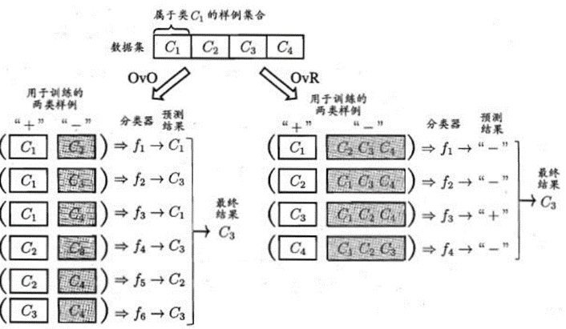
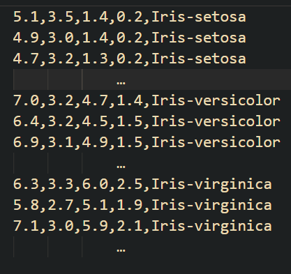
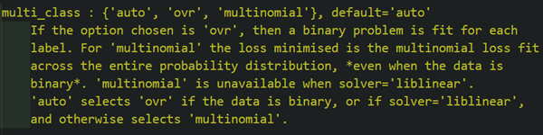
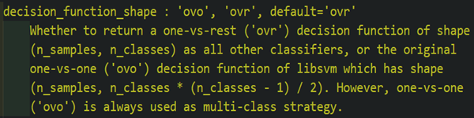
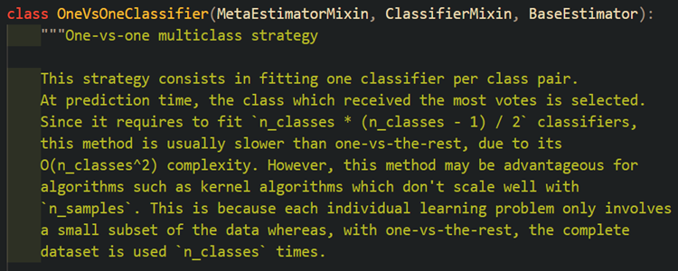
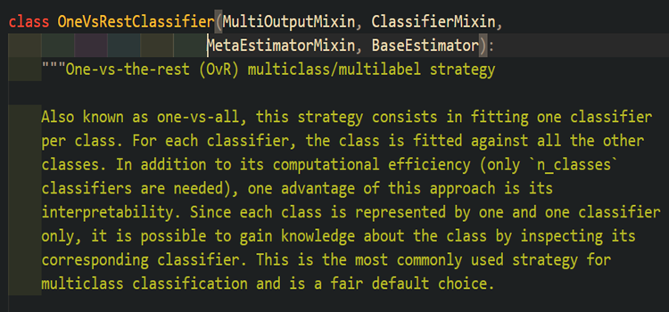

# ===========二分类算法解决多分类问题,并通过Sci-kit Learn实现=========


## 多分类基本思路:将多分类任务拆分成若干个二分类任务.
## 最经典的拆分策略:
## ①"一对一"(One vs One,简称OvO);
- 将n个类别两两配对，产生n(n-1)/2个二分类任务，获得n(n-1)/2个分类器，新样本交给这些分类器，得到n(n-1)/2个结果，最终结果投票产生。

## ②"一对其余"(One vs Rest,简称OvR);
- 每次将一个类作为正例，其余n-1个类作为反例。可训练出n个分类器，在测试时，若仅有一个分类器预测为正类，则对应的类别标记作为最终分类结果。若有多个分类器预测为正类，则通常考虑各分类器的预测置信度，选择预测置信度最大的类别标记作为分类结果。类别多时，OvO的训练时间开销通常比OvR小。

## ③"多对多"(Many vs Many,简称MvM).
- 每次将若干个类作为正类，若干个其他类作为反类。显然，OvO，OvR是MvM的特例。
- MvM的正、反类构造须有特殊的设计，不能随意选取。最常用的MvM技术：“纠错输出码”（ECOC），将编码的思想引入类别拆分，并尽可能在解码过程中具有容错性。
- ECOC主要分为两步：
- 编码：对n个类别做M次划分，每次划分将一部分类别划为正类，一部分划为反类，从而形成一个二分类训练集，这样一共产生M个训练集，可训练出M个分类器；
- 解码：M个分类器分别对测试样本进行预测，这些预测标记组成一个编码，将这个预测编码与每个类别各自的编码进行比较，返回其中距离最小的类别作为最终预测结果。

### 常用方法:OvO以及OvR.


### OvO与OvR优缺点比较:
### ①OvO优点:在类别很多时,训练时间要比OvR少;缺点:分类器个数多.
### ②OvR优点:分类器个数少,存储开销和测试时间比OvO少;缺点:类别很多时,训练时间长.

## 实验采用Iris鸢尾花数据集进行.Iris数据集内包含 3 类共 150 条记录，每类各 50 个数据，每条记录都有 4 项特征：花萼长度、花萼宽度、花瓣长度、花瓣宽度，类别名称为Iris-setosa、Iris-versicolour、Iris-virginica.


### pre_step 1:构造函数将Iris鸢尾花种类标签转化为数字


```python
def iris_type(s):
    it = {b'Iris-setosa': 0, b'Iris-versicolor': 1, b'Iris-virginica': 2}
    return it[s]
```

### pre_step 2:导入数据并显示转化后数据格式


```python
import os
import numpy as np

prefix = os.getcwd()
path = prefix + u'/iris.data'
data = np.loadtxt(
    path, dtype=float, delimiter=',', converters={4: iris_type}
)
```


```python
data
```


    array([[5.1, 3.5, 1.4, 0.2, 0. ],
           [4.9, 3. , 1.4, 0.2, 0. ],
           [4.7, 3.2, 1.3, 0.2, 0. ],
           [4.6, 3.1, 1.5, 0.2, 0. ],
           [5. , 3.6, 1.4, 0.2, 0. ],
           [5.4, 3.9, 1.7, 0.4, 0. ],
           [4.6, 3.4, 1.4, 0.3, 0. ],
           [5. , 3.4, 1.5, 0.2, 0. ],
           [4.4, 2.9, 1.4, 0.2, 0. ],
           [4.9, 3.1, 1.5, 0.1, 0. ],
           [5.4, 3.7, 1.5, 0.2, 0. ],
           [4.8, 3.4, 1.6, 0.2, 0. ],
           [4.8, 3. , 1.4, 0.1, 0. ],
           [4.3, 3. , 1.1, 0.1, 0. ],
           [5.8, 4. , 1.2, 0.2, 0. ],
           [5.7, 4.4, 1.5, 0.4, 0. ],
           [5.4, 3.9, 1.3, 0.4, 0. ],
           [5.1, 3.5, 1.4, 0.3, 0. ],
           [5.7, 3.8, 1.7, 0.3, 0. ],
           [5.1, 3.8, 1.5, 0.3, 0. ],
           [5.4, 3.4, 1.7, 0.2, 0. ],
           [5.1, 3.7, 1.5, 0.4, 0. ],
           [4.6, 3.6, 1. , 0.2, 0. ],
           [5.1, 3.3, 1.7, 0.5, 0. ],
           [4.8, 3.4, 1.9, 0.2, 0. ],
           [5. , 3. , 1.6, 0.2, 0. ],
           [5. , 3.4, 1.6, 0.4, 0. ],
           [5.2, 3.5, 1.5, 0.2, 0. ],
           [5.2, 3.4, 1.4, 0.2, 0. ],
           [4.7, 3.2, 1.6, 0.2, 0. ],
           [4.8, 3.1, 1.6, 0.2, 0. ],
           [5.4, 3.4, 1.5, 0.4, 0. ],
           [5.2, 4.1, 1.5, 0.1, 0. ],
           [5.5, 4.2, 1.4, 0.2, 0. ],
           [4.9, 3.1, 1.5, 0.1, 0. ],
           [5. , 3.2, 1.2, 0.2, 0. ],
           [5.5, 3.5, 1.3, 0.2, 0. ],
           [4.9, 3.1, 1.5, 0.1, 0. ],
           [4.4, 3. , 1.3, 0.2, 0. ],
           [5.1, 3.4, 1.5, 0.2, 0. ],
           [5. , 3.5, 1.3, 0.3, 0. ],
           [4.5, 2.3, 1.3, 0.3, 0. ],
           [4.4, 3.2, 1.3, 0.2, 0. ],
           [5. , 3.5, 1.6, 0.6, 0. ],
           [5.1, 3.8, 1.9, 0.4, 0. ],
           [4.8, 3. , 1.4, 0.3, 0. ],
           [5.1, 3.8, 1.6, 0.2, 0. ],
           [4.6, 3.2, 1.4, 0.2, 0. ],
           [5.3, 3.7, 1.5, 0.2, 0. ],
           [5. , 3.3, 1.4, 0.2, 0. ],
           [7. , 3.2, 4.7, 1.4, 1. ],
           [6.4, 3.2, 4.5, 1.5, 1. ],
           [6.9, 3.1, 4.9, 1.5, 1. ],
           [5.5, 2.3, 4. , 1.3, 1. ],
           [6.5, 2.8, 4.6, 1.5, 1. ],
           [5.7, 2.8, 4.5, 1.3, 1. ],
           [6.3, 3.3, 4.7, 1.6, 1. ],
           [4.9, 2.4, 3.3, 1. , 1. ],
           [6.6, 2.9, 4.6, 1.3, 1. ],
           [5.2, 2.7, 3.9, 1.4, 1. ],
           [5. , 2. , 3.5, 1. , 1. ],
           [5.9, 3. , 4.2, 1.5, 1. ],
           [6. , 2.2, 4. , 1. , 1. ],
           [6.1, 2.9, 4.7, 1.4, 1. ],
           [5.6, 2.9, 3.6, 1.3, 1. ],
           [6.7, 3.1, 4.4, 1.4, 1. ],
           [5.6, 3. , 4.5, 1.5, 1. ],
           [5.8, 2.7, 4.1, 1. , 1. ],
           [6.2, 2.2, 4.5, 1.5, 1. ],
           [5.6, 2.5, 3.9, 1.1, 1. ],
           [5.9, 3.2, 4.8, 1.8, 1. ],
           [6.1, 2.8, 4. , 1.3, 1. ],
           [6.3, 2.5, 4.9, 1.5, 1. ],
           [6.1, 2.8, 4.7, 1.2, 1. ],
           [6.4, 2.9, 4.3, 1.3, 1. ],
           [6.6, 3. , 4.4, 1.4, 1. ],
           [6.8, 2.8, 4.8, 1.4, 1. ],
           [6.7, 3. , 5. , 1.7, 1. ],
           [6. , 2.9, 4.5, 1.5, 1. ],
           [5.7, 2.6, 3.5, 1. , 1. ],
           [5.5, 2.4, 3.8, 1.1, 1. ],
           [5.5, 2.4, 3.7, 1. , 1. ],
           [5.8, 2.7, 3.9, 1.2, 1. ],
           [6. , 2.7, 5.1, 1.6, 1. ],
           [5.4, 3. , 4.5, 1.5, 1. ],
           [6. , 3.4, 4.5, 1.6, 1. ],
           [6.7, 3.1, 4.7, 1.5, 1. ],
           [6.3, 2.3, 4.4, 1.3, 1. ],
           [5.6, 3. , 4.1, 1.3, 1. ],
           [5.5, 2.5, 4. , 1.3, 1. ],
           [5.5, 2.6, 4.4, 1.2, 1. ],
           [6.1, 3. , 4.6, 1.4, 1. ],
           [5.8, 2.6, 4. , 1.2, 1. ],
           [5. , 2.3, 3.3, 1. , 1. ],
           [5.6, 2.7, 4.2, 1.3, 1. ],
           [5.7, 3. , 4.2, 1.2, 1. ],
           [5.7, 2.9, 4.2, 1.3, 1. ],
           [6.2, 2.9, 4.3, 1.3, 1. ],
           [5.1, 2.5, 3. , 1.1, 1. ],
           [5.7, 2.8, 4.1, 1.3, 1. ],
           [6.3, 3.3, 6. , 2.5, 2. ],
           [5.8, 2.7, 5.1, 1.9, 2. ],
           [7.1, 3. , 5.9, 2.1, 2. ],
           [6.3, 2.9, 5.6, 1.8, 2. ],
           [6.5, 3. , 5.8, 2.2, 2. ],
           [7.6, 3. , 6.6, 2.1, 2. ],
           [4.9, 2.5, 4.5, 1.7, 2. ],
           [7.3, 2.9, 6.3, 1.8, 2. ],
           [6.7, 2.5, 5.8, 1.8, 2. ],
           [7.2, 3.6, 6.1, 2.5, 2. ],
           [6.5, 3.2, 5.1, 2. , 2. ],
           [6.4, 2.7, 5.3, 1.9, 2. ],
           [6.8, 3. , 5.5, 2.1, 2. ],
           [5.7, 2.5, 5. , 2. , 2. ],
           [5.8, 2.8, 5.1, 2.4, 2. ],
           [6.4, 3.2, 5.3, 2.3, 2. ],
           [6.5, 3. , 5.5, 1.8, 2. ],
           [7.7, 3.8, 6.7, 2.2, 2. ],
           [7.7, 2.6, 6.9, 2.3, 2. ],
           [6. , 2.2, 5. , 1.5, 2. ],
           [6.9, 3.2, 5.7, 2.3, 2. ],
           [5.6, 2.8, 4.9, 2. , 2. ],
           [7.7, 2.8, 6.7, 2. , 2. ],
           [6.3, 2.7, 4.9, 1.8, 2. ],
           [6.7, 3.3, 5.7, 2.1, 2. ],
           [7.2, 3.2, 6. , 1.8, 2. ],
           [6.2, 2.8, 4.8, 1.8, 2. ],
           [6.1, 3. , 4.9, 1.8, 2. ],
           [6.4, 2.8, 5.6, 2.1, 2. ],
           [7.2, 3. , 5.8, 1.6, 2. ],
           [7.4, 2.8, 6.1, 1.9, 2. ],
           [7.9, 3.8, 6.4, 2. , 2. ],
           [6.4, 2.8, 5.6, 2.2, 2. ],
           [6.3, 2.8, 5.1, 1.5, 2. ],
           [6.1, 2.6, 5.6, 1.4, 2. ],
           [7.7, 3. , 6.1, 2.3, 2. ],
           [6.3, 3.4, 5.6, 2.4, 2. ],
           [6.4, 3.1, 5.5, 1.8, 2. ],
           [6. , 3. , 4.8, 1.8, 2. ],
           [6.9, 3.1, 5.4, 2.1, 2. ],
           [6.7, 3.1, 5.6, 2.4, 2. ],
           [6.9, 3.1, 5.1, 2.3, 2. ],
           [5.8, 2.7, 5.1, 1.9, 2. ],
           [6.8, 3.2, 5.9, 2.3, 2. ],
           [6.7, 3.3, 5.7, 2.5, 2. ],
           [6.7, 3. , 5.2, 2.3, 2. ],
           [6.3, 2.5, 5. , 1.9, 2. ],
           [6.5, 3. , 5.2, 2. , 2. ],
           [6.2, 3.4, 5.4, 2.3, 2. ],
           [5.9, 3. , 5.1, 1.8, 2. ]])


### pre_step 3:划分训练集和数据集，并使用全部四项特征.


```python
from sklearn.model_selection import train_test_split

x, y = np.split(data, indices_or_sections=(4,), axis=1)
x = x[:, :4] # 数字表示使用前几项特征
x_train, x_test, y_train, y_test = train_test_split(
 x, y, random_state=1, train_size=0.6, test_size=0.4
)
```

### 在sklearn模块中，Logistic Regression方法可通过multiclass参数设置One Vs One或One Vs Rest；SVM中用于分类的SVC方法，可通过设置decision_function_shape设置多分类方式.



### 多分类问题也可以通过Sci-kit Learn模块中已封装好OneVsOneClassifier和OneVsRestClassifier的方法实现. 



### 采用sklearn中已封装好的分类器进行分类，并采用默认参数，不进行调参，便于对比实验结果.

#### =================== 1. Logistic Regression 实现一分类和多分类 ===================

##### 1.0.1 通过默认值实现多分类


```python
from sklearn.linear_model import LogisticRegression

lr_default = LogisticRegression(solver="liblinear")
```

##### 1.0.2 打印训练集和测试集结果


```python
lr_default.fit(x_train, y_train.ravel())

print("LR_default best score of training:", lr_default.score(x_train, y_train))
print("LR_default best score of testing:", lr_default.score(x_test, y_test))
```

    LR_default best score of training: 0.9555555555555556
    LR_default best score of testing: 0.9


##### 1.1.1 通过一对一(OVO)实现多分类


```python
from sklearn.multiclass import OneVsOneClassifier
from sklearn.linear_model import LogisticRegression

lr_ovo = OneVsOneClassifier(LogisticRegression(solver="liblinear"))
```

##### 1.1.2 打印训练集和测试集结果


```python
lr_ovo.fit(x_train, y_train.ravel())

print("LR_OVO best score of training:", lr_ovo.score(x_train, y_train))
print("LR_OVO best score of testing:", lr_ovo.score(x_test, y_test))
```

    LR_OVO best score of training: 0.9777777777777777
    LR_OVO best score of testing: 0.9666666666666667


##### 1.2.1 通过一对多(OVR)实现多分类


```python
from sklearn.multiclass import OneVsRestClassifier
from sklearn.linear_model import LogisticRegression

lr_ovr = OneVsRestClassifier(LogisticRegression(solver="liblinear"))
```

##### 1.2.2 打印训练集和测试集结果


```python
lr_ovr.fit(x_train, y_train.ravel())

print("LR_OVR best score of training:", lr_ovr.score(x_train, y_train))
print("LR_OVR best score of testing:", lr_ovr.score(x_test, y_test))
```

    LR_OVR best score of training: 0.9555555555555556
    LR_OVR best score of testing: 0.9


#### =================== 2. Perceptron 实现一分类和多分类 ===================

##### 2.0.1 通过默认值实现多分类


```python
from sklearn.linear_model import Perceptron

per_default = Perceptron(max_iter=40, eta0=0.1, random_state=0)
```

##### 2.0.2 打印训练集和测试集结果


```python
per_default.fit(x_train, y_train.ravel())

print("Per_default best score of training:", per_default.score(x_train, y_train))
print("Per_default best score of testing:", per_default.score(x_test, y_test))
```

    Per_default best score of training: 0.7222222222222222
    Per_default best score of testing: 0.65


##### 2.1.1 通过一对一(OVO)实现多分类


```python
from sklearn.multiclass import OneVsOneClassifier
from sklearn.linear_model import Perceptron

per_ovo = OneVsOneClassifier(Perceptron(max_iter=40, eta0=0.1, random_state=0))
```

##### 2.1.2 打印训练集和测试集结果


```python
per_ovo.fit(x_train, y_train.ravel())

print("Per_OVO best score of training:", per_ovo.score(x_train, y_train))
print("Per_OVO best score of testing:", per_ovo.score(x_test, y_test))
```

    Per_OVO best score of training: 0.9666666666666667
    Per_OVO best score of testing: 0.9666666666666667


##### 2.2.1 通过一对多(OVR)实现多分类


```python
from sklearn.multiclass import OneVsRestClassifier
from sklearn.linear_model import Perceptron

per_ovr = OneVsRestClassifier(Perceptron(max_iter=40, eta0=0.1, random_state=0))
```

##### 2.2.2 打印训练集和测试集结果


```python
per_ovr.fit(x_train, y_train.ravel())

print("Per_OVR best score of training:", per_ovr.score(x_train, y_train))
print("Per_OVR best score of testing:", per_ovr.score(x_test, y_test))
```

    Per_OVR best score of training: 0.7222222222222222
    Per_OVR best score of testing: 0.65


#### =================== 3. SVM 实现一分类和多分类 ===================

##### 3.0.1 通过默认值实现多分类


```python
from sklearn import svm

svm_default = svm.SVC(C=20, kernel="linear")
```

##### 3.0.2 打印训练集和测试集结果


```python
svm_default.fit(x_train, y_train.ravel())

print("SVM_default best score of training:", svm_default.score(x_train, y_train))
print("SVM_default best score of testing:", svm_default.score(x_test, y_test))
```

    SVM_default best score of training: 0.9777777777777777
    SVM_default best score of testing: 0.9833333333333333


##### 3.1.1 通过一对一(OVO)实现多分类


```python
from sklearn.multiclass import OneVsOneClassifier
from sklearn import svm

svm_ovo = OneVsOneClassifier(svm.SVC(C=20, kernel="linear"))
```

##### 3.1.2 打印训练集和测试集结果


```python
svm_ovo.fit(x_train, y_train.ravel())

print("SVM_OVO best score of training:", svm_ovo.score(x_train, y_train))
print("SVM_OVO best score of testing:", svm_ovo.score(x_test, y_test))
```

    SVM_OVO best score of training: 0.9777777777777777
    SVM_OVO best score of testing: 0.9833333333333333


##### 3.2.1 通过一对多(OVR)实现多分类


```python
from sklearn.multiclass import OneVsRestClassifier
from sklearn import svm

svm_ovr = OneVsRestClassifier(svm.SVC(C=20, kernel="linear"))
```

##### 3.2.2 打印训练集和测试集结果


```python
svm_ovr.fit(x_train, y_train.ravel())

print("SVM_OVR best score of training:", svm_ovr.score(x_train, y_train))
print("SVM_OVR best score of testing:", svm_ovr.score(x_test, y_test))
```

    SVM_OVR best score of training: 0.9444444444444444
    SVM_OVR best score of testing: 0.9


### 将三种基本算法及其一对一(OVO)、一对多(OVR)分类方法结果进行对比.


```python
import pandas as pd

data = {
    "LR_default": [lr_default.score(x_train, y_train), lr_default.score(x_test, y_test)],
    "LR_OVO": [lr_ovo.score(x_train, y_train), lr_ovo.score(x_test, y_test)],
    "LR_OVR": [lr_ovr.score(x_train, y_train), lr_ovr.score(x_test, y_test)],
    "Per_default": [per_default.score(x_train, y_train), per_default.score(x_test, y_test)],
    "Per_OVO": [per_ovo.score(x_train, y_train), per_ovo.score(x_test, y_test)],
    "Per_OVR": [per_ovr.score(x_train, y_train), per_ovr.score(x_test, y_test)],
    "SVM_default": [svm_default.score(x_train, y_train), svm_default.score(x_test, y_test)],
    "SVM_OVO": [svm_ovo.score(x_train, y_train), svm_ovo.score(x_test, y_test)],
    "SVM_OVR": [svm_ovr.score(x_train, y_train), svm_ovr.score(x_test, y_test)],
}

df = pd.DataFrame(data, index=["Accuracy for train set", "Accuracy for test set"])
```


```python
df
```


<div>
<style scoped>
    .dataframe tbody tr th:only-of-type {
        vertical-align: middle;
    }

    .dataframe tbody tr th {
        vertical-align: top;
    }
    
    .dataframe thead th {
        text-align: right;
    }
</style>
<table border="1" class="dataframe">
  <thead>
    <tr style="text-align: right;">
      <th></th>
      <th>LR_default</th>
      <th>LR_OVO</th>
      <th>LR_OVR</th>
      <th>Per_default</th>
      <th>Per_OVO</th>
      <th>Per_OVR</th>
      <th>SVM_default</th>
      <th>SVM_OVO</th>
      <th>SVM_OVR</th>
    </tr>
  </thead>
  <tbody>
    <tr>
      <th>Accuracy for train set</th>
      <td>0.955556</td>
      <td>0.977778</td>
      <td>0.955556</td>
      <td>0.722222</td>
      <td>0.966667</td>
      <td>0.722222</td>
      <td>0.977778</td>
      <td>0.977778</td>
      <td>0.944444</td>
    </tr>
    <tr>
      <th>Accuracy for test set</th>
      <td>0.900000</td>
      <td>0.966667</td>
      <td>0.900000</td>
      <td>0.650000</td>
      <td>0.966667</td>
      <td>0.650000</td>
      <td>0.983333</td>
      <td>0.983333</td>
      <td>0.900000</td>
    </tr>
  </tbody>
</table>
</div>


