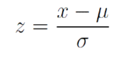
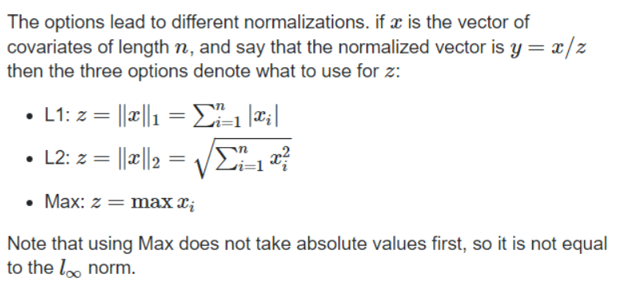
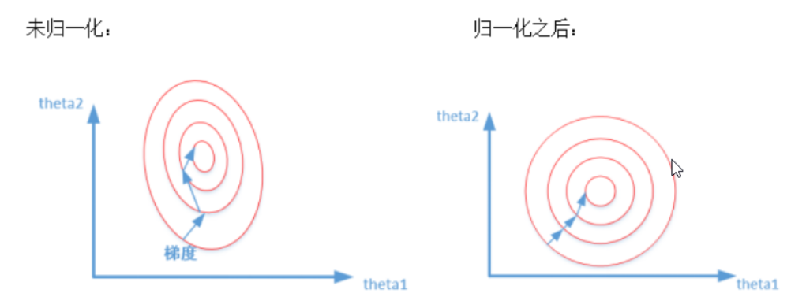
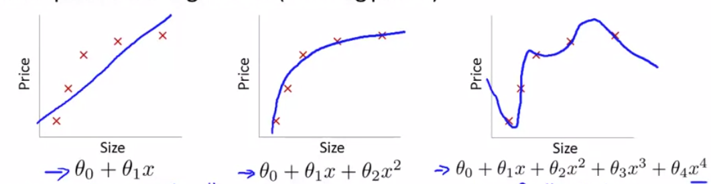
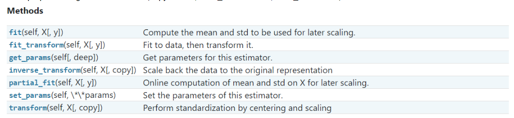
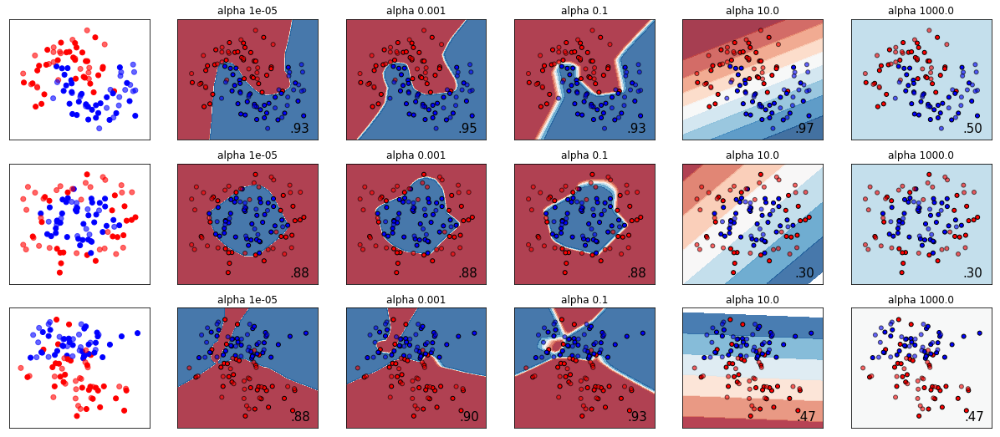
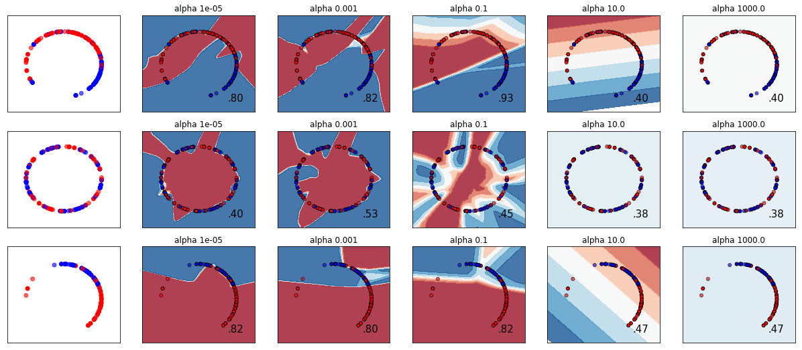
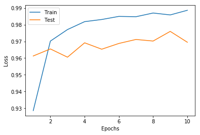
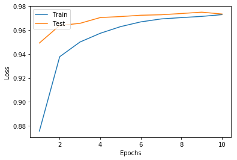
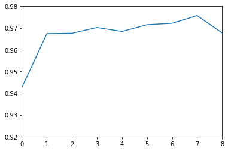

# 问题：**数据进行标准化(Standardization)、归一化（（Normalization）或者正则化（Regularization）处理，请问这三者有何不同？分别适用于哪些算法？**

------


## **标准化**：
通常情况下是指对数据进行相应的改变，使得数据近似满足服从标准正态的分布，即下面这个式子：



### 作用
在许多机器学习算法中**普遍要求数据满足正态分布的特征**，此时算法能够很好的去对这些特征进行处理，进而算法的性能会更佳或是会更快收敛。因而在使用机器学习算法时标准化是处理数据重要的一步。

### 适用的算法

>基于欧氏距离的k近邻、K-means聚类算法、线性回归、逻辑回归                             
支持向量机（带有径向偏置的核函数rbf）、主成分分析                            
线性判别分析、神经网络

## **归一化**：
是将**单个样本**缩放为具有单位范数的过程，其目的在于样本向量在点乘运算或其他核函数计算相似性时，拥有统一的标准。其中将单个样本缩放为具有单位范数，通常使用l1或l2范数。


### 作用

**1.加快了求最优解的速度、消除量纲影响**                                                
如下图所示，粉色的圈圈图代表的是两个特征的等高线。其中左图两个特征theta1和theta2的区间相差非常大，theta1区间是[0,2000]，X2区间是 [1,5]，其所形成的等高线非常尖。当使用梯度下降法寻求最优解时，很有可能走“之字型”路线（垂直等高线走），从而导致需要迭代很多次才能收敛；
而右图对两个原始特征进行了归一化，其对应的等高线显得很圆，在梯度下降进行求解时能较快的收敛。


因此如果机器学习模型使用梯度下降法求最优解时，归一化往往非常有必要，否则很难收敛甚至不能收敛。

**2.归一化有可能提高精度**                                                  
一些分类器需要计算样本之间的距离（如欧氏距离），例如KNN。如果一个特征值域范围非常大，那么距离计算就主要取决于这个特征，从而与实际情况相悖（比如这时实际情况是值域范围小的特征更重要）
### 适用算法

>k近邻、K-means聚类算法

## **正则化**：
当我们的训练结果出现过拟合，在训练的数据上表现很好，但却无法很好的预测新的样本时，可以通过正则化来提高模型性能，减少过拟合。


如第三幅图所示，模型通过高维度的特征很好地学习训练数据中的细节和噪声，出现过拟合，但会在未知数据表现不佳；

如第二幅图所示，特征维度降低，模型刚好拟合了数据，在未知数据也能够有更好的表现。

**正则化，便是通过引入惩戒系数，惩戒每个节点的权重矩阵，约束参数的范数使其不要太大，限制模型的复杂度，减少过拟合。(软间隔SVM)**

-----

### 正则化策略
#### 1. L1&L2 正则化
- L1正则化
$$J_{regularized} = Loss + \small { \frac{\lambda}{2m} \sum\ ||w|| } $$

- L2正则化
$$J_{regularized} = Loss + \small { \frac{\lambda}{2m} \sum\small ||w||^{2}  } $$

**Lambda是正则化参数**。它是一个需要优化的超参数 ,可以通过**交叉验证和网络搜索**方法来优化。

通过添加正则化项，使权重矩阵的值减小，让神经网络模型更为简单，因此在一定程度上可以减少过拟合。

相同点：
      
      都用于避免过拟合。

不同点：

      L1可以让一部分特征的系数缩小到0，从而间接实现特征选择。所以L1适用于特征之间有关联的情况。
    
      L2让所有特征的系数都缩小，但是不会减为0，它会使优化求解稳定快速。所以L2适用于特征之间没有关联的情况。


详细说明：https://blog.csdn.net/jinping_shi/article/details/52433975?depth_1-utm_source=distribute.pc_relevant.none-task-blog-BlogCommendFromBaidu-1&utm_source=distribute.pc_relevant.none-task-blog-BlogCommendFromBaidu-1


### 2.数据扩增
减小过拟合的最简单方法就是数据扩增，对于图像处理问题，可以通过对训练样本进行翻转，旋转，平移等操作来增加数据。
##### 适用:  
图像、视频处理领域

### 3.Dropout
Dropout主要是神经网络中一种防止过拟合的技术。


在每一个批量的前向传播与反向更新中，我们关闭每个神经元的概率为 1-keep_prob，且关闭的神经元不参与前向传播计算与参数更新。

每当每次迭代都训练一我们关闭一些神经元，我们实际上修改了原模型的结构，那么个不同的架构，参数更新也更加关注激活的神经元。


### 适用算法：
>支持向量机、神经网络、逻辑回归等

------

# 标准化（Standardization）

>相关函数sklearn函数:
- sklearn.preprocessing.StandardScaler（copy = True，with_mean = True，with_std = True ）



```python
import numpy as np
from sklearn.preprocessing import StandardScaler#导入库
data  = np.array([[0, 0], [0, 0], [1, 1], [1, 1]])#example
scaler = StandardScaler()#创建实例
print(scaler.fit(data))#用于缩放以后数据的均值和标准差.
print(scaler.transform(data))#	通过居中和缩放执行标准化
```

    StandardScaler(copy=True, with_mean=True, with_std=True)
    [[-1. -1.]
     [-1. -1.]
     [ 1.  1.]
     [ 1.  1.]]


    G:\ML\Anaconda\Program_Data\Anaconda3\lib\site-packages\sklearn\utils\validation.py:595: DataConversionWarning: Data with input dtype int32 was converted to float64 by StandardScaler.
      warnings.warn(msg, DataConversionWarning)
    G:\ML\Anaconda\Program_Data\Anaconda3\lib\site-packages\sklearn\utils\validation.py:595: DataConversionWarning: Data with input dtype int32 was converted to float64 by StandardScaler.
      warnings.warn(msg, DataConversionWarning)


```python
(data[0][0] - data[:,0].mean())/data[:,0].std()
```


    -1.0


------

# 归一化（Normalization）

将输入缩放到单位范数是文本分类或聚类的常见操作。在sklearn中，有一个使用k-means聚类文本文档的例子用到归一化，使得KMeans表现得像球形k-means，例子的链接：
https://scikit-learn.org/stable/auto_examples/text/plot_document_clustering.html#sphx-glr-auto-examples-text-plot-document-clustering-py

## 函数的基本使用
>sklearn.preprocessing.normalize（X，norm ='l2'，axis = 1，copy = True，return_norm = False ）

          X：要归一化的数据；norm：用于规范化的范数；axis :用来归一化数据的轴                               
        copy：设置为False可以执行就地行规范化并避免复制；return_norm ：是否返回计算的范数。
>sklearn.preprocessing.Normalizer（norm ='l2'，copy = True ）

          fit(self, X[, y])不执行任何操作，并使估算器保持不变
          transform(self, X, copy=None):将X的每个非零行缩放为单位范数


```python
from sklearn import preprocessing
import numpy as np
X = [[ 1., -1.,  2.],  
     [ 2.,  0.,  0.],
     [ 0.,  1500000., -3700000.]]#假如这三行代表三个不同变量
X_normalized = preprocessing.normalize(X, norm='l2')#归一化消除量纲影响
X_normalized
```


    array([[ 0.40824829, -0.40824829,  0.81649658],
           [ 1.        ,  0.        ,  0.        ],
           [ 0.        ,  0.37570511, -0.92673927]])


```python
from sklearn import preprocessing
import numpy as np
X = [[ 1., -1.,  2.],  
     [ 2.,  0.,  0.],
     [ 0.,  1., -1.]]
normalizer = preprocessing.Normalizer().fit(X)  # fit does nothing
normalizer.transform(X)
```


    array([[ 0.40824829, -0.40824829,  0.81649658],
           [ 1.        ,  0.        ,  0.        ],
           [ 0.        ,  0.70710678, -0.70710678]])


------

## 正则化（Regulation）
## L1&L2正则化
代码实现：在Keras中，我们使用regularizers模块来在某个层上应用L1或者L2正则化

eg:
from keras import regularizers
model.add(Dense(64, input_dim=64,
         kernel_regularizer=regularizers.l2(0.01)  #在某一层上使用L2正则化，其中lambda为0.01     
## Dropout
代码实现：Keras中，使用Dropout层实现dropout。
from keras.layers.core import Dropout
#定义网络：输入维数784，输出维数500，在第一层实行dropout。第二层输入维数500，输出维数10.
model = Sequential([
 Dense(output_dim=500, input_dim= 784, activation='relu'),
 Dropout(0.25),                               #dropout设置的丢弃概率值为0.25，这个值也可以采用网格搜索方法进一步优化
 Dense(output_dim=10, input_dim=500, activation='softmax'),
 ])

## 数据增强
代码实现：keras中，通过使用ImageDataGenerator来实现图像变换
eg:
from keras.preprocessing import image
gen = image.ImageDataGenerator(rotation_range = 40, width_shift_range = 0.2, height_shift_range = 0.2,
                            fill_mode = 'nearest')  #图像生成器，旋转范围40，宽度高度平移范围0.2
batches=gen.flow(X, Y, batch_size=64)              #图像生成

正常训练结果：

L2正则化后结果：

Dropout后结果：

数据增强后结果：


## 结论：L2、数据增强效果稍有提高，Dropout效果较好

# 标准化、归一化以及正则化具体的实例


```python
#标准化实例
#------------------#

import numpy as np
from matplotlib import pyplot as plt
from matplotlib.colors import ListedColormap
from sklearn.model_selection import train_test_split
from sklearn.preprocessing import StandardScaler
from sklearn.datasets import make_moons, make_circles, make_classification
from sklearn.neural_network import MLPClassifier

h = .02  # step size in the mesh

alphas = np.logspace(-5, 3, 5)
names = ['alpha ' + str(i) for i in alphas]

classifiers = []
for i in alphas:
    classifiers.append(MLPClassifier(solver='lbfgs', alpha=i, random_state=1,
                                     hidden_layer_sizes=[100, 100]))
##多重感知机训练器
X, y = make_classification(n_features=2, n_redundant=0, n_informative=2,
                           random_state=0, n_clusters_per_class=1)
#随机生成二分类数据
rng = np.random.RandomState(2)
X += 2 * rng.uniform(size=X.shape)
linearly_separable = (X, y)

datasets = [make_moons(noise=0.3, random_state=0),
            make_circles(noise=0.2, factor=0.5, random_state=1),
            linearly_separable]

figure = plt.figure(figsize=(17, 9))
i = 1
# iterate over datasets
for X, y in datasets:
    # preprocess dataset, split into training and test part
    X = StandardScaler().fit_transform(X)
    X_train, X_test, y_train, y_test = train_test_split(X, y, test_size=.4)

    x_min, x_max = X[:, 0].min() - .5, X[:, 0].max() + .5
    y_min, y_max = X[:, 1].min() - .5, X[:, 1].max() + .5
    xx, yy = np.meshgrid(np.arange(x_min, x_max, h),
                         np.arange(y_min, y_max, h))

    # just plot the dataset first
    cm = plt.cm.RdBu
    cm_bright = ListedColormap(['#FF0000', '#0000FF'])
    ax = plt.subplot(len(datasets), len(classifiers) + 1, i)
    # Plot the training points
    ax.scatter(X_train[:, 0], X_train[:, 1], c=y_train, cmap=cm_bright)
    # and testing points
    ax.scatter(X_test[:, 0], X_test[:, 1], c=y_test, cmap=cm_bright, alpha=0.6)
    ax.set_xlim(xx.min(), xx.max())
    ax.set_ylim(yy.min(), yy.max())
    ax.set_xticks(())
    ax.set_yticks(())
    i += 1

    # iterate over classifiers
    for name, clf in zip(names, classifiers):
        ax = plt.subplot(len(datasets), len(classifiers) + 1, i)
        clf.fit(X_train, y_train)
        score = clf.score(X_test, y_test)

        # Plot the decision boundary. For that, we will assign a color to each
        # point in the mesh [x_min, x_max]x[y_min, y_max].
        if hasattr(clf, "decision_function"):
            Z = clf.decision_function(np.c_[xx.ravel(), yy.ravel()])
        else:
            Z = clf.predict_proba(np.c_[xx.ravel(), yy.ravel()])[:, 1]

        # Put the result into a color plot
        Z = Z.reshape(xx.shape)
        ax.contourf(xx, yy, Z, cmap=cm, alpha=.8)

        # Plot also the training points
        ax.scatter(X_train[:, 0], X_train[:, 1], c=y_train, cmap=cm_bright,
                   edgecolors='black', s=25)
        # and testing points
        ax.scatter(X_test[:, 0], X_test[:, 1], c=y_test, cmap=cm_bright,
                   alpha=0.6, edgecolors='black', s=25)

        ax.set_xlim(xx.min(), xx.max())
        ax.set_ylim(yy.min(), yy.max())
        ax.set_xticks(())
        ax.set_yticks(())
        ax.set_title(name)
        ax.text(xx.max() - .3, yy.min() + .3, ('%.2f' % score).lstrip('0'),
                size=15, horizontalalignment='right')
        i += 1

figure.subplots_adjust(left=.02, right=.98)
plt.show()
```

    Automatically created module for IPython interactive environment





```python
#归一化化实例
#---------------------#

import numpy as np
from matplotlib import pyplot as plt
from matplotlib.colors import ListedColormap
from sklearn.model_selection import train_test_split
from sklearn.preprocessing import StandardScaler
from sklearn.datasets import make_moons, make_circles, make_classification
from sklearn.neural_network import MLPClassifier
from sklearn.preprocessing import Normalizer
h = .02  # step size in the mesh

alphas = np.logspace(-5, 3, 5)
names = ['alpha ' + str(i) for i in alphas]

classifiers = []
for i in alphas:
    classifiers.append(MLPClassifier(solver='lbfgs', alpha=i, random_state=1,
                                     hidden_layer_sizes=[100, 100]))

X, y = make_classification(n_features=2, n_redundant=0, n_informative=2,
                           random_state=0, n_clusters_per_class=1)
rng = np.random.RandomState(2)
X += 2 * rng.uniform(size=X.shape)
linearly_separable = (X, y)

datasets = [make_moons(noise=0.3, random_state=0),
            make_circles(noise=0.2, factor=0.5, random_state=1),
            linearly_separable]

figure = plt.figure(figsize=(17, 9))
i = 1
# iterate over datasets
for X, y in datasets:
    # preprocess dataset, split into training and test part
    X =Normalizer().fit_transform(X)
    X_train, X_test, y_train, y_test = train_test_split(X, y, test_size=.4)

    x_min, x_max = X[:, 0].min() - .5, X[:, 0].max() + .5
    y_min, y_max = X[:, 1].min() - .5, X[:, 1].max() + .5
    xx, yy = np.meshgrid(np.arange(x_min, x_max, h),
                         np.arange(y_min, y_max, h))

    # just plot the dataset first
    cm = plt.cm.RdBu
    cm_bright = ListedColormap(['#FF0000', '#0000FF'])
    ax = plt.subplot(len(datasets), len(classifiers) + 1, i)
    # Plot the training points
    ax.scatter(X_train[:, 0], X_train[:, 1], c=y_train, cmap=cm_bright)
    # and testing points
    ax.scatter(X_test[:, 0], X_test[:, 1], c=y_test, cmap=cm_bright, alpha=0.6)
    ax.set_xlim(xx.min(), xx.max())
    ax.set_ylim(yy.min(), yy.max())
    ax.set_xticks(())
    ax.set_yticks(())
    i += 1

    # iterate over classifiers
    for name, clf in zip(names, classifiers):
        ax = plt.subplot(len(datasets), len(classifiers) + 1, i)
        clf.fit(X_train, y_train)
        score = clf.score(X_test, y_test)

        # Plot the decision boundary. For that, we will assign a color to each
        # point in the mesh [x_min, x_max]x[y_min, y_max].
        if hasattr(clf, "decision_function"):
            Z = clf.decision_function(np.c_[xx.ravel(), yy.ravel()])
        else:
            Z = clf.predict_proba(np.c_[xx.ravel(), yy.ravel()])[:, 1]

        # Put the result into a color plot
        Z = Z.reshape(xx.shape)
        ax.contourf(xx, yy, Z, cmap=cm, alpha=.8)

        # Plot also the training points
        ax.scatter(X_train[:, 0], X_train[:, 1], c=y_train, cmap=cm_bright,
                   edgecolors='black', s=25)
        # and testing points
        ax.scatter(X_test[:, 0], X_test[:, 1], c=y_test, cmap=cm_bright,
                   alpha=0.6, edgecolors='black', s=25)

        ax.set_xlim(xx.min(), xx.max())
        ax.set_ylim(yy.min(), yy.max())
        ax.set_xticks(())
        ax.set_yticks(())
        ax.set_title(name)
        ax.text(xx.max() - .3, yy.min() + .3, ('%.2f' % score).lstrip('0'),
                size=15, horizontalalignment='right')
        i += 1

figure.subplots_adjust(left=.02, right=.98)
plt.show()
```

    Automatically created module for IPython interactive environment





## 正则化具体实例
该案例需要配置keras环境，如果大家想要更加直观的了解可以看一下下面这个网站：
http://playground.tensorflow.org/#activation=tanh&batchSize=10&dataset=circle&regDataset=reg-plane&learningRate=0.03&regularizationRate=0&noise=0&networkShape=4,2&seed=0.32351&showTestData=false&discretize=false&percTrainData=50&x=true&y=true&xTimesY=false&xSquared=false&ySquared=false&cosX=false&sinX=false&cosY=false&sinY=false&collectStats=false&problem=classification&initZero=false&hideText=false


```python
from keras.datasets import mnist
from keras.layers import Dense,Dropout,Flatten,Lambda
from keras.models import Sequential
from sklearn.model_selection import train_test_split
from keras.preprocessing import image
from keras import regularizers,optimizers
from keras.callbacks import EarlyStopping
from keras.utils.np_utils import to_categorical
from keras.callbacks import EarlyStopping

import numpy as np
import matplotlib.pyplot as plt
%matplotlib inline

(train_image,train_labels),(test_images,test_labels) = mnist.load_data()  
print(train_image.shape,train_labels.shape,test_images.shape,test_labels.shape)
#for i in range(6,9): 
#    plt.subplot(330+i+1)
#   plt.imshow(train_image[i], cmap=plt.get_cmap('gray'))
#   plt.title(train_labels[i]);

#one hot coding
train_labels = to_categorical(train_labels)
test_labels = to_categorical(test_labels)
print(train_labels[0])
print(test_labels[0])

mean_px = train_image.mean().astype(np.float32)
std_px = train_image.std().astype(np.float32)
def standardize(x):
    return (x-mean_px)/std_px

#划分训练集和验证集 按7:3划分
split_size = int(len(train_image) * 0.7)
x_train,y_train = train_image[:split_size,:,:,np.newaxis],train_labels[:split_size,:]
x_val,y_val = train_image[split_size:,:,:,np.newaxis],train_labels[split_size:,:]


output_num_units = 10
seed = 100
np.random.seed(seed)
epochs = 10
batch_size = 128
model = Sequential([
 Lambda(standardize, input_shape=(28,28,1)),
 Flatten(),
 Dense(500, activation='relu'),
 Dense(500, activation='relu'),
 Dense(500, activation='relu'),
 Dense(output_num_units, activation='softmax'),]
  )
model.compile(loss='categorical_crossentropy', optimizer='adam', metrics=['accuracy'])
history = model.fit(x_train, y_train, batch_size=batch_size, epochs=10, verbose=2, validation_data=(x_val, y_val))
history_dict = history.history
print(history_dict.keys())
loss_value = history_dict['acc']
val_loss_values = history_dict['val_acc']
epochs = range(1,len(loss_value)+1)

plt.plot(epochs, loss_value)
plt.plot(epochs, val_loss_values)
plt.xlabel('Epochs')
plt.ylabel('Loss')
plt.legend(['Train', 'Test'], loc='upper left')
plt.show()
```

    (60000, 28, 28) (60000,) (10000, 28, 28) (10000,)
    [0. 0. 0. 0. 0. 1. 0. 0. 0. 0.]
    [0. 0. 0. 0. 0. 0. 0. 1. 0. 0.]
    Train on 42000 samples, validate on 18000 samples
    Epoch 1/10
    6s - loss: 0.2283 - acc: 0.9293 - val_loss: 0.1283 - val_acc: 0.9623
    Epoch 2/10
    6s - loss: 0.0941 - acc: 0.9704 - val_loss: 0.1196 - val_acc: 0.9660
    Epoch 3/10
    5s - loss: 0.0672 - acc: 0.9783 - val_loss: 0.1099 - val_acc: 0.9692
    Epoch 4/10
    5s - loss: 0.0483 - acc: 0.9845 - val_loss: 0.1262 - val_acc: 0.9676
    Epoch 5/10
    5s - loss: 0.0375 - acc: 0.9881 - val_loss: 0.1045 - val_acc: 0.9720
    Epoch 6/10
    5s - loss: 0.0336 - acc: 0.9890 - val_loss: 0.1011 - val_acc: 0.9740
    Epoch 7/10
    5s - loss: 0.0281 - acc: 0.9910 - val_loss: 0.1006 - val_acc: 0.9752
    Epoch 8/10
    5s - loss: 0.0262 - acc: 0.9915 - val_loss: 0.1196 - val_acc: 0.9737
    Epoch 9/10
    5s - loss: 0.0293 - acc: 0.9905 - val_loss: 0.1131 - val_acc: 0.9735
    Epoch 10/10
    5s - loss: 0.0211 - acc: 0.9931 - val_loss: 0.1343 - val_acc: 0.9717
    dict_keys(['val_loss', 'val_acc', 'loss', 'acc'])


```python
## L2正则化
reg_w = 2e-4

model = Sequential([
 Lambda(standardize, input_shape=(28,28,1)),
 Flatten(),
 Dense(500, activation='relu', kernel_regularizer=regularizers.l2(reg_w)),
 Dense(500, activation='relu', kernel_regularizer=regularizers.l2(reg_w)),
 Dense(500, activation='relu', kernel_regularizer=regularizers.l2(reg_w)),
 Dense(output_num_units, activation='softmax'),]
  )

model.compile(optimizer="adam", loss="categorical_crossentropy", metrics=["accuracy"])
history2 = model.fit(x_train, y_train, batch_size=batch_size, epochs=10, verbose=2, validation_data=(x_val, y_val))

history_dict2 = history2.history
history_dict.keys()
loss_value = history_dict2['acc']
val_loss_values = history_dict2['val_acc']
epochs = range(1,len(loss_value)+1)

plt.plot(epochs, loss_value)
plt.plot(epochs, val_loss_values)
plt.xlabel('Epochs')
plt.ylabel('Loss')
plt.legend(['Train', 'Test'], loc='upper left')
plt.show()
```

    Train on 42000 samples, validate on 18000 samples
    Epoch 1/10
    9s - loss: 0.5124 - acc: 0.9286 - val_loss: 0.3721 - val_acc: 0.9613
    Epoch 2/10
    7s - loss: 0.3171 - acc: 0.9702 - val_loss: 0.3099 - val_acc: 0.9655
    Epoch 3/10
    7s - loss: 0.2506 - acc: 0.9771 - val_loss: 0.2935 - val_acc: 0.9606
    Epoch 4/10
    7s - loss: 0.2067 - acc: 0.9818 - val_loss: 0.2443 - val_acc: 0.9692
    Epoch 5/10
    7s - loss: 0.1788 - acc: 0.9831 - val_loss: 0.2388 - val_acc: 0.9653
    Epoch 6/10
    7s - loss: 0.1593 - acc: 0.9850 - val_loss: 0.2173 - val_acc: 0.9688
    Epoch 7/10
    7s - loss: 0.1503 - acc: 0.9848 - val_loss: 0.1973 - val_acc: 0.9712
    Epoch 8/10
    7s - loss: 0.1361 - acc: 0.9870 - val_loss: 0.1947 - val_acc: 0.9702
    Epoch 9/10
    7s - loss: 0.1350 - acc: 0.9859 - val_loss: 0.1751 - val_acc: 0.9760
    Epoch 10/10
    7s - loss: 0.1204 - acc: 0.9886 - val_loss: 0.1910 - val_acc: 0.9695





```python
#Dropout
from keras.layers.core import Dropout
model = Sequential([
 Lambda(standardize, input_shape=(28,28,1)),
 Flatten(),
 #Dense(output_dim=500, input_dim=hidden1_num_units, activation='relu'),
 Dense(500, activation='relu'),
 Dropout(0.5),
 Dense(500, activation='relu'),
 Dense(500, activation='relu'),
 Dropout(0.4),

Dense(output_dim=output_num_units, input_dim=500, activation='softmax'),
 ])
model.compile(loss='categorical_crossentropy', optimizer='adam', metrics=['accuracy'])
history3 = model.fit(x_train, y_train, nb_epoch=10, batch_size=batch_size, validation_data=(x_val, y_val))

history_dict3 = history3.history
history_dict.keys()
loss_value = history_dict3["acc"]
val_loss_values = history_dict3['val_acc']
epochs = range(1,len(loss_value)+1)

plt.plot(epochs, loss_value)
plt.plot(epochs, val_loss_values)
plt.xlabel('Epochs')
plt.ylabel('Loss')
plt.legend(['Train', 'Test'], loc='upper left')
plt.show()
```

    WARNING:tensorflow:From G:\ML\Anaconda\Program_Data\Anaconda3\lib\site-packages\keras\backend\tensorflow_backend.py:2888: calling dropout (from tensorflow.python.ops.nn_ops) with keep_prob is deprecated and will be removed in a future version.
    Instructions for updating:
    Please use `rate` instead of `keep_prob`. Rate should be set to `rate = 1 - keep_prob`.


    G:\ML\Anaconda\Program_Data\Anaconda3\lib\site-packages\ipykernel_launcher.py:13: UserWarning: Update your `Dense` call to the Keras 2 API: `Dense(input_dim=500, activation="softmax", units=10)`
      del sys.path[0]
    G:\ML\Anaconda\Program_Data\Anaconda3\lib\site-packages\keras\models.py:848: UserWarning: The `nb_epoch` argument in `fit` has been renamed `epochs`.
      warnings.warn('The `nb_epoch` argument in `fit` '


    Train on 42000 samples, validate on 18000 samples
    Epoch 1/10
    42000/42000 [==============================] - 8s - loss: 0.3968 - acc: 0.8756 - val_loss: 0.1671 - val_acc: 0.9493
    Epoch 2/10
    42000/42000 [==============================] - 7s - loss: 0.2060 - acc: 0.9378 - val_loss: 0.1201 - val_acc: 0.9639
    Epoch 3/10
    42000/42000 [==============================] - 7s - loss: 0.1663 - acc: 0.9501 - val_loss: 0.1115 - val_acc: 0.9657
    Epoch 4/10
    42000/42000 [==============================] - 7s - loss: 0.1400 - acc: 0.9574 - val_loss: 0.1024 - val_acc: 0.9706
    Epoch 5/10
    42000/42000 [==============================] - 7s - loss: 0.1230 - acc: 0.9630 - val_loss: 0.1006 - val_acc: 0.9714
    Epoch 6/10
    42000/42000 [==============================] - 6s - loss: 0.1094 - acc: 0.9670 - val_loss: 0.0948 - val_acc: 0.9725
    Epoch 7/10
    42000/42000 [==============================] - 6s - loss: 0.1020 - acc: 0.9694 - val_loss: 0.1025 - val_acc: 0.9729
    Epoch 8/10
    42000/42000 [==============================] - 6s - loss: 0.0992 - acc: 0.9705 - val_loss: 0.0944 - val_acc: 0.9739
    Epoch 9/10
    42000/42000 [==============================] - 7s - loss: 0.0949 - acc: 0.9715 - val_loss: 0.0949 - val_acc: 0.9751
    Epoch 10/10
    42000/42000 [==============================] - 7s - loss: 0.0859 - acc: 0.9730 - val_loss: 0.0986 - val_acc: 0.9735





```python
#Earlystop
model = Sequential([
 Lambda(standardize, input_shape=(28,28,1)),
 Flatten(),
 Dense(500, activation='relu'),
 Dense(500, activation='relu'),
 Dense(500, activation='relu'),
 Dense(output_num_units, activation='softmax'),]
  )

model.compile(optimizer="adam", loss="categorical_crossentropy", metrics=["accuracy"])

history4 = model.fit(x_train, y_train, batch_size=batch_size, epochs=10, verbose=2,
                         validation_data=(x_val, y_val), callbacks=[EarlyStopping(monitor="val_acc", patience=1)])
history_dict4 = history4.history
history_dict.keys()
loss_value = history_dict4['acc']
val_loss_values = history_dict4['val_acc']
epochs = range(1,len(loss_value)+1)

plt.plot(epochs, loss_value)
plt.plot(epochs, val_loss_values)
plt.xlabel('Epochs')
plt.ylabel('Loss')
plt.legend(['Train', 'Test'], loc='upper left')
plt.show()
```


```python
#数据增强
datagen = image.ImageDataGenerator(rotation_range=20)
i = 0
f, ax = plt.subplots(1,6)
for batch in datagen.flow(x_train, batch_size = 1):  
    imgplot = ax[i].imshow(image.array_to_img(batch[0]))
    ax[i].axis('off')
    i += 1
    if i % 6 == 0:
        break
datagen.fit(x_train, augment=True)
model = Sequential([
 Dense(500, input_shape=( 784,), activation='relu'),
 Dense(500, activation='relu'),
 Dense(500, activation='relu'),
 Dense(500, activation='relu'),
 Dense(output_num_units, activation='softmax'),]
  )

model.compile(optimizer="adam", loss="categorical_crossentropy", metrics=["accuracy"])
res = np.zeros([10,2])
for e in range(10):
    print('Epoch', e)
    batches = 0
    for x_batch, y_batch in datagen.flow(x_train, y_train, batch_size=batch_size):
        x_batch = np.reshape(x_batch, (-1, 784)) / 255.0
        model.train_on_batch(x_batch, y_batch)
        batches += 1
        if batches >= len(x_train) // batch_size:
         # we need to break the loop by hand because
         # the generator loops indefinitely
         break

    res[e] = model.evaluate(x_val.reshape(-1, 784), y_val, verbose=0, batch_size=batch_size)
    print(res)
    
val_acc = res[:,1]
print("acc:",val_acc)
plt.plot(val_acc)
plt.axis([0,8,0.92,0.98])
```

    Epoch 0
    [[0.91796191 0.9425    ]
     [0.         0.        ]
     [0.         0.        ]
     [0.         0.        ]
     [0.         0.        ]
     [0.         0.        ]
     [0.         0.        ]
     [0.         0.        ]
     [0.         0.        ]
     [0.         0.        ]]
    Epoch 1
    [[0.91796191 0.9425    ]
     [0.51809204 0.96738889]
     [0.         0.        ]
     [0.         0.        ]
     [0.         0.        ]
     [0.         0.        ]
     [0.         0.        ]
     [0.         0.        ]
     [0.         0.        ]
     [0.         0.        ]]
    Epoch 2
    [[0.91796191 0.9425    ]
     [0.51809204 0.96738889]
     [0.51994744 0.96755556]
     [0.         0.        ]
     [0.         0.        ]
     [0.         0.        ]
     [0.         0.        ]
     [0.         0.        ]
     [0.         0.        ]
     [0.         0.        ]]
    Epoch 3
    [[0.91796191 0.9425    ]
     [0.51809204 0.96738889]
     [0.51994744 0.96755556]
     [0.47344193 0.97022222]
     [0.         0.        ]
     [0.         0.        ]
     [0.         0.        ]
     [0.         0.        ]
     [0.         0.        ]
     [0.         0.        ]]
    Epoch 4
    [[0.91796191 0.9425    ]
     [0.51809204 0.96738889]
     [0.51994744 0.96755556]
     [0.47344193 0.97022222]
     [0.50594619 0.96838889]
     [0.         0.        ]
     [0.         0.        ]
     [0.         0.        ]
     [0.         0.        ]
     [0.         0.        ]]
    Epoch 5
    [[0.91796191 0.9425    ]
     [0.51809204 0.96738889]
     [0.51994744 0.96755556]
     [0.47344193 0.97022222]
     [0.50594619 0.96838889]
     [0.45353601 0.9715    ]
     [0.         0.        ]
     [0.         0.        ]
     [0.         0.        ]
     [0.         0.        ]]
    Epoch 6
    [[0.91796191 0.9425    ]
     [0.51809204 0.96738889]
     [0.51994744 0.96755556]
     [0.47344193 0.97022222]
     [0.50594619 0.96838889]
     [0.45353601 0.9715    ]
     [0.44463746 0.97216667]
     [0.         0.        ]
     [0.         0.        ]
     [0.         0.        ]]
    Epoch 7
    [[0.91796191 0.9425    ]
     [0.51809204 0.96738889]
     [0.51994744 0.96755556]
     [0.47344193 0.97022222]
     [0.50594619 0.96838889]
     [0.45353601 0.9715    ]
     [0.44463746 0.97216667]
     [0.38527994 0.97572222]
     [0.         0.        ]
     [0.         0.        ]]
    Epoch 8
    [[0.91796191 0.9425    ]
     [0.51809204 0.96738889]
     [0.51994744 0.96755556]
     [0.47344193 0.97022222]
     [0.50594619 0.96838889]
     [0.45353601 0.9715    ]
     [0.44463746 0.97216667]
     [0.38527994 0.97572222]
     [0.5167773  0.96772222]
     [0.         0.        ]]
    Epoch 9
    [[0.91796191 0.9425    ]
     [0.51809204 0.96738889]
     [0.51994744 0.96755556]
     [0.47344193 0.97022222]
     [0.50594619 0.96838889]
     [0.45353601 0.9715    ]
     [0.44463746 0.97216667]
     [0.38527994 0.97572222]
     [0.5167773  0.96772222]
     [0.39206719 0.9755    ]]
    acc: [0.9425     0.96738889 0.96755556 0.97022222 0.96838889 0.9715
     0.97216667 0.97572222 0.96772222 0.9755    ]


    [0, 8, 0.92, 0.98]


```python
plt.plot(val_acc)
plt.axis([0,8,0.92,0.98])
```


    [0, 8, 0.92, 0.98]





```python

```
