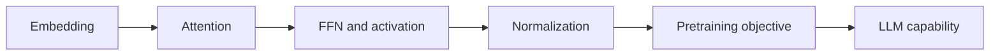
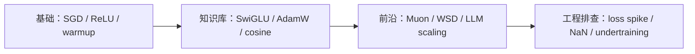

# 深度学习基础

## 当前定位

这章用于沉淀深度学习与 NLP/LLM 基础：注意力机制、Transformer、位置编码、归一化、激活函数、预训练模型和大模型结构。它和后训练章节的关系是：**后训练优化的是模型行为，深度学习基础解释模型为什么能表示和学习**。

> **面试抓手**：深度学习基础要能把“结构设计、训练稳定性、计算复杂度、表示能力”连起来讲。

## ReadyBlog 来源

- ReadyBlog: `深度学习/监督学习/NLP方向/注意力机制.md`
- ReadyBlog: `深度学习/监督学习/NLP方向/PLMs.md`
- ReadyBlog: `深度学习/监督学习/NLP方向/传统模型.md`
- ReadyBlog: `深度学习/监督学习/NLP方向/生成式模型基础.md`
- ReadyBlog: `深度学习/监督学习/大模型方向/大模型基础知识.md`
- ReadyBlog: `深度学习/监督学习/CV方向/vit系列.md`

## 知识画像

| 主题 | 必须掌握 | 面试表达重点 |
|---|---|---|
| Attention | Q/K/V、scaled dot-product、mask | 为什么除以 $\sqrt{d_k}$，自注意力复杂度 |
| Transformer | MHA、FFN、Residual、Norm | Pre-Norm vs Post-Norm，训练稳定性 |
| 位置编码 | 绝对位置、相对位置、RoPE | 位置信息如何进入 attention |
| 激活函数 | ReLU、GELU、SwiGLU | 非线性、门控和 FFN 表达能力 |
| PLM | BERT、RoBERTa、XLNet、ELECTRA | MLM、AR、判别式预训练差异 |
| LLM | decoder-only、MoE、LoRA、RLHF | 从预训练到指令对齐的链路 |

## 训练优化基础：激活函数、优化器与学习率

这一节只沉淀长期稳定的基础概念，面试专题和 LLM 工程细节放在知识库的 [激活函数与门控 FFN](#knowledge/activation-functions) 与 [优化器与训练稳定性](#knowledge/optimization-training) 中展开。

| 基础问题 | 基础层要掌握 | 知识库专题继续展开 |
|---|---|---|
| 激活函数为什么需要 | 引入非线性，影响梯度传播和输出分布 | GELU / SiLU / SwiGLU 与 Transformer FFN |
| 优化器在做什么 | 根据梯度更新参数，控制步长、方向和噪声 | AdamW、Adafactor、Lion、Sophia、Shampoo、Muon |
| 学习率调度为什么重要 | 控制不同训练阶段的更新幅度 | warmup、cosine、linear decay、WSD 与 LLM 训练稳定性 |
| 梯度裁剪解决什么 | 限制异常 batch 的梯度范数 | 和 AdamW/Muon、RL 后训练中的稳定性排查结合 |

### 激活函数基础

激活函数的核心作用是让网络具备非线性表达能力。如果多层网络中只有线性变换，那么多层线性层仍然等价于一个线性层。常见激活函数可以按“是否饱和、是否平滑、是否带门控”来理解：

| 激活函数 | 直觉 | 关键风险 |
|---|---|---|
| Sigmoid / Tanh | 平滑但容易饱和 | 大输入处梯度接近 0 |
| ReLU | 正半轴不饱和，计算简单 | 负半轴可能 dead ReLU |
| GELU / SiLU | 平滑自门控 | 计算略复杂，但 Transformer 中常用 |
| GLU / SwiGLU | 显式门控通道 | 参数预算和 FFN 结构要一起设计 |

### 优化器基础

最小的优化器视角是 SGD：

$$
\theta_{t+1}=\theta_t-\eta\nabla_\theta\mathcal{L}(\theta_t)
$$

Momentum 用历史梯度平滑方向；Adam 用一阶矩和二阶矩做自适应缩放；AdamW 把 weight decay 从 Adam 的梯度路径中解耦出来。面试里先把这条主线讲清楚，再进入 Muon、Sophia 这类前沿优化器，理解会稳很多。

### 学习率调度基础

学习率决定每一步更新的幅度。训练早期常用 warmup 避免参数和 Adam 矩估计尚未稳定时更新过猛；中后期常用 decay 降低噪声、促进收敛。基础层只需要记住三句话：

- **warmup**：保护训练早期，逐步升到 peak LR。
- **decay**：训练后期降低学习率，减少振荡。
- **schedule 要和 batch size、optimizer、weight decay 一起调**，不能孤立比较。

### 基础到专题的学习路径

## 核心公式

Scaled dot-product attention：

$$
\mathrm{Attention}(Q,K,V)
=
\mathrm{softmax}\left(\frac{QK^\top}{\sqrt{d_k}}\right)V
$$

Transformer block 直觉：

$$
h' = h + \mathrm{Attention}(\mathrm{Norm}(h))
$$

$$
h_{out} = h' + \mathrm{FFN}(\mathrm{Norm}(h'))
$$

## 核心结论

- **Attention 解决动态加权聚合**：每个 token 根据当前上下文决定关注哪些 token。
- **Transformer 的稳定训练依赖残差和归一化**：深层网络没有残差和 Norm 很难稳定传播梯度。
- **位置编码决定长度泛化边界**：RoPE、ALiBi、相对位置等设计直接影响长上下文能力。
- **PLM 到 LLM 的关键变化是目标和架构**：BERT 偏理解，GPT/decoder-only 偏生成，大模型再通过 SFT/RLHF/偏好优化对齐行为。

## 面试 QA

**Q：Attention 为什么要除以 $\sqrt{d_k}$？**

A：当维度 $d_k$ 变大时，点积方差会变大，softmax 容易进入饱和区，梯度变小。除以 $\sqrt{d_k}$ 可以稳定 logits 尺度。

**Q：BERT 和 GPT 的核心区别是什么？**

A：BERT 是 encoder-only，通常用 MLM 做双向理解；GPT 是 decoder-only，用 causal LM 做自回归生成。前者适合理解类任务，后者更自然适合生成和对话。

**Q：Pre-Norm 为什么更适合深层 Transformer？**

A：Pre-Norm 把归一化放在子层前，残差路径更干净，梯度更容易穿过深层网络；Post-Norm 在较深模型中更容易训练不稳定。

## 后续补全计划

- 从 ReadyBlog 注意力机制笔记中拆出 RoPE / MQA / GQA / FlashAttention 小节。
- 从 PLMs 笔记中补 BERT、RoBERTa、XLNet、ELECTRA 对比表。
- 把 LLM 基础与当前 SFT/DPO/GRPO 后训练章节做交叉引用。
