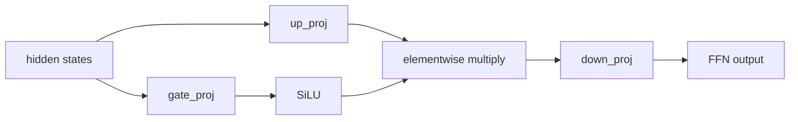

# 激活函数与门控 FFN：ReLU / GELU / SiLU / GLU / SwiGLU

## 当前定位

激活函数决定了神经网络在每一层如何引入非线性，也会影响梯度传播、表示稀疏性、训练稳定性和 FFN 参数效率。大模型面试里，激活函数通常不会单独问成数学题，而是和 Transformer FFN、SwiGLU、LLaMA/Qwen/PaLM 架构、初始化、优化器和训练稳定性一起问。

> **面试抓手**：普通深度学习里先讲 ReLU / GELU / SiLU；LLM 架构里重点讲 **GLU 系列门控 FFN**，尤其是 SwiGLU 为什么替代传统 FFN 的 `Linear -> GELU -> Linear`。

### 章节边界

本章放在[优化器与训练稳定性](#knowledge/optimization-training)之前，原因是激活函数属于“模型内部信号如何流动”的结构前置知识；优化器则回答“参数如何更新”。两者都会影响训练稳定性，但作用位置不同。

| 问题 | 放在本章 | 放在优化器章节 |
|---|---|---|
| 非线性怎么引入 | ReLU、GELU、SiLU、GLU/SwiGLU | 不展开 |
| 梯度为什么消失、饱和或稀疏 | 从激活函数导数和输出分布解释 | 从学习率、动量、二阶信息解释 |
| LLM 为什么用 SwiGLU | 从门控 FFN 和参数效率解释 | 只讨论它对训练稳定性的间接影响 |

### 基础入口

如果对 ReLU、GELU、SiLU、SGD、warmup 这些概念还不熟，先回到 [深度学习基础](#foundations/dl-foundations) 的“训练优化基础”小节。本页只负责把基础概念推进到 LLM 面试常问的门控 FFN、SwiGLU 参数预算和 Transformer 架构选择。


## 一、基础激活函数

### ReLU

ReLU 定义为：

$$
\mathrm{ReLU}(x)=\max(0,x)
$$

优点是计算简单、正半轴梯度恒为 1、能产生稀疏激活；缺点是负半轴梯度为 0，可能出现 dead ReLU。

面试里不要只说“ReLU 解决梯度消失”。更准确的说法是：ReLU 在正半轴不饱和，缓解了 sigmoid/tanh 在大输入处导数接近 0 的问题，但负半轴仍然可能导致神经元长期不更新。

### GELU

GELU 定义为：

$$
\mathrm{GELU}(x)=x\Phi(x)
$$

其中 $\Phi(x)$ 是标准正态分布 CDF。常用近似为：

$$
\mathrm{GELU}(x)\approx 0.5x\left(1+\tanh\left(\sqrt{2/\pi}(x+0.044715x^3)\right)\right)
$$

GELU 可以理解为“按输入大小做软门控”：输入越大，通过概率越高；输入偏负时不是硬截断，而是平滑衰减。因此 BERT/GPT 早期 Transformer FFN 常用 GELU。

### SiLU / Swish

SiLU 定义为：

$$
\mathrm{SiLU}(x)=x\sigma(x)
$$

它和 GELU 很像，都是输入乘一个平滑门控函数。区别是 GELU 使用正态 CDF，SiLU 使用 sigmoid。SiLU 在现代 CNN、LLM 的门控变体里很常见，SwiGLU 就使用 SiLU 作为 gate activation。

### Sigmoid / Tanh

Sigmoid 和 tanh 在现代大模型 FFN 中较少作为主激活函数，主要原因是饱和区导数接近 0，深层网络里梯度传播不友好。但它们仍常出现在门控、概率输出和归一化控制里。

| 激活函数 | 形式 | 优点 | 风险 |
|---|---|---|---|
| Sigmoid | $\sigma(x)$ | 输出可解释为概率 | 饱和、非零中心 |
| Tanh | $\tanh(x)$ | 零中心 | 饱和 |
| ReLU | $\max(0,x)$ | 简单、不饱和、稀疏 | dead ReLU |
| GELU | $x\Phi(x)$ | 平滑软门控 | 计算略复杂 |
| SiLU | $x\sigma(x)$ | 平滑、自门控 | 负区间仍有小梯度 |

## 二、Transformer FFN 与门控激活

标准 Transformer FFN 通常是：

$$
\mathrm{FFN}(x)=W_2\,\phi(W_1x)
$$

其中 $\phi$ 可以是 ReLU、GELU 或 SiLU。早期 Transformer 论文使用 ReLU，BERT/GPT 系列大量使用 GELU。

门控 FFN 把中间层拆成两条分支：

$$
\mathrm{GLU}(x)=(W_a x)\odot \sigma(W_b x)
$$

其中一条分支产生内容，另一条分支产生 gate。直觉上，它让模型不只是“生成一个中间表示”，还可以动态决定哪些通道应该通过。

### GEGLU 与 SwiGLU

GEGLU 把 sigmoid gate 换成 GELU：

$$
\mathrm{GEGLU}(x)=(W_a x)\odot \mathrm{GELU}(W_b x)
$$

SwiGLU 把 gate 换成 SiLU：

$$
\mathrm{SwiGLU}(x)=(W_a x)\odot \mathrm{SiLU}(W_b x)
$$

现代 LLM 常见的 SwiGLU FFN 写法是：

$$
\mathrm{FFN}_{\mathrm{SwiGLU}}(x)=W_o\left((W_{up}x)\odot \mathrm{SiLU}(W_{gate}x)\right)
$$

这里 `up_proj` 提供内容通道，`gate_proj` 提供门控通道，`down_proj` 投回 residual hidden size。



### 为什么 LLM 偏好 SwiGLU

面试可以从三点讲：

1. **表达能力**：门控结构允许模型按 token 和通道动态筛选信息，比单一路径 GELU FFN 更灵活。
2. **训练表现**：GLU 变体在多篇经验研究和大模型实践中表现更好，PaLM、LLaMA 系列都采用 SwiGLU 或相近门控 FFN。
3. **参数预算**：SwiGLU 通常会调整中间维度，使参数量接近传统 FFN，而不是无脑翻倍。

典型 LLaMA 风格 FFN 会把中间维度从传统 $4d$ 调整到约 $\frac{8}{3}d$，因为门控 FFN 有两条输入投影分支。这样整体参数量大致接近传统 FFN：

$$
\text{Traditional FFN params}\approx d\cdot 4d + 4d\cdot d = 8d^2
$$

$$
\text{SwiGLU FFN params}\approx d\cdot \frac{8d}{3}\cdot 2 + \frac{8d}{3}\cdot d = 8d^2
$$

## 三、面试高频比较

### ReLU vs GELU

| 维度 | ReLU | GELU |
|---|---|---|
| 非线性 | 硬截断 | 平滑软门控 |
| 负半轴 | 直接为 0 | 保留小的负值影响 |
| 梯度 | 简单但有 dead ReLU 风险 | 更平滑 |
| 常见场景 | CNN、早期 Transformer | BERT/GPT 风格 Transformer |

一句话回答：ReLU 是硬门控，GELU 是概率意义上的软门控；Transformer 里 GELU 更常见，因为平滑性和表示效果通常更好。

### GELU vs SiLU

| 维度 | GELU | SiLU |
|---|---|---|
| 形式 | $x\Phi(x)$ | $x\sigma(x)$ |
| 直觉 | 正态 CDF 软门控 | sigmoid 自门控 |
| LLM 用法 | 标准 FFN 激活 | SwiGLU gate 激活 |
| 工程成本 | 有近似实现 | sigmoid 更直接 |

一句话回答：两者都是平滑自门控激活；GELU 常作为普通 FFN 激活，SiLU 更常作为 SwiGLU 的 gate。

### GELU FFN vs SwiGLU FFN

| 维度 | GELU FFN | SwiGLU FFN |
|---|---|---|
| 结构 | 单投影 + 激活 + 输出投影 | up 分支和 gate 分支相乘 |
| 信息筛选 | 靠激活函数本身 | 显式门控通道 |
| 参数量 | 通常中间层 $4d$ | 常调成约 $\frac{8}{3}d$ 保持预算接近 |
| LLM 实践 | BERT/GPT 早期常见 | PaLM/LLaMA/Qwen 等现代 LLM 常见 |

面试结论：SwiGLU 的关键不是“换了一个激活函数”，而是 FFN 从单路径非线性变成了门控特征选择结构。

## 四、原理代码

下面代码只保留手撕面试所需的最小实现，真实训练中直接使用 PyTorch 内置函数即可。

```python
import torch
import torch.nn as nn
import torch.nn.functional as F


def gelu_tanh_approx(x: torch.Tensor) -> torch.Tensor:
    """GELU 的 tanh 近似版本，常用于解释 GELU 的平滑软门控性质。"""
    coeff = torch.sqrt(torch.tensor(2.0 / torch.pi, device=x.device, dtype=x.dtype))
    return 0.5 * x * (1.0 + torch.tanh(coeff * (x + 0.044715 * x.pow(3))))


def silu(x: torch.Tensor) -> torch.Tensor:
    """SiLU / Swish：输入乘以 sigmoid gate。"""
    return x * torch.sigmoid(x)


class SwiGLUFFN(nn.Module):
    """LLaMA 风格的 SwiGLU FFN：up 分支提供内容，gate 分支控制通过比例。"""

    def __init__(self, hidden_size: int, intermediate_size: int) -> None:
        super().__init__()
        self.up_proj = nn.Linear(hidden_size, intermediate_size, bias=False)
        self.gate_proj = nn.Linear(hidden_size, intermediate_size, bias=False)
        self.down_proj = nn.Linear(intermediate_size, hidden_size, bias=False)

    def forward(self, x: torch.Tensor) -> torch.Tensor:
        content = self.up_proj(x)
        gate = F.silu(self.gate_proj(x))
        return self.down_proj(content * gate)
```

## 五、面试 QA

**Q：为什么 Transformer 里很少直接用 sigmoid/tanh 当主激活函数？**

A：它们在输入绝对值较大时容易饱和，导数接近 0，深层网络里梯度传播不友好。现代 Transformer 更常用 ReLU/GELU/SiLU 这类非饱和或平滑自门控激活。

**Q：GELU 为什么比 ReLU 更适合很多 Transformer？**

A：ReLU 是硬截断，负半轴直接为 0；GELU 是平滑软门控，会按输入大小连续调节通过程度。Transformer 的 residual stream 和 LayerNorm 已经让输入分布比较连续，GELU 的平滑性通常更友好。

**Q：SwiGLU 相比 GELU FFN 的核心改进是什么？**

A：不是单纯把 GELU 换成 SiLU，而是引入 gate 分支。SwiGLU 用 `up_proj(x) * SiLU(gate_proj(x))` 做通道级动态筛选，再投回 hidden size，因此表达能力更强。

**Q：SwiGLU 会不会让参数量翻倍？**

A：如果中间维度仍然用 $4d$，确实会明显增加参数。但 LLaMA 风格通常把中间维度调到约 $\frac{8}{3}d$，因为有 up 和 gate 两条投影分支，整体参数量可以接近传统 $4d$ FFN。

**Q：激活函数和优化器有什么关系？**

A：激活函数影响前向输出分布和反向梯度形态；优化器决定参数更新方式。比如激活饱和会让优化器拿不到有效梯度，激活输出尺度变化也会影响学习率、归一化和初始化的稳定性。

## 知识索引引用

| 知识点 | 来源 | 本页使用方式 |
|---|---|---|
| GELU 定义与 Transformer 中的使用 | Gaussian Error Linear Units；BERT / GPT 系列实践 | 用于解释 GELU 的平滑软门控性质 |
| GLU / GEGLU / SwiGLU | GLU Variants Improve Transformer；PaLM / LLaMA 架构实践 | 用于解释门控 FFN 为什么成为现代 LLM 常见结构 |
| FFN 参数量对齐 | PaLM / LLaMA 风格 SwiGLU FFN 设计 | 用于说明 $\frac{8}{3}d$ 中间维度的参数预算直觉 |
| ReLU / Sigmoid / Tanh 基础性质 | 深度学习基础教材与常见面试题 | 用于构建激活函数横向对比 |

## 参考资源

- Hendrycks & Gimpel, Gaussian Error Linear Units, arXiv:1606.08415.
- Shazeer, GLU Variants Improve Transformer, arXiv:2002.05202.
- Vaswani et al., Attention Is All You Need, NeurIPS 2017.
- Touvron et al., LLaMA: Open and Efficient Foundation Language Models, arXiv:2302.13971.
- Chowdhery et al., PaLM: Scaling Language Modeling with Pathways, arXiv:2204.02311.
