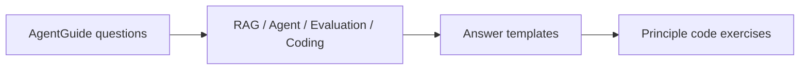

# AgentGuide 面试问答补全

> 本章基于 AgentGuide `docs/04-interview` 目录，补齐 Agent / RAG / 模型评估 / 系统手撕代码相关面试问题的中文回答模板。它和 [Agent 前沿](#knowledge/agent)、[Agent 面试实战](#knowledge/agent-interview-practice)、[LLM 工程基础](#foundations/llm-engineering-foundations) 互相跳转：这里负责“问题怎么答”，其他章节负责“原理怎么深挖”。

## 总体复习结构

| AgentGuide 文档 | 本地沉淀方式 | 重点 |
| --- | --- | --- |
| `01-theory-questions.md` | 面试题库和基础知识交叉引用 | Transformer、RoPE、MHA/MQA/GQA、Tokenizer、Scaling Law、正则化、激活函数 |
| `02-rag-questions.md` | 本章 RAG 问答 | RAG pipeline、chunk、embedding、hybrid search、Lost in the Middle、GraphRAG、评估、动态更新 |
| `03-agent-questions.md` | 本章 Agent 问答 + Agent 专题跳转 | Memory、Planning、Tool、Multi-Agent、冲突处理、人类反馈、Prompt 自动优化 |
| `04-coding-questions.md` / `17-coding-exercises.md` | 原理代码模块 | Tool Registry、Memory、Chunking、BM25、Hybrid Retrieval、Semantic Cache |
| `13-model-evaluation.md` | 本章评估问答 | LLM-as-a-Judge、BLEU/ROUGE 局限、Agent 任务轨迹评估 |

## RAG 高频问答

### Q1：RAG 相比直接微调解决什么问题？

**60 秒回答**：RAG 把“知识更新”和“模型行为”拆开。微调更适合改变模型的格式、风格、任务行为；RAG 更适合接入私有知识、实时知识和可追溯证据。RAG 的流程是先从外部知识库召回相关片段，再把证据放进上下文让 LLM 生成答案，因此它能缓解知识过时、私有知识缺失和部分幻觉问题。

**展开要点**：

- 微调把知识写进参数，更新成本高，难追溯来源。
- RAG 把知识放在外部索引，更新更快，能给引用。
- RAG 不等于一定不幻觉：检索错、上下文噪声、生成不忠实都会导致错误。
- 面试中要补一句：生产 RAG 要做权限、版本、评估和监控。

### Q2：完整 RAG pipeline 怎么讲？

可以按离线和在线两条链路回答：

| 阶段 | 关键步骤 | 常见风险 |
| --- | --- | --- |
| 离线建设 | 文档清洗、切块、metadata、embedding、向量库/倒排索引、权限索引 | 脏数据、chunk 语义断裂、版本混乱、权限泄漏 |
| 在线查询 | query rewrite、意图识别、召回、rerank、过滤、上下文拼接、生成、引用、日志 | 召回不足、噪声过多、Lost in the Middle、延迟高 |

一句话模板：**Load -> Clean -> Chunk -> Embed -> Store -> Retrieve -> Rerank -> Compose Context -> Generate -> Cite -> Monitor**。

### Q3：Chunk size 和 overlap 怎么选？

**核心取舍**：chunk 越小，召回更精准但上下文不完整；chunk 越大，语义更完整但噪声更多、召回粒度粗、上下文成本高。overlap 能缓解边界切断问题，但会增加索引和召回冗余。

实战回答：

- FAQ / 短文档：小 chunk，低 overlap。
- 法律、论文、技术文档：按标题层级、段落、表格边界做结构化 chunk。
- 代码文档：按函数、类、文件结构切。
- 最终用 Recall@k、MRR、答案忠实度、上下文 token 成本共同调参。

### Q4：如何选择 embedding 模型？

从四个维度答：

1. **语义匹配能力**：MTEB / C-MTEB、Recall@k、nDCG@k、MRR。
2. **领域适配**：金融、法律、代码、医疗等领域词汇是否稳定。
3. **多语言能力**：中英混合、专有名词、缩写是否处理好。
4. **工程成本**：向量维度、吞吐、延迟、部署方式、增量更新成本。

面试加分：embedding 负责粗召回，reranker 负责精排；不要指望 embedding 单独解决所有相关性问题。

### Q5：除了向量检索，如何提升召回质量？

| 方法 | 解决问题 | 代价 |
| --- | --- | --- |
| BM25 + dense hybrid | 稀疏关键词和语义召回互补 | 需要融合分数 |
| query rewrite / multi-query | 用户查询短、歧义大 | 生成成本和噪声 |
| HyDE | 用假设答案辅助召回 | 可能引入假设偏差 |
| reranker | 粗召回后精排 | 增加延迟 |
| metadata filter | 时间、权限、类型过滤 | 元数据建设成本 |
| GraphRAG | 多跳实体关系 | 图谱构建和维护成本 |

### Q6：Lost in the Middle 怎么缓解？

它指的是长上下文中间位置的信息更容易被模型忽略。缓解策略：

- 减少无关 chunk，只保留高置信证据。
- 把最关键证据放在上下文开头或结尾。
- 对召回结果先压缩、摘要、重排。
- 多轮检索而不是一次塞满。
- 对关键答案做引用一致性检查。

### Q7：什么时候用 GraphRAG？

适合实体关系强、多跳推理多、需要可解释路径的场景，例如企业知识库、供应链、医疗指南、金融风控。普通事实问答或语义相似搜索，向量检索 + rerank 往往更轻。

回答边界：GraphRAG 不是替代向量库，而是补充结构化关系；很多系统会同时使用 graph、BM25、dense retrieval。

### Q8：RAG 怎么评估？

分检索和生成两层：

| 层级 | 指标 | 说明 |
| --- | --- | --- |
| 检索 | Recall@k、MRR、nDCG、hit rate | 证据是否被找回来、排序是否靠前 |
| 生成 | faithfulness、answer correctness、citation accuracy | 答案是否忠于证据、引用是否正确 |
| 系统 | latency、cost、fallback rate、no-answer accuracy | 是否满足生产约束 |

面试中要强调：没有标注集时，先构建小规模 golden set，再结合 LLM-as-a-Judge 和人工抽检。

### Q9：动态增量更新如何避免新旧文档分布不一致？

回答模板：

- 文档进入统一清洗和 chunk 规则，避免新旧切分不一致。
- embedding 模型版本固定；升级 embedding 时做全量重嵌或双索引灰度。
- metadata 带版本号、时间戳、来源、权限。
- 新旧索引并行评估 Recall@k 和线上点击/反馈。
- 对时效性强的文档加入时间衰减或 freshness boost。

### Q10：RAG 有噪声怎么办？

按链路处理：

- 入库前：去重、去模板、去广告、质量评分。
- 召回后：rerank、metadata filter、阈值过滤。
- 生成前：上下文压缩，只保留证据句。
- 生成中：要求引用、无法回答时拒答。
- 生成后：事实一致性检查和人工抽检。

### Q11：BM25 原理怎么讲？

BM25 是稀疏检索方法，核心是 TF-IDF 的改进：词在文档中出现越多越相关，但 TF 增益会饱和；词在全库越稀有，IDF 越高；同时会做文档长度归一化。它擅长精确关键词、专有名词、编号、错误码，和 dense retrieval 互补。

### Q12：Function Calling 和 MCP 怎么讲？

Function Calling 是模型按 schema 选择工具并生成结构化参数；MCP 更像工具/资源/上下文的标准协议，让模型应用能以统一方式连接外部工具和数据源。面试回答要落到工程边界：schema 校验、权限、超时、审计、错误恢复和工具结果回填。

## Agent 高频问答

### Q13：Agent 和普通 Chatbot 的区别？

Chatbot 主要回答问题；Agent 有目标、状态、工具、规划、执行和反馈闭环。可以用公式化表达：

Agent 的难点不是“会调用工具”，而是多步任务中如何保持目标一致、处理失败、控制成本和避免越权。

### Q14：Agent Memory 怎么设计？

分三层：

| 层级 | 存什么 | 技术 |
| --- | --- | --- |
| 短期记忆 | 当前任务上下文、最近对话、工具结果 | sliding window、summary |
| 长期记忆 | 用户偏好、历史任务、可复用经验 | 向量库、KV store、关系库 |
| 工作记忆 | 当前计划、待办、约束、已验证事实 | structured state、JSON schema |

查询效率优化：embedding 索引、metadata filter、时间衰减、重要性评分、冷热分层、摘要压缩。避免旧记忆干扰：设置过期、冲突检测、用户确认和高风险任务不自动使用旧偏好。

### Q15：如何处理 Agent 误判导致策略冲突？

回答模板：

- 先检测冲突：目标冲突、工具结果冲突、权限冲突、子 Agent 结论冲突。
- 再仲裁：规则优先级、critic/reviewer、投票、置信度、回滚到安全状态。
- 对高风险操作加 HITL。
- 记录冲突样本，进入后续 SFT / preference / RL 数据闭环。

### Q16：Human feedback 如何被 Agent 消化？

四种方式：

1. 直接写入 memory：用户偏好、纠错、禁用规则。
2. 进入数据集：失败轨迹 -> 人工修正 -> SFT。
3. 偏好优化：chosen/rejected 轨迹用于 DPO/IPO 等。
4. RL 更新：任务成功率、工具结果、环境 reward 用于在线/离线 RL。

边界：线上系统不一定直接实时更新模型参数，更常见是先更新 memory、规则和检索库，再离线训练。

### Q17：响应速度和推理精度怎么 trade-off？

分层回答：

- 简单请求：直接生成或小模型路由。
- 中等请求：轻量 RAG + rerank。
- 复杂请求：planner + 多步工具 + verifier。
- 高风险请求：加人工确认或强校验。

优化手段：query cache、semantic cache、parallel retrieval、rerank 截断、streaming、模型路由、工具并行、超时 fallback。

### Q18：电商 Agent 输入哪些模态？

可以按任务拆：

- 商品理解：标题、详情页、属性、图片、视频。
- 用户理解：搜索词、浏览、点击、购买、收藏、评价。
- 决策上下文：价格、库存、物流、促销、售后。
- 外部反馈：评论、客服记录、退货原因。

多模态不是越多越好，要考虑数据质量、实时性、隐私合规和线上延迟。

### Q19：Prompt 自动优化和不完整意图补全怎么做？

Prompt 自动优化：

- 建立评测集和指标。
- 生成候选 prompt。
- A/B 或离线 judge 评估。
- 保留高分版本并记录适用场景。

意图补全：

- 低置信度时追问。
- 利用用户历史、当前页面、任务上下文补全。
- 对高风险默认不猜，要求确认。
- 将补全假设显式写入计划，便于用户纠正。

## 评估问答

### Q20：BLEU / ROUGE 为什么不够？

它们主要看 n-gram 重合，适合翻译、摘要的早期自动评估，但不理解语义、事实性、推理链、安全性和工具使用。LLM/Agent 评估需要任务成功率、事实一致性、引用准确性、轨迹质量、成本和安全约束。

### Q21：LLM-as-a-Judge 的优缺点？

优点：可扩展、成本低、能按 rubric 评价语义质量。缺点：位置偏见、冗长偏见、模型自偏好、对事实不一定可靠。生产中要配合人工抽检、成对比较、固定 rubric、打乱顺序和校准集。

### Q22：Agent 怎么评估？

Agent 评估对象是完整任务轨迹：

- 最终成功率。
- 工具调用正确率。
- 步骤数、延迟、成本。
- 错误恢复能力。
- 权限和安全违规率。
- 人类干预次数。

最好在可复现 sandbox 中评估，并保存完整 trace。

## 手撕代码补充

AgentGuide 的代码题更偏系统模块，已经沉淀到 [原理代码：Agent/RAG systems](#principle-code/agent-rag-systems)。

| 手撕题 | 本地实现 | 面试考点 |
| --- | --- | --- |
| Tool Registry | `ToolRegistry` | 工具注册、schema、调用、错误处理 |
| ReAct Agent | `simple_react_agent` | Thought / Action / Observation 循环 |
| Memory 系统 | `ShortTermMemory` / `VectorMemory` | 短期窗口、长期检索、时间衰减 |
| Chunking | `fixed_size_chunks` / `overlap_chunks` | chunk size 与 overlap 取舍 |
| BM25 + 向量混合检索 | `BM25Index` / `hybrid_search` | 稀疏与稠密融合 |
| Semantic Cache | `SemanticCache` | 相似查询缓存、阈值、过期 |

## 知识索引引用

- [AgentGuide 面试目录](https://github.com/adongwanai/AgentGuide/tree/main/docs/04-interview)：用于整体问题分类。
- [理论基础题](https://github.com/adongwanai/AgentGuide/blob/main/docs/04-interview/01-theory-questions.md)：用于补充 Transformer、RoPE、Tokenizer、激活函数等基础追问。
- [RAG 系统题](https://github.com/adongwanai/AgentGuide/blob/main/docs/04-interview/02-rag-questions.md)：用于补充 RAG pipeline、检索优化、评估和工程实践。
- [Agent 系统题](https://github.com/adongwanai/AgentGuide/blob/main/docs/04-interview/03-agent-questions.md)：用于补充 Memory、冲突处理、多模态 Agent、人类反馈、Prompt 自动优化。
- [代码手撕题](https://github.com/adongwanai/AgentGuide/blob/main/docs/04-interview/04-coding-questions.md)：用于补充 Agent/RAG 系统模块实现。
- [模型评估题](https://github.com/adongwanai/AgentGuide/blob/main/docs/04-interview/13-model-evaluation.md)：用于补充 LLM-as-a-Judge 与 Agent 评估。
- [手撕练习清单](https://github.com/adongwanai/AgentGuide/blob/main/docs/04-interview/17-coding-exercises.md)：用于补充基础算子与系统模块训练路线。
