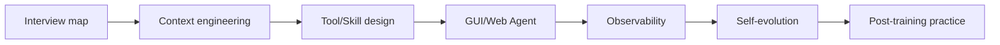
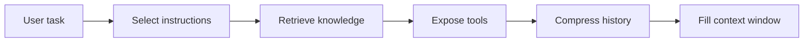
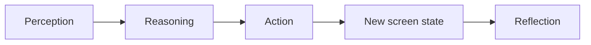
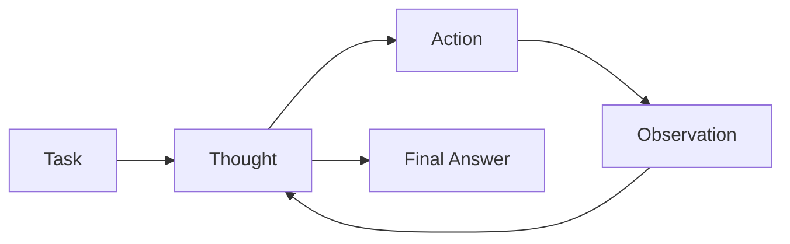
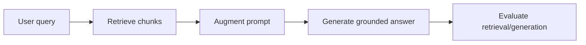

# Agent 面试与实战补充

## 当前定位

这个章节用于吸收 Datawhale Hello-Agents `Extra-Chapter` 中更贴近 **面试准备、工程实战和踩坑复盘** 的内容。它不替代 Agent 基础章节，而是补充“面试官会怎么问、项目里会踩什么坑、怎样把 Agent 从 demo 做成可诊断系统”。

> **面试抓手**：Agent 不是只会 ReAct / Function Calling。工程面试更关心：上下文怎么管理、工具怎么设计、失败怎么诊断、GUI/Web 环境怎么感知和执行、Agent 能否评估和持续进化。



## 面试问题地图

Hello-Agents 的面试问题总结覆盖了 LLM、VLM、RLHF、Agent、RAG、评估和行业趋势，适合做一张“面试准备雷达图”。

| 方向 | 高频问题 | 应该沉淀到哪里 |
|---|---|---|
| LLM 基础 | Transformer、RoPE、MHA/MQA/GQA、MoE、解码策略、Scaling Laws | 基础知识 / 模型架构 |
| VLM 基础 | CLIP、LLaVA、视觉指令微调、Grounding、幻觉 | CV 基础模型 / 多模态 |
| RLHF / RLVR | RM、PPO、DPO、GRPO、DAPO、GSPO、credit assignment | GRPO / DPO / 后训练 |
| Agent | ReAct、Planning、Memory、Tool Use、Multi-Agent、A2A、Agent 微调 | Agent 前沿 |
| RAG | chunk、embedding、rerank、Lost in the Middle、Graph RAG | Agent / 检索与排序 |
| 评估 | LLM-as-a-Judge、Agent benchmark、红队、线上监控 | 采样评测闭环 |

面试时建议不要把这些问题当“背诵清单”，而是按能力层级组织：**模型基础 -> 后训练 -> Agent 工程 -> 评估与上线**。

## 上下文工程：比 Prompt Engineering 更大的问题

Hello-Agents 的上下文工程文档把 Agent 类比成“新型操作系统”：LLM 是 CPU，上下文窗口是 RAM，Context Engineering 就是决定什么时候把什么信息放进这块有限工作内存。

上下文大致包括三类：

| 上下文类型 | 内容 | 工程问题 |
|---|---|---|
| Instructions | 系统提示词、用户指令、少样本示例、输出格式、工具描述 | 怎么写得清楚、短、稳定 |
| Knowledge | RAG 文档、长期记忆、实时数据、领域知识 | 怎么检索、压缩、更新、排序 |
| Tools | 工具 schema、调用结果、执行状态、错误反馈 | 怎么让模型知道何时调用、如何恢复 |



**关键结论**：RAG 没有死，但单纯“检索后拼接”太窄。Agent 场景更需要上下文调度：哪些记忆保留、哪些工具暴露、哪些证据放前面、哪些历史要压缩。

## Skills 与 MCP：连接能力和程序性知识分离

Hello-Agents 对 Agent Skills 的解读很适合面试：**MCP 解决“能连到什么工具”，Skills 解决“该如何使用这些工具完成任务”**。

| 维度 | MCP | Agent Skills |
|---|---|---|
| 主要作用 | 标准化连接外部工具、文件、数据库、API | 封装领域 SOP、操作策略、参考资料、脚本 |
| 像什么 | USB 接口 / 驱动 | 操作手册 / 工作流插件 |
| 解决问题 | connectivity | capability |
| 风险 | 工具 schema 过多导致上下文膨胀 | Skill 写得太泛会变成无效提示词 |

Skill 的最小形态通常是一个 `SKILL.md`，包含：

- 元数据：让 Agent 判断什么时候激活。
- 操作说明：激活后才读取的具体步骤。
- 可选资源：参考文档、脚本、模板、测试样例。

**渐进式披露** 是 Skills 的核心价值：先让模型看到很短的技能描述，只有触发时才加载完整说明，避免把所有 SOP 一次性塞进上下文窗口。

## 工具设计：可诊断性优先

Extra09 的 Code Agent 复盘里有一个非常重要的工程结论：**可诊断性是可恢复性的前提**。

错误案例是管道命令：

```bash
rg -n "def process_data" src/ | grep -v test | sed -n '1,50p'
```

如果 `src/` 路径不存在，上游错误可能被管道压扁成空输出，Agent 会误以为“确实没找到”，然后开始错误重试。

更好的工具设计是把高频操作拆成结构化原子工具：

| 工具 | 功能 | 返回结构 |
|---|---|---|
| `LS` | 列目录 | `{status, data: {entries}, text}` |
| `Glob` | 按文件名找文件 | `{status, data: {paths}, text}` |
| `Grep` | 按内容搜索 | `{status, data: {matches}, text}` |
| `Read` | 带行号读取 | `{status, data: {content}, text}` |

状态码要区分：

- `success`：执行成功，结果可能为空。
- `partial`：执行成功但内容截断。
- `error`：执行失败，必须有错误码和错误信息。

**面试表达**：不要只说“给 Agent 更多工具”。工具设计要落在 Goldilocks 区：太自由不可诊断，太碎会增加决策负担；最重要的是每一步失败都能被定位和恢复。

## Prompt 是 Agent 的控制面

Agent 的系统提示词不是“魔法咒语”，而是控制面。它要明确：

- 任务边界：Agent 能做什么，不能做什么。
- 工具边界：哪些任务必须用专门工具，哪些允许用 shell。
- 安全边界：危险操作如何确认。
- 观察边界：遇到空结果、错误、超时时如何解释。
- 输出边界：什么时候给结论，什么时候继续查证。

在复杂 Agent 中，prompt 不是越长越好，而是要和工具返回结构、上下文压缩、可观测日志一起设计。

## GUI Agent：从 RPA 到视觉-推理-执行闭环

GUI Agent 的核心是让模型像人一样“看屏幕、想步骤、做操作”。它和传统 RPA 的区别：

| 维度 | 传统 RPA | GUI Agent |
|---|---|---|
| 感知 | 固定选择器、XPath、控件 ID | 截图、DOM/可访问性树、VLM |
| 规划 | 人工预设流程 | LLM 自主拆解任务 |
| 适应性 | UI 改动容易失效 | 有语义弹性，但不保证稳定 |
| 执行 | 脚本回放 | click/type/scroll/swipe 等动作 |
| 风险 | 脚本脆弱 | 幻觉、误操作、成本高 |

GUI Agent 的三层结构：



面试要点：

- 感知可以走 DOM/Accessibility，也可以走纯视觉。
- 推理需要任务分解、状态追踪、反思纠错。
- 执行层要做坐标映射、平台适配、动作封装。
- 高风险操作必须 human-in-the-loop。

## Web Agent：不是 Chrome 版 GUI Agent

Web Agent 有 Web 独有的结构化信号和对抗环境。生产级 Web Agent 通常走混合路线：

| 感知策略 | 优势 | 失败场景 |
|---|---|---|
| DOM / AX-tree | 快、准、可定位 | Canvas、Shadow DOM、混淆 DOM、SPA 延迟渲染 |
| 纯视觉 | 通用、接近人类观察 | 成本高、定位误差、小字识别差 |
| 混合方案 | 视觉理解布局，DOM 精确执行 | 工程复杂度更高 |

Web Agent 还要处理：

- 反爬：Cloudflare、指纹、行为检测、代理。
- 会话：cookie、localStorage、OAuth、验证码。
- 状态突变：动态加载、模态框、重渲染、iframe。
- 网络等待：XHR 完成不等于页面视觉稳定。
- 成本：每步 LLM 调用 + 浏览器动作往返。

**面试表达**：GUI Agent 关注跨平台 UI 操作；Web Agent 还要关注浏览器状态、DOM/网络层、反爬、会话和生产可观测性。

## Agent 自进化：四类闭环

Hello-Agents 的自进化文档给了一个很好的分类：自进化不是简单长期记忆，而是让真实任务反馈持续影响后续行为。

| 闭环类型 | 演化对象 | 典型信号 | 风险控制 |
|---|---|---|---|
| 内建上下文闭环 | 记忆、会话检索、项目上下文 | 用户纠错、历史任务 | 记忆污染、过期 |
| 技能资产化闭环 | Skill / SOP / 工作流 | 任务成功率、评测结果 | 版本、回滚、测试 |
| 外部监督或群体智能 | 多 Agent 经验、用户反馈 | 审查、投票、专家反馈 | 反馈噪声、冲突 |
| 参数/代码/工作流自修改 | 模型参数、代码、配置 | 训练数据、单元测试、环境反馈 | 沙箱、权限、供应链 |

横切约束是：**评估、版本、回滚、权限、审计**。没有这些约束的自进化，很容易变成不可控的自我污染。

## Agent 后训练实战：旅行助手案例的可迁移经验

Extra12 的旅行助手后训练实践虽然是具体项目，但能抽出一套通用方法：

### 数据生成与审计

先 dry-run 请求分布，再 dry-run `PlannerContext`，小批量生成，记录 usage / manifest / run 配置。生成后先审计再进训练集。

硬过滤包括：

- JSON / schema 合法。
- 日期和天数一致。
- 酒店、餐厅、景点 grounded。
- 餐饮不重复。
- 预算 hard constraint。
- 预算关系合理。

**关键经验**：旧数据不要舍不得。如果协议或预算口径变了，旧数据和新规则混在一起会让模型学到冲突目标。

### LoRA 多阶段训练

多阶段训练遵循“尽量少同时改变量”：

- 主干 clean SFT：先学稳 schema / 协议。
- 真实预算混合补训：补真实预算口径。
- 预算利用诊断补训：针对薄弱指标补数据。
- Best-of-N replay：把规则挑出来的 winner 回放进 SFT。

LoRA 适合高频迭代、回滚和小数据项目；全参 SFT 可能提升表达上限，但成本高、回滚慢，也可能让硬约束变不稳。

### Best-of-N Replay 与 Rerank

| 名称 | 所在阶段 | 作用 |
|---|---|---|
| Best-of-N Replay | 训练数据构造 | 多温度采样多个候选，规则挑 winner，回写训练集 |
| Rerank | 推理阶段 | 线上生成多个候选，规则选择最优答案返回 |

不要只看单生成。某些 checkpoint 单生成不一定最强，但能产生更好的候选池，配合 rerank 表现更好。

### DPO Pair 构造

高质量 DPO pair 不应该是“坏 JSON vs 好 JSON”，而应该是：

```text
同一个上下文
chosen: schema 过、hardpass 过、planner soft 更好
rejected: schema 过、hardpass 过，但预算/重复/偏好更差
```

同时必须做 frozen eval 防泄漏，避免从评测集挖训练 pair。

## 面试 QA

**Q：Context Engineering 和 Prompt Engineering 有什么区别？**

A：Prompt Engineering 主要优化输入指令；Context Engineering 管理模型下一步能看到的一切，包括指令、记忆、检索知识、工具描述、工具反馈和历史压缩。

**Q：MCP 和 Skills 的区别是什么？**

A：MCP 解决连接外部工具的问题，Skills 解决如何使用工具完成特定任务的问题。MCP 像接口，Skills 像 SOP。

**Q：为什么 Agent 工具返回值要结构化？**

A：结构化返回能区分空结果、执行失败和内容截断，避免模型把错误误判成事实，从而提升可诊断性和可恢复性。

**Q：Web Agent 为什么不能只靠视觉？**

A：视觉能理解布局，但定位和状态判断成本高且不稳定；DOM/AX-tree 能精确定位和读取结构。生产级 Web Agent 通常用视觉理解 + DOM 执行的混合方案。

**Q：Agent 自进化最危险的地方是什么？**

A：把错误经验沉淀成长期记忆、Skill 或代码，导致系统持续变坏。所以必须有评估、版本、回滚、权限和审计。

**Q：Agent 后训练项目为什么要重视数据审计？**

A：Agent 输出常有 schema、grounding、预算、工具调用、时序等硬约束。没有数据审计，模型会学到冲突规则或幻觉候选，后续 SFT/DPO/RL 都会放大问题。

## Extra01 面试八股答案补充：Agent / RAG 高频题

这一部分专门吸收 `Extra01-面试问题总结.md` 和 `Extra01-参考答案.md` 的八股问答。它的使用方式不是逐字背诵，而是把每个问题压缩成 **定义 -> 机制 -> 工程取舍 -> 风险边界** 四段式回答。

### Agent 是什么：四组件回答框架

面试中可以把 LLM Agent 定义为：以 LLM 作为认知核心，能够围绕目标自主规划、调用工具、观察环境反馈并循环执行的系统。它和普通 Chatbot 的关键差异是 **自主性、工具交互和循环执行**。

| 组件 | 作用 | 面试回答重点 |
|---|---|---|
| Brain / Core Engine | 理解目标、推理、决策、选择下一步行动 | LLM 是决策核心，但不能把所有能力都归因给模型本身 |
| Planning | 将复杂目标拆成可执行步骤，并根据反馈修正计划 | CoT 偏线性，ReAct 可动态修正，ToT/GoT 支持搜索和回溯 |
| Memory | 维护当前任务状态与长期经验 | 短期记忆服务当前任务连贯性，长期记忆依赖存储与检索 |
| Tool Use | 调用 API、搜索、代码执行、数据库、浏览器等外部能力 | 工具调用需要 schema、参数约束、错误反馈和安全边界 |

> **关键结论**：Agent 的能力不是“LLM + 工具列表”自然涌现出来的，而是由规划、记忆、工具协议、执行器、观测反馈和评估闭环共同决定。

### ReAct：把推理和行动交织起来

ReAct 的核心不是简单的 CoT，而是把 **Thought -> Action -> Observation** 变成循环：



- `Thought`：分析当前目标、已有观察和下一步策略。
- `Action`：选择工具，并以结构化参数表达调用意图。
- `Observation`：执行器调用工具后，把结果反馈给模型。
- 下一轮 `Thought` 基于最新观察继续修正策略。

面试中要强调：传统 CoT 通常一次性生成推理链；ReAct 的推理链是 **动态的、交互式的、基于环境反馈持续更新的**。这让它更适合搜索、问答、代码调试、网页操作等多步任务。

### Planning：CoT / ReAct / ToT / GoT 的层次

| 方法 | 核心思想 | 优点 | 局限 |
|---|---|---|---|
| CoT | 线性逐步思考 | 简单、低成本 | 难以探索和回溯 |
| ReAct | 每一步先思考、再行动、再观察 | 能根据工具反馈动态调整 | 依赖工具质量和上下文管理 |
| ToT | 把多个思路组织成树并搜索 | 支持探索、评估、回溯 | 计算开销较高 |
| GoT | 把思维过程组织成图，允许合并与循环 | 更适合复杂依赖和迭代优化 | 实现复杂，控制难度更高 |
| Task Decomposition | 先显式拆任务，再逐个执行 | 结构清晰，便于监控 | 初始拆解错误会影响后续执行 |

**面试抓手**：规划不是越复杂越好。简单任务用 CoT/ReAct 即可；需要多候选探索时考虑 ToT；需要多信息流合并、迭代优化时才讨论 GoT 或更复杂的图式规划。

### Memory：短期记忆和长期记忆不能混为一谈

短期记忆主要服务当前任务：

- 对话历史。
- ReAct scratchpad。
- 工具调用结果。
- 当前计划和中间状态。

长期记忆主要服务跨任务复用：

- 用户偏好。
- 历史成功或失败经验。
- 项目知识。
- 领域知识。

长期记忆常见实现是 RAG：写入时用 embedding 把文本转成向量并存储；读取时用当前任务构造 query，检索相关记忆后放回上下文。面试中要补一句风险：**记忆不是越多越好**，长期记忆需要写入门槛、过期机制、冲突处理和隐私边界，否则会污染决策。

### Function Calling / Tool Use：从语言模型到行动执行者

工具调用的本质是让模型学会两件事：

- 什么时候需要用工具。
- 如何用结构化格式表达工具名和参数。

一个可靠的 Function Calling 系统通常包含：

| 环节 | 关键点 |
|---|---|
| 工具注册 | 用 JSON Schema 或类似协议描述函数名、用途、参数类型和约束 |
| 调用决策 | 模型根据任务判断是否调用工具、调用哪个工具 |
| 参数生成 | 模型生成结构化参数，执行器负责校验 |
| 外部执行 | harness 调用真实 API、数据库、搜索、代码环境等 |
| 结果回填 | 把工具结果作为 observation 放回上下文 |
| 错误处理 | 区分参数错误、执行错误、空结果、超时和权限不足 |

**面试抓手**：Function Calling 不等于 Agent。Function Calling 解决“单步工具调用协议”，Agent 还需要规划、记忆、多步执行、失败恢复和评估闭环。

### Agent 微调：微调的是决策轨迹，不只是最终答案

`Extra01-参考答案.md` 中关于 Agent 微调的一个重要结论是：Agent 微调更像行为克隆，核心数据不是普通 `(input, output)`，而是高质量的 **decision-making trajectories**。

一条训练样本应尽量包含：

- 用户任务。
- 可用工具集合。
- 每一步 Thought。
- 每一步 Action 与参数。
- 每一步 Observation。
- 最终答案或任务完成状态。

常见数据来源：

- 强教师模型生成 ReAct/Tool-use 轨迹。
- 人工编写或修正失败轨迹。
- 从真实用户交互日志中清洗成功案例。

**面试抓手**：Agent SFT / DPO / RL 的核心不是让模型“回答得像”，而是让模型在关键状态下做出更稳定的工具选择、计划修正和停止判断。

### RAG 高频八股：先检索，后生成

RAG 的基本流程是：



它主要解决三类问题：

- LLM 知识静态、容易过时。
- 纯生成容易幻觉。
- 私有知识或垂直领域知识不适合全部靠微调注入。

与微调相比，RAG 更适合频繁更新、可追溯、私有知识问答；微调更适合改变模型行为风格、格式遵循、任务技能和领域表达模式。

RAG 系统面试回答要覆盖：

- 文档解析与清洗。
- chunk size / overlap 取舍。
- embedding 模型选择。
- 向量检索、BM25、hybrid search。
- rerank。
- query rewrite / multi-query / self-query。
- 引用溯源与答案 groundedness。
- 检索指标和生成指标分开评估。

**关键结论**：RAG 的难点不只是“向量库召回”，而是端到端的信息链路：数据质量、切块粒度、召回、多路检索、重排、上下文压缩、生成约束和评估闭环。

## 知识索引引用

| 知识点 | 主要来源 | 本页使用方式 |
|---|---|---|
| LLM/VLM/RLHF/Agent/RAG/评估面试问题地图 | Extra01 面试问题总结 | 用于构造 Agent 相关面试雷达图 |
| 上下文工程、Prompt/RAG/Agent/Context Engineering 边界 | Extra02 上下文工程补充知识 | 用于解释上下文工程不等于提示词工程 |
| MCP 与 Agent Skills 的区别、渐进式披露 | Extra05 AgentSkills 解读、Extra08 如何写出好的 Skill | 用于解释连接能力和程序性知识分离 |
| GUI Agent 架构、RPA 对比、感知-推理-执行闭环 | Extra06 GUIAgent 科普与实战 | 用于补充 GUI Agent 面试点 |
| Code Agent 工具设计踩坑、可诊断性、Goldilocks 工具区 | Extra09 Agent 应用开发实践踩坑与经验分享 | 用于总结 Agent 工程可观测与工具设计原则 |
| Agent 自进化四类闭环 | Extra10 Agent 自进化 | 用于建立自进化 Agent 的分类框架 |
| Web Agent 混合感知、反爬、会话和动态状态 | Extra11 WebAgent 科普与实战 | 用于区分 Web Agent 和 GUI Agent |
| 旅行助手后训练、LoRA 多阶段、Best-of-N、DPO pair、Rerank | Extra12 旅行助手后训练实战 | 用于沉淀 Agent 后训练项目经验 |

## 参考资料

- Hello-Agents Extra-Chapter: `https://github.com/datawhalechina/hello-agents/tree/main/Extra-Chapter`
- Extra01 面试问题总结：`https://github.com/datawhalechina/hello-agents/blob/main/Extra-Chapter/Extra01-%E9%9D%A2%E8%AF%95%E9%97%AE%E9%A2%98%E6%80%BB%E7%BB%93.md`
- Extra02 上下文工程补充知识：`https://github.com/datawhalechina/hello-agents/blob/main/Extra-Chapter/Extra02-%E4%B8%8A%E4%B8%8B%E6%96%87%E5%B7%A5%E7%A8%8B%E8%A1%A5%E5%85%85%E7%9F%A5%E8%AF%86.md`
- Extra05 AgentSkills 解读：`https://github.com/datawhalechina/hello-agents/blob/main/Extra-Chapter/Extra05-AgentSkills%E8%A7%A3%E8%AF%BB.md`
- Extra06 GUIAgent 科普与实战：`https://github.com/datawhalechina/hello-agents/blob/main/Extra-Chapter/Extra06-GUIAgent%E7%A7%91%E6%99%AE%E4%B8%8E%E5%AE%9E%E6%88%98.md`
- Extra09 Agent 应用开发实践踩坑与经验分享：`https://github.com/datawhalechina/hello-agents/blob/main/Extra-Chapter/Extra09-Agent%E5%BA%94%E7%94%A8%E5%BC%80%E5%8F%91%E5%AE%9E%E8%B7%B5%E8%B8%A9%E5%9D%91%E4%B8%8E%E7%BB%8F%E9%AA%8C%E5%88%86%E4%BA%AB.md`
- Extra10 Agent 自进化：`https://github.com/datawhalechina/hello-agents/blob/main/Extra-Chapter/Extra10-Agent%E8%87%AA%E8%BF%9B%E5%8C%96.md`
- Extra11 WebAgent 科普与实战：`https://github.com/datawhalechina/hello-agents/blob/main/Extra-Chapter/Extra11-WebAgent%E7%A7%91%E6%99%AE%E4%B8%8E%E5%AE%9E%E6%88%98.md`
- Extra12 旅行助手后训练实战：`https://github.com/datawhalechina/hello-agents/blob/main/Extra-Chapter/Extra12-%E6%97%85%E8%A1%8C%E5%8A%A9%E6%89%8B%E5%90%8E%E8%AE%AD%E7%BB%83%E5%AE%9E%E6%88%98.md`
