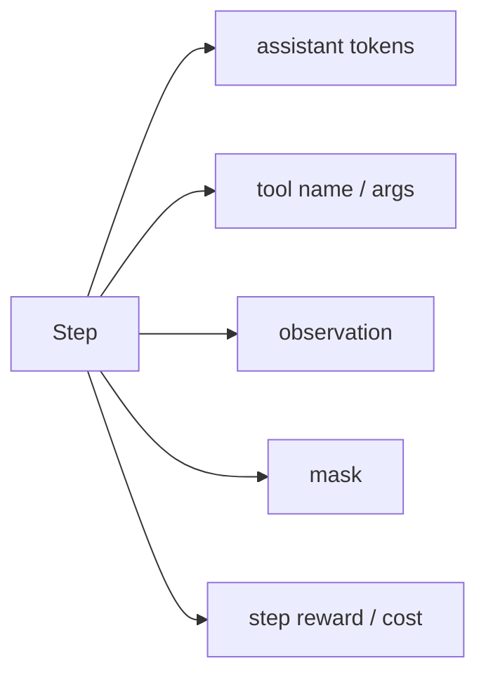
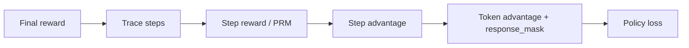

# Agentic RL 系统链路

## 当前定位

Agentic RL 不是“给 Agent 加一个 GRPO loss”这么简单，而是把 **多轮交互、工具调用、环境反馈、轨迹存储、reward 计算和 policy update** 串成一个可训练闭环。VeRL 的 Agent Loop / Reward Loop 给出的启发是：Agent 训练系统要把 rollout 和 reward 都当成可扩展的分布式子系统，而不是普通 trainer 的一个函数调用。

> **面试抓手**：普通 RLVR 的样本通常是 prompt -> response；Agentic RL 的样本是 prompt -> action/tool -> observation -> action/tool -> final answer 的轨迹。系统难点从“答案对不对”扩展到“轨迹是否可复现、哪些 token 参与 loss、工具返回如何 mask、reward 如何分层、rollout 与 reward 能否并行”。

### 前置知识：多步 RL 解决“怎么归因”，Agentic RL 解决“怎么落系统”

阅读本章前，建议先看 [多步强化学习](#knowledge/multi-step-rl)。多步 RL 提供 step reward、tree rollout、branch advantage、trajectory-level advantage 等归因工具；Agentic RL 在此基础上进一步处理 tool observation、response_mask、trace schema、Reward Loop、rollout engine 和资源调度。

| 前置能力 | 在 Agentic RL 中的落点 |
|---|---|
| step-level credit assignment | 判断哪次工具调用、哪段推理、哪步修复应该被强化或惩罚 |
| branch / tree advantage | 支持搜索式 Agent、代码修复、多路径规划和多候选工具调用 |
| trajectory schema | 把 prompt、action、observation、reward、mask 串成可训练样本 |

```archify
Agentic RL System Loop|assets/diagrams/html/agentic-rl-system.html
```

## 一、系统链路：Agent Loop 与 Reward Loop

### Agent Loop：负责生成可训练轨迹

VeRL 的 Agent Loop 抽象里，用户实现一个 `AgentLoopBase.run`，输入 prompt 和 sampling params，内部可以调用 LLM、工具、数据库、代码沙箱、环境或 reflection，最后返回 `AgentLoopOutput`。这个输出至少包含：

| 字段 | 含义 | 面试解释 |
|---|---|---|
| `prompt_ids` | 初始任务 token | 用于保持 rollout 起点和训练输入一致 |
| `response_ids` | 多轮过程中新增 token | 包括 LLM 生成 token，也可能包括工具返回 token |
| `response_mask` | token 是否参与 policy loss | `1` 表示模型生成 token，`0` 表示工具/环境返回 token |
| trace metadata | 工具名、参数、状态、错误、耗时 | 用于 reward、debug、过滤、replay 和审计 |

关键点是：**Agent Loop 输出的是训练样本，不只是服务端对话记录**。服务场景里用最终 messages 重新套 chat template 可能能工作，但 RL 训练要求 token 序列必须和模型真实采样路径一致，否则 old logprob、ratio、KL 和 response mask 都会错位。

### Reward Loop：负责把轨迹变成可优化信号

Reward Loop 解决的是 reward 计算本身也会成为瓶颈。VeRL 文档把 reward 计算拆成可分布式执行的 RewardLoopManager / RewardWorker / RewardManager：controller 把 rollout 后的 batch 切成 chunks，多个 reward worker 并发计算分数，再合并回 DataProto。

| Reward 类型 | 例子 | 优势 | 风险 |
|---|---|---|---|
| rule-based | 数学答案、格式、代码单测、权限规则 | 快、稳定、可解释 | 规则覆盖窄，容易 reward hacking |
| discriminative RM | reward model / ORM / PRM | 能判断更复杂质量 | 校准和偏差问题明显 |
| generative RM | 让模型按 rubric 给分 | 灵活，可处理复杂任务 | 成本高、延迟高、judge 偏差 |
| hybrid reward | 规则 + 模型打分 + 成本惩罚 | 更接近生产目标 | 权重归因困难 |
| streaming reward | rollout 完一个样本就算一个 | 降低等待，提高吞吐 | 需要异步调度和资源池隔离 |

面试中要强调：Agentic RL 的 reward 不应只看 final answer。工具是否必要、参数是否正确、是否越权、是否过度调用、是否能恢复错误，都可能成为过程 reward 或过滤条件。

### 多轮轨迹的数据结构

一个可训练 Agent 轨迹至少要保留四类信息：

| 信息 | 为什么需要 |
|---|---|
| token 序列 | 计算 logprob、ratio、KL 和 loss |
| role / mask | 区分 assistant token、tool observation、system/user prompt、padding |
| tool trace | reward、debug、失败复盘、成本统计 |
| environment snapshot | replay 时复现状态，避免工具结果漂移 |

推荐把每一步拆成结构化 trace：



如果只存最终文本，后续很难回答：哪一步工具调用错了？哪个 token 应该算 loss？reward 为什么高？同一条轨迹能否复现？

## 二、训练信号：mask、reward 与 credit assignment

### response mask 为什么是核心

Agentic RL 里常见错误是把工具返回内容也当成模型输出训练。正确做法是：

| Token 来源 | 是否参与 policy loss | 原因 |
|---|---|---|
| assistant 生成的 reasoning / tool call / final answer | 通常参与 | 这是 policy 的动作 |
| tool observation | 不参与 | 这是环境返回，不是模型动作 |
| user / system prompt | 不参与 | 是条件，不是要优化的输出 |
| padding / template control token | 视模板而定 | 要避免 assistant prompt 或 padding 污染 loss |

VeRL 的 AgentLoopOutput 用 `response_mask=1/0` 明确区分 LLM generated token 与 tool response token。面试回答时可以说：**mask 错了，policy gradient 就会优化环境文字，等价于让模型模仿工具结果，训练目标直接污染。**

### 训练闭环：SFT / DPO / GRPO 怎么接

| 阶段 | 数据形态 | 优点 | 局限 |
|---|---|---|---|
| Agent SFT | 人工或强模型生成的工具轨迹 | 稳定学格式和基本策略 | 受示范覆盖限制，容易学脚手架套路 |
| Agent DPO | chosen/rejected 轨迹对 | 适合偏好、成本、安全和工具选择对比 | 需要可靠 pair 构造 |
| Agent GRPO/RLVR | 同任务多条 rollout + reward | 能探索能力边界，可直接优化任务成功 | reward 稀疏、长轨迹方差大、工具噪声污染 |
| Agentic RL + Reward Loop | 多轮 trace + 分布式 reward | 可扩展到代码、Web、数据库、沙箱任务 | 工程复杂，必须做版本、mask、trace 管理 |

面试模板：先用 SFT 学会工具格式和基本策略，再用 DPO/RFT 做偏好和失败轨迹筛选，最后对可验证任务用 GRPO/RLVR 优化任务成功率。整个过程要保留 trace、mask、reward source 和 environment snapshot，否则训练样本不可解释、不可复现。

### Credit assignment：把 reward 对齐到 step/token

Agentic RL 的核心训练难点是 **credit assignment**：最终成功或失败应该归因到哪一步、哪个工具调用、哪段 reasoning，还是哪次 observation 处理。普通 RLVR 可以把一条 response 当成整体评分；Agentic RL 里如果仍然把 final reward 粗暴广播到所有 token，模型可能强化错误步骤，也可能惩罚本来正确的早期探索。



| 分配方式 | 做法 | 适合场景 | 主要风险 |
|---|---|---|---|
| final reward broadcast | 把最终 reward 分给所有 assistant step/token | 只有最终 verifier，先做 baseline | 错误归因粗，长轨迹里噪声很大 |
| step reward | 每一步用规则、PRM、工具状态或单测给分 | 数学推理、代码修复、工具调用 | verifier 成本高，过程标签可能不稳 |
| discounted return | 从后往前累计后续 reward | 有明确 step 序列的 Agent trace | gamma 和 step 粒度会影响归因 |
| branch backup | 树/图搜索中把叶子结果回传到分支节点 | Tree-GRPO、搜索式 Agent | 树展开成本高，branch id 必须稳定 |
| hybrid credit | final + step + cost + safety 组合 | 生产 Agent、代码/浏览器任务 | 权重难调，指标归因复杂 |

面试时可以给出一个清晰判断：**final reward 解决“做没做成”，step/process reward 解决“哪一步做对”，cost/safety reward 解决“是否值得这么做”。** 三者缺一类，训练都会偏。

### 和 response_mask 的关系

credit assignment 先决定每个 step/token 应该拿到多大 advantage；`response_mask` 再决定这些 advantage 是否真的进入 policy loss。两者不是一回事：

| 概念 | 负责什么 | 典型错误 |
|---|---|---|
| credit assignment | 给动作分配收益或惩罚 | 把失败归因到所有步骤，导致好步骤也被惩罚 |
| response mask | 判断 token 是 policy action 还是环境观测 | 把 tool observation 算进 loss，让模型模仿工具返回 |
| loss mask / attention mask | 训练和注意力可见性控制 | prompt、padding、assistant prefix 混入训练目标 |

因此 Agentic RL 的 token-level loss 通常可以写成一个概念式：

$$
\mathcal{L}
=
-\sum_t
m_t A_t
\log \pi_\theta(a_t \mid s_t)
$$

其中 $m_t$ 是 response mask，$A_t$ 是经过 credit assignment 得到的 token advantage。只有 $m_t=1$ 的 assistant token 才真正更新 policy。

### 面试回答模板

如果被问“Agentic RL 的 reward 怎么设计”，可以按四层回答：

1. **Outcome 层**：最终任务是否成功，例如答案正确、代码测试通过、网页任务完成。
2. **Process 层**：中间步骤是否合理，例如检索证据相关、工具参数正确、PRM 给分高。
3. **Cost 层**：工具调用次数、延迟、token 成本是否过高。
4. **Safety 层**：是否越权、是否访问敏感资源、是否违反业务规则。

最后补一句：这些 reward 需要通过 credit assignment 映射到 step/token，再用 response_mask 过滤非模型动作，否则训练目标会污染。

## 三、工程落地：排障与原理代码

### 系统排障清单

| 症状 | 可能原因 | 排查方式 |
|---|---|---|
| reward 上升但任务成功率不升 | reward hacking 或 final reward 太窄 | 看失败 trace、人工抽检、增加 PRM/规则交叉验证 |
| KL / ratio 异常 | rollout token 与训练 token 不一致 | 检查 chat template、token in/out、old logprob、response mask |
| 工具调用越来越多 | reward 没有成本项 | 加 tool cost、latency、调用次数 penalty |
| 模型复读工具返回 | tool observation 被算进 loss | 抽查 `response_mask`，确认 observation mask 为 0 |
| 多轮 rollout 很慢 | 工具延迟、LLM server 调度、reward 串行 | streaming reward、并行工具、异步 LLM server、限流 |
| 轨迹无法复现 | 没有保存环境版本和工具快照 | trace 中记录 tool version、输入、输出、随机种子、超时状态 |

### 原理代码

关联原理代码：[Agentic RL trace / mask / reward loop](#principle-code/agentic-rl-loop)。这段代码保留三件面试最常手写的东西：

| 函数/类 | 面试考点 |
|---|---|
| `AgentTraceStep` | 用结构化 step 保存 assistant/action/observation/reward/cost |
| `build_agent_response_mask` | assistant token 为 1，tool observation token 为 0 |
| `assign_step_credit` | 从 final reward、step reward、cost、error penalty 反推 step advantage |
| `build_token_advantages_from_steps` | 把 step advantage 展开到 token 粒度，并与 response_mask 配合 |
| `score_agent_trace` | final reward、step reward、tool cost、error penalty 的组合 |
| `replayable_trace_summary` | 训练样本必须能复盘和审计 |

## 面试 QA

**Q：Agentic RL 和普通 RLVR 最大区别是什么？**

A：普通 RLVR 多是单轮 prompt-response，reward 通常看最终答案；Agentic RL 是多轮轨迹，包含工具调用、环境状态、观察结果和失败恢复。它不只优化文本答案，还优化工具选择、调用参数、步骤成本和任务完成率。

**Q：为什么 Agent Loop 要输出 response mask？**

A：因为轨迹里混有模型动作和环境返回。只有 assistant 生成 token 才是 policy action，tool observation 是环境状态，不能参与 policy loss。mask 错会导致模型学习模仿工具返回，污染训练目标。

**Q：Reward Loop 为什么要单独抽象？**

A：Agent 任务的 reward 可能来自单测、搜索、数据库、模型 judge、环境模拟和安全规则，计算成本高且延迟不稳定。单独抽象 Reward Loop 可以分布式并行、流式计算，并支持 rule-based、model-based、hybrid reward。

**Q：Agentic RL 最容易翻车在哪里？**

A：第一是 reward 不可靠，模型学会钻规则；第二是 token/mask/chat template 不一致，导致 logprob 和 loss 错位；第三是工具环境不可复现，失败 trace 无法定位；第四是长轨迹方差大，需要过滤、成本约束和分层 reward。

## 知识索引引用

| 知识点 | 主要来源 | 本页使用方式 |
|---|---|---|
| Agent Loop 抽象、AgentLoopBase、AgentLoopOutput、response_mask | VeRL Agent Loop 文档 | 用于解释多轮 rollout 如何变成可训练轨迹，以及哪些 token 参与 policy loss |
| Reward Loop、RewardManager、RewardWorker、streaming reward、hybrid reward | VeRL Reward Loop 文档 | 用于解释 reward 计算为何需要独立分布式链路，而不是 trainer 内部函数 |
| Multi-turn rollout、SGLang 工具调用、loss mask | VeRL Multi-turn Rollout 文档 | 用于补充多轮工具调用里的 tokenization、mask 和 rollout engine 约束 |
| 多步 RL、Tree-GRPO、credit assignment | 本地多步强化学习章节与 Tree of Thoughts / Reflexion 论文线 | 用于解释 final reward 如何回传到 step、branch 和 token |
| ReAct / Reflexion / Tree-of-Thoughts | Agent 经典范式论文 | 用于把 Agentic RL 的轨迹训练和推理时的规划、行动、反思连接起来 |

## 相关章节

| 章节 | 关系 |
|---|---|
| [Agent 系统](#knowledge/agent) | ReAct、Function Calling、Memory、Planning、Multi-Agent 等 Agent 范式入口 |
| [VeRL：RL 后训练系统框架](#knowledge/verl-rl-framework) | DataProto、WorkerGroup、rollout/reward/update 数据流入口 |
| [采样、评测与强化微调闭环](#knowledge/sampling-evaluation-rft) | Reward Function、ORM/PRM、RFT/RLVR 与训练中评测入口 |
| [多步强化学习](#knowledge/multi-step-rl) | credit assignment、Tree-GRPO、branch advantage 与长链路推理入口 |

## 关联资源

| 资源 | 链接 | 为什么重要 |
|---|---|---|
| VeRL Agent Loop | https://verl.readthedocs.io/en/latest/advance/agent_loop.html | 官方定义 AgentLoopBase、AgentLoopOutput、response_mask 和异步 LLM server 架构 |
| VeRL Reward Loop | https://verl.readthedocs.io/en/latest/advance/reward_loop.html | 官方解释分布式 RewardManager、RewardWorker、streaming reward 和 hybrid reward |
| VeRL Multi-turn Rollout | https://verl.readthedocs.io/en/latest/sglang_multiturn/multiturn.html | 说明 SGLang 多轮 rollout、工具配置、function_tool、multi-turn tokenization 和 loss mask |
| VeRL 框架章节 | #knowledge/verl-rl-framework | 对接 DataProto、WorkerGroup、rollout/reward/update 数据流 |
