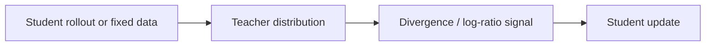
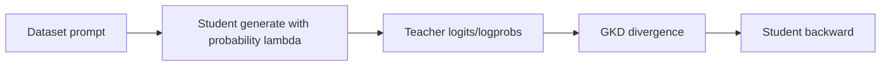

# 知识蒸馏：KD / GKD / OPD-RL / OPSD

## 当前定位

知识蒸馏是把教师模型的能力迁移给学生模型的训练方法。它和 SFT、RL、OPD 都有关系，但不能混为一谈：**SFT 可以看成 one-hot teacher 的特例；普通 KD 用教师软分布提供 per-token 稠密信号；on-policy distillation 则让学生在自己采样的轨迹上接受教师监督**。

> **面试抓手**：蒸馏要从两个维度讲：数据来自 on-policy 还是 off-policy，反馈是 per-token 稠密信号还是 per-sequence 稀疏奖励。

### 和 OPD 的关系：前置知识，而不是合并章节

本章保留为**后训练核心里的独立前置知识**，原因是知识蒸馏不仅服务于 OPD，还覆盖 KD / GKD / OPSD / self-distillation、teacher logits、Forward KL / Reverse KL / JSD、top-k 与 sampled-token teacher signal 等通用概念。[OPD](#knowledge/opd)则是在这些概念之上，进一步强调 student on-policy rollout：学生真实会走到哪些 prefix，就在哪些 prefix 上接受 teacher 的 dense token supervision。

| 概念层级 | 放在这里讲 | 放到 OPD 里讲 |
|---|---|---|
| 蒸馏基础 | teacher/student 分布、KL/JSD、teacher signal 粒度、GKD/OPSD | 作为阅读前置引用 |
| OPD 专题 | 不展开 on-policy 系统细节 | student rollout、sampled-token OPD、PowerOPD、teacher 稳定性 |

## 一、蒸馏基础与散度选择

### 四象限理解

| 方法 | 数据来源 | 反馈密度 | 教师信号 | 典型问题 |
|---|---|---|---|---|
| SFT | off-policy 固定数据 | per-token | one-hot 标注 token | 模仿强，但有 exposure bias |
| 离线蒸馏 | off-policy 固定数据或教师生成数据 | per-token | 教师软分布 | 稠密，但不一定覆盖学生错误状态 |
| RL / RLVR | on-policy 学生采样 | per-sequence | reward / verifier | 分布一致，但 credit assignment 粗 |
| On-policy 蒸馏 | on-policy 学生采样 | per-token | 教师在学生轨迹上的分布 | 同时缓解 exposure bias 和稀疏反馈 |

### SFT 是蒸馏的特例

SFT 的 cross-entropy 可以写成 one-hot 教师分布和学生分布的 KL：

$$
-\log P_S(y_t^\*)=\mathrm{KL}(\delta_{y^\*}\|P_S)
$$

知识蒸馏只是把 one-hot 教师 $\delta_{y^\*}$ 换成软教师分布 $P_T$：

$$
\mathcal{L}_{KD}
=\sum_t D(P_T(\cdot|x,y_{<t}), P_S(\cdot|x,y_{<t}))
$$

软分布的价值在于它不仅告诉学生正确 token，还告诉学生其它 token 的相对可接受程度。

### 散度方向：Forward / Reverse / JSD

| 散度 | 直觉 | 行为 |
|---|---|---|
| Forward KL $\mathrm{KL}(P_T\|P_S)$ | 以教师分布为期望 | mode-covering，学生尽量覆盖教师认为可能的区域 |
| Reverse KL $\mathrm{KL}(P_S\|P_T)$ | 以学生分布为期望 | mode-seeking，学生更集中到教师高概率区域 |
| JSD / generalized JSD | 在两者之间插值 | 用 $\beta$ 控制覆盖与聚焦的折中 |

面试中可以这样答：Forward KL 更像“别漏掉老师觉得可能的答案”；Reverse KL 更像“别往老师觉得不好的地方跑”。

### 教师信号的计算粒度

| 粒度 | 教师信息 | 优势 | 代价 |
|---|---|---|---|
| full-vocab logits | 完整 next-token 分布 | 散度最完整 | 显存和通信开销大 |
| top-k logits | 教师概率最高的 K 个 token | 适合远程 API / vLLM server | 是近似，需要重新归一化 |
| sampled token logp | 只取学生实际采样 token 的教师 logp | 通信最省，适合 OPD-RL | 方差较大，可能不稳定 |

这也是为什么全词表 OPD、sampled-token OPD、PowerOPD 会成为不同路线：它们本质上是在 **教师信息成本** 和 **梯度估计稳定性** 之间取舍。

## 二、GKD / OPD-RL / OPSD 工程实现

### SWIFT 中的三类蒸馏实现

| 方法 | 启用方式 | 信号传递 | 一句话 |
|---|---|---|---|
| GKD | `--rlhf_type gkd` | 教师散度直接作为 loss | 支持 full-vocab / top-k，能做 online/offline 混合 |
| OPD-RL | `--rlhf_type grpo` + teacher | 教师 log-ratio 注入 advantage | 把蒸馏信号接进 policy gradient |
| OPSD | `teacher_prompt` / 自蒸馏配置 | 同模型教师带特权信息 | 不额外加载大教师，用 privileged prompt 构造教师视角 |

### GKD：直接散度损失

GKD 的核心损失是：

$$
\mathcal{L}_{GKD}(x,y)
=\sum_{t=1}^{|y|}
D_{\mathrm{JSD}(\beta)}
\left(P_T(\cdot|x,y_{<t}),P_S(\cdot|x,y_{<t})\right)
$$

SWIFT 中重要参数：

- `--beta`：控制 Forward KL / JSD / Reverse KL。
- `--lmbda`：控制 batch 中使用学生在线采样的概率，`0` 是纯离线，`1` 是纯 on-policy。
- `--sft_alpha`：混合 SFT loss。
- `--gkd_logits_topk`：只用教师 top-k logits，适合远程教师服务。

### OPD-RL：教师 KL 作为 advantage

OPD-RL 把教师信号注入 GRPO 的 per-token advantage：

$$
A_t=A_t^{base}
\alpha\left[
\log\pi_T(y_t|x,y_{<t})
-\log\pi_S(y_t|x,y_{<t})
\right]
$$

其中 $A_t^{base}$ 可以来自任务 reward / GRPO 组内优势；如果没有 reward，教师 log-ratio 就是唯一训练信号。

**关键边界**：GKD 是“散度作为 loss”；OPD-RL 是“散度估计作为 policy gradient 的权重”。二者共享教师基础设施，但梯度路径不同。

### OPSD：On-Policy Self-Distillation

OPSD 用同一个模型构造学生和教师两个视角：

- 学生：只看到问题，正常采样。
- 教师：看到问题 + 特权信息，例如参考解答、提示或更完整上下文。
- 训练：让学生在自己采样的响应上对齐教师分布。

它适合教师模型很贵、但可以通过 prompt 构造“更强教师视角”的场景。

### 工程实现关注点

- **教师来源**：本地 `teacher_model`、远程 `teacher_model_server`、动态自蒸馏。
- **教师成本**：本地教师占训练显存；远程教师需要 API 返回 logprobs；top-k 是常见折中。
- **采样加速**：`lmbda > 0` 时学生要 online generation，通常需要 vLLM 加速。
- **预采样路线**：先用教师离线生成数据，再当作固定数据训练，工程简单但回到 off-policy。
- **监控指标**：teacher KL、response length、reward、student sampling quality 都要看。

## 三、面试 QA

**Q：SFT 和知识蒸馏是什么关系？**

A：SFT 可以看成 one-hot teacher 的蒸馏。普通 KD 把 one-hot 换成教师软分布，提供更丰富的 token-level 信号。

**Q：为什么 on-policy distillation 能缓解 exposure bias？**

A：因为训练轨迹来自学生自己采样，覆盖了学生推理时会进入的状态；教师再在这些状态上给 per-token 监督。

**Q：Forward KL 和 Reverse KL 怎么区分？**

A：Forward KL 偏 mode-covering，鼓励学生覆盖教师分布；Reverse KL 偏 mode-seeking，鼓励学生避开教师低概率区域、集中到高概率模式。

**Q：GKD 和 OPD-RL 最大区别是什么？**

A：GKD 把教师-学生散度直接作为 loss 反传；OPD-RL 把教师 log-ratio 当成 per-token advantage，走 policy gradient。

**Q：为什么 top-k 蒸馏有工程价值？**

A：完整 logits 显存和通信开销大。top-k logits 能在远程教师 API 和大词表场景下降低成本，但它是近似，需要关注归一化和信息损失。

## 四、VeRL / SWIFT 文档补强：OPD 与蒸馏的工程实现

> **结论**：蒸馏章节需要同时讲“分布级 loss”和“policy-gradient 式教师奖励”。SWIFT 更强调 GKD/OPD-RL/OPSD 的训练入口，VeRL 则把 OPD 拆成 GKD OPD、PG OPD 和 Multi-Teacher OPD，适合面试时解释不同梯度路径。

### GKD OPD 与 PG OPD 的区别

| 维度 | GKD OPD | PG OPD |
|---|---|---|
| 核心目标 | 在学生采样状态上直接最小化 teacher/student KL | 把教师 logprob 与学生 logprob 的差作为 per-token reward |
| 教师信号 | 更偏 full distribution / top-k distribution | 可只需要 sampled token 的 teacher logprob |
| 梯度路径 | 直接对 student probability 反传 | 走 policy gradient，reward 要 stop-gradient |
| 优点 | 信号稠密、方差较小 | 教师接口更轻，适合远程教师或只返回 logprob 的场景 |
| 风险 | full-vocab logits 显存和通信开销高 | 单样本 KL 估计方差更大，训练稳定性更依赖 baseline/normalization |

VeRL OPD 文档里一个非常关键的细节是：PG OPD 会使用形如 `log nu(y_t|s_t) - log pi_theta(y_t|s_t)` 的信号作为 reward，并且需要 stop-gradient。原因是这个值在 policy-gradient 目标里扮演奖励，如果不截断梯度，教师信号可能在求导路径中被抵消，最后变成不真正依赖教师的损失。

### Multi-Teacher OPD 怎么讲

Multi-Teacher OPD 适合多领域蒸馏：数学、代码、通用指令、Agent 等领域可以各有专门 teacher。训练时根据样本 domain/routing key 选择对应教师，把多个专家策略整合进一个学生模型。

面试表达：**MOPD 不是简单 ensemble，而是“在学生 on-policy 状态上，按领域选择教师分布做对齐”。它的价值是保留 OPD 的状态分布一致性，同时吸收多领域专家。**

### SWIFT 中 GKD / OPD-RL / OPSD 的应用边界

| 方法 | 适合场景 | 不适合场景 |
|---|---|---|
| GKD | 有稳定 teacher logits/top-k logits，想获得稠密 per-token 教师监督 | teacher 太慢或只能返回采样 token logprob |
| OPD-RL | 想把教师信号接入 GRPO/RL 风格训练，并降低 full logits 成本 | 训练对方差非常敏感，reward/baseline 尚未设计好 |
| OPSD | 没有额外大 teacher，但能通过 privileged prompt 构造更强教师视角 | privileged 信息不可得，或自蒸馏教师没有明显优势 |

### 三、面试 QA

**Q：为什么 OPD 比普通离线蒸馏更适合修正模型自己的错误？**

A：离线蒸馏通常在 teacher 或数据集给出的状态上训练，学生推理时一旦早期走偏，就会进入训练中少见的状态。OPD 让学生先自己 rollout，再让教师在这些学生实际进入的状态上给 per-token 分布或 logprob 信号，因此更直接覆盖 self-generated mistakes。

**Q：full-vocab、top-k、sampled-token 三种教师信号怎么选？**

A：full-vocab 最完整但最贵；top-k 是远程教师/API 场景的折中；sampled-token 最省通信，适合 PG OPD/OPD-RL，但方差更大。面试中要把选择和显存、网络、稳定性联系起来。

### 本节知识索引引用

| 知识点 | 来源 |
|---|---|
| SWIFT Distillation：GKD、OPD-RL、OPSD、KL/JSD、top-k 教师信号 | https://swift.readthedocs.io/zh-cn/latest/Instruction/Distillation.html |
| VeRL OPD：GKD OPD、PG OPD、MOPD、stop-gradient 解释 | https://verl.readthedocs.io/en/latest/algo/opd.html |

## 知识索引引用

| 知识点 | 主要来源 | 本页使用方式 |
|---|---|---|
| SFT / KD / RL / On-policy distillation 四象限 | SWIFT Distillation 文档 | 用于建立蒸馏章节的整体分类框架 |
| GKD、OPD-RL、OPSD 三类实现 | SWIFT Distillation 文档 | 用于说明 SWIFT 中蒸馏方法的工程落点 |
| Forward KL / Reverse KL / JSD | SWIFT GKD 文档 | 用于解释散度方向和 beta 参数含义 |
| full-vocab / top-k / sampled-token 教师信号 | SWIFT Distillation / GKD 文档、OPD/PowerOPD 论文线 | 用于说明教师信号成本和稳定性的 trade-off |
| teacher_model / teacher_model_server / vLLM 加速 | SWIFT Distillation / GKD 文档 | 用于说明工程实现中的教师来源和成本 |
| OPD-RL teacher log-ratio advantage | SWIFT Distillation 文档、OPD 论文库 | 用于连接蒸馏与 GRPO-style policy gradient |

## 参考资料

- SWIFT Knowledge Distillation documentation: `https://swift.readthedocs.io/zh-cn/latest/Instruction/Distillation.html`
- SWIFT GKD documentation: `https://swift.readthedocs.io/zh-cn/latest/Instruction/GKD.html`
- On-Policy Distillation of Language Models: Learning from Self-Generated Mistakes。
- DeepSeek-V4 / OPD 相关论文与 PowerOPD 分析见论文库 OPD 分组。
