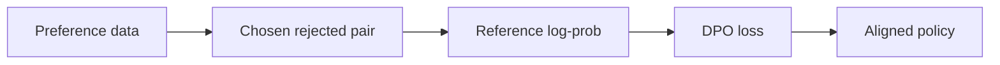
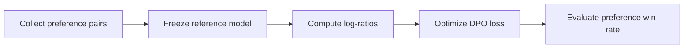

# DPO / 偏好优化

## 当前定位

DPO（Direct Preference Optimization）是 LLM 对齐和后训练中的经典偏好优化方法。它的核心思想是：**不显式训练 reward model，也不跑 PPO，而是直接用 chosen/rejected 偏好对优化 policy 相对 reference model 的偏好概率**。

> **面试抓手**：DPO 可以理解为把 RLHF 中“先学 reward、再用 RL 优化”的两阶段过程，改写成一个直接的监督式分类目标。但它仍然隐含了 reward model 和 KL-regularized RL 的假设。

## DPO 的明确结论

> **一句话结论**：DPO 的优势是用离线偏好对直接优化 policy，训练简单稳定、成本低；局限是它不在线探索，强依赖偏好数据质量和 reference model，难以替代所有 RLHF / GRPO 场景。

| 维度 | 结论 |
|---|---|
| 优势 1 | **工程实现简单**：DPO 不需要 reward model、value model、rollout 环境和 PPO 训练循环，更像一次带偏好对的监督微调。 |
| 优势 2 | **训练稳定性通常更好**：离线 chosen/rejected 数据固定，目标函数是 logistic loss，调试成本低于完整 RLHF。 |
| 优势 3 | **适合对齐风格和偏好边界**：例如回答是否有帮助、是否礼貌、是否拒答合理、是否更符合人类偏好。 |
| 局限 1 | **不会主动探索新策略**：DPO 只学习已有偏好对，不能像在线 RL 那样从当前 policy 采样并发现新高 reward 行为。 |
| 局限 2 | **偏好数据决定上限**：chosen/rejected 噪声、风格单一、长度偏置或标注偏差都会直接被模型学习。 |
| 局限 3 | **reference 和 beta 很关键**：reference 选择不当或 $\beta$ 设置不合适，会导致学不动、过度偏移或语言质量下降。 |
| 核心 trade-off | DPO 用稳定简单的离线训练换取低工程成本，但牺牲了在线探索能力和对复杂 reward 的直接优化能力。 |

**适合使用**：已有高质量偏好对、风格对齐、安全拒答、回答质量排序、低成本替代 RLHF 的场景。  
**谨慎使用**：数学/代码这类可验证推理持续提升、需要在线采样探索、reward 可自动验证且希望突破离线数据上限的场景。

## 为什么需要 DPO

传统 RLHF 通常包含三步：

1. SFT 得到初始 assistant policy。
2. 用人类偏好训练 reward model。
3. 用 PPO 在 reward model 上优化 policy，同时用 KL 约束 policy 不要偏离 reference。

这个流程很强，但工程成本也高：

- reward model 训练和校准很麻烦。
- PPO 训练不稳定，涉及 rollout、advantage、value model、KL controller 等组件。
- 对很多团队来说，偏好数据已经有了，但跑完整 RLHF 系统成本太高。

DPO 的价值就在于：**把偏好学习直接写成一个 policy loss**，让训练流程更接近普通 SFT，工程实现更轻。

## 偏好建模背景

DPO 通常从 Bradley-Terry 偏好模型理解。给定 prompt $x$，两个回答 $y_w$（winner/chosen）和 $y_l$（loser/rejected），偏好概率可以写成：

$$
P(y_w \succ y_l \mid x)
=
\sigma\left(r(x,y_w)-r(x,y_l)\right)
$$

其中 $r(x,y)$ 是隐式 reward。DPO 的关键推导是：在带 KL 约束的 RL 目标下，最优 policy 与 reward 存在关系：

$$
r(x,y)
=
\beta \log \frac{\pi_\theta(y\mid x)}{\pi_{ref}(y\mid x)}
+ C(x)
$$

把这个隐式 reward 代回偏好模型，就能得到不显式训练 reward model 的 DPO loss。

## DPO Loss

给定偏好对 $(x, y_w, y_l)$，DPO 常见 loss 是：

$$
\mathcal{L}_{DPO}
=
-\log \sigma \left(
\beta
\left[
\log \frac{\pi_\theta(y_w\mid x)}{\pi_{ref}(y_w\mid x)}
-
\log \frac{\pi_\theta(y_l\mid x)}{\pi_{ref}(y_l\mid x)}
\right]
\right)
$$

直觉上：

- 如果 policy 相对 reference 更偏向 chosen，loss 下降。
- 如果 policy 相对 reference 也提高 rejected，或者 chosen/rejected 区分不足，loss 会惩罚。
- $\beta$ 控制偏好优化强度，也可以理解为 KL 约束的温度参数。

## Reference Model 的作用

reference model 不是装饰项，它决定了 DPO 的“不要偏太远”的基准。

- 没有 reference，训练可能只是在无约束地拉开 chosen/rejected。
- 有 reference，DPO 优化的是 policy 相对 reference 的 log-ratio 差异。
- reference 通常是 SFT model 或当前训练前的 frozen policy。

> **关键点**：DPO 不是简单地“提高 chosen log-prob，降低 rejected log-prob”。它提高的是 chosen 相对 reference 的优势，同时压低 rejected 相对 reference 的优势。

## 和 SFT / PPO / GRPO 的区别

| 方法 | 数据形态 | 是否在线采样 | 是否需要 reward model | 核心训练信号 |
|---|---|---|---|---|
| SFT | 单条标准回答 | 否 | 否 | 模仿目标答案 token |
| DPO | chosen/rejected 偏好对 | 否 | 否（隐式 reward） | 偏好对的 log-ratio 差异 |
| PPO/RLHF | rollout + reward | 是 | 是 | reward advantage + KL |
| GRPO | 同 prompt 多回答组 | 是 | 可用规则 reward | 组内相对 advantage |
| OPD | student on-policy 轨迹 + teacher 分布 | 是 | 否 | teacher distribution supervision |

## 训练流程

一个典型 DPO 训练循环：

1. 准备偏好数据：每条样本包含 prompt、chosen、rejected。
2. 固定 reference model，通常是 SFT model。
3. 分别计算 policy 和 reference 对 chosen/rejected 的 sequence log-prob。
4. 计算 log-ratio 差值和 DPO loss。
5. 监控 reward margin、chosen/rejected log-prob、KL、长度偏置和真实评测指标。

## 常见风险

- **偏好数据质量决定上限**：chosen/rejected 如果噪声大，DPO 会学到错误偏好。
- **长度偏置**：sequence log-prob 可能受回答长度影响，需要注意 normalization 和数据构造。
- **beta 敏感**：$\beta$ 太大可能更新过猛，太小可能偏好信号不足。
- **reference 选择影响大**：reference 太弱或与 policy 分布差异太大，log-ratio 解释会变差。
- **离线偏好局限**：DPO 不主动探索新回答，不能像在线 RL 那样基于最新 policy 采样发现新策略。

## 变体谱系

- **IPO**：从理论上重新审视 preference optimization，指出 DPO 在某些设置下可能过度优化偏好边界，提出 identity preference optimization。
- **KTO**：不要求成对偏好，只需要 desirable / undesirable 单样本反馈，用 prospect theory 风格目标做对齐。
- **ORPO**：尝试去掉 reference model，把 SFT 和 preference optimization 合并为单阶段目标。
- **SimPO / CPO 等**：进一步简化 reference 或 margin 设计，常用于偏好优化工程对比。

## 面试 QA

**Q：DPO 为什么可以不用显式 reward model？**

A：因为在 KL-regularized RL 的最优解假设下，reward 可以写成 policy 和 reference 的 log-ratio。DPO 把这个隐式 reward 代入 Bradley-Terry 偏好模型，直接得到一个基于 chosen/rejected 的分类式 loss。

**Q：DPO 和 SFT 最大区别是什么？**

A：SFT 只模仿单个目标回答；DPO 利用 chosen/rejected 对比，优化“更偏好 chosen 而不是 rejected”的相对关系。DPO 的训练信号更接近偏好边界，而不是单纯 token imitation。

**Q：DPO 中 beta 怎么理解？**

A：$\beta$ 控制 policy 相对 reference 偏离的强度，也影响偏好 margin 的尺度。太大可能导致过度优化和分布漂移，太小则可能学不动偏好。

**Q：DPO 一定比 PPO/RLHF 更好吗？**

A：不是。DPO 简洁稳定、工程成本低，适合已有高质量离线偏好数据的场景；PPO/GRPO 等在线 RL 可以从当前 policy 继续采样探索，在可验证推理和在线 reward 优化中可能更强。

**Q：DPO 会不会降低模型多样性？**

A：可能会。偏好对如果风格单一，DPO 会强化 chosen 风格，并抑制 rejected 分布。需要通过数据多样性、KL/温度、评估集和人工检查控制模式坍缩。

## 原理代码

关联代码骨架：`dpo-loss`。后续可以补两个最小实现：

- chosen/rejected sequence log-prob 计算。
- DPO loss：policy log-ratio、reference log-ratio、beta、binary logistic loss。

## SWIFT 视角补强：DPO 与偏好对齐方法谱系

> **结论**：DPO 只是离线偏好对齐的一种代表。SWIFT 的人类对齐目录把 DPO、RM、PPO、KTO、CPO、ORPO、SimPO 放在同一组，面试时应该用“是否需要 reward model、是否在线采样、是否需要成对偏好、是否保留 reference model”来区分。

| 方法 | 数据形态 | 是否在线采样 | 是否显式 reward model | 面试抓手 |
|---|---|---|---|---|
| RM | chosen/rejected 或评分数据 | 否 | 是，训练 reward model | RLHF 的奖励建模阶段 |
| PPO | rollout + reward | 是 | 通常是 | 在线优化，但系统复杂，需要 critic/value |
| DPO | chosen/rejected pair | 否 | 否 | 把偏好优化写成分类式目标，工程简单 |
| KTO | good/bad 单样本反馈 | 否 | 否 | 不强依赖成对偏好，适合非成对反馈 |
| CPO | chosen/rejected pair | 否 | 否 | 更强调 conservative preference update |
| ORPO | SFT + preference odds ratio | 否 | 否 | 把监督学习和偏好惩罚合到一个目标 |
| SimPO | chosen/rejected pair | 否 | 否 | 简化 reference 依赖，常用长度归一化 margin |

### DPO 的常见误区

- DPO 不等于“比 PPO 永远更好”：DPO 省掉在线 rollout 和 reward model，但它受限于离线偏好数据覆盖。
- DPO 不等于“直接灌知识”：它主要改变偏好排序和回答风格，不适合频繁更新事实知识；事实更新更适合 RAG 或继续训练。
- DPO 不等于“没有 KL 思想”：DPO 的推导里仍然隐含 reference policy 约束，只是形式上变成偏好分类目标。

### 面试 QA

**Q：DPO、PPO、GRPO 怎么快速区分？**

A：DPO 是离线偏好优化，吃 chosen/rejected；PPO 是在线 RLHF，吃 rollout reward 并训练 critic/value；GRPO 是 critic-free 的在线 RLVR/RLHF 变体，用同 prompt 多回答的组内 reward 构造 advantage。

**Q：什么时候 DPO 不够？**

A：当目标能力需要模型自己探索新推理路径、代码解法或数学链路时，离线偏好数据可能覆盖不足；这时 GRPO/RLVR 这类在线采样方法更有价值。但如果 reward/verifier 不可靠，DPO 反而更稳。

### 知识索引引用

| 知识点 | 来源 |
|---|---|
| SWIFT 人类对齐目录：DPO/RM/PPO/KTO/CPO/ORPO/SimPO | https://swift.readthedocs.io/zh-cn/latest/index.html |

## 参考论文

- Direct Preference Optimization: Your Language Model is Secretly a Reward Model, arXiv:2305.18290。本地文件：`papers/post-training/dpo.pdf`。DPO 核心论文。
- A General Theoretical Paradigm to Understand Learning from Human Preferences, arXiv:2310.12036。本地文件：`papers/post-training/ipo.pdf`。IPO 与偏好优化理论视角。
- KTO: Model Alignment as Prospect Theoretic Optimization, arXiv:2402.01306。本地文件：`papers/post-training/kto.pdf`。不依赖成对偏好数据的对齐目标。
- ORPO: Monolithic Preference Optimization without Reference Model, arXiv:2403.07691。本地文件：`papers/post-training/orpo.pdf`。无 reference 的单阶段偏好优化。

## 博文与社区资料使用原则

可以用知乎、CSDN、博客园、个人博客补充 DPO 的推导直觉，但建议分层使用：

- **公式和结论以 DPO / IPO / KTO / ORPO 论文为准**。
- **博客适合看推导步骤和代码实现讲解**，尤其是 sequence log-prob、mask、chosen/rejected batching。
- **面试表达要回到三个问题**：为什么不用 reward model、reference model 约束了什么、DPO 和 PPO/RLHF 的边界在哪里。

## 知识索引引用

| 知识点 | 主要来源 | 本页使用方式 |
|---|---|---|
| DPO 目标、隐式 reward、reference policy 与 $\beta$ | Direct Preference Optimization 论文 | 用于解释 DPO 为什么可以绕过显式 RM 与 PPO rollout |
| IPO / KTO / ORPO | 对应偏好优化论文 | 用于补充 DPO 之后的偏好优化变体 |
| RLHF / PPO 对比 | InstructGPT 与 PPO 相关论文 | 用于说明 DPO 和传统 RLHF 的工程差异 |
