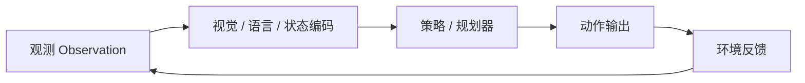
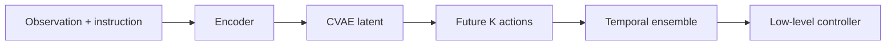
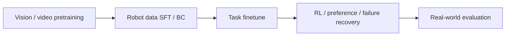

# 具身智能与机器人 VLA：基础、模型、数据、Sim-to-Real 与 RL

## 当前定位

具身智能（Embodied AI）关注的是 **带身体约束的闭环交互智能**：模型不是只理解图像或语言，而是要在真实或仿真环境中观察、决策、行动，并承担动作对下一步观测的影响。机器人 VLA（Vision-Language-Action）是当前具身智能里最常见的大模型化表达：用视觉、语言、状态和历史作为条件，输出动作 token、连续轨迹、action chunk 或 action expert 的控制结果。

> **面试抓手**：具身智能和普通 VLM 的最大差别是 **闭环性和物理约束**。VLM 答错可以重试，机器人动作错了会改变世界，甚至造成安全风险。

## 基础概念速查

| 概念 | 面试里怎么说 | 常见坑 |
|---|---|---|
| Embodied AI | 在身体、传感器、动作和环境反馈约束下完成任务的智能系统 | 只说成“多模态 AI” |
| VLA | Vision、Language、Action 条件下的动作生成模型 | 只把它当 VQA 或普通规划器 |
| Embodiment | 机器人形态、关节、末端执行器、传感器和动力学约束 | 忽略不同机器人动作空间不可直接复用 |
| Action Token | 把离散化动作当作语言 token 生成 | 忽略连续控制精度和延迟 |
| Action Chunk | 一次输出未来 K 步动作 | 只看到平滑，不讲延迟和滚动执行 |
| EEF Action | 末端执行器位姿/速度控制 | 忽略 IK 和低层控制器 |
| Joint Action | 关节角/速度/力矩控制 | 忽略跨机器人迁移难度 |
| BC | Behavior Cloning，模仿专家示范 | 容易 compounding error 和 OOD 崩溃 |
| Sim-to-Real | 从仿真迁移到真实机器人 | 忽略传感器、摩擦、延迟、接触动力学差异 |
| OOD | 分布外状态 | 只看离线 loss，不看真机失败模式 |

## VLA 综述论文视角：五条主线

Sapkota 等人的 VLA 综述把近三年 80 余个 VLA 相关模型放在一个统一框架里，适合作为面试时的“总览地图”。这篇综述的价值不是给出某个新算法，而是帮助你把机器人 VLA 从零散模型名整理成五条主线：

| 主线 | 面试里怎么讲 | 代表问题 |
|---|---|---|
| 概念基础 | VLA 统一视觉、语言、状态和动作，不再只是 VLM 输出文本解释 | VLA 和 VLM 的本质差别是什么？ |
| 架构演进 | 从 CLIPort/Gato/RT-1/VIMA 到 RT-2、OpenVLA、Octo、π0、GROOT 等 | 为什么从模块化管线走向统一 token / policy？ |
| 高效训练 | 参数高效微调、数据高效学习、跨任务数据混训、动作 token 化 | 机器人数据少，为什么还要复用 VLM/LLM backbone？ |
| 实时推理 | 自回归动作 token 通常很慢，需要并行解码、action chunk、轻量动作头或低层控制器接管 | 为什么 VLA 论文指标好，不代表真机可部署？ |
| 开放挑战 | 安全、泛化、Sim-to-Real、伦理、跨具身迁移和 System 1/2 集成 | VLA 距离通用机器人还差什么？ |

面试中可以把 VLA 的回答组织成一句话：**VLA 不是“多模态问答加一个动作输出”，而是把环境观测、语言目标、本体状态和可执行控制放进同一个闭环系统里，同时要处理实时性、安全性和跨具身泛化。**

### 2022-2025 演进线

| 阶段 | 典型模型/方向 | 关键变化 |
|---|---|---|
| 2022-2023 基础集成 | CLIPort、Gato、RT-1、VIMA、ACT、Diffusion Policy、RT-2 | 用预训练视觉语言表征连接机器人控制，开始把动作 token、action chunk、生成式策略引入操作任务 |
| 2024 专用化与具身推理 | OpenVLA、Octo、VoxPoser、面向导航/自动驾驶/遮挡处理的 VLA | 更强调机器人数据、空间推理、记忆、检索、领域归纳偏置和开源复现 |
| 2025 泛化与安全部署 | SafeVLA、Humanoid-VLA、GROOT N1、SpatialVLA、π0/π0.5 等 | 从“能做任务”转向实时、安全、跨机器人、跨场景和长程任务 |

这条时间线适合用来回答“VLA 最近几年怎么发展”：早期是**把模态接起来**，中期是**让动作更可学、更可泛化**，后期是**面向真机部署补实时、安全和跨具身迁移**。

### Token 化与融合范式

VLA 常见输入不是只有图像和文本，还包括状态与历史：

| Token / 表征 | 作用 | 面试提醒 |
|---|---|---|
| Vision token | 编码 RGB/RGB-D/视频/多相机观测 | 仅有 2D 语义不够，机器人还关心深度、遮挡、接触和可供性 |
| Language token | 编码任务目标、约束和人类指令 | 语言负责“做什么”和部分高层约束，不应直接替代低层控制 |
| State token | 编码关节、末端位姿、力/触觉、里程计等本体状态 | 缺少 proprioception 会让模型难以处理真实控制闭环 |
| Action token / action head | 输出离散动作、连续轨迹或 action chunk | 离散 token 易复用 LLM，连续/扩散/流模型更适合精细控制 |

跨模态融合可以是拼接 token、cross-attention、统一自回归 decoder，也可以是高层 VLM + 低层 policy 的分层架构。**工程上更稳的答案通常不是绝对端到端，而是端到端学习能力与可验证低层控制之间的折中。**

### 综述强调的部署瓶颈

| 瓶颈 | 为什么严重 | 常见缓解 |
|---|---|---|
| 实时推理 | 自回归动作 token 往往只有低频响应，难满足机械臂/无人车高频控制 | action chunk、并行解码、蒸馏、轻量动作头、低层 MPC/控制器 |
| 动作表征 | 离散 token 精度不足，MLP 可能模式坍塌，diffusion/flow 计算更重 | 按任务选择 token、continuous head、diffusion、flow 或分层控制 |
| 开放世界安全 | 动作错误会改变世界，碰撞/力矩/速度约束不能只靠语言模型自觉 | 安全过滤器、CBF/MPC、风险评估、人工接管、真机闭环测试 |
| 数据偏差 | 互联网视觉语言知识不等于机器人可执行经验 | 真实遥操作数据、失败数据、跨任务混训、数据版本管理 |
| 泛化不足 | 从家庭迁移到工业/农业/医疗时物体、动力学和约束都变了 | cross-embodiment 数据、domain randomization、adapter、少量真机校正 |
| System 1/2 集成 | 高层规划推理慢，低层控制周期快，两者时间尺度不一致 | 高层低频规划、低层高频控制、异步队列、receding horizon |

> **面试结论**：VLA 的难点不是“能否生成动作”这一个点，而是动作必须在真实系统里满足 **低延迟、连续性、安全边界、跨环境泛化和可恢复性**。

## VLA 三层架构：大脑、小脑与身体

机器人 VLA 可以用“大脑-小脑-身体”解释：

| 层级 | 负责什么 | 常见实现 |
|---|---|---|
| 大脑 | 任务理解、语言指令、语义规划、子目标分解 | VLM / LLM / planner / memory / tool use |
| 小脑 | 动作生成、轨迹平滑、局部反馈控制 | ACT、Diffusion Policy、Flow Matching、MPC、RL policy |
| 身体 | 机器人硬件、传感器、执行器、低层控制 | arm、gripper、mobile base、humanoid、force/tactile sensor |

分层架构的优点是可解释、易调试、安全边界清楚；端到端 VLA 的优点是减少人工接口和误差传播，但对数据、算力、安全验证和 sim-to-real 要求更高。

## 动作表示怎么选

| 动作表示 | 优点 | 局限 | 适合场景 |
|---|---|---|---|
| 离散 action token | 可复用 LLM/VLM 自回归生成 | 连续精度和实时性有限 | RT-2、OpenVLA 类动作 token 化路线 |
| EEF pose / velocity | 直观、跨机械臂相对容易 | 依赖 IK 和控制器质量 | 抓取、放置、操作任务 |
| Joint action | 控制精细，接近底层执行 | 跨机器人泛化差 | 固定机器人和高精度控制 |
| Action chunk | 一次预测多步动作，减少抖动 | chunk 太长会增加闭环迟滞 | ACT、Diffusion Policy、RDT 类策略 |
| Diffusion action | 建模多峰轨迹分布强 | 多步去噪带来推理成本 | 灵巧操作、多模态动作选择 |
| Flow action expert | 用连续流/速度场生成动作 | 训练与部署复杂，需要稳定 ODE/采样 | π0、SmolVLA 等新 VLA action expert |

**结论**：动作表示不是越“大模型化”越好。机器人场景要同时看控制频率、闭环延迟、动作平滑、机器人形态、数据来源和安全验证。

## 经典模型路线

| 模型/路线 | 核心思想 | 面试重点 |
|---|---|---|
| RT-2 | 把机器人动作离散化为 token，让 VLM 直接生成动作 | web knowledge transfer、action tokenization、语义泛化 |
| OpenVLA | 开源 7B VLA，融合 DINOv2/SigLIP 视觉特征和 Llama 2 | 开源数据、robot demos、LoRA/量化部署 |
| ACT | CVAE + action chunk，解决模仿学习中的多峰动作和高频控制 | latent style、temporal ensemble、chunk horizon |
| Diffusion Policy | 用扩散模型生成连续 action chunk | joint trajectory distribution、receding horizon、多峰动作 |
| RDT-1B | Diffusion Transformer + action chunk | 多模态输入、机器人 foundation policy |
| π0 / π0.5 | VLA backbone + flow matching action model | action expert、跨 embodiment、flow matching |
| GR00T | 面向 humanoid 的 VLM + DiT / action expert | System 1/2、humanoid foundation model |
| SmolVLA | 小模型 VLM + flow action expert | 轻量化、LeRobot、异步推理 |

## ACT / CVAE / Action Chunking

ACT 的关键不是“用了 Transformer”，而是 **把短期未来动作作为 chunk 一起预测**，并用 CVAE latent 表示同一任务下多种合理操作风格。

面试可以这样回答：

- action chunk 减少一步一步预测带来的高频抖动，也能缓解长序列误差累积。
- CVAE latent 让模型表达多峰示范，例如不同操作者拿杯子的轨迹不同但都可行。
- 推理时常用 temporal ensemble，把多个重叠 chunk 的动作做平滑融合。
- chunk 太短会不稳定，chunk 太长会降低闭环反馈频率，需要按控制频率和任务动态调参。

## Diffusion Policy 与 Flow Matching

Diffusion Policy 把动作序列看成需要从噪声中逐步还原的轨迹分布，适合建模多模态动作。Flow Matching 则直接学习从噪声到数据的连续 velocity field，通常可用 ODE 路径解释，目标是更高效地生成动作。

| 方法 | 建模对象 | 优点 | 风险 |
|---|---|---|---|
| Diffusion Policy | action chunk 的联合分布 | 多峰表达强，适合复杂操作 | 多步采样慢，实时控制要优化 |
| DDIM / DPM-Solver | 加速扩散采样 | 减少推理步数 | 可能牺牲质量或稳定性 |
| Flow Matching | 学习噪声到动作的速度场 | 路径直接，适合 action expert | 训练和数值稳定性要求高 |
| Consistency Model | 学一次/少步映射 | 推理快 | 对训练稳定和蒸馏质量敏感 |

**高分表述**：机器人动作不是独立 token，而是强时序相关的连续轨迹。Diffusion/Flow 更适合建模 joint trajectory distribution；如果只逐步建模 marginal action，容易出现动作抖动和不一致。

## 数据训练：从遥操作到 SFT

具身智能最大瓶颈通常是数据，而不是单纯模型结构。可用数据包括：

| 数据类型 | 价值 | 风险 |
|---|---|---|
| 遥操作 demo | 最直接的 expert action supervision | 成本高、操作者风格差异、噪声和延迟 |
| 人类操作视频 | 规模大，包含丰富物体和任务语义 | 缺少机器人动作标签，需要 inverse dynamics / affordance |
| 仿真数据 | 成本低，可控，可做失败场景 | sim-to-real gap |
| 公开机器人数据 | Open X-Embodiment、DROID、BridgeData、LeRobot 等 | embodiment 不一致，schema 和动作空间不同 |
| 失败数据 | 能覆盖边界和恢复策略 | 标注难，需要区分可恢复/不可恢复失败 |

训练阶段可以拆成：

### 遥操作系统设计

一个真实遥操作数据系统至少要考虑：

- 多视角 RGB / depth / wrist camera 同步。
- 机器人 state、EEF pose、joint action、gripper state 记录。
- 时间戳对齐，处理视觉、触觉、控制不同延迟。
- 操作者风格差异，用 CVAE latent、质量评分或分层标签处理多峰示范。
- 数据清洗，包括异常轨迹、碰撞、掉帧、控制抖动和重采样。
- 任务元信息，包括 object、scene、instruction、subtask、success/failure。

## Sim-to-Real 常见坑

| Gap 类型 | 表现 | 处理方式 |
|---|---|---|
| 视觉 gap | 光照、材质、背景、相机噪声不同 | domain randomization、真实图像混训、视觉增强 |
| 动力学 gap | 摩擦、质量、接触、柔性物体差异 | system identification、真实 rollout 校正 |
| 传感器 gap | depth 噪声、标定误差、遮挡 | calibration、sensor fusion、鲁棒特征 |
| 延迟 gap | 图像、控制、执行器反馈不同步 | latency compensation、timestamp alignment |
| 任务 gap | 仿真任务过干净，真实环境杂乱 | curriculum、hard negative、failure data |

**面试结论**：Sim-to-Real 不只是“仿真加随机化”。要把感知、动力学、接触、延迟和任务分布逐层拆开看，并用真实失败数据闭环修正。

## VLA 中的 RL

RL 在机器人 VLA 里通常不是从零训练大模型，而是用于后期提升：任务成功率、失败恢复、动作平滑、安全约束和长程任务。

| RL 方法 | 适合什么 | 机器人场景风险 |
|---|---|---|
| PPO | on-policy 稳定更新，适合仿真和可并行 rollout | 样本效率低，真实机器人成本高 |
| SAC | off-policy + entropy，适合连续控制 | critic 误差和真实部署安全 |
| TD3 | 连续控制、减少 Q overestimation | reward 设计和探索风险 |
| CQL / IQL / AWAC | 离线 RL，利用固定数据集 | OOD action 的 Q 估计偏差 |
| DPO / GRPO / RLHF/RLAIF | 借鉴 LLM 后训练做偏好或相对优势 | 动作 reward 难定义，安全边界更硬 |

奖励设计可分为：

- task success：是否完成抓取、放置、导航、装配等目标。
- dense shaping：距离、接触、姿态、进度、subgoal completion。
- safety：碰撞、力矩、速度、禁区、物体损坏。
- smoothness：动作跳变、加速度、jerk penalty。
- human preference：轨迹自然度、效率、可接受性。

## 动作抖动与安全约束

动作抖动可以从四层处理：

| 层级 | 方法 |
|---|---|
| 数据层 | 清洗遥操作抖动，重采样，统一控制频率 |
| 模型层 | temporal smoothness loss、action chunk、diffusion trajectory prior |
| 推理层 | temporal ensemble、receding horizon、uncertainty gating |
| 控制层 | low-pass filter、MPC、CBF、安全限幅 |

高风险场景如手术机器人、工业机械臂和人形机器人，需要进一步考虑 risk-aware training、uncertainty estimation、fail-safe controller 和人工接管。

## Benchmark 与数据集怎么选

| 资源 | 用途 | 注意点 |
|---|---|---|
| Open X-Embodiment | 多机器人多任务大规模数据 | embodiment 差异大，动作 schema 需统一 |
| DROID | 真实机器人操作数据 | 场景真实但清洗和任务标准化重要 |
| BridgeData | 机器人操作迁移和多任务学习 | 需检查相机、动作空间和任务标签 |
| LeRobot | 轻量复现实验和开源生态 | 适合入门和小模型验证 |
| LIBERO / Meta-World / ManiSkill | 仿真 benchmark | sim-to-real 不能直接等同真实能力 |
| ALOHA / ACT tasks | 双臂操作和 action chunk 研究 | 数据采集系统和控制频率很关键 |

## 面试 QA

**Q：具身智能和传统 CV/NLP 最大区别是什么？**

A：传统 CV/NLP 多数是静态输入到输出，模型回答不会改变下一步输入；具身智能是闭环交互，动作会改变环境和下一步观测，因此必须考虑身体约束、动力学、实时性、安全和长期误差累积。

**Q：VLA 的 Vision、Language、Action 怎么串起来？**

A：Vision 提供场景、物体、空间和状态信息；Language 提供任务目标、约束和高层语义；Action 把理解结果转成机器人可执行轨迹。中间通常需要视觉编码器、语言模型/规划器、动作头和低层控制器。

**Q：RT-2 和 OpenVLA 的区别是什么？**

A：RT-2 强调把 web-scale VLM 知识迁移到机器人控制，并把动作作为 token 生成；OpenVLA 更强调开源、可复现和机器人数据训练，使用 DINOv2/SigLIP 视觉特征与 Llama 2 backbone，在真实 robot demonstrations 上训练。

**Q：ACT 为什么要用 action chunk？**

A：机器人控制频率高，如果一步一步生成动作，容易抖动并累积误差。action chunk 一次预测未来 K 步，可以提高短期轨迹一致性；再结合 temporal ensemble，可以让执行更平滑。

**Q：Diffusion Policy 比普通 BC 好在哪里？**

A：普通 BC 往往用 MSE 拟合单一动作均值，面对多峰示范会平均出不可执行轨迹。Diffusion Policy 建模动作序列的联合分布，能表达多种可行动作模式，更适合复杂操作。

**Q：Sim-to-Real 怎么答才不像口号？**

A：要拆成视觉 gap、动力学 gap、传感器 gap、延迟 gap 和任务 gap。解决方案包括 domain randomization、system identification、真实数据混训、标定、时间同步、失败数据回放和真机闭环评测。

**Q：VLA 里 PPO、SAC、TD3 怎么选？**

A：PPO on-policy 稳定但样本效率低，适合仿真并行 rollout；SAC/TD3 是 off-policy 连续控制常用方法，样本效率更好但 critic 误差和安全探索要处理。真实机器人通常先 SFT/BC，再在仿真或安全环境里做 RL 微调。

**Q：如何把公开数据落到自己的机器人？**

A：先统一 schema，包括 observation、camera、state、action、timestamp、instruction、success；再做 embodiment mapping，把外部动作转换到本机 EEF 或 joint action；然后按任务相似度、质量和机器人差异做加权混训，最后用本机小规模数据和失败数据闭环校正。

## 与现有知识章节的连接

| 关联章节 | 学习关系 |
|---|---|
| [VLA：视觉-语言-动作与自动驾驶/具身智能](#knowledge/vla-embodied-driving) | 本章更偏机器人具身操作，VLA 章节更偏通用 VLA 和自动驾驶 |
| [多模态大模型与 VLM](#knowledge/multimodal-vlm) | 视觉语言 backbone 是 VLA 的上层语义能力来源 |
| [Agent 系统](#knowledge/agent) | 具身智能可以视为真实环境中的多模态 Agent |
| [采样、评测与强化微调闭环](#knowledge/sampling-evaluation-rft) | 对应 rollout、reward、评测和失败数据闭环 |
| [CV 基础模型](#foundations/cv-foundation-models) | ViT、CLIP、DINOv2、MAE、Diffusion 是机器人 VLA 的视觉和生成基础 |

## 知识索引引用

| 知识点 | 来源 | 本页使用方式 |
|---|---|---|
| 具身智能基础概念、VLA 框架、大脑/小脑、动作表示、视觉编码器、benchmark | https://www.guyuehome.com/wap/detail?id=2051180175141400577 | 作为本章基础概念、VLA 架构和面试 QA 主线 |
| RT-2、OpenVLA、ACT、Diffusion Policy、RDT-1B、π0、GR00T、SmolVLA 等经典模型路线 | https://www.guyuehome.com/wap/detail?id=2051193990079868929 | 用于整理模型谱系、动作生成范式和 action expert 对比 |
| 数据训练、遥操作、SFT、Sim-to-Real、公开数据集、长序列任务和数据版本管理 | https://www.guyuehome.com/wap/detail?id=2051196653962031106 | 用于补充数据瓶颈、遥操作系统、Sim-to-Real 和数据闭环 |
| ACT/action chunk、Diffusion Policy、Flow Matching、PPO/SAC/TD3、离线 RL、动作抖动与风险约束 | https://www.guyuehome.com/wap/detail?id=2051200242788888578 | 用于补充生成式动作策略和机器人 RL 面试点 |
| VLA 综述论文：概念基础、80 余个模型、五条主线、实时推理、安全、泛化和系统集成挑战 | https://arxiv.org/abs/2505.04769 / https://www.cnblogs.com/emergence/p/19043338 | 作为机器人 VLA 章节的全局地图，补强发展时间线、token 化范式和部署挑战 |
