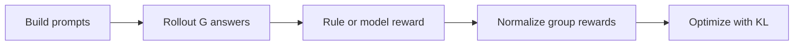
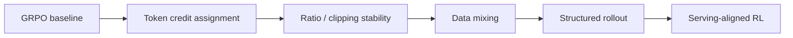
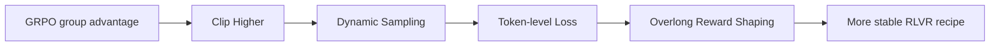

# GRPO：Group Relative Policy Optimization

## 当前定位

GRPO 是 DeepSeekMath / DeepSeek-R1 路线中非常重要的强化学习后训练方法。它的核心思想是：**对同一个 prompt 采样多个回答，使用组内 reward 的相对高低来构造 advantage，从而减少对 value model / critic 的依赖**。

> **面试抓手**：GRPO 不是“完全不同于 PPO 的新 RL 范式”，而是面向 LLM 后训练场景对 PPO 进行工程和估计方式上的简化：保留 clipped policy optimization 和 KL 约束思想，但用 group-relative reward baseline 替代显式 value model。


## 一、GRPO 基础：从 PPO 到 group-relative advantage

### GRPO 的明确结论

> **一句话结论**：GRPO 的优势是用组内相对比较省掉 value model，适合可验证推理任务；局限是强依赖 reward/verifier 和采样组质量，不适合 reward 模糊、开放式偏好多样的场景。

| 维度 | 结论 |
|---|---|
| 优势 1 | **工程链路更轻**：相比 PPO/RLHF，GRPO 不需要单独训练 value model / critic，显存、训练组件和调参复杂度更低。 |
| 优势 2 | **适合数学、代码、可验证推理**：同一个 prompt 下采样多个答案，再用规则 reward / verifier 做组内比较，信号直接且容易扩展。 |
| 优势 3 | **比纯 SFT 更能优化结果质量**：SFT 只模仿答案，GRPO 可以直接鼓励更高 reward 的解法，尤其适合 outcome reward 清晰的任务。 |
| 局限 1 | **依赖 reward 可靠性**：如果 reward model、规则验证器或单元测试有偏差，GRPO 会把错误偏好放大。 |
| 局限 2 | **组内估计有方差**：group size 太小、采样温度不合适或候选答案质量太接近时，relative advantage 不稳定。 |
| 局限 3 | **开放式任务不一定合适**：写作、闲聊、多风格偏好这类任务 reward 很难统一，GRPO 的组内相对分数可能不如高质量偏好数据稳。 |
| 核心 trade-off | GRPO 用更低工程成本换取可验证任务上的 RL 效率，但把压力转移到了 reward 设计、采样策略和训练稳定性上。 |

**适合使用**：数学推理、代码生成、可单测任务、格式可验证任务、答案对错明确的 RLVR。  
**谨慎使用**：开放式创作、多轮主观偏好、安全对齐、reward 难校准的任务。

### 为什么需要 GRPO

LLM 后训练中的 PPO/RLHF 通常包含 policy model、reference model、reward model、value model。这个链路有效，但在大模型上有几个明显成本：

- **value model 训练成本高**：critic 需要拟合 token/sequence 级价值，额外增加显存、训练稳定性和调参复杂度。
- **推理任务 reward 更稀疏**：数学、代码、可验证推理任务常常只有最终答案对错，过程价值估计不一定可靠。
- **同一 prompt 下的候选回答天然可比较**：如果对同一个问题采样多个解法，组内 reward 的相对排序可以提供强训练信号。

GRPO 的切入点就是：既然同一个 prompt 下有一组候选答案，就用组内均值/标准差做 baseline 和 normalization，让高于组平均的回答被鼓励，低于组平均的回答被抑制。

### 从 PPO 到 GRPO

PPO 常见目标可以简化理解为：限制新旧策略概率比不要变化过大，同时最大化 advantage 加权的 log-prob 更新。

$$
\mathcal{L}_{PPO}
= \mathbb{E}\left[
\min\left(
r_t(\theta) A_t,\;
\mathrm{clip}(r_t(\theta), 1-\epsilon, 1+\epsilon) A_t
\right)
\right]
$$

其中：

- $r_t(\theta)=\frac{\pi_\theta(y_t\mid x,y_{<t})}{\pi_{\theta_{old}}(y_t\mid x,y_{<t})}$ 是新旧策略概率比。
- $A_t$ 通常来自 value model / GAE 等估计。
- clipping 用来避免 policy 一步更新过大。

GRPO 保留类似的 clipped objective，但 advantage 不再主要依赖 value model，而是来自组内 reward 标准化。

### Group Relative Advantage

对同一个 prompt $x$，采样 $G$ 个回答 $\{y_1,\dots,y_G\}$，每个回答得到 reward $r_i$。一个常见的 group-relative advantage 写法是：

$$
A_i =
\frac{r_i - \mathrm{mean}(r_1,\dots,r_G)}
{\mathrm{std}(r_1,\dots,r_G) + \epsilon}
$$

直觉很简单：

- 如果某个回答 reward 高于同组平均，它的 $A_i>0$，训练会提高该回答概率。
- 如果某个回答 reward 低于同组平均，它的 $A_i<0$，训练会降低该回答概率。
- 组内归一化让不同 prompt 的 reward 尺度更可比。

> **关键点**：GRPO 的 baseline 是同 prompt 多回答的组内统计量，而不是训练一个额外 critic 去预测 value。

### GRPO 目标函数直觉

在 LLM 序列级训练中，可以把每个回答 $y_i$ 的 group-relative advantage 分配到该回答的 token log-prob 上，并加入 reference policy 的 KL 约束：

$$
\mathcal{J}_{GRPO}(\theta)
=
\mathbb{E}_{x,\{y_i\}\sim\pi_{\theta_{old}}}
\frac{1}{G}\sum_{i=1}^{G}
\left[
\min\left(
\rho_i(\theta) A_i,\;
\mathrm{clip}(\rho_i(\theta),1-\epsilon,1+\epsilon)A_i
\right)
- \beta D_{KL}(\pi_\theta \| \pi_{ref})
\right]
$$

这里 $\rho_i(\theta)$ 可以理解为新旧策略在回答 $y_i$ 上的概率比。实际论文和实现会在 token 粒度、sequence 粒度、KL 估计方式、length normalization 上有细节差异，面试时不需要死背完整公式，更重要的是讲清楚：**GRPO 用组内相对优势替代 value model，同时仍然需要 clip / KL 来控制策略漂移**。

### 训练流程



一个典型 GRPO/RLVR 训练循环：

1. 从训练集中取一批 prompts。
2. 当前 policy 对每个 prompt 采样多个候选回答。
3. 用规则验证器、reward model 或 outcome reward 给每个回答打分。
4. 对同一 prompt 内的 rewards 做组内标准化，得到 advantages。
5. 用 clipped objective 更新 policy，并用 reference model KL 约束语言分布不要漂移太远。

### 和 DPO / SFT / OPD 的区别

| 方法 | 训练信号 | 数据来源 | 是否在线采样 | 面试区分点 |
|---|---|---|---|---|
| SFT | 标准答案 token loss | 人工/合成示范 | 否 | 学会模仿，但不直接优化偏好或 reward |
| DPO | chosen vs rejected 偏好对 | 离线偏好数据 | 否 | 不显式训练 reward model，把偏好优化写成分类式目标 |
| PPO/RLHF | reward + value advantage | 在线 rollout + reward | 是 | critic/value model 成本高，但框架成熟 |
| GRPO | 组内相对 reward advantage | 在线 rollout group | 是 | 去掉显式 value model，用 group baseline |
| OPD | teacher distribution supervision | student on-policy 轨迹 | 是 | 本质是蒸馏监督，不是直接最大化环境 reward |

### 常见风险

- **组大小敏感**：$G$ 太小会导致 advantage 方差大，组内比较不稳定。
- **reward 稀疏或噪声大**：如果 verifier/reward 本身不可靠，GRPO 会放大错误偏好。
- **长度偏置**：长回答可能因为包含更多 token 或冗余推理而影响 reward / KL，需要 length normalization 或格式约束。
- **熵坍缩**：如果持续强化少数高 reward 模式，模型可能探索不足。
- **off-policy 问题**：旧 rollout 数据复用过多时，policy ratio 和真实采样分布可能脱节，后续 DAPO 等工作会专门处理这类稳定性问题。

## 二、RLVR 高级谱系：从问题定位到方法选择

### GRPO / RLVR 高级方法谱系

结合 SWIFT Advanced Research 文档，可以把 GRPO 后续改进理解成四条线：**训练信号更细、ratio/clip 更稳、SFT 与 RL 更好混合、rollout 与 serving 更贴近真实推理**。

> **面试抓手**：GRPO 解决的是 critic 成本和 group baseline 问题，但并没有自动解决 token credit assignment、off-policy 漂移、SFT 能力保持、MoE 路由错配和训练-推理不一致。这些后续论文大多是在修这些工程与算法细节。
### 高级谱系总表：面试先讲问题，再讲方法

| 面试追问方向 | 典型问题 | 代表方法 | 核心改动 | 60 秒回答抓手 |
|---|---|---|---|---|
| 有效训练信号 | 大量低信息 token 稀释 RLVR 梯度 | High-Entropy Minority Tokens | 对高熵、决策分叉 token 做筛选或加权 | RL 真正改变推理路径的位置通常不是所有 token，而是少数高不确定性决策点。 |
| ratio / clip 偏差 | clip 后重要 token 的梯度可能被截断或带偏 | CISPO | clipped importance weight 常量化，梯度仍回到 logprob | 不是只调 clip 阈值，而是修正 importance sampling 权重进入梯度的方式。 |
| 长序列稳定性 | token ratio 在长 CoT 和 MoE 下抖动更大 | GSPO | sequence-level importance ratio / clipping | 奖励是序列级时，优化单位也尽量贴近序列级，减少 token 级噪声。 |
| off-policy 冲击 | hard clipping 对旧 rollout 或极端 token 过硬 | SAPO | temperature-controlled soft gate | 让约束从硬截断变成平滑门控，减少极端样本对训练的尖锐冲击。 |
| critic-free baseline | 不训练 critic 时方差仍然偏大 | RLOO / REINFORCE++ | leave-one-out baseline、reward norm、KL-in-reward | GRPO 是 group mean/std，RLOO 是“排除自己”的组内 baseline，目标都是降方差。 |
| token credit | outcome reward 难以判断哪一步真正贡献大 | FIPO / REAL | Future-KL、classification view | 从“整条回答好坏”推进到“关键 token / 正负样本判别”层面的信号。 |
| 能力保持 | 纯 RL 可能破坏 SFT 学到的通用能力 | CHORD | 动态混合 SFT 与 RL loss | RL 负责拉高可验证 reward，SFT 负责稳住语言、格式和基础能力。 |
| rollout 结构 | 线性 rollout 对长链路搜索效率不够 | TreePO / Tree-GRPO | tree-based rollout / segment modeling | 长推理更像搜索树，结构化 rollout 能提升探索和复用效率。 |
| MoE 与 serving | 训练路由、推理路由和真实 serving 不一致 | Router Replay / Training-Inference-Mismatch | router alignment、serving-aligned RL | 后期 RL 已经是系统问题：loss、router、rollout engine 和 serving engine 必须一起看。 |




### 1. 高熵少数 token 与 RLVR 信号

**High-Entropy Minority Tokens** 的核心观察是：RLVR 中真正推动推理能力变化的，往往不是所有 token，而是少数高熵、决策分叉明显的 token。它提示我们：如果把所有 token 等权处理，训练信号会被大量模板词、格式词和低信息 token 稀释。

面试中可以这样说：

- 高熵 token 更接近 reasoning fork，是模型真正需要选择方向的位置。
- 低熵 token 更多是格式、常见连接词或确定性输出。
- token-level loss mask 或 entropy-aware weighting 可以让 RL 信号更集中。

### 2. ratio / clipping 稳定性

| 方法 | 主要问题 | 改进方向 | 面试表达 |
|---|---|---|---|
| DAPO | 大规模 RLVR recipe 不稳定 | Clip Higher、Dynamic Sampling、Token-level Loss、Overlong Filtering | 不是单一算法，而是一套可复现的大规模 RL 配方 |
| CISPO | token 级 importance ratio 和 clip 估计有偏 | 对 clipped importance weight 做更稳的处理 | 重点是降低 clip 引入的训练偏差 |
| GSPO | token-level ratio 对长序列和 MoE 更敏感 | 改用 sequence-level importance ratio 与 clipping | 从 token 级稳定性转向 sequence 级稳定性 |
| SAPO | hard clipping 对 off-policy token 过于粗糙 | 用 temperature-controlled soft gate 替代硬截断 | 让策略约束更平滑，减少极端 token 冲击 |

**关键结论**：GRPO 的 clipping 不是“写上就稳定”。CISPO、GSPO、SAPO 都是在回答同一个问题：当 rollout 分布、当前策略和参考策略不断变化时，怎样让 policy ratio 不把训练带偏。

### 3. advantage / baseline 估计

**RLOO** 可以看成 REINFORCE 系列里的 leave-one-out baseline。对于同一 prompt 的多个样本，某个样本的 advantage 可以用其 reward 减去其他样本 reward 的平均值：

$$
\hat{A}_{i}=R_i-\frac{1}{K-1}\sum_{j\ne i}R_j
$$

**REINFORCE++** 则尝试把 PPO/GRPO 中一些稳定化技巧带回 critic-free REINFORCE 路线，例如 reward normalization、KL-in-reward、mini-batch update 等。

面试区分：

- GRPO 用 group mean/std 做相对优势。
- RLOO 用 leave-one-out baseline 降低偏差。
- REINFORCE++ 强调在不训练 critic 的情况下引入稳定化技巧。

### 4. token-level credit assignment

**FIPO** 关注的是 sequence-level advantage 太粗的问题：一个最终 reward 很高的回答，并不代表每个 token 都同等重要。它通过 Future-KL 影响来估计 token 对后续分布的贡献，试图让 credit assignment 更细。

**REAL** 从分类视角重新理解 RLVR，把 reward 当成 label，强调正负 rollout 之间的分类式优化。这条线的意义是把“可验证奖励”转成更清晰的判别学习问题。

面试表达：

- outcome reward 简单，但 token credit assignment 模糊。
- FIPO 试图给关键 token 更高权重。
- REAL 试图把 RLVR 改写成更稳定的分类式目标。

### 5. SFT 与 RL 的混合

**CHORD** 的核心是协调 on-policy RL rollout 和 off-policy expert/SFT data。直觉上，RL 负责探索高 reward 行为，SFT 负责保持语言能力、格式能力和基础任务能力。

$$
\mathcal{L}_{CHORD}=(1-\mu)\mathcal{L}_{GRPO}+\mu\mathcal{L}_{SFT}
$$

面试中可以强调：如果只做 RL，模型可能丢掉 SFT 学到的通用能力；如果只做 SFT，又缺少对可验证 reward 的直接优化。CHORD 类方法就是在动态调节这两类信号的权重。

### 6. 结构化 rollout、MoE 与训练-推理一致性

| 方法 | 关注点 | 价值 |
|---|---|---|
| TreePO | tree-based rollout / segment decoding | 把线性采样扩展到树状候选，有利于长链路推理 |
| DeepEyes | multimodal RL + visual tool use | 将 RLVR 扩展到“看图思考”和视觉工具调用 |
| Router Replay | MoE router alignment | 处理 RL 训练与推理时 MoE 路由分布不一致 |
| Training-Inference-Mismatch | serving-aligned RL | 让训练中的 rollout 更接近 vLLM/SGLang 等真实 serving 行为 |

**一句话总结**：GRPO 后续工作已经不只是 loss 设计，而是逐渐进入 rollout 结构、MoE 路由、推理框架和真实 serving 一致性的系统问题。

### 进一步沉淀方向

- **算法主线**：GRPO、DAPO、GSPO、SAPO、CISPO、RLOO、REINFORCE++。
- **信用分配主线**：High-Entropy、FIPO、REAL。
- **数据混合主线**：CHORD、SFT/RL dynamic weighting。
- **系统主线**：TreePO、Router Replay、Training-Inference-Mismatch、VeRL/SWIFT/Slime rollout。

## 三、DAPO / DrGRPO：大规模 RLVR 稳定训练 recipe

### GRPO 到 DAPO / DrGRPO：稳定性谱系

从 SWIFT 和 VeRL 的文档看，DAPO 更像一套面向大规模 RLVR 的 **GRPO 稳定训练 recipe**，而不是完全替代 GRPO 的新范式。它主要修四类问题：探索受限、无效 group、长度偏差、超长样本 reward 噪声。



| 问题 | GRPO 中的表现 | DAPO / VeRL / SWIFT 的落点 | 面试结论 |
|---|---|---|---|
| 探索受限 | 对称 clip 同时限制正负方向更新，低概率但高优势 token 难被强化 | `epsilon_high` / `clip_ratio_high=0.28`，下界仍保持 0.2 | 放宽正优势更新上界，鼓励探索，同时保留下界稳定性 |
| 无效 group | 同一 prompt 的多条回答全对或全错，组内 std 约为 0 | `dynamic_sample` / `filter_groups.enable`，按 `acc`、`score` 等过滤 | 没有相对优势就没有有效梯度，应重采样填满有效 batch |
| 长度偏差 | sequence-level 聚合让长回答或短回答的梯度权重不合理 | `loss_type=bnpo/dapo`、`loss_agg_mode=token-mean` | token-level 聚合把有效 token 放在同一分母，减少长 CoT 偏差 |
| 超长噪声 | 被截断回复的 reward 混入“内容质量”和“长度截断”两种因素 | `overlong_filter` 或 `soft_overlong` / overlong buffer | 长度控制最好用平滑 reward shaping，而不是只靠硬截断 |
| 训练脆弱 | 多个 trick 同时修改时难判断收益来源 | VeRL DAPO FAQ 建议一次只改一个变量 | RLVR 复现实验要做 ablation，不要一次改全套配置 |

### DAPO 代码直觉

对应的最小实现已经放在 [DAPO 原理代码](#principle-code/dapo-loss)：

```python
def dapo_clipped_policy_loss(new_logprobs, old_logprobs, advantages, clip_low=0.2, clip_high=0.28):
    ratio = torch.exp(new_logprobs - old_logprobs)
    unclipped = ratio * advantages
    clipped = ratio.clamp(1 - clip_low, 1 + clip_high) * advantages
    return -torch.min(unclipped, clipped).mean()
```

这段代码要讲清楚两点：

- `clip_high > clip_low` 不是为了无约束放大更新，而是在正优势方向保留更多探索空间；
- 真正训练还要叠加 response mask、KL、reward shaping、batch/group 过滤和 rollout engine 配置。

### DrGRPO 的位置

VeRL 的 GRPO 文档还提到 DrGRPO：它关注 GRPO 在长 CoT 场景下的长度偏差和优化偏置，使用不同的 loss aggregation 与归一化方式，试图避免模型通过生成更长回答“占便宜”。面试中可以把 DrGRPO 放在 DAPO 旁边理解：

| 方法 | 关注点 | 和 DAPO 的关系 |
|---|---|---|
| DAPO | 大规模 RLVR recipe，修 clip、采样、长度、超长 reward | 更偏工程配方和可复现实验 |
| DrGRPO | 修 GRPO loss aggregation 导致的长度偏置 | 更聚焦 loss normalization 本身 |

**一句话模板**：GRPO 给出了 critic-free 的相对优势框架；DAPO 把它扩展成更稳的大规模训练配方；DrGRPO 进一步盯住长 CoT 中的长度偏置。面试时不要把它们讲成互斥算法，而要讲成同一条稳定性演进线。

### GRPO / DAPO 排障清单

| 现象 | 优先检查 | 可能处理 |
|---|---|---|
| reward 一直不涨 | verifier 是否太稀疏、group 内 reward std 是否为 0 | 提高采样多样性，启用 dynamic sampling，检查 reward 覆盖率 |
| reward 涨但 eval 不涨 | reward hacking、训练集泄漏、格式奖励过强 | 加强 held-out eval，加入规则校验和人工抽查 |
| response 越来越长 | loss aggregation、overlong reward、max_response_length | token-mean / DrGRPO / soft overlong penalty |
| KL 突然爆 | learning rate、clip、KL coef、old logprob 是否对齐 | 降 LR、收紧 clip、提高 KL、检查 rollout policy version |
| clip fraction 很高 | 更新过猛或 advantage 方差大 | 降 LR、增大 batch、调 reward normalization、检查 group size |
| group 全对/全错很多 | 题太简单/太难，采样温度不合适 | 动态采样、重分布数据难度、调 temperature/top-p |

### SWIFT / VeRL 配置速记

| 概念 | SWIFT 写法 | VeRL 写法 | 记忆方式 |
|---|---|---|---|
| clip higher | `epsilon_high` | `clip_ratio_high` | 正优势方向给更大上界 |
| dynamic sampling | `dynamic_sample`, `max_resample_times` | `filter_groups.enable`, `max_num_gen_batches` | 过滤无差异 group |
| token-level loss | `loss_type=bnpo/dapo` | `loss_agg_mode=token-mean` | 减少长度归一化偏差 |
| soft overlong | `reward_funcs=soft_overlong` | `reward_model.overlong_buffer` | 超长输出线性惩罚 |
| group size | rollout 多条回答 | `actor_rollout_ref.rollout.n` | GRPO 必须大于 1 才有组内比较 |
| KL loss | KL / ref 约束 | `use_kl_loss`, `kl_loss_coef`, `kl_loss_type` | 控制策略别偏离 reference 太远 |

## 四、面试 QA 与原理代码

### 面试 QA

**Q：GRPO 相比 PPO 省掉了什么？**

A：主要省掉显式 value model / critic 训练，用同一 prompt 下多个回答的 reward 组内均值作为 baseline 来构造相对 advantage。它降低了显存和训练复杂度，但也引入组大小、reward 方差、采样质量等新问题。

**Q：为什么 GRPO 适合数学/代码推理？**

A：这类任务常常可以用规则或单元测试得到 outcome reward。同一题采样多个解法后，组内比较能有效区分高低质量回答，而不一定需要训练一个精确 token-level value model。

**Q：GRPO 还需要 reference model 吗？**

A：通常仍然需要。reference KL 用来约束 policy 不要为了 reward 过度偏离原始语言模型分布，减少 reward hacking、格式崩坏和语言质量退化。

**Q：GRPO 是不是一定优于 PPO？**

A：不是。GRPO 更像是在 LLM 可验证推理场景下的实用折中：更省 critic 成本，但依赖高质量 reward、足够组大小和稳定采样。在复杂开放式任务上，value model 或其他 credit assignment 机制仍可能有价值。

### 原理代码

关联原理代码：

- [GRPO group advantage](#principle-code/grpo-advantage)：从 rewards 构造 group-relative advantages，并展示 clipped policy loss + KL。
- [DAPO loss recipe](#principle-code/dapo-loss)：展示 clip higher、dynamic sampling、token-level loss 和 soft overlong punishment 的最小实现。

## 五、VeRL / SWIFT 工程落点

### VeRL / SWIFT 文档补强：GRPO 到 DAPO 的工程落点

> **结论**：GRPO 面试不能只讲“去掉 critic”。在真实框架里，决定训练效果的往往是 `rollout.n`、reward group 是否有区分度、loss aggregation、KL 放在 reward 还是 loss、长度归一化、动态采样和过长惩罚。

### VeRL 中 GRPO 的关键配置

| 配置/机制 | 作用 | 面试解释 |
|---|---|---|
| `actor_rollout_ref.rollout.n` | 每个 prompt 采样多少条 response | GRPO 需要 group sampling，`n=1` 基本退化，无法构造有效组内相对优势 |
| `algorithm.adv_estimator=grpo` | 使用 GRPO 优势估计 | 说明 advantage 来自组内 reward，而不是 critic/value |
| `loss_agg_mode` | token/sequence 损失聚合方式 | 长 CoT 场景下不同归一化会引入长度偏差，不能只看公式 |
| `use_kl_loss` / `kl_loss_coef` | KL 约束放在 actor loss | VeRL 文档强调 GRPO 可直接把 actor-reference KL 加到 loss，而不是放进 reward |
| `kl_loss_type` | k1/k2/k3/full 等 KL 估计 | 这是面试区分“知道 KL 正则”和“知道工程估计”的地方 |

### DrGRPO 为什么重要

VeRL 文档指出，R1-Zero-like 训练里可能出现 optimization bias：GRPO 的 group reward normalization 与 token loss 聚合方式可能鼓励不必要的长回答，尤其是错误输出也可能变长。DrGRPO 的处理思路是用更稳定的全局常数做 token loss 归一化，并关闭部分标准差归一化，目标是减少长度偏差。

面试表达：**GRPO 的 reward baseline 解决 critic 成本，但不自动解决长度偏差；长 CoT 训练时必须看 loss 聚合、response length、overlong reward、KL 和 reward 的共同变化。**

### DAPO 的四个工程动作

SWIFT 与 VeRL 文档对 DAPO 的拆解基本一致，可以按四个动作回答：

| 动作 | 解决什么问题 | 典型参数/实现 |
|---|---|---|
| Clip Higher | 对正优势 token 放宽上裁剪，鼓励探索 | SWIFT `epsilon_high`；VeRL `clip_ratio_low=0.2`, `clip_ratio_high=0.28` |
| Dynamic Sampling | 全对或全错 group 没有有效相对优势 | SWIFT `dynamic_sample`；VeRL `filter_groups.enable=True` |
| Token-level Loss | sequence 平均可能带来长度偏差 | VeRL `loss_agg_mode=token-mean` |
| Overlong Reward Shaping | 强截断样本 reward 噪声大，长度也要受控 | `overlong_buffer.len`、`penalty_factor` 线性惩罚 |

关键不是背参数，而是能说明：DAPO 是一套 scalable RLVR recipe，它把“探索不足、无效 group、长度偏差、超长噪声”四类问题同时纳入训练配置。

### CISPO / GSPO 与 DAPO 的区别

- **DAPO** 更像训练 recipe：通过 clip higher、dynamic sampling、token-level loss、overlong shaping 组合提高大规模 RLVR 稳定性。
- **CISPO** 更聚焦重要性采样权重本身：把 clipped importance weight detach 成常数，让梯度仍来自 `log pi_theta`，避免关键 token 因 ratio clip 被完全压掉。
- **GSPO** 更聚焦 importance sampling 的粒度：把 token-level ratio 提升到 sequence-level ratio，使优化单位和序列级 reward 更一致，尤其适合长序列和 MoE 稳定性讨论。

### VeRL / SWIFT 面试 QA

**Q：为什么 DAPO 要过滤全对/全错 group？**

A：因为 GRPO 的优势来自同一 prompt 下多个回答的相对 reward。如果一个 group 内所有样本 reward 一样，标准化后的 advantage 接近 0，训练信号很弱。动态采样会继续生成，直到得到足够有区分度的 group。

**Q：VeRL 里的 `loss_agg_mode` 为什么值得关注？**

A：因为 LLM reasoning 常常是长序列训练。token-mean、seq-mean-token-sum、seq-mean-token-mean 会改变长短回答在 loss 里的权重，进而影响模型是否倾向变长、是否惩罚冗余推理。

**Q：GRPO 的 KL 应该放 reward 还是 loss？**

A：两种实现都能见到。VeRL GRPO 文档强调可以直接把 actor-reference KL 加到 actor loss 中，并配置 KL 类型和系数；如果放 reward，需要注意 reward shaping 和优势估计会被 KL 项影响。

### VeRL / SWIFT 资料索引

| 知识点 | 来源 |
|---|---|
| VeRL GRPO 配置、loss_agg_mode、KL loss、DrGRPO | https://verl.readthedocs.io/en/latest/algo/grpo.html |
| VeRL DAPO clip higher、dynamic sampling、token-level loss、overlong reward shaping | https://verl.readthedocs.io/en/latest/algo/dapo.html |
| SWIFT DAPO 参数与算法拆解 | https://swift.readthedocs.io/zh-cn/latest/Instruction/GRPO/AdvancedResearch/DAPO.html |
| SWIFT CISPO | https://swift.readthedocs.io/zh-cn/latest/Instruction/GRPO/AdvancedResearch/CISPO.html |
| SWIFT GSPO | https://swift.readthedocs.io/zh-cn/latest/Instruction/GRPO/AdvancedResearch/GSPO.html |

## 六、关联资源与知识索引

### 参考论文

- DeepSeekMath: Pushing the Limits of Mathematical Reasoning in Open Language Models, arXiv:2402.03300。本地文件：`papers/model-series/deepseekmath.pdf`。GRPO 的核心出处。
- DeepSeek-R1: Incentivizing Reasoning Capability in LLMs via Reinforcement Learning, arXiv:2501.12948。本地文件：`papers/model-series/deepseek-r1.pdf`。理解 reasoning RL / RLVR 路线。
- Proximal Policy Optimization Algorithms, arXiv:1707.06347。本地文件：`papers/post-training/ppo.pdf`。理解 PPO clip objective 的基础。
- DAPO: An Open-Source LLM Reinforcement Learning System at Scale, arXiv:2503.14476。本地文件：`papers/post-training/dapo.pdf`。GRPO 后续改进和大规模 RL 系统参考。
- Understanding R1-Zero-Like Training: A Critical Perspective, arXiv:2503.20783。本地文件：`papers/post-training/understanding-r1-zero.pdf`。分析 R1-Zero 类训练现象与局限。
- A U-Statistic Perspective on Variance Reduction in Group Relative Policy Optimization, arXiv:2603.01162。本地文件：`papers/post-training/grpo-u-statistic.pdf`。从统计估计角度理解 GRPO 方差问题。
- Revisiting Group Relative Policy Optimization: Insights into On-Policy and Off-Policy Training, arXiv:2505.22257。本地文件：`papers/post-training/revisiting-grpo-on-off-policy.pdf`。理解 on-policy / off-policy 训练稳定性。

### 博文与社区资料使用原则

可以用知乎、CSDN、博客园、个人博客来辅助理解术语和工程经验，但沉淀到知识库时建议遵守三条规则：

- **结论优先回到论文或开源实现核验**，不要把二级资料中的推断直接当事实。
- **博客适合补直觉和面试表达**，例如“为什么用组内均值当 baseline”“为什么不训练 critic”。
- **公式、实验结果和定量结论必须引用论文**，尤其是涉及 DeepSeek-R1、DAPO、R1-Zero 这类快速演进方向。

### 知识索引引用

| 知识点 | 主要来源 | 本页使用方式 |
|---|---|---|
| GRPO group relative advantage | DeepSeekMath、DeepSeek-R1 | 用于解释为什么同一 prompt 多回答组内比较可以替代显式 value model |
| PPO clipped objective 与 KL 约束 | PPO 论文 | 用于说明 GRPO 与 PPO 的继承关系 |
| DAPO / CISPO / GSPO / SAPO / RLOO / REINFORCE++ / FIPO / REAL / CHORD | SWIFT Advanced Research 与对应论文 | 用于构建 GRPO/RLVR 后续改进谱系 |
| TreePO / DeepEyes / Router Replay / Training-Inference-Mismatch | SWIFT Advanced Research 与对应论文 | 用于补充结构化 rollout、视觉工具、MoE 路由和 serving 一致性问题 |

