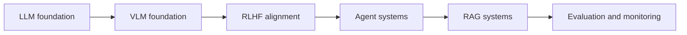

# 大模型算法工程师面试八股总览

## 当前定位

这一章吸收 `jungerhs/learn` 的 Docsify 面试笔记，将其整理成一个 **LLM / VLM / RLHF / Agent / RAG / 评估** 六段式复习地图。它不替代 GRPO、DPO、Agent、VLM 等专题页，而是用于面试前快速定位“哪些问题必须能答出结构化版本”。

> **使用方式**：每个问题都按 **一句话定义 -> 核心机制 -> 工程取舍 -> 风险或追问** 来准备。面试时不要背长文，先把回答压缩成 60 秒版本，再根据面试官追问展开。

## LLM 八股：基础结构和训练推理

| 高频问题 | 回答抓手 | 需要关联的知识页 |
|---|---|---|
| Self-Attention 如何工作？为什么比 RNN 适合长序列？ | Q/K/V、scaled dot-product、softmax 权重、并行计算、任意位置 O(1) 交互路径 | 基础知识 / 模型架构 |
| 位置编码为什么必要？ | Transformer 自注意力本身近似置换不变，需要显式注入顺序信息 | 位置编码与长上下文 |
| RoPE 相比绝对位置编码的优势是什么？ | 在 Q/K 上做旋转，注意力分数自然带相对位置信息；但长距离外推仍需 PI/NTK/YaRN 等方法 | 位置编码与长上下文 |
| MHA / MQA / GQA 区别？ | KV head 共享程度不同；核心是质量、KV Cache、吞吐之间的权衡 | 训练推理框架 / vLLM |
| Encoder-only / Decoder-only / Encoder-Decoder 怎么选？ | NLU、NLG、Seq2Seq 三类任务差异；当前通用 LLM 以 decoder-only 为主 | 基础知识 |
| Scaling Laws 对研发有什么指导？ | 参数、数据、算力存在幂律关系；Chinchilla 强调 compute-optimal 下数据与参数配比 | 训练基础 |
| 解码策略有哪些？ | greedy、beam、top-k、top-p、temperature；准确性、多样性、成本之间取舍 | 推理服务 |
| MoE 如何扩大参数但不显著增加 FLOPs？ | 用 router 将 token 路由到 top-k experts，总参数与激活参数解耦 | MoE 模型架构 |
| 训练百亿/千亿模型的挑战？ | 显存、通信、训练稳定性；3D 并行、ZeRO、BF16、梯度裁剪、warmup | 训练推理框架 |

### 面试回答模板：MHA / MQA / GQA

MHA 每个 attention head 都有独立的 Q/K/V，表达能力强，但自回归推理时 KV Cache 大。MQA 保留多个 Q head，但所有 Q head 共享一组 K/V，显著降低 KV Cache 和带宽压力，代价是表达能力可能下降。GQA 是折中：多个 Q head 分组共享 K/V，当组数等于 head 数时退化为 MHA，组数为 1 时退化为 MQA。

**追问准备**：如果面试官继续问工程意义，要落到 **长上下文推理时 KV Cache 是主要显存瓶颈，MQA/GQA 本质上是在降低每层每 token 的 K/V 存储与读取成本**。

## VLM 八股：对齐、融合和视觉幻觉

| 高频问题 | 回答抓手 | 需要关联的知识页 |
|---|---|---|
| 多模态核心挑战是什么？ | 模态鸿沟：像素连续密集，文本离散抽象；需要语义对齐和信息融合 | CV 基础模型 |
| CLIP 怎么用对比学习连接图文？ | 双编码器、共享嵌入空间、InfoNCE、batch 内正负样本 | CV 基础模型 |
| LLaVA / MiniGPT-4 怎么连接视觉编码器和 LLM？ | frozen vision encoder + connector + LLM；连接器把视觉特征转成 visual tokens | CV 基础模型 |
| 视觉指令微调为什么关键？ | 从视觉-语言对齐走向指令遵循和对话能力 | SFT / 多模态 |
| 视频相比图片多了什么难点？ | 时序建模、长依赖、帧采样、音频字幕同步、计算成本 | CV 基础模型 |
| Grounding 如何评估？ | phrase 到 bbox / mask 的定位，常用 IoU、Accuracy@threshold | CV 基础模型 |
| VLM 幻觉和 LLM 幻觉有何不同？ | VLM 常见物体幻觉、属性幻觉、关系幻觉，是视觉证据和语言先验冲突 | 评估 |

### 面试回答模板：Connector-based VLM

LLaVA 类模型通常冻结 CLIP ViT 作为视觉编码器，再用线性层或 MLP 把视觉 patch 特征映射到 LLM token embedding 空间，形成 visual tokens，与文本 token 拼接后送入 decoder-only LLM。第一阶段通常做图文对齐预训练，第二阶段做视觉指令微调。优势是复用强视觉编码器和强 LLM，训练成本低；局限是视觉信息被压缩进固定 visual tokens，细粒度定位和高分辨率图像会有信息瓶颈。

## RLHF / 偏好优化八股：从 SFT 到 RLVR

| 高频问题 | 回答抓手 | 需要关联的知识页 |
|---|---|---|
| SFT 为什么不足以对齐？ | 只能模仿示例，难表达细粒度偏好；存在 exposure bias，难覆盖巨大行为空间 | SFT |
| RLHF 三阶段是什么？ | SFT、Reward Model、PPO；输入输出和目标分别说明 | GRPO / DPO |
| 为什么 RM 用 pairwise comparison？ | 相对偏好更稳定、一致性更高；但信息效率和传递性有问题 | DPO / RLHF |
| Bradley-Terry 如何解释 RM loss？ | 用 $\sigma(r_w-r_l)$ 表示 chosen 优于 rejected 的概率 | DPO |
| PPO 为什么需要 KL？ | 约束策略不要偏离 SFT/reference 太远，避免 reward hacking 和语言能力退化 | GRPO |
| $\beta$ 太大或太小会怎样？ | 太大保守不学，太小激进作弊；看 KL、reward、人工样例和多样性 | GRPO |
| DPO 相比 PPO 的优势？ | 不显式训练 RM，不跑 RL rollout，本质是偏好数据上的直接监督优化 | DPO |
| GRPO 与 PPO 的差异？ | 用 group relative advantage 减少 value model 依赖，适合 RLVR reasoning | GRPO |
| 信用分配怎么解决？ | sequence reward 简单但稀疏；token/step reward 更细但难标；critic、GAE、PRM、树轨迹可缓解 | 多步强化学习 |

### 面试回答模板：RLHF 线上变差怎么办

如果离线 RM 分数很高，但线上回答越来越模式化、奉承、信息密度低，通常不是“模型突然坏了”，而是奖励模型偏差和 PPO 过度优化共同造成的。排查顺序是：先诊断 RM 是否偏爱模板化回答，再看 KL 是否过大、reward 是否异常上升，最后抽样人工评估多样性、事实性和信息密度。解决方式包括补充反例偏好数据、重训或校准 RM、增大 KL、加入熵奖励、early stopping，并调整线上解码策略。

## Agent 八股：系统组件、工具和安全

| 高频问题 | 回答抓手 | 需要关联的知识页 |
|---|---|---|
| Agent 和 Chatbot 区别？ | Agent 有目标、规划、工具调用、环境反馈和循环执行 | Agent 系统 |
| ReAct 如何工作？ | Thought -> Action -> Observation 循环，动态交互式 CoT | Agent 面试与实战补充 |
| CoT / ToT / GoT 有何不同？ | 线性推理、树搜索、图式合并与循环 | Agent 系统 |
| Memory 怎么设计？ | 短期记忆维持当前任务；长期记忆依赖写入、检索、过期和冲突处理 | Agent 系统 |
| Function Calling 如何让 LLM 调工具？ | 工具注册、schema、意图识别、结构化参数、执行器、结果回填 | Agent 面试与实战补充 |
| LangChain 和 LlamaIndex 怎么选？ | LangChain 偏流程编排，LlamaIndex 偏数据摄入、索引和 RAG | 训练推理框架 |
| Multi-Agent 优缺点？ | 分工、并行、冗余、多视角；但通信、协调、状态一致性和信用分配更复杂 | Agent 系统 |
| Agent 安全怎么做？ | 最小权限、工具白名单、HITL、沙箱、规则护栏、审计和红队 | Agent 面试与实战补充 |

### 面试回答模板：Agent 微调数据

Agent 微调不能只收集最终答案，而要收集 **决策轨迹**：任务、可用工具、每一步 Thought、Action、Observation、最终结果。数据来源可以是强教师模型生成、人工修正失败轨迹、真实用户日志清洗。核心目标是让模型在关键状态下学会更稳定地选择工具、修正计划和判断何时停止。

## RAG 八股：检索、生成和工程落地

| 高频问题 | 回答抓手 | 需要关联的知识页 |
|---|---|---|
| RAG 相比微调解决什么？ | 知识更新、私有知识、可追溯和减少幻觉；微调更适合行为和格式 | Agent / RAG |
| 完整 RAG pipeline？ | Load -> Split -> Embed -> Store -> Retrieve -> Rerank -> Generate | Agent 系统 |
| chunk size / overlap 怎么选？ | 语义完整性、召回精度、噪声、上下文成本之间权衡 | RAG |
| embedding 模型怎么评估？ | MTEB/C-MTEB、nDCG@k、Recall@k、MRR、STS | 评估 |
| 如何提升检索质量？ | hybrid search、rerank、multi-query、HyDE、sub-query、small-to-large、graph index | RAG |
| Lost in the Middle 怎么办？ | 重要证据放首尾、压缩上下文、减少无关 chunk、long-context rerank | RAG / 位置编码 |
| 图数据库什么时候有用？ | 多跳关系、强结构实体关系、可解释证据链 | RAG |
| 生产部署挑战？ | 数据同步、权限、延迟、成本、无答案识别、提示注入、监控 | 工程闭环 |

### 面试回答模板：RAG 和搜索系统的区别

搜索系统的目标是返回排序后的文档列表，用户自己阅读和总结；RAG 的目标是基于检索到的文档生成直接答案。搜索系统提供“源”，RAG 交付“答案”。所以 RAG 包含检索模块，但额外依赖 LLM 做综合、引用、压缩和回答生成。

## 模型评估与 Agent 评估

| 高频问题 | 回答抓手 | 面试注意点 |
|---|---|---|
| BLEU / ROUGE 为什么不够？ | 只看 n-gram，不理解语义、事实性、推理和安全 | 不能只说“过时”，要说明局限维度 |
| MMLU / Big-Bench / HumanEval 各测什么？ | 学科知识、能力边界、代码生成 | 可补充 GSM8K、ARC、HellaSwag |
| LLM-as-a-Judge 优缺点？ | 可扩展、一致、可定制；但有位置偏见、冗长偏见、自我风格偏见 | 需要人工抽检和 rubric |
| 如何评估事实性、推理、安全？ | 分别构建事实 QA、推理 benchmark、安全红队；结合 outcome 和 process | 需要区分能力定义和评估方法 |
| Agent 为什么更难评估？ | 有状态、多步、环境动态、轨迹非确定、目标开放 | 评估对象从单轮回答变成完整任务轨迹 |
| Agent 过程指标有哪些？ | 成本、延迟、步骤数、工具失败率、错误恢复、人类干预次数 | 对工程面试很重要 |
| 线上如何持续监控？ | 日志、用户反馈、代理指标、LLM-as-a-Judge 抽样、人工审计、A/B 测试 | 建立采集 -> 监控 -> 分析 -> 迭代闭环 |

### 面试回答模板：Agent 评估

评估 Agent 不能只看最终答案是否正确，还要看任务成功率、工具调用是否合理、步骤数、成本、延迟、错误恢复、是否需要人类干预、是否违反权限和安全约束。基础 LLM 评估像静态问答测试，Agent 评估更像交互式环境测试，需要可复现沙箱、程序化成功条件和完整轨迹日志。

## MoonOut 面经补充：高频追问与手撕代码

MoonOut 博客园面经把 LLM 算法岗问题按 **Transformer 架构、训练微调、RLHF、Agent、RAG、推理部署、多模态、代码手撕** 八类组织。它的价值在于把真实面试里的“追问粒度”列得更细，尤其是代码手撕部分可以直接转换为原理代码训练。

### 高频追问补充

| 方向 | 新增追问 | 推荐跳转 |
| --- | --- | --- |
| Transformer | 去掉 K 变成 QQV 会有什么问题？FFN 为什么会演变成 MoE？MoE 负载均衡 bias 怎么更新？ | [LLM 工程基础](#foundations/llm-engineering-foundations)、[MoE 架构](#knowledge/moe-architecture) |
| SFT / LoRA | 手写 SFT shift-right loss；LoRA 为什么不插在 LayerNorm 后；QLoRA 的 NF4 和 double quantization | [SFT](#knowledge/sft)、[LLM 工程基础](#foundations/llm-engineering-foundations) |
| RLHF | PPO clip、GAE、DPO、GRPO、DAPO、GSPO、KL 估计方法 | [GRPO](#knowledge/grpo)、[DPO](#knowledge/dpo)、[强化学习基础](#foundations/rl-foundations) |
| Agent | Memory 衰退、工具 fallback、多 Agent 冲突、高并发 Agent 延迟优化 | [Agent](#knowledge/agent)、[Agent 面试实战](#knowledge/agent-interview-practice) |
| RAG | Chunk 策略、增量 embedding、时间衰减、RAG + 知识图谱更新 | [Agent](#knowledge/agent) |
| 推理部署 | KV cache、Gradient Checkpointing、模型压缩、量化精度补偿、有限 GPU 上推理与微调资源调度 | [训练推理框架](#knowledge/training-inference-frameworks)、[LLM 工程基础](#foundations/llm-engineering-foundations) |
| 多模态 | CLIP、ViT、SAM、多模态组件和视觉文本对齐 | [CV 基础模型](#foundations/cv-foundation-models) |

### 必须补齐的手撕实现

这些实现已经沉淀到 [原理代码模块](#principle-code/llm-decoding-sampling)，并额外提供可编辑脚本：`content/principle-code/code/llm_handwritten_kernels.py`。

| 手撕题 | 代码条目 | 面试必须说清 |
| --- | --- | --- |
| top-k / top-p | [Top-k / Top-p sampling](#principle-code/llm-decoding-sampling) | temperature 顺序、top-p 保留越界 token、过滤 logits |
| LayerNorm / RMSNorm / SFT loss / CE | [Norm / SFT / CE](#principle-code/llm-norm-sft-ce) | 数值稳定、shift-right、ignore_index、RMSNorm 不减均值 |
| QKV / Self-Attention / MHA / RoPE | [QKV / MHA / RoPE](#principle-code/llm-attention-rope) | 维度变换、causal mask、RoPE 作用于 Q/K |
| PPO / DPO / GRPO / GAE | [RL losses and GAE](#principle-code/llm-rl-losses-gae) | ratio、clip、reference log-ratio、group advantage |
| ReAct + tool call | [ReAct tool loop](#principle-code/llm-react-tool-loop) | Thought/Action/Observation、fallback、max_steps |

## MoonOut 参考资料

- [LLM 算法岗：面试常问的 LLM 八股题目汇总](https://www.cnblogs.com/moonout/p/19702578)
- [LLM 算法岗：代码手撕题目汇总与解析](https://www.cnblogs.com/moonout/p/19722167)
- [Transformer 与模型架构原理问答](https://www.cnblogs.com/moonout/p/19702708)
- [大模型训练流程与微调技术问答](https://www.cnblogs.com/moonout/p/19705026)
- [强化学习与 RLHF 问答](https://www.cnblogs.com/moonout/p/19749191)

## 知识索引引用

| 知识点 | 主要来源 | 本页使用方式 |
|---|---|---|
| 六类面试八股总目录 | `jungerhs/learn` README 与 `_sidebar.md` | 用于确定 LLM / VLM / RLHF / Agent / RAG / 评估 六段式结构 |
| LLM 基础题：Self-Attention、RoPE、MHA/MQA/GQA、Scaling Laws、MoE、训练挑战 | `chapters/1-LLM八股.md` | 抽取为 LLM 面试高频问题表与回答模板 |
| VLM 基础题：CLIP、LLaVA、视觉指令微调、Grounding、VLM 幻觉 | `chapters/2-VLM八股.md` | 抽取为 VLM 面试高频问题表与 connector 回答模板 |
| RLHF 题：HHH、RLHF 三阶段、RM、Bradley-Terry、PPO KL、DPO、信用分配、RLAIF | `chapters/3.RLHF八股.md` | 抽取为偏好优化面试地图，并链接到 GRPO/DPO 专题 |
| Agent 题：四组件、ReAct、Planning、Memory、Function Calling、Multi-Agent、安全 | `chapters/4-Agent.md` | 与本地 Agent 面试实战补充页互相补充 |
| RAG 题：pipeline、chunk、embedding、rerank、Lost in the Middle、Graph RAG、生产部署 | `chapters/5-RAG.md` | 抽取为 RAG 面试回答框架 |
| 评估题：LLM-as-a-Judge、benchmark、Agent benchmark、红队、线上监控 | `chapters/6-模型与Agent评估.md` | 抽取为模型与 Agent 评估面试地图 |

## 参考资料

- jungerhs/learn 在线站点：`https://jungerhs.github.io/learn/#/`
- jungerhs/learn 仓库：`https://github.com/jungerhs/learn`
- LLM 八股：`https://github.com/jungerhs/learn/blob/main/chapters/1-LLM%E5%85%AB%E8%82%A1.md`
- VLM 八股：`https://github.com/jungerhs/learn/blob/main/chapters/2-VLM%E5%85%AB%E8%82%A1.md`
- RLHF 八股：`https://github.com/jungerhs/learn/blob/main/chapters/3.RLHF%E5%85%AB%E8%82%A1.md`
- Agent：`https://github.com/jungerhs/learn/blob/main/chapters/4-Agent.md`
- RAG：`https://github.com/jungerhs/learn/blob/main/chapters/5-RAG.md`
- 模型与 Agent 评估：`https://github.com/jungerhs/learn/blob/main/chapters/6-%E6%A8%A1%E5%9E%8B%E4%B8%8EAgent%E8%AF%84%E4%BC%B0.md`
