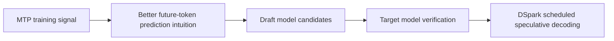
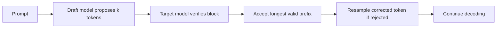
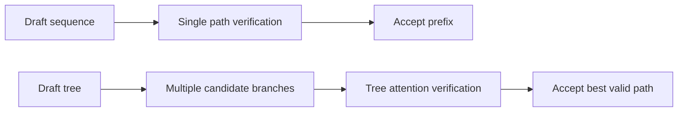

# MTP：Multi-Token Prediction

## 当前定位

MTP 是相对 next-token prediction 的训练目标扩展：在同一个位置同时预测未来多个 token。它既可作为辅助训练目标提升 sample efficiency，也和推理加速、规划能力、DeepSeek-V3 的训练目标有关。

## 核心问题

- 为什么预测多个未来 token 可能比只预测下一个 token 提供更丰富训练信号？
- MTP 的多个 prediction heads 如何共享 trunk？
- MTP 和 speculative decoding 是什么关系，哪里相同、哪里不同？
- DeepSeek-V3 为什么把 MTP 作为训练目标之一？

## 方法直觉

标准 NTP 只监督 `x[t+1]`。MTP 在同一个 hidden state 上同时预测 `x[t+1] ... x[t+n]`，让模型学习更长的局部未来结构。论文中常把它作为 auxiliary loss，不一定替代 NTP。

## 关键公式

如果第 $k$ 个 prediction head 负责预测未来第 $k$ 个 token，那么 MTP 辅助损失可以抽象成：

$$
\mathcal{L}_{MTP}
= \sum_{t=1}^{T}\sum_{k=1}^{K}
\lambda_k \cdot
\mathrm{CE}\left(y_{t+k}, p_{\theta,k}(\cdot\mid h_t)\right)
$$

这里 $h_t$ 是共享 trunk 的 hidden state，$\lambda_k$ 控制不同预测步长的权重。面试中可以进一步追问：多个 head 是否共享参数、标签如何 shift、过远未来 token 的监督是否会变噪、以及它和 speculative decoding 的边界在哪里。

## 面试关注

- MTP 不是简单“一次生成多个 token”，训练目标和推理策略要分开讲。
- MTP 可以改善代码和推理任务上的 sample efficiency，但多 token 头会增加实现复杂度。
- 和 speculative decoding 相比，MTP 的 draft/verify 关系不一定相同；MTP 更偏训练目标，speculative decoding 更偏推理算法。

## 与 DSpark / speculative decoding 的关系

DSpark: Confidence-Scheduled Speculative Decoding with Semi-Autoregressive Generation 是 DeepSeek-AI 2026 年的推理加速论文。它和 MTP **关系很大，但不等价**：

**核心结论**：投机解码不是 MTP 的定义核心，但它是 MTP 最重要的推理侧应用之一。MTP 解决“训练时如何让模型学会预测多个未来 token”；speculative decoding 解决“推理时如何用便宜候选 + 目标模型验证来减少 target forward 次数”。如果 MTP head 能稳定给出高接受率候选，它就可以成为 speculative decoding 的 drafter；但没有 speculative decoding，MTP 仍然可以作为辅助训练目标存在。

| 维度 | MTP | DSpark |
|---|---|---|
| 核心定位 | 训练目标 / 辅助头，让模型从同一 hidden state 预测未来多个 token | speculative decoding 框架，用 drafter 提候选 token，再由 target model 验证 |
| 关键问题 | 多 token 监督信号如何提升 sample efficiency 或推理能力 | 如何 draft 更长块、保持接受率、并减少 verification 浪费 |
| 主要机制 | multi-token heads、shifted labels、auxiliary loss | semi-autoregressive drafter、confidence-scheduled verification、hardware-aware scheduler |
| 与 DeepSeek 的关系 | DeepSeek-V3 中 MTP 是训练目标之一；生产里也有 MTP-1 baseline | DSpark 在 DeepSeek-V4 serving 中替代/超过 MTP-1 baseline |

**一句话结论**：MTP 更像“让模型学会预测未来多个 token”的训练机制；DSpark 更像“利用 draft + verify 加速生成”的推理系统。DSpark 论文直接把 DeepSeek 生产中的 MTP-1 作为 baseline，因此它是 MTP 复习时必须关联的推理加速延伸，但不能把 DSpark 当成 MTP 本身。



## 推理侧延伸：speculative decoding / Medusa / EAGLE

这篇公众号文章更准确地说是在讲 **speculative decoding 的直觉和工程动机**，不是在讲 MTP 训练目标本身。它适合放在 MTP 的延伸区，因为 MTP、Medusa、EAGLE、DSpark 都围绕“如何更便宜地得到未来 token 候选”展开，但它们所在层次不同。

> **面试抓手**：MTP 是训练目标；speculative decoding 是推理算法；Medusa / EAGLE 是让同一个目标模型或轻量模块产生未来候选的推理加速路线；DSpark 是更偏生产 serving 的调度与验证系统。

### 标准投机采样的流程

标准自回归解码每生成一个 token 都要做一次 target model forward。投机采样的核心是：用更便宜的 draft model 先提出一段候选 token，再让 target model 一次性验证这一段。如果多个候选 token 被接受，就相当于用接近一次 target forward 的代价推进了多个 token。



从分布角度看，draft model 只是在“提案”，最终输出仍由 target model 的分布校正。令 target 分布为 $p$，draft 分布为 $q$，对 draft 采到的 token $x$，直觉上的接受概率可以写成：

$$
a(x)=\min\left(1,\frac{p(x)}{q(x)}\right)
$$

如果 token 被拒绝，就从校正后的剩余分布中重新采样。这个 rejection sampling 设计保证最终输出分布与单独运行 target model 一致，所以 speculative decoding 常被称为 **lossless decoding acceleration**。注意这里的“无损”是分布意义上的无损，不是说每次生成文本逐字相同。

### 为什么能提速

大模型 decode 阶段常是 **memory-bound**：瓶颈主要来自权重和 KV cache 访问，而不只是矩阵计算本身。对一小段候选 token 做并行验证时，target model 的权重加载开销和生成单个 token 相近；只要接受率足够高，平均每次 target forward 推进的 token 数就会增加。

影响接受率的因素包括：

- **draft model 和 target model 的分布接近程度**：越接近，候选越容易被接受。
- **任务可预测性**：代码、格式化文本、低温度生成通常更容易被 draft 命中；开放式创作更难。
- **draft 长度**：候选越长，后缀被拒绝的概率越高，过长会带来 verification waste。
- **采样温度和策略**：temperature 越高，分布越分散，draft 更难稳定命中 target。

### 树状投机采样与 SpecInfer

普通 speculative decoding 只给一条长度为 $k$ 的候选链。如果 draft model 在几个可能分支之间不确定，一条链很容易赌错。树状投机采样的思路是让 draft 产生一棵候选树，再让 target model 验证多条分支。



**SpecInfer** 可以作为树状 speculative decoding 的代表来理解：它用 draft model 构造候选 token 树，target model 通过树结构 attention 一次验证多条可能路径。优势是覆盖更多高概率分支，劣势是实现复杂度、调度策略和验证 token 预算都更难控制。

### Medusa、EAGLE 与 MTP 的边界

**Medusa** 的做法是在 target model 上挂多个额外预测头，让模型在一次 forward 中预测未来多个 token 候选。它和 MTP 在形式上都可能出现“多 future-token head”，但目标不同：

| 方法 | 更偏训练还是推理 | 关键作用 |
|---|---|---|
| MTP | 训练目标 | 用未来多个 token 的监督增强表示学习 |
| Medusa | 推理加速 | 用额外 heads 产生 draft candidates，减少独立 draft model 依赖 |
| EAGLE | 推理加速 | 在 feature level 预测未来状态，再生成候选 token，提高接受率 |
| DSpark | 生产推理系统 | 用 semi-autoregressive drafter 与 confidence-scheduled verification 改善 serving 性能 |

**EAGLE** 进一步把候选预测前移到特征层，而不是直接在 token 层预测。面试中可以这样讲：token-level draft 更直观，但容易受离散 token 误差影响；feature-level draft 试图保留更多 target model 内部状态信息，从而提升候选质量和接受率。

### 面试 QA

**Q：投机采样为什么说是无损的？**

A：因为 draft model 只是提出候选，最终接受/拒绝由 target distribution 通过 rejection sampling 校正。只要接受规则和拒绝后的校正采样实现正确，最终生成分布等价于直接从 target model 逐 token 采样。

**Q：speculative decoding 为什么能提速？**

A：decode 常是 memory-bound。target model 一次验证多个候选 token 的权重访问成本接近一次单 token forward；如果接受率高，就能提高每次 target forward 的有效产出。

**Q：MTP 和 Medusa 是不是一回事？**

A：不是。MTP 是训练阶段的 multi-token prediction objective；Medusa 是推理阶段利用额外 future-token heads 产生候选 token 的 speculative decoding 路线。它们结构上相似，但优化目标、训练方式和使用场景不同。

**Q：接受率主要取决于什么？**

A：取决于 draft 与 target 的分布距离、任务可预测性、采样温度、draft 长度以及系统侧验证策略。接受率不是越追求长候选越好，因为长候选后缀更容易被拒绝。

## 原理代码：MTP shifted labels 与 speculative verify

下面这段代码已经沉淀到 [原理代码](#principle-code/mtp-loss) 中。面试时不需要背完整实现，但要能手写出标签 shift、multi-head CE 和 draft/verify 的最小逻辑。

```python
import torch
import torch.nn.functional as F


def build_mtp_shifted_labels(labels: torch.Tensor, num_future_tokens: int, ignore_index: int = -100):
    # labels: [batch, seq]
    # 返回 [batch, num_future_tokens, seq]
    # 第 k 个 future head 在位置 t 预测第 t+k 个 token。
    batch, seq_len = labels.shape
    shifted = labels.new_full((batch, num_future_tokens, seq_len), ignore_index)
    for k in range(1, num_future_tokens + 1):
        shifted[:, k - 1, : seq_len - k] = labels[:, k:]
    return shifted


def mtp_multi_head_loss(future_logits: torch.Tensor, labels: torch.Tensor, loss_weights=None):
    # future_logits: [batch, num_future_tokens, seq, vocab]
    batch, num_future_tokens, seq_len, vocab = future_logits.shape
    targets = build_mtp_shifted_labels(labels, num_future_tokens)
    if loss_weights is None:
        loss_weights = torch.ones(num_future_tokens, device=future_logits.device)
    loss_weights = loss_weights / loss_weights.sum().clamp_min(1e-12)

    total = 0.0
    for k in range(num_future_tokens):
        loss_k = F.cross_entropy(
            future_logits[:, k].reshape(batch * seq_len, vocab),
            targets[:, k].reshape(batch * seq_len),
            ignore_index=-100,
        )
        total = total + loss_weights[k] * loss_k
    return total
```

### 代码怎么讲

| 函数 | 解决什么 | 面试提醒 |
|---|---|---|
| `build_mtp_shifted_labels` | 把同一条 label 构造成多个 future-token target | k=1 等价于 NTP；k>1 给模型额外未来监督 |
| `mtp_multi_head_loss` | 对多个 future head 分别算 CE 再加权 | loss 权重过大可能干扰主 next-token 目标 |
| `speculative_accept_mask` | 演示 draft token 被 target token 验证的连续前缀 | 真实无损投机解码还要用概率比做 rejection sampling |

### 面试结论

- **MTP 是训练目标/模型结构能力**：让模型在同一位置预测多个未来 token。
- **Speculative decoding 是推理系统算法**：先 draft，再由 target verify。
- **MTP 可以服务 speculative decoding**，但不是唯一 draft 机制；小模型、Medusa、EAGLE、DSpark 都可以提供不同草稿路线。
- **是否加速看净收益**：接受 token 数、额外计算、KV cache、硬件利用率、服务调度都会影响最终吞吐。

## VeRL 文档补强：MTP 在 SFT/RL/推理中的真实边界

> **结论**：MTP 与投机解码关系很近，但不能简单说“MTP 就等于投机解码”。MTP 是模型训练出的多 token 预测能力；投机解码是推理阶段利用 draft/verify 机制加速生成的方法。MTP 可以作为投机解码或 rollout 加速的一种 draft 能力来源，但是否真的提速取决于模型、引擎、硬件和接受率。

### VeRL 支持边界

VeRL 的 MTP 文档给出的工程边界非常明确：

| 维度 | 结论 | 面试解释 |
|---|---|---|
| 训练引擎 | 当前 RL 训练主要支持 `mbridge/Megatron-Bridge + megatron` 组合 | MTP 不只是 loss，还涉及模型结构和并行训练后端支持 |
| 推理引擎 | 推理侧可以兼容多个引擎，但模型必须在对应引擎兼容列表中 | 能不能部署 MTP 取决于 vLLM/SGLang 等服务端是否支持对应结构 |
| 训练模式 | 可以只加载 MTP 参数、全参训练 MTP、只训 MTP 参数 | 面试要区分“带 MTP 模块”和“真正训练 MTP loss” |
| rollout 加速 | vLLM 可配置 `method="mtp"`，SGLang 可走 EAGLE 类投机配置 | 这是用 MTP 支撑 rollout inference 加速，而不是后训练算法本身 |

### MTP 配置怎么理解

| 配置 | 含义 |
|---|---|
| `enable=True` | 加载或启用 MTP 相关模块，显存会上升，导出模型可包含 MTP 参数 |
| `enable_train=True` | 训练 MTP 相关参数/损失 |
| `mtp_loss_scaling_factor=0.1` | 控制 MTP loss 对主训练目标的权重 |
| `detach_encoder=True` | 冻结主干 encoder，仅更新 MTP 模块，降低对主模型能力的扰动 |
| `enable_rollout=True` | rollout 推理阶段启用 MTP 加速逻辑 |
| `num_speculative_tokens` / `speculative_num_steps` | 控制一次尝试草稿多少 token，影响接受率和吞吐 |

### 为什么“投机解码不一定提速”

VeRL 文档给了一个很重要的工程提醒：MTP 能提高 rollout 接受率，但在某些硬件和模型组合上，总吞吐可能不升反降。例如 H20 上的某些实验里，MTP speculative decoding 的 rollout throughput 甚至下降。原因是投机解码并不是免费收益，它引入额外 draft、verify、权重同步、KV cache 和调度开销；如果硬件 tensor core 性能、模型大小、batch、接受率不匹配，就可能抵消收益。

面试表达：**MTP 提供“多 token 猜测能力”，投机解码提供“猜测后验证的系统机制”；是否加速要看 accepted tokens / extra compute / hardware utilization 三者的净收益。**

### 面试 QA

**Q：MTP 和 speculative decoding 是什么关系？**

A：MTP 是训练或结构层面的多 token 预测模块，它让模型除了 next-token 以外还能预测后续 token。Speculative decoding 是推理算法，通常先生成 draft tokens，再由目标模型验证。MTP 可以作为 draft 来源，但 speculative decoding 也可以用小模型、EAGLE 等其他 draft 机制。

**Q：为什么 RL rollout 里会关心 MTP？**

A：RL 后训练的瓶颈之一是 rollout 生成。如果 MTP 能提高一次前向可接受的 token 数，就可能降低采样成本。但 RL rollout 还涉及频繁权重更新、服务引擎同步和长上下文，因此实际收益比静态推理更难保证。

### 知识索引引用

| 知识点 | 来源 |
|---|---|
| VeRL MTP 支持范围、训练配置、rollout 加速、性能注意事项 | https://verl.readthedocs.io/en/latest/advance/mtp.html |

## 知识索引引用

| 知识点 | 主要来源 | 本页使用方式 |
|---|---|---|
| MTP 训练目标与 multi-token heads | Multi-Token Prediction 论文、DeepSeek-V3 技术报告 | 用于解释 MTP 作为辅助训练目标和 sample efficiency 信号 |
| speculative decoding / Medusa / EAGLE / SpecInfer | 投机解码相关论文与技术文章 | 用于区分“训练目标”和“推理加速算法” |
| DSpark 与 DeepSeek serving 中的 MTP-1 baseline | DSpark 论文 | 用于说明 MTP 和 speculative decoding 的生产级联系与边界 |
