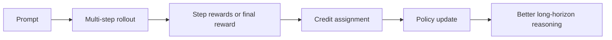
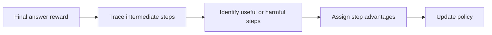
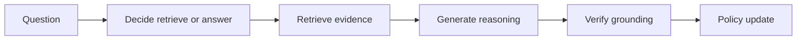
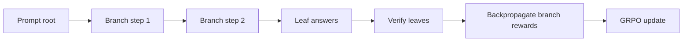
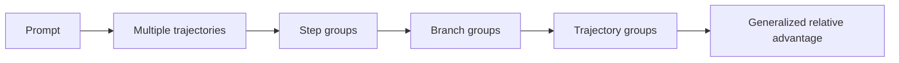

# 多步强化学习：ARPO / AEPO / RAPO / Tree-GRPO / GiGPO

## 当前定位

多步强化学习主要服务于 **长链路推理、Agentic task、数学证明、代码调试、多轮工具调用** 这类任务。和单轮偏好优化不同，多步 RL 的训练对象往往不是一条完整回答，而是一个由多个 step、action、observation、branch 组成的轨迹。

> **面试抓手**：GRPO 解决同一 prompt 下多回答的相对优势估计；多步 RL 更进一步关心 **credit assignment**：最终成功或失败应该归因到哪一步、哪条分支、哪个工具调用或哪个中间决策。

### 和 Agentic RL 的边界

多步强化学习应该放在**后训练核心**里，而不是完全并入 Agentic RL。它回答的是“长链路任务里 reward 怎么归因、优势怎么分配、分支怎么比较”；[Agentic RL 系统链路](#knowledge/agentic-rl-system)回答的是“这些方法如何落到工具调用、环境交互、trace 存储、response mask、Reward Loop 和分布式 rollout 系统里”。

| 章节 | 更关注的问题 | 面试时的定位 |
|---|---|---|
| 多步强化学习 | step / branch / trajectory 的 credit assignment 与相对优势估计 | Agentic RL 的前置方法论，不是 Agentic RL 的子集 |
| Agentic RL 系统链路 | 多轮工具轨迹如何采样、mask、打分、回放和更新 | 把多步 RL 放进可训练系统里的工程闭环 |



## 为什么需要多步 RL

单轮 RL 或偏好优化通常把完整回答当成一个整体：

$$
R(y \mid x)
$$

但复杂推理更像轨迹：

$$
\tau = (s_0, a_0, o_0, s_1, a_1, o_1, \ldots, s_T)
$$

最终 reward 可能只告诉你“答案对了”：

$$
R(\tau) \in \{0,1\}
$$

难点是：如果最后错了，是因为计划错、检索错、工具调用错、某一步代数推导错，还是最后格式错？这就是 credit assignment。

## 总览画像

| 方法 | 关注点 | 典型对象 | 和 GRPO 的关系 | 主要风险 |
|---|---|---|---|---|
| ARPO | 动态/自适应奖励或优势优化 | 多步 reasoning、偏好强度、难例 | 可作为 GRPO 的 reward/advantage 改造方向 | 缩写撞名，需要确认论文定义 |
| AEPO | entropy-aware / entropy-policy optimization 相关 | 探索-利用平衡、熵正则、分布校准 | 可用于控制策略更新保守程度 | 至少有两条 AEPO 命名线 |
| RAPO | retrieval/role/reasoning aware policy optimization | RAG、Agent、角色化多步任务 | 把外部证据或角色过程纳入 RL | RAPO 命名撞名明显 |
| Tree-GRPO | 树状 rollout 上的 GRPO | 多分支推理、search tree | 从“答案组”扩展到“推理树分支组” | 树展开成本高 |
| GiGPO | group / graph / generalized process optimization | 图结构、多粒度 trajectory | 从 group relative advantage 扩展到更复杂结构 | 需结合具体论文定义 |

> **证据边界**：截至 2026-06-29，这些缩写在论文和社区资料中存在撞名或快速演进。本章先建立面试知识框架，后续每篇论文精读后再把定义锁死到对应论文卡片。

## 从 GRPO 到多步 RL

GRPO 的基本直觉是：同一 prompt 采样多个回答，用组内 reward 做相对优势：

$$
A_i = \frac{r_i - \mathrm{mean}(r)}{\mathrm{std}(r) + \epsilon}
$$

多步任务里，回答不再只是 $y_i$，而是轨迹 $\tau_i$。如果只有最终 reward：

$$
A(\tau_i)=\frac{R(\tau_i)-\mathrm{mean}(R)}{\mathrm{std}(R)+\epsilon}
$$

这仍然是 trajectory-level advantage。更进一步，可以把 reward 分摊到 step：

$$
A_{i,t}=f(R(\tau_i), r_{i,t}, V(s_{i,t}), \mathrm{branch\ group})
$$

这时训练信号就从“整条回答好不好”变成“哪一步值得强化”。

## credit assignment

credit assignment 是多步 RL 的核心。常见做法有四类：

| 方法 | 思路 | 适用场景 | 风险 |
|---|---|---|---|
| Final reward broadcast | 把最终 reward 分给所有 step | 只有最终 verifier 时 | 错误归因粗糙 |
| Step reward model | 每一步由 PRM / verifier 打分 | 数学、代码、工具调用 | 标注或 verifier 成本高 |
| Outcome-to-process decomposition | 用模型或规则推断关键错误 step | 证明、长推理 | 解释可能不可靠 |
| Tree / graph backup | 分支节点根据子树结果回传价值 | 多分支搜索 | 展开和存储成本高 |



**面试结论**：多步 RL 的难点不是写一个 PPO/GRPO loss，而是构造可信的 step-level 或 branch-level credit signal。Agent 多轮工具场景的系统化拆解见 [Agentic RL 系统链路](#knowledge/agentic-rl-system)。

## ARPO

ARPO 这类方法通常可以从 **adaptive reward / advantage / regularized policy optimization** 的角度理解：在多步推理中，不同样本难度、不同 step 的不确定性和不同 reward 可信度不同，训练信号不应一刀切。

可以抽象成：

$$
\mathcal{L}_{ARPO}
=
-\mathbb{E}
\left[
w(x,\tau,t)
A_{t}
\log \pi_\theta(a_t \mid s_t)
\right]
$$

其中 $w(x,\tau,t)$ 可以表示难度权重、奖励置信度、step 重要性或自适应裁剪强度。

**面试表达**：

- ARPO 类方法的核心价值是让策略更新对难例、长链路或不确定 reward 更敏感。
- 如果论文里的 A 指 adaptive，要重点讲 sample/step weighting。
- 如果论文里的 A 指 adversarial/answer-aware，要回到具体定义，不要泛化乱讲。

## AEPO

AEPO 存在明显命名撞名。本章先记录两种常见理解：

1. **Adaptive Entropy Policy Optimization**：强调根据策略熵自适应调节探索。
2. **Arbitrary Entropy Policy Optimization**：强调更一般的 entropy regularization 形式。

多步 RL 中，entropy 的意义是：如果模型过早塌缩到单一路径，会降低探索；如果熵太高，又会生成大量低质量分支。

抽象目标可以写成：

$$
\mathcal{J}(\theta)
=
\mathbb{E}_{\tau \sim \pi_\theta}
\left[
R(\tau)
+ \alpha \mathcal{H}(\pi_\theta(\cdot \mid s_t))
\right]
$$

**面试表达**：

- AEPO 类方法通常关心探索-利用平衡。
- 在 reasoning RL 中，熵太低会导致路径单一，熵太高会浪费 rollout budget。
- 真正回答时要先说明具体论文的 AEPO 定义，因为缩写不唯一。

## RAPO

RAPO 也存在多种命名。常见可能包括：

- **Retrieval-Augmented Policy Optimization**：把检索证据纳入 policy optimization。
- **Role-Aware Policy Optimization**：多角色 Agent 或对话任务里，不同角色使用不同 reward/constraint。
- **Reasoning-Aware Policy Optimization**：更强调过程推理质量。

如果按 Retrieval-Augmented 理解，RAPO 的关键是让模型不仅优化最终回答，还优化 **何时检索、检索什么、如何使用证据**。



可能的 reward 组成：

$$
R
=
R_{answer}
+ \lambda_1 R_{grounding}
- \lambda_2 C_{retrieval}
- \lambda_3 R_{hallucination}
$$

**面试表达**：

- RAPO 类方法适合 RAG/Agent 场景，因为 action 不只是 token 生成，还包括 retrieve、tool call、role response。
- 关键不是“加检索”本身，而是把检索质量、证据使用和最终答案统一到 policy objective。

## Tree-GRPO

Tree-GRPO 可以理解为把 GRPO 的“同 prompt 多回答组”扩展到“同 prompt 多分支推理树”。每个节点代表一个中间 reasoning state，每条边是一次 step/action，每条 root-to-leaf 路径是一条候选解法。



普通 GRPO 的 group 是：

$$
\{y_1, y_2, \ldots, y_G\}
$$

Tree-GRPO 的 group 可以是同一节点下的 sibling branches：

$$
\{a_{t}^{(1)}, a_{t}^{(2)}, \ldots, a_{t}^{(K)} \mid s_t\}
$$

于是 advantage 可以在同一节点的兄弟分支内归一化：

$$
A_{t}^{(j)}
=
\frac{R(\mathrm{subtree}_{j})-\mathrm{mean}_{k}R(\mathrm{subtree}_{k})}
{\mathrm{std}_{k}R(\mathrm{subtree}_{k})+\epsilon}
$$

**优势**：

- 更适合多分支推理、搜索、proof、code repair。
- 能发现“哪一步分支选择”导致最终成功。
- 与 Tree of Thoughts / MCTS / self-consistency 有自然联系。

**局限**：

- rollout 成本高，树宽和树深都受预算限制。
- branch reward 可能稀疏，需要 verifier 或 PRM 支持。
- 多分支数据结构比普通 response batch 难管理。

## GiGPO

GiGPO 可以先按 **Generalized / Graph-induced / Group-in-Group Policy Optimization** 这类方向建立理解：它试图把 GRPO 的 group 相对优势，从平铺 answer group 推广到更复杂的 **层级组、图结构或多粒度过程**。



一个通用抽象是：

$$
A(u)
=
\frac{R(u)-\mu_{\mathcal{G}(u)}}{\sigma_{\mathcal{G}(u)}+\epsilon}
$$

其中 $u$ 可以是 token、step、branch 或 trajectory，$\mathcal{G}(u)$ 是它所在的比较组。

**面试表达**：

- GiGPO 类方法关注“比较组怎么定义”：同 prompt、同 step、同节点兄弟分支、同工具调用类型、同难度 bucket。
- 它的价值是让 reward normalization 更贴合多步结构。
- 需要具体论文确认 G/i/G 的精确定义，当前先把它作为 GRPO 结构化扩展来理解。

## 与 PPO / GRPO / DPO 的关系

| 方法 | 数据来源 | 训练粒度 | 是否在线采样 | 适合问题 |
|---|---|---|---|---|
| DPO | 离线 chosen/rejected | response pair | 否 | 风格偏好、低成本对齐 |
| PPO | 在线 rollout + reward/value | token/trajectory | 是 | 一般 RLHF |
| GRPO | 同 prompt 多回答 + reward | response group | 是 | reasoning RL、无需 critic |
| 多步 RL | 多 step / tool / branch trajectory | step / branch / trajectory | 通常是 | 长链路推理、Agent、搜索 |
| Tree-GRPO / GiGPO | 树/图/层级组 rollout | branch/group/process | 是 | 多分支探索和 credit assignment |

## 工程实现关注点

| 组件 | 要解决什么 |
|---|---|
| Rollout engine | 支持多步生成、工具调用、分支展开、状态保存 |
| Verifier / PRM | 给最终答案或中间步骤打分 |
| Trace schema | 保存 prompt、step、action、observation、reward、branch id |
| Credit assignment | 把最终 reward 分配到 step/branch |
| Advantage normalization | 按 prompt、step、branch group 或 difficulty bucket 归一化 |
| Budget controller | 控制树宽、树深、工具调用次数和总 token 成本 |
| Replay/debug | 能复盘为什么某条轨迹得高分或低分 |

## 代码理解：多步 trajectory schema

```python
from dataclasses import dataclass, field
from typing import Any


@dataclass
class Step:
    state: str
    action: str
    observation: str | None = None
    reward: float | None = None
    metadata: dict[str, Any] = field(default_factory=dict)


@dataclass
class Trajectory:
    prompt: str
    steps: list[Step]
    final_answer: str
    final_reward: float
```

## 代码理解：从 final reward 回传 step advantage

```python
def broadcast_final_reward(trajectories: list[Trajectory], eps: float = 1e-8) -> list[list[float]]:
    rewards = [traj.final_reward for traj in trajectories]
    mean = sum(rewards) / len(rewards)
    var = sum((r - mean) ** 2 for r in rewards) / len(rewards)
    std = (var + eps) ** 0.5
    trajectory_advantages = [(r - mean) / std for r in rewards]
    return [[adv] * len(traj.steps) for traj, adv in zip(trajectories, trajectory_advantages)]
```

这只是最粗糙的 credit assignment。真实多步 RL 会进一步引入 step reward、verifier、PRM、树搜索回传或 value estimation。

## 面试 QA

**Q：多步 RL 和普通 GRPO 最大区别是什么？**

A：GRPO 通常比较同一 prompt 下多个完整回答；多步 RL 还要处理轨迹内部的 step、branch、tool call 和 observation，核心难点是 credit assignment。

**Q：为什么只用最终 reward 不够？**

A：最终 reward 只能告诉你整条轨迹好坏，不能告诉你哪一步导致成功或失败。长链路任务中，粗暴广播最终 reward 会带来错误归因。

**Q：Tree-GRPO 适合什么场景？**

A：适合多分支推理、数学证明、代码修复、搜索式 Agent。它可以在同一节点的多个分支之间做相对优势估计。

**Q：RAPO 如果按 Retrieval-Augmented 理解，核心优化目标是什么？**

A：不只是优化最终答案，还要优化何时检索、检索什么、证据是否被正确使用，以及幻觉和检索成本。

**Q：AEPO 为什么和 entropy 有关？**

A：多步推理需要探索不同路径，但探索过强会浪费 rollout budget。entropy regularization 用来控制策略分布不要过早塌缩，也不要过度发散。

**Q：GiGPO 可以怎么理解？**

A：可以理解为把 GRPO 的 group relative advantage 推广到更复杂的组结构，如 step group、branch group、trajectory group 或 graph group。

**Q：多步 RL 工程落地最容易出什么 bug？**

A：trace schema 不完整、reward 和 step 对不齐、branch id 混乱、工具 observation 被污染、advantage 归一化组定义错误、verifier 不稳定。

## 后续补全计划

- 对 ARPO、AEPO、RAPO、Tree-GRPO、GiGPO 分别建立论文精读卡，锁定各自精确定义。
- 增加 tree rollout 数据结构与 sibling advantage normalization 的代码 demo。
- 增加 PRM / ORM / verifier reward 的对比章节。
- 把多步 RL 与 Agent 工具调用、RAG、Memory 的训练闭环打通。

## 参考资料与检索入口

- DeepSeek-R1 / GRPO 相关论文和本地 GRPO 章节。
- Tree of Thoughts: Deliberate Problem Solving with Large Language Models, arXiv:2305.10601。
- Reflexion: Language Agents with Verbal Reinforcement Learning, arXiv:2303.11366。
- Self-RAG: Learning to Retrieve, Generate, and Critique through Self-Reflection, arXiv:2310.11511。
- ARPO / AEPO / RAPO / Tree-GRPO / GiGPO：当前先作为快速演进论文线保留，后续需要按具体论文 PDF 精读后把缩写定义固定下来。
