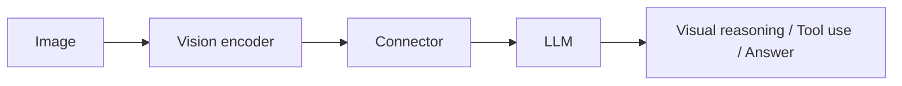
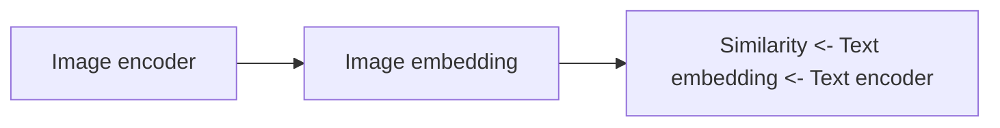
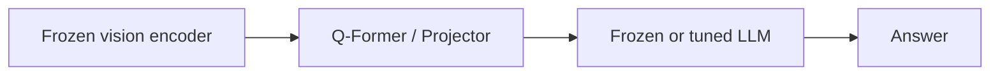
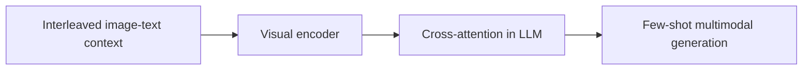
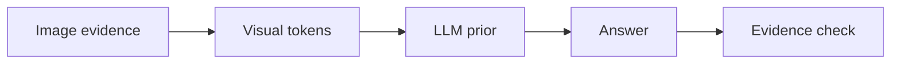
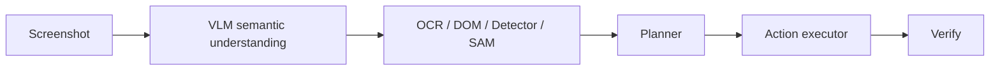

# 多模态大模型与 VLM：CLIP / BLIP-2 / LLaVA / Flamingo / Qwen-VL

## 当前定位

VLM（Vision-Language Model）不是“给 LLM 加一张图”这么简单。它要解决的是：**视觉信号如何压缩成可被语言模型理解的 token，图文语义如何对齐，模型如何从看图描述升级到视觉指令推理，以及如何减少视觉幻觉和定位错误。**

面试中可以把 VLM 拆成四层：

| 层次 | 核心问题 | 典型技术 |
|---|---|---|
| 视觉表征 | 图像如何变成 token/embedding | ViT、CLIP ViT、DINOv2、SigLIP、EVA |
| 模态连接 | 视觉特征如何接入 LLM | Linear/MLP projector、Q-Former、Perceiver Resampler、cross-attention |
| 指令对齐 | 模型如何按人类指令理解图像 | image-text pretraining、visual instruction tuning、SFT、偏好对齐 |
| 可靠性 | 如何减少幻觉、OCR 错误、定位失败 | grounding、OCR、SAM/检测工具、评测、RAG/证据约束 |

## VLM 的三类主流架构

### 1. Dual Encoder：CLIP 类

CLIP 类模型用 image encoder 和 text encoder 分别编码，再通过对比学习对齐语义空间。它适合检索、zero-shot 分类、图文相似度评分，但不直接生成长回答。

**适合**：图文检索、数据过滤、zero-shot 分类、图像 embedding。

**不适合**：复杂视觉问答、多轮对话、区域级推理、工具调用。

### 2. Frozen Encoder + Connector + LLM：BLIP-2 / LLaVA 类

这类模型通常冻结或部分冻结视觉 encoder 和 LLM，中间训练一个 connector，把视觉 token 映射到 LLM 可接收的 hidden space。

| 模型 | 连接方式 | 核心思想 |
|---|---|---|
| BLIP-2 | Q-Former | 用少量 learnable queries 从 frozen image encoder 抽取视觉信息，再连接 frozen LLM |
| LLaVA | MLP projector | 用视觉指令数据把 CLIP ViT 特征映射进 LLaMA 类 LLM |
| MiniGPT-4 | Linear projection | 类似把视觉特征接入 Vicuna，强调视觉对话能力 |
| Qwen-VL / InternVL 类 | 强视觉 encoder + LLM + 多阶段训练 | 更系统地覆盖 OCR、定位、图文理解、多语言和指令能力 |

**面试结论**：connector 的价值是减少训练成本和模态差异。它不只是线性层，而是在决定“视觉信息以什么粒度、多少 token、什么语义形式进入 LLM”。

### 3. Cross-Attention / Interleaved Multimodal：Flamingo 类

Flamingo 类模型支持图文交错输入，在 LLM 中插入 cross-attention，让语言 token 能访问视觉特征。它更适合 few-shot、多图、多轮上下文，但结构和训练复杂度更高。

## 视觉指令微调为什么关键

CLIP/BLIP 类预训练让模型“看懂图文匹配”，但不等于会按人类指令回答。视觉指令微调把任务转成对话格式，例如：

- 图像描述：这张图里发生了什么？
- VQA：图中红色车旁边是什么？
- OCR：图中文字写了什么？
- Reasoning：根据图表数据判断哪个方案更优。
- Grounding：指出图中某个目标的位置。

LLaVA 的核心贡献之一就是用 GPT-4 等强模型生成视觉指令数据，把 image-caption/pair 数据转成更接近对话和问答的训练样本。

### 训练阶段拆解

| 阶段 | 训练对象 | 目标 |
|---|---|---|
| 图文预训练 | vision encoder / connector | 建立视觉和文本语义对齐 |
| projector 预训练 | connector | 让视觉 token 落到 LLM hidden space |
| 视觉指令 SFT | connector + LLM 部分参数 | 学会按照自然语言指令使用视觉信息 |
| 多模态偏好对齐 | VLM policy | 降低幻觉，改善回答风格和安全性 |
| 多模态 RL/RLVR | VLM policy + verifier | 强化 OCR、图表、定位、工具使用等可验证能力 |

## VLM 的常见能力边界

| 能力 | 常见表现 | 风险 |
|---|---|---|
| 图像描述 | 能抓主体和场景 | 容易忽略细节或编造不存在物体 |
| VQA | 能回答显著目标问题 | 空间关系、计数、遮挡容易错 |
| OCR | 能读清晰大字 | 小字、手写、复杂版面错误率高 |
| 图表理解 | 能解释趋势 | 数值精确性、坐标轴、单位容易错 |
| Grounding | 能粗定位目标 | box/mask 精度不足，语言短语和区域对应不稳 |
| 多图比较 | 能比较差异 | 容易混淆图像顺序和细节 |
| GUI/Web Agent | 能理解截图布局 | 需要 DOM/Accessibility/OCR/坐标工具辅助 |

**面试抓手**：VLM 幻觉比纯 LLM 幻觉多一层来源：除了语言模型会编，视觉 encoder/connector 也可能丢信息、错对齐、错定位。

## 视觉幻觉怎么分析

| 幻觉来源 | 例子 | 缓解方式 |
|---|---|---|
| 视觉信息丢失 | 小字、远处目标、遮挡物体没被编码 | 高分辨率切图、OCR、区域 crop、视觉 token 增强 |
| 语义先验过强 | 看到厨房就说有冰箱，但图里没有 | 要求引用图像证据，做 object grounding |
| connector 对齐不足 | 图像 token 与语言 token 语义错位 | 更高质量图文对齐、视觉指令微调、偏好数据 |
| 评测目标不准 | 只看最终自然语言，不检查区域证据 | VQA + grounding + OCR + citation 多维评测 |
| 多轮上下文污染 | 前一轮错误描述影响后续回答 | 每轮重新绑定视觉证据，维护 visual state |

## VLM 与 Agent 的关系

在 GUI Agent、Web Agent 和多模态工具调用中，VLM 通常不应该单独完成所有事情。更稳的系统是：

| 模块 | 作用 |
|---|---|
| VLM | 理解页面大意、任务目标、视觉布局 |
| OCR | 提供精确文字证据 |
| DOM / Accessibility Tree | 提供控件层级和可点击元素 |
| Grounding / Detection | 把语言目标映射到坐标或区域 |
| SAM / Segmentation | 精细区域分割，辅助编辑、选区、元素识别 |
| Planner / Executor | 决策下一步动作并执行 |
| Verifier | 检查页面是否真的到达目标状态 |

**面试结论**：GUI Agent 不能只靠截图 VLM，因为点击坐标、控件状态、网络加载和权限边界都需要结构化工具验证。VLM 适合做语义理解和候选区域提示，执行层最好结合 DOM、OCR、检测和状态校验。

## 多模态评测体系

| 能力 | 常见 benchmark | 看什么 |
|---|---|---|
| 通用 VQA | VQAv2、GQA、MMBench | 常识、视觉问答、鲁棒性 |
| 学科推理 | MMMU、MathVista、ScienceQA | 图表、数学、科学题推理 |
| OCR / 文档 | TextVQA、OCRBench、DocVQA | 文字识别、版面理解、文档问答 |
| Grounding | RefCOCO、Visual7W、区域定位任务 | 文本短语到区域的对齐 |
| 幻觉 | POPE、CHAIR 类指标 | 是否编造不存在对象 |
| 多模态 Agent | GUI/Web task success rate | 任务成功率、步骤数、工具错误、可恢复性 |

评测时不要只看总分：要按 OCR、图表、空间关系、计数、长图、多图、中文、多轮等能力切片，否则很难定位 VLM 到底短板在哪里。

## 面试 QA

**Q：CLIP 和 LLaVA 的核心区别是什么？**

A：CLIP 是双塔图文对齐模型，主要输出图像/文本 embedding，适合检索和 zero-shot 分类；LLaVA 是视觉指令模型，把视觉 encoder 特征通过 projector 接入 LLM，能生成自然语言回答和进行多轮视觉问答。

**Q：BLIP-2 的 Q-Former 解决什么问题？**

A：Q-Former 用少量 learnable query 从 frozen image encoder 中抽取与语言相关的视觉信息，把大量视觉 token 压缩成更适合 LLM 接收的表示，从而降低连接大视觉模型和大语言模型的训练成本。

**Q：为什么 VLM 容易出现视觉幻觉？**

A：因为视觉信息经过 encoder 和 connector 会被压缩，细节可能丢失；LLM 又有强语言先验，可能根据常识补全不存在内容。再加上训练数据中 caption 常常不完整，模型容易学到“合理但不真实”的描述。

**Q：如何提升 VLM 的 OCR 能力？**

A：可以从三层做：数据层加入高质量文档/截图/OCR 标注；模型层提高分辨率、切图、多尺度视觉 token；系统层接入专门 OCR 工具，并在回答中引用识别结果。

**Q：VLM 和多模态 RAG 怎么结合？**

A：先用 OCR、layout parser、image caption、region detector 把图像内容结构化，再建立文本/视觉索引。查询时检索相关文本片段、区域或图像，再把证据放入 VLM/LLM 上下文生成答案。

**Q：多模态 RLVR 可以做什么？**

A：适合可验证任务，如 OCR 答案、图表数值、几何题、GUI 任务完成率、代码视觉题等。关键是 verifier 要能可靠判断输出，否则 RL 会放大奖励漏洞。

## 与 VLA 的连接

当 VLM 从“回答图像问题”走向“根据视觉和语言目标采取动作”时，就进入 VLA（Vision-Language-Action）问题域。VLA 复用 VLM 的视觉语言对齐能力，但额外要求动作表示、动态感知、3D 空间、闭环评估和安全约束。

> **学习跳转**：如果已经理解 CLIP / BLIP-2 / LLaVA / Qwen-VL 的 backbone 和 connector，可以继续阅读 [VLA：视觉-语言-动作与自动驾驶/具身智能](#knowledge/vla-embodied-driving)，重点看动作输出、自动驾驶幻觉、3D 空间和开闭环评估。

## 知识索引引用

| 知识点 | 来源 | 本页使用方式 |
|---|---|---|
| CLIP 图文对齐与 zero-shot | https://arxiv.org/abs/2103.00020 | 解释 dual encoder、对比学习、zero-shot 与局限 |
| BLIP-2 Q-Former | https://arxiv.org/abs/2301.12597 | 解释 frozen vision encoder 和 frozen LLM 之间的 query connector |
| LLaVA 视觉指令微调 | https://arxiv.org/abs/2304.08485 | 解释 visual instruction tuning 和 projector-based VLM |
| Flamingo 交错图文与 cross-attention | https://arxiv.org/abs/2204.14198 | 解释 few-shot multimodal generation 与 cross-attention 连接 |
| SAM promptable segmentation | https://arxiv.org/abs/2304.02643 | 解释分割工具如何补充 VLM grounding 能力 |
| Grounding DINO open-set detection | https://arxiv.org/abs/2303.05499 | 解释语言条件检测与区域定位 |
| jungerhs LLM/VLM/Agent 面试笔记 | https://jungerhs.github.io/learn/#/ | 用作 VLM 面试问题索引和复习入口 |
| WDN LLM 面经站点 | https://wdndev.github.io/llm_interview_note/#/ | 用作多模态与大模型面试题补充入口 |
| AgentGuide 面试目录 | https://github.com/adongwanai/AgentGuide/tree/main/docs/04-interview | 用作 Agent/VLM 系统面试题扩展入口 |
| Hello-Agents Extra-Chapter | https://github.com/datawhalechina/hello-agents/tree/main/Extra-Chapter | 用作 GUI/Web Agent、多模态 Agent 实战补充入口 |
