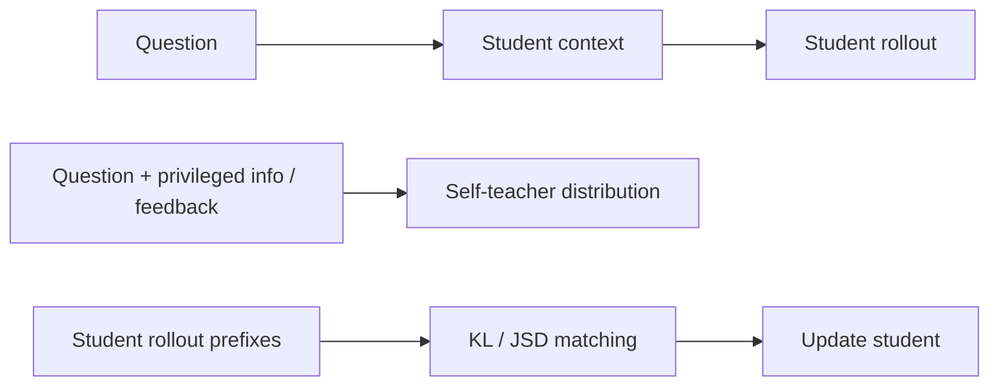
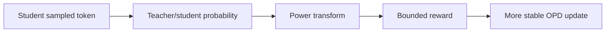
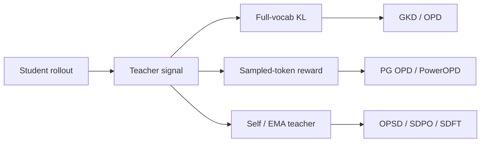

# OPD / On-Policy Distillation：从离线蒸馏到自蒸馏后训练

## 当前定位

OPD（On-Policy Distillation）是一类把 **on-policy 采样** 和 **teacher 的密集 token 监督** 结合起来的后训练方法。它不像普通 SFT / off-policy 蒸馏那样只在固定数据分布上学习，也不像 GRPO / RLVR 那样主要依赖稀疏 scalar reward，而是让 student 在自己当前策略下 rollout，再让 teacher 在这些 student prefix 上给出分布级或 token 级监督。

### 阅读前置：先理解知识蒸馏，再看 OPD

OPD 默认读者已经理解 [知识蒸馏](#knowledge/distillation) 中的 teacher/student 分布、Forward KL、Reverse KL、JSD、full-vocab / top-k / sampled-token teacher signal。OPD 的新增点不是“又一个蒸馏 loss”，而是把监督位置从固定数据分布移动到 student 自己采样出来的 prefix 上，再讨论 teacher 信号如何进入 KL loss 或 policy-gradient reward。

| 前置概念 | 在 OPD 中怎么被使用 |
|---|---|
| Forward KL / Reverse KL / JSD | 决定 mode-covering、mode-seeking 或折中行为 |
| top-k / sampled-token teacher signal | 决定显存、通信成本和梯度方差 |
| teacher stability | 决定 frozen teacher、EMA teacher、trust-region teacher 或 self-teacher 的选择 |

```archify
OPD / KL Distillation Loop|assets/diagrams/html/opd-distillation-loop.html
```

> **面试抓手**：OPD 的一句话总结是：**学生真实会走到哪里，就在哪里让老师给密集监督**。它试图同时获得 RL 的 on-policy 分布真实性，以及蒸馏的低方差、高信息密度监督。

## 一、核心问题与数学视角

### 为什么需要 OPD

| 方法 | 采样分布 | 监督信号 | 主要优点 | 主要问题 |
|---|---|---|---|---|
| SFT / 离线蒸馏 | 固定数据或 teacher 轨迹 | token-level label / soft label | 稳定、便宜、信息密 | off-policy，训练和推理 prefix 不一致 |
| RLHF / RLVR / GRPO | 当前 student 策略 | scalar reward / group advantage | on-policy，直接优化任务结果 | reward 稀疏、高方差、credit assignment 粗 |
| OPD | 当前 student 策略 | teacher token distribution | on-policy + dense supervision | teacher 成本高，teacher 构造和稳定性难 |
| OPSD / SDPO / SDFT | 当前 student 策略 | self-teacher / feedback teacher | 不依赖外部大 teacher，可结合反馈 | 依赖模型 ICL/反思能力，teacher 质量不稳定 |

OPD 解决的不是“有没有老师”，而是 **老师应该在哪些状态上教学生**。如果只在 teacher 自己写出的轨迹上教，学生推理时一旦走偏，就会进入训练时没见过的 prefix；OPD 直接在 student 自己采到的 prefix 上监督，能缓解 exposure bias 和 train-test distribution mismatch。

### 数学视角

设 student 为 $\pi_\theta$，teacher 为 $\pi_T$，输入为 $x$，student 采样得到 $y \sim \pi_\theta(\cdot \mid x)$。一个常见的 OPD 目标是：

$$
\mathcal{L}_{\text{OPD}}(\theta)
=
\mathbb{E}_{x\sim\mathcal{D},\,y\sim\pi_\theta(\cdot\mid x)}
\left[
\sum_{t=1}^{|y|}
D\left(
\pi_T(\cdot\mid x,y_{<t})
\,\|\,
\pi_\theta(\cdot\mid x,y_{<t})
\right)
\right].
$$

这里的关键不是公式本身，而是两个分布来源不同：

- **prefix 来自 student**：训练覆盖 student 推理时真实会访问的状态。
- **监督来自 teacher**：每个 token 位置可以获得比 scalar reward 更密集的学习信号。
- **散度可以变化**：Forward KL、Reverse KL、JSD、generalized JSD 会带来不同的 mode-covering / mode-seeking 行为。

### Forward KL / Reverse KL / JSD 怎么讲

| 散度 | 直觉 | 行为倾向 | 适用场景 |
|---|---|---|---|
| Forward KL：$D_{KL}(P\|Q)$ | 让 student 覆盖 teacher 高概率区域 | mode-covering，少漏主模态 | 摘要、翻译、多答案覆盖任务 |
| Reverse KL：$D_{KL}(Q\|P)$ | 惩罚 student 去 teacher 低概率区域 | mode-seeking，收缩到高置信峰 | 数学、代码、正确解窄峰任务 |
| JSD / generalized JSD | 在两者之间折中 | 更稳定、可调 | 希望兼顾覆盖和保守的任务 |

**面试结论**：推理任务通常更重视“不要走到明显错误的低概率区域”，所以 reverse KL 或偏 reverse 的 generalized JSD 更常被拿来解释；但如果 student 和 teacher 支持集重叠很差，reverse KL 也救不了，需要先做领域 SFT / mid-training / 数据筛选。

### 梯度分解：为什么 OPD 像 RL

对于一般目标：

$$
\mathcal{L}(\theta)=\mathbb{E}_{y\sim q_\theta}[f_\theta(y)],
$$

梯度可分解为：

$$
\nabla_\theta \mathcal{L}
=
\mathbb{E}_{y\sim q_\theta}[\nabla_\theta f_\theta(y)]
+
\mathbb{E}_{y\sim q_\theta}[f_\theta(y)\nabla_\theta\log q_\theta(y)].
$$

第一项是直接梯度项，第二项是 score function / policy gradient 项。很多工程实现会把采样到的 student rollout 当成固定数据，只优化直接 KL 项，这样会有 bias，但方差更低、更稳定；MiniLLM 一类 sequence-level reverse KL 更接近保留完整策略梯度，目标更忠实但训练更难。

## 二、OPD / Self-Distillation 方法族

### OPD / OPSD / SDPO / SDFT 方法族

| 方法 | Teacher 来源 | 额外信息 | 关键点 | 面试表述 |
|---|---|---|---|---|
| OPD | 外部强 teacher | teacher logits / distribution | student rollout 上做分布匹配 | 外部 teacher 提供密集 token 信号 |
| OPSD | student 自身的另一种条件化版本 | ground-truth answer / reference reasoning | 同一个模型扮演 teacher 和 student | 不需要外部大 teacher，依赖模型 rationalization 能力 |
| SDPO | 当前模型 conditioned on feedback | rich feedback、环境反馈、测试错误 | 把反馈转成 self-teacher 分布 | 解决 RLVR scalar reward 信息瓶颈 |
| SDFT | 当前模型 conditioned on demonstration | expert demonstration | 从 demonstration 构造 on-policy 学习信号 | 缓解 SFT 的 off-policy 遗忘问题 |
| GKD | 外部 teacher 或广义 teacher | on-policy / mixed data | 统一 KL/JSD 蒸馏视角 | 稳健、可调，但要选散度和采样策略 |
| MiniLLM | teacher sequence distribution | sequence-level signal | reverse KL + policy gradient 视角 | 目标更忠实，训练更高方差 |
| PowerOPD | 外部 teacher | sampled-token probability | 修复 log-ratio reward 无界 | 保留 sampled-token 效率，降低极端 token 冲击 |

### 七篇 Self-Distillation / OPD 论文线怎么归纳

青稞的 OPD/Self-Distillation 综述给出的最大启发是：OPD 不是单篇论文的名字，而是一条把 **SFT 的稠密监督** 和 **RL 的 on-policy 状态分布** 合并起来的方法线。面试时可以按“训练分布、教师来源、梯度路径、稳定化手段”四个维度归纳。

| 论文线 / 方法线 | 核心问题 | 训练信号 | 面试抓手 |
|---|---|---|---|
| GKD / generalized KD | 离线 KD 和 on-policy KD 如何统一 | KL / generalized JSD | `lambda` 控制学生采样比例，`beta` 控制散度形态 |
| MiniLLM / sequence-level reverse KL | 如何让小模型更贴近大模型高概率模式 | sequence-level reverse KL | reverse KL 更 mode-seeking，但支持集重叠很重要 |
| RL via Self-Distillation / SDPO | RLVR 的 scalar reward 太稀疏 | feedback-conditioned self-teacher | 把 rich feedback 转成 dense token signal |
| Self-Distillation Enables Continual Learning / SDFT | SFT / continual learning 容易遗忘 | demonstration-conditioned self-teacher | 用自蒸馏缓解灾难遗忘，而不是只靠 replay |
| Self-Distilled Reasoner / OPSD | 没有外部大 teacher 时怎么办 | privileged-information self-teacher | teacher 看到答案/反馈，student 只看到问题 |
| G-OPD / reward extrapolation | teacher 是否只能被模仿 | 外推式 teacher reward | 尝试让学生不只是追 teacher，而是利用反馈超过 teacher |
| PowerOPD | sampled-token log-ratio reward 无界 | bounded power reward | 修 sampled-token OPD 的极端 reward 病理 |

**面试结论**：OPD 的价值不是“又一种蒸馏 loss”，而是把监督位置从固定数据分布搬到 student 自己会访问的 prefix 上；Self-Distillation 的价值也不是“没有老师也能凭空变强”，而是利用答案、反馈、示范或 EMA teacher 构造更稳定、更有信息量的教师视角。

### On-Policy Self-Distillation 怎么理解

OPSD / SDFT / SDPO 的共同点是：teacher 不一定是另一个更大的模型，而可以是 **同一个模型在更多上下文、更多反馈、更多 privileged information 条件下形成的分布**。



典型构造包括：

- **Ground-truth solution 作为 privileged information**：teacher 看到参考答案或推理链，student 只看到题目。
- **Environment feedback 作为 privileged information**：teacher 看到编译错误、单测失败、judge 反馈，student 原始生成时看不到。
- **Expert demonstration 作为 privileged information**：teacher conditioned on demonstration，student conditioned only on query。
- **EMA / trust-region teacher**：让 teacher 参数或 teacher 分布不要随 student 剧烈抖动。

**关键边界**：self-distillation 并不意味着“模型凭空变强”。它依赖模型已有的 in-context learning、反思和 rationalization 能力。模型需要在看到答案、反馈或示范后，能够形成比原始 student 更好的 token 分布。

### Teacher 稳定性：EMA、Trust Region 和 stop-gradient

OPD 的 teacher 如果变化太快，student 会追一个不断移动的目标；如果 teacher 太旧，又可能不适合当前 student rollout。

| 策略 | 作用 | 风险 |
|---|---|---|
| Frozen teacher | 稳定、实现简单 | 后期 teacher 与 student 分布差距变大 |
| Online self-teacher | 成本低、天然同步 | teacher 抖动大，容易自我确认偏差 |
| EMA teacher | 平滑 teacher 参数变化 | 增加维护成本，需要调 EMA 系数 |
| Trust-region teacher | 限制 teacher/student 偏离 | 需要定义可信区域或 clipping 规则 |
| stop-gradient | 阻断 teacher 端梯度 | 避免 teacher/student 同时塌缩 |

面试里可以这样说：OPD 的 teacher 不只是“谁更强”，还要回答“teacher 在 student 当前 prefix 上是否可靠、是否稳定、是否会引入错误监督”。

## 三、Sampled-token OPD 与 PowerOPD

### PowerOPD：sampled-token OPD 的 reward 病理

为了避免 full-vocab KL 的高成本，一些 OPD 实现会只在 student 采样到的 token 上计算 teacher-student log-ratio：

$$
r^{\text{OPD}}_t(c_t,o_t)=
\log\frac{\pi_T(o_t\mid c_t)}{\pi_\theta(o_t\mid c_t)}.
$$

这个 reward 可以直接进入 policy-gradient 风格更新：

$$
\nabla_\theta J_{\text{OPD}}
=
\mathbb{E}_{o\sim\pi_\theta}
\left[
\sum_t r^{\text{OPD}}_t(c_t,o_t)
\nabla_\theta\log\pi_\theta(o_t\mid c_t)
\right].
$$

问题在于 log-ratio 无界：当 teacher 或 student 对某个 sampled token 概率接近 0 时，reward 会爆炸，导致梯度方差很大。早期 token 的极端 reward 还会污染后续 prefix distribution。clip、tanh、z-score 这类 post-hoc 修补只能压缩后果，不一定修复源头。

PowerOPD 用 Box-Cox power transformation 替代 log：

$$
h_\alpha(p)=\frac{p^\alpha-1}{\alpha},\quad \alpha>0
$$

得到有界且符号一致的 reward：

$$
r^{\text{PowerOPD}}_t
=
\frac{\pi_T(o_t\mid c_t)^\alpha-\pi_\theta(o_t\mid c_t)^\alpha}{\alpha}.
$$

当 $\alpha \to 0$ 时，$h_\alpha(p)$ 退化为 $\log p$，所以 vanilla log-ratio OPD 可以看作 PowerOPD 的极限形式。



### OPD 与 GRPO 怎么结合

OPD 和 GRPO 不是互斥关系。GRPO 给的是 group-level 或 sequence-level 的相对优势，OPD 给的是 token-level 的 dense teacher signal。

| 组合方式 | 直觉 | 风险 |
|---|---|---|
| 先 OPD 再 GRPO | 先用密集监督提升基本能力，再用 RL 优化结果 | OPD teacher 若偏保守，可能限制探索 |
| GRPO + OPD auxiliary loss | 同时优化 reward 和 teacher matching | loss 权重难调，目标可能冲突 |
| SDPO + GRPO | 用 self-teacher 替代部分 advantage | 依赖反馈质量和 self-teacher 质量 |
| OPD 作为 token-level reward | 把 KL/log-ratio 转成 reward shaping | sampled-token reward 可能无界，需要 PowerOPD 类稳定化 |

**面试结论**：GRPO 更像“结果驱动”，OPD 更像“过程级密集指导”。二者结合的关键是权重、teacher 可靠区域、reward clipping/normalization 和是否会抑制探索。

## 四、工程谱系、配置与排障

### OPD 变体谱系：面试版总表

| 方法 | teacher / reward 来源 | 训练形态 | 解决的核心问题 | 面试抓手 |
|---|---|---|---|---|
| GKD / OPD | 外部 teacher | on-policy token distribution matching | student 训练状态和监督状态一致 | on-policy 的价值是减少 exposure bias |
| PG OPD / OPD-RL | teacher log-ratio reward | policy gradient | 把教师信号变成 sampled-token reward | sampled-token 更省，但 reward 方差和无界性要处理 |
| OPSD / SDPO / SDFT | self-teacher / EMA teacher | self-distillation | 不依赖固定外部 teacher | teacher 更新频率和 stop-gradient 是稳定性关键 |
| TrOPD | trust-region teacher | constrained OPD | teacher/policy 漂移过大 | 类似把蒸馏 teacher 也纳入信任域约束 |
| OPRD | preference / reward distillation | reward distillation | 把偏好信号和蒸馏结合 | 适合讲 OPD 与 DPO/RLHF 的交叉 |
| MAD-OPD / MOPD | multi-agent / multi-teacher | 多教师协作 | 单 teacher 覆盖不足 | 多 teacher 的关键是路由、加权和冲突处理 |
| PowerOPD | power-transformed sampled reward | sampled-token OPD | log-ratio reward 无界 | Box-Cox / power transform 把极端 token 影响压住 |



### VeRL OPD 配置与排障清单

| 配置/概念 | 作用 | 面试解释 |
|---|---|---|
| `algorithm.adv_estimator=opd` | 选择 OPD 类 advantage / reward 构造 | OPD 在 VeRL 里进入 RL 数据流，而不是只作为离线 CE loss |
| teacher logprob | 提供教师在 student sampled token 上的概率 | sampled-token OPD 的核心信号，成本低于 full-vocab KL |
| old logprob / new logprob | 计算 policy ratio | 仍然要控制 policy update 的分布漂移 |
| response mask | 只对 assistant 生成 token 计算 loss | Agent/RAG/tool 场景尤其重要，不能把 observation 算入策略 loss |
| KL / clip / entropy | 稳定 policy update | OPD 不等于免疫 RL 不稳定，仍要监控 ratio、KL、长度和 reward 分布 |

### OPD 排障表

| 症状 | 可能原因 | 排查方式 |
|---|---|---|
| reward 极端尖峰 | sampled-token log-ratio 无界或 teacher/student 概率太小 | 看 reward percentile、token logprob、是否需要 PowerOPD |
| loss 正常但效果不涨 | teacher 过弱、mask 错、sampled token 覆盖不足 | 对比 teacher/student accuracy，抽查 response mask |
| KL 快速升高 | policy update 太猛或 old/new policy 差异大 | 降 learning rate、clip range、rollout reuse |
| 长回答占优 | token aggregation 或 reward shaping 有长度偏差 | 同时看 response length、token mean loss、overlong penalty |

### 原理代码：OPD loss 与 PowerOPD

关联原理代码：[OPD forward KL / PG OPD / PowerOPD reward](#principle-code/opd-loss)。

| 函数 | 面试考点 |
|---|---|
| `token_level_forward_kl` | full-vocab teacher distribution matching，最接近普通 KL 蒸馏 |
| `topk_forward_kl` | 只保留 teacher top-k，降低显存和通信成本 |
| `sampled_reverse_kl_reward` | sampled-token log-ratio reward，解释 PG OPD 的 reward 形态 |
| `pg_opd_loss` | 用 teacher reward 加权 clipped policy gradient |
| `power_opd_reward` | 用 power transform 缓解 log-ratio reward 无界 |

面试表达：**full-vocab KL 更稳定但贵，sampled-token OPD 更便宜但方差和极端值更明显；PowerOPD 的价值是把 sampled-token reward 的尾部风险压住。**

### 工程实现检查表

| 检查点 | 为什么重要 |
|---|---|
| rollout 是否来自当前 student | 决定是否真 on-policy |
| teacher 是否在相同 prefix 上评估 | 决定 token-level supervision 是否对齐 |
| 使用 full-vocab 还是 sampled-token | 决定成本、稳定性和近似误差 |
| KL/JSD 类型和温度 | 决定 mode-covering / mode-seeking |
| teacher 是否 stop-gradient | 避免 teacher 端被错误更新 |
| teacher 是否 EMA / trust-region | 控制训练目标漂移 |
| 是否保留 policy-gradient 项 | 决定 bias-variance trade-off |
| 是否混入 replay / base data | 防止能力遗忘 |
| logprob、mask、prefix 是否对齐 | 避免把 prompt、工具反馈、padding 算进 loss |

### 原理代码维护说明

OPD 代码统一放入 [原理代码](#principle-code/opd-loss)。本章只保留公式、方法谱系、工程排障和面试解释；每次代码调整后通过 build-principle-code-snippets.js 重新渲染到工作台。

## 五、面试 QA

**Q：OPD 和普通离线蒸馏的核心区别是什么？**

A：普通离线蒸馏通常在固定数据或 teacher 轨迹上学习，prefix 分布不一定等于 student 推理时会遇到的分布。OPD 让 student 先用当前策略 rollout，然后 teacher 在这些 student prefix 上给 dense token-level supervision。因此 OPD 主要缓解训练和推理分布不一致，而不只是换了一个 loss。

**Q：OPD 为什么比 GRPO 更“密集”？**

A：GRPO 通常每条 rollout 得到一个结果 reward 或 group advantage，credit assignment 比较粗；OPD 在每个 token prefix 上都可以比较 teacher 和 student 分布，信息密度接近 $O(N)$，其中 $N$ 是序列长度。但 OPD 依赖 teacher 分布质量，GRPO 则可以直接优化环境结果。

**Q：OPSD 为什么不需要外部 teacher？**

A：OPSD 让同一个模型在不同上下文下扮演 teacher 和 student。student 只看题目并生成 rollout；teacher 看到 ground-truth、参考推理或反馈后，在 student prefix 上给出更有信息量的分布。它本质上利用模型的 in-context learning 和 rationalization 能力。

**Q：OPD 的最大工程难点是什么？**

A：第一是 teacher 推理成本，特别是 full-vocab logits 很贵；第二是 teacher 在 student 偏离区域是否可靠；第三是 KL/JSD、mask、prefix、temperature、EMA/trust-region 等细节很容易导致训练不稳定；第四是 sampled-token log-ratio 可能有无界 reward 病理。

**Q：Forward KL、Reverse KL 应该怎么选？**

A：Forward KL 更 mode-covering，适合覆盖多种表达；Reverse KL 更 mode-seeking，适合数学、代码这类正确峰值窄、错误代价高的任务。JSD/generalized JSD 可以在两者之间折中。实际工程通常还要看 student 和 teacher 的支持集重叠，如果重叠很差，先做 SFT 或领域适配更重要。

**Q：PowerOPD 主要解决什么？**

A：它解决 sampled-token OPD 中 log-ratio reward 无界的问题。vanilla reward 是 teacher/student 概率比的 log，当概率接近 0 时会出现极端值。PowerOPD 用 power transform 得到有界、符号一致的 reward，降低极端 token 对训练的冲击。

**Q：OPD 会不会导致模型只模仿 teacher，无法超过 teacher？**

A：如果只是强约束 teacher matching，确实可能限制探索。但一些方法会通过 on-policy rollout、反馈 teacher、G-OPD 式外推、GRPO 辅助目标或多 teacher 组合来缓解。面试中要说清楚：OPD 的优势是 dense guidance，不天然保证超过 teacher；是否能超过取决于反馈、采样、目标组合和 teacher 构造。

## 知识索引引用

| 知识点 | 来源 | 本页使用方式 |
|---|---|---|
| OPD / OPSD 的目标、梯度、teacher 构造、EMA / trust-region | https://qingkeai.online/archives/On-Policy-Distillation | 作为 OPD 定义、自蒸馏和 teacher 稳定性的中文精读来源 |
| 七篇 OPD / self-distillation 论文谱系、KL/JSD、梯度分解、方法总结 | https://qingkeai.online/archives/20260304 | 作为方法族整理、KL 对比和面试结论来源 |
| SDPO：用 rich feedback 构造 self-teacher，缓解 RLVR scalar reward 信息瓶颈 | https://arxiv.org/html/2601.20802 | 支撑 SDPO、RLRF、dense credit assignment 和测试时自蒸馏 |
| SDFT：用 demonstration-conditioned self-teacher 进行持续学习并减少遗忘 | https://arxiv.org/html/2601.19897 | 支撑 self-distillation 缓解 catastrophic forgetting 的论证 |
| OPSD：同一模型在 privileged information 条件下扮演 teacher，student 在自身 rollout 上学习 | https://arxiv.org/html/2601.18734 | 支撑 OPSD 定义、ground-truth solution teacher 和 per-token KL clipping |
| PowerOPD：bounded sampled-token OPD reward | PowerOPD 论文与社区解读 | 用于解释 sampled-token log-ratio reward 的无界病理与 Box-Cox 修正 |
