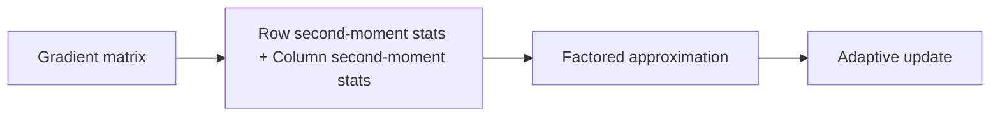
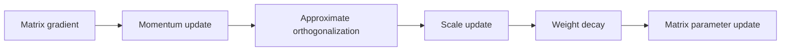
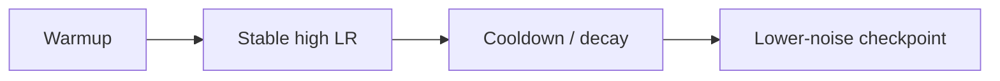

# 优化器与训练稳定性

## 当前定位

优化器应该单独作为一个知识模块维护，不建议放进“训练推理框架”。框架解决的是分布式训练、rollout、serving 和调度；优化器解决的是 **参数如何根据梯度更新、如何控制训练稳定性、显存开销和收敛效率**。

> **面试抓手**：SGD / Momentum 是地基，AdamW 是大模型训练默认基线，Muon 是前沿的大模型预训练优化器候选。Adafactor、Lion、Sophia、Shampoo 则分别代表低内存、sign momentum、轻量二阶和矩阵预条件路线。

### 基础入口

本页保留在知识库中，定位是“LLM 算法工程师面试专题”。SGD、Momentum、Adam、warmup、梯度裁剪等教材级概念已经在 [深度学习基础](#foundations/dl-foundations) 中建立入口；本页继续展开 AdamW、Muon、Sophia、Shampoo、WSD、linear decay-to-zero 和大模型训练稳定性排查。


## 优化器知识地图

| 类别 | 代表优化器 | 核心思想 | 面试重点 |
|---|---|---|---|
| 一阶基础 | SGD | 沿负梯度方向更新 | 学习率、batch noise、收敛稳定性 |
| 动量方法 | Momentum / Nesterov | 用历史梯度平滑方向并加速 | 动量为何能抑制震荡 |
| 自适应一阶 | Adam / AdamW | 一阶动量 + 二阶矩估计，按坐标缩放更新 | bias correction、decoupled weight decay |
| 低内存自适应 | Adafactor | 用行/列 factored second moment 近似完整二阶矩 | optimizer state 显存 |
| sign update | Lion | 只保留 momentum，用 sign 方向更新 | 省内存、学习率更小 |
| 轻量二阶 | Sophia | 用 Hessian diagonal 估计做预条件，并裁剪更新 | curvature、clip、预训练效率 |
| 矩阵预条件 | Shampoo | 为张量各维维护预条件矩阵 | 预条件、矩阵开销 |
| 正交化更新 | Muon | 对矩阵 momentum 做近似正交化更新 | Newton-Schulz、spectral norm、LLM scaling |

## SGD：所有优化器的地基

SGD 的更新非常直接：

$$
\theta_{t+1}=\theta_t-\eta g_t
$$

其中 $g_t=\nabla_\theta \mathcal{L}(\theta_t)$，$\eta$ 是 learning rate。它的优点是状态少、实现简单、泛化表现常常不错；缺点是对学习率敏感，面对噪声梯度、病态曲率和稀疏梯度时收敛可能慢。

**面试结论**：SGD 不是“过时方法”，而是理解其他优化器的参照系。AdamW、Sophia、Muon 本质上都在回答：如何在 SGD 的基础上更好地处理噪声、尺度、曲率或矩阵几何。

## Momentum 与 Nesterov

Momentum 引入速度项 $v_t$：

$$
v_t=\mu v_{t-1}+g_t
$$

$$
\theta_{t+1}=\theta_t-\eta v_t
$$

直觉是：如果连续多个 batch 的梯度方向一致，动量会加速；如果梯度在某个方向来回震荡，动量会平滑掉一部分噪声。

Nesterov momentum 的区别是先沿动量方向看一眼未来位置，再计算梯度。面试里不必硬背公式，抓住它的直觉即可：**普通 momentum 是先看当前梯度再走，Nesterov 是先按惯性预估位置再修正**。

## Adam：大模型优化器的基础基线

Adam 维护梯度一阶矩 $m_t$ 和二阶矩 $v_t$：

$$
m_t=\beta_1 m_{t-1}+(1-\beta_1)g_t
$$

$$
v_t=\beta_2 v_{t-1}+(1-\beta_2)g_t^2
$$

因为 $m_0$ 和 $v_0$ 通常初始化为 0，训练早期估计会偏小，所以 Adam 使用 bias correction：

$$
\hat{m}_t=\frac{m_t}{1-\beta_1^t},\quad
\hat{v}_t=\frac{v_t}{1-\beta_2^t}
$$

参数更新为：

$$
\theta_{t+1}
=\theta_t-\eta \frac{\hat{m}_t}{\sqrt{\hat{v}_t}+\epsilon}
$$

**直觉**：$m_t$ 提供稳定方向，$v_t$ 让不同参数按梯度尺度自适应调整学习率。梯度长期很大的参数更新会被压小，梯度稀疏或尺度小的参数不会完全被淹没。

## AdamW：为什么大模型默认用它

AdamW 的关键不是“Adam + L2 正则”这么简单，而是 **decoupled weight decay**。在 SGD 中，L2 regularization 和 weight decay 在形式上等价；但在 Adam 这类 adaptive optimizer 中，L2 penalty 会被二阶矩缩放，导致正则强度和自适应学习率纠缠。

AdamW 把 weight decay 从梯度更新中解耦：

$$
\theta_{t+1}
=(1-\eta\lambda)\theta_t
-\eta \frac{\hat{m}_t}{\sqrt{\hat{v}_t}+\epsilon}
$$

**面试结论**：

- AdamW 是 Transformer / LLM 训练的默认强基线。
- weight decay 不应该作用于所有参数，常见做法是跳过 bias、LayerNorm / RMSNorm 权重，有时也跳过 embedding。
- AdamW 的主要代价是 optimizer state 显存：通常要为每个参数保存 $m$ 和 $v$，混合精度训练还可能保存 master weights。

## Adafactor：低内存 Adam 路线

Adafactor 解决的是 Adam 二阶矩状态太大的问题。对矩阵参数 $G \in \mathbb{R}^{m\times n}$，Adam 需要保存完整 $m\times n$ 的 second moment；Adafactor 只保存行统计和列统计，再近似恢复每个元素的二阶矩尺度。



**适合讲法**：Adafactor 用更少 optimizer state 换取近似的自适应缩放能力，适合超大模型或内存敏感训练。它不是单纯“更好的 Adam”，而是“低内存 Adam-like optimizer”。

## Lion：sign momentum 路线

Lion 来自优化器自动搜索，核心更新使用 momentum 的 sign，而不是 Adam 那样除以二阶矩。它通常只需要保存一份 momentum state，因此比 AdamW 省状态内存。

可以把它粗略理解为：

$$
\theta_{t+1}=\theta_t-\eta\cdot \mathrm{sign}(u_t)
$$

其中 $u_t$ 来自动量组合。由于 sign update 的范数较大，Lion 往往需要比 AdamW 更小的 learning rate，并且对任务和 batch size 比较敏感。

## Sophia：轻量二阶优化

Sophia 的动机是：AdamW 只用 gradient moments，不显式利用曲率；完整二阶方法又太贵。Sophia 用轻量的 diagonal Hessian estimate 做预条件，并用 clipping 控制每个坐标的最大更新。


**面试重点**：

- Sophia 试图利用 curvature information 改善预训练效率。
- 它不是完整 Newton method，只是轻量 diagonal second-order approximation。
- clipping 很关键，因为非凸训练中 Hessian 估计会变化快，直接除以曲率可能导致不稳定。

## Shampoo：矩阵/张量预条件

Shampoo 代表更结构化的预条件路线。它不只按元素保存二阶矩，而是为张量不同维度维护预条件矩阵，用更强的几何信息缩放梯度。

**优点**：理论和经验上可能更快收敛，能捕捉参数矩阵行/列方向的相关性。

**代价**：预条件矩阵的存储、矩阵根/逆根计算、分布式通信和实现复杂度都更高，所以在超大 LLM 里需要大量工程优化。

## Muon：正交化更新的前沿路线

Muon 的核心直觉是：对矩阵参数，不一定要像 Adam 那样做逐元素自适应缩放；可以先对 gradient momentum 做矩阵正交化，让更新方向在矩阵空间中具有更好的谱性质。

典型流程可以抽象成：



令矩阵参数的动量为 $M_t$，Muon 会对 $M_t$ 做近似正交化：

$$
O_t \approx \mathrm{orthogonalize}(M_t)
$$

然后用 $O_t$ 更新矩阵参数：

$$
W_{t+1}=W_t-\eta\cdot s(W_t)\cdot O_t
$$

其中 $s(W_t)$ 表示与参数形状/尺度相关的 update scale。实际实现通常用 **Newton-Schulz iteration** 近似正交化，因为它主要由矩阵乘法组成，适合 GPU。

### Muon 和 AdamW 的关键差异

| 维度 | AdamW | Muon |
|---|---|---|
| 更新几何 | 按坐标自适应缩放 | 对矩阵 momentum 做正交化 |
| 状态 | 一阶矩 + 二阶矩 | momentum + 正交化计算 |
| 主要适用参数 | 几乎所有 dense 参数 | 更适合 2D matrix weights |
| weight decay | decoupled weight decay 是默认关键机制 | 大规模 scaling 论文强调加入 weight decay 很关键 |
| 工程挑战 | state 显存大，但实现成熟 | 正交化开销、分布式通信、参数分组策略 |

### Muon 在 LLM 中怎么用

Muon is Scalable for LLM Training 的核心结论是：Muon 原本在小模型上表现强，但扩到 LLM 需要两个关键工程技巧：

- **加入 weight decay**：否则大规模训练稳定性和泛化可能不足。
- **调整 per-parameter update scale**：不同形状矩阵不能直接用同一更新尺度。

论文报告在 compute-optimal training 的 scaling law 实验中，Muon 相比 AdamW 约有 **2x compute efficiency**；并用 Muon 训练了 Moonlight 3B/16B MoE 模型，训练数据规模为 5.7T tokens。

**重要边界**：Muon 通常不是把所有参数都替换掉。bias、norm、embedding、一些非矩阵参数可能仍用 AdamW 或单独参数组。面试里不要说“Muon 全面替代 AdamW”，更稳的说法是：Muon 是对大矩阵权重更新几何的改造，能否替代 AdamW 取决于模型规模、参数类型、训练阶段、分布式实现和稳定性验证。

## 学习率调度：warmup、decay 与 cooldown

学习率调度不是优化器之外的“小参数”，而是决定优化器在不同训练阶段用多大步长移动的控制策略。面试里可以把它拆成三段：**warmup 保护早期更新、stable 阶段保持有效探索、decay/cooldown 阶段收敛到更低噪声区域**。

### 为什么需要 warmup

大模型训练早期，参数、激活分布、AdamW 的一阶/二阶矩估计都还不稳定。如果一开始就使用峰值学习率，更新步长可能过大，导致 loss spike、梯度异常或表示崩坏。warmup 的做法是让学习率从很小的值线性升到峰值：

$$
\eta_t = \eta_{max}\cdot \frac{t}{T_{warmup}},\quad 0\le t\le T_{warmup}
$$

直觉上，warmup 不是为了“慢慢学”，而是为了**限制训练早期的参数更新幅度**。近年的 GPT warmup 分析也指出，warmup 能缓解早期 update direction / angular update 过大的问题。

### 常见学习率调度谱系

| 调度方式 | 公式直觉 | 适合场景 | 风险 |
|---|---|---|---|
| constant | 全程固定学习率 | 小实验、调试 baseline | 后期噪声大，难精调收敛 |
| linear decay | 从峰值线性降到 0 或 min_lr | LLM 训练、微调、预算固定训练 | 下降过快可能欠训练 |
| cosine decay | 半个 cosine 从峰值平滑降到 0/min_lr | Transformer 预训练和微调常见默认项 | 依赖总步数，尾部可能过早变小 |
| inverse sqrt | warmup 后按 $t^{-1/2}$ 衰减 | Transformer 原论文 Noam schedule | 后期衰减较慢，需配合任务调参 |
| polynomial decay | 按多项式形状下降 | 需要控制尾部曲线时 | power 超参不直观 |
| step / multistep | 到指定节点乘 gamma | CV 传统训练常见 | 离散跳变可能不适合 LLM |
| cosine restarts | 周期性重启学习率 | 探索多个 basin 或小模型训练 | 大模型预训练中未必稳定 |
| OneCycle | 先升后降，常配合 momentum 反向变化 | 训练预算短、想快速找较大学习率 | LLM 主流预训练较少直接用 |
| WSD | warmup + stable + decay | 预算可变、想保留主干 checkpoint | decay/cooldown 形状需要调 |

Hugging Face `get_scheduler` 里已经把这些工程常用项统一成 API，包括 `linear`、`cosine`、`cosine_with_restarts`、`polynomial`、`constant_with_warmup`、`inverse_sqrt`、`warmup_stable_decay` 等；PyTorch 则提供 `LinearLR`、`CosineAnnealingLR`、`OneCycleLR`、`ReduceLROnPlateau` 等底层调度器。

### Transformer 原始 Noam schedule

Transformer 原论文使用的是 warmup + inverse square root decay：

$$
\eta_t=d_{model}^{-0.5}\cdot \min(t^{-0.5},\;t\cdot T_{warmup}^{-1.5})
$$

它的形状是：先线性 warmup，到达峰值后按 $1/\sqrt{t}$ 下降。这个 schedule 很适合用来讲“为什么 Transformer 早期需要 warmup”，但现代 LLM 训练更常见的是 warmup + cosine、warmup + linear decay 或 WSD。

### Cosine decay

cosine decay 的常见形式是：

$$
\eta_t=\eta_{min}+\frac{1}{2}(\eta_{max}-\eta_{min})\left(1+\cos\left(\pi\frac{t-T_{warmup}}{T_{total}-T_{warmup}}\right)\right)
$$

优点是平滑、稳定、生态默认支持好。缺点是需要提前知道总训练步数；如果训练预算变化，整条曲线也要重设。PyTorch `CosineAnnealingLR` 和 Hugging Face `get_cosine_schedule_with_warmup` 都是常用实现入口。

### Linear decay-to-zero

linear decay-to-zero 简写为 D2Z：warmup 后从峰值线性降到 0。

$$
\eta_t=\eta_{max}\left(1-\frac{t-T_{warmup}}{T_{total}-T_{warmup}}\right)
$$

近年的 LLM 训练研究提出，在 compute-optimal token 预算下，线性衰减到 0 可能比“cosine 衰减到 10% 峰值”更好。面试时可以保守表达为：**cosine 是强默认，linear decay-to-zero 是值得关注的 LLM 训练经验趋势，但要和 peak LR、token budget、batch size 一起调。**

### Warmup-Stable-Decay / WSD

WSD 把学习率分成三段：

1. warmup：从小学习率升到峰值。
2. stable：长时间保持较高学习率，沿 loss landscape 中的有效方向快速推进。
3. decay / cooldown：在末尾快速降低学习率，降低振荡，释放真实 loss 改善。



WSD 的优势是对训练预算更灵活：可以先训练一个 stable 主干，再在不同 step 分叉做 decay 得到多个 checkpoint。相关论文用 “river valley loss landscape” 解释：stable 阶段在谷底附近大步前进，decay 阶段减小振荡，让模型靠近更低噪声位置。

### 学习率、batch size 和梯度累积

学习率不能脱离 effective batch size 讨论。常见经验是：batch size 增大时，峰值学习率可以适当增大，但不是无限线性增长；超过 critical batch size 后，继续增大 batch 可能更多降低梯度噪声，而不是带来等比例训练效率。梯度累积只改变 effective batch size 和更新频率，不等价于完全相同的分布式大 batch，因为通信、归一化、随机性和数据顺序仍可能不同。

面试时可以这样组织：

| 超参 | 影响 | 常见排查 |
|---|---|---|
| peak LR | 主导更新幅度 | loss spike 先降 peak LR 或加长 warmup |
| warmup steps | 控制早期稳定 | 早期不稳加 warmup，收敛慢则检查是否过长 |
| min LR / final LR | 控制末尾噪声 | eval loss 不降可尝试更低 final LR 或 cooldown |
| schedule shape | 控制中后期探索/收敛 | cosine、linear、WSD 做 ablation |
| batch size | 控制梯度噪声 | 和 LR、梯度裁剪、AdamW beta 一起看 |

### 手写学习率调度代码

```python
import math


def linear_warmup_cosine_decay(step: int, warmup_steps: int, total_steps: int, peak_lr: float, min_lr: float = 0.0) -> float:
    """warmup + cosine decay：LLM 训练最常见的强 baseline。"""
    if step < warmup_steps:
        return peak_lr * step / max(1, warmup_steps)
    progress = (step - warmup_steps) / max(1, total_steps - warmup_steps)
    progress = min(max(progress, 0.0), 1.0)
    cosine = 0.5 * (1.0 + math.cos(math.pi * progress))
    return min_lr + (peak_lr - min_lr) * cosine


def linear_warmup_linear_decay(step: int, warmup_steps: int, total_steps: int, peak_lr: float) -> float:
    """warmup + linear decay-to-zero：固定 token 预算下值得重点比较。"""
    if step < warmup_steps:
        return peak_lr * step / max(1, warmup_steps)
    progress = (step - warmup_steps) / max(1, total_steps - warmup_steps)
    return peak_lr * max(0.0, 1.0 - progress)


def noam_inverse_sqrt(step: int, model_dim: int, warmup_steps: int) -> float:
    """Transformer 原论文的 warmup + inverse sqrt schedule。"""
    step = max(step, 1)
    return model_dim ** -0.5 * min(step ** -0.5, step * warmup_steps ** -1.5)


def warmup_stable_decay(step: int, warmup_steps: int, stable_steps: int, decay_steps: int, peak_lr: float, min_lr: float = 0.0) -> float:
    """WSD：先 warmup，再保持高 LR，最后 cooldown。"""
    if step < warmup_steps:
        return peak_lr * step / max(1, warmup_steps)
    if step < warmup_steps + stable_steps:
        return peak_lr
    progress = (step - warmup_steps - stable_steps) / max(1, decay_steps)
    progress = min(max(progress, 0.0), 1.0)
    return min_lr + (peak_lr - min_lr) * (1.0 - progress)
```

### 面试 QA：学习率调度

**Q：为什么 LLM 训练常用 warmup？**

A：训练早期 AdamW 的矩估计、激活分布和梯度方向都不稳定，直接用峰值学习率容易导致过大的参数更新。warmup 用较小步长启动训练，逐步放大到 peak LR，主要目的是限制早期 update size，而不是单纯“慢慢学”。

**Q：cosine decay 和 linear decay 怎么选？**

A：cosine 是生态默认强 baseline，平滑稳定；linear decay-to-zero 在一些 LLM compute-optimal 研究中表现很好，直觉是后期更强地降低噪声。工程上不要脱离 peak LR、token budget、batch size 单独比较 schedule。

**Q：WSD 相比 cosine 的价值是什么？**

A：cosine 需要提前固定总步数；WSD 可以长时间保持 stable 主干，并在需要 checkpoint 时分叉做 decay，因此更适合预算变化或想复用中间 checkpoint 的大规模训练。它的关键调参在 stable 长度和 cooldown 形状。

**Q：学习率调度和优化器 beta 有关系吗？**

A：有。AdamW 的 $\beta_1/\beta_2$ 决定动量和平滑窗口，学习率决定更新幅度。进入 cooldown 后，较低学习率和更平滑的二阶矩估计会共同影响最终收敛；一些 WSD cooldown 研究也观察到 AdamW 超参和 cooldown 形状需要一起调。

## 训练稳定性相关面试点

### 学习率和 warmup

优化器不能脱离 learning rate schedule。大模型训练常用 warmup + cosine decay 或类似策略。warmup 过短可能早期梯度噪声放大；过长会浪费训练预算。

### gradient clipping

gradient clipping 用于限制梯度范数，防止异常 batch 或训练早期不稳定导致参数大幅跳动。它不是优化器本身，但经常和 AdamW、Sophia、Muon 这些方法一起讨论。

### optimizer state 显存

如果模型参数量是 $N$，AdamW 至少要保存 $m$ 和 $v$ 两份状态，混合精度训练还可能保存 FP32 master weights。面试中可以用这个解释为什么 Adafactor、Lion、Muon 这类方法会关注内存和通信。

### 参数分组

LLM 训练中常把参数分组设置不同规则：

- weight matrix：通常使用 optimizer 主逻辑和 weight decay。
- bias / norm：常常不做 weight decay。
- embedding / lm head：可能需要单独学习率或 decay 策略。
- MoE experts / router：有时需要独立学习率、正则或稳定性监控。

## 优化器选择建议

| 场景 | 优先选择 | 原因 |
|---|---|---|
| 常规 SFT / 微调 | AdamW | 成熟稳定、默认强基线、生态完善 |
| 显存很紧的大模型训练 | Adafactor / 低状态优化器 | 减少 optimizer state |
| 研究预训练效率 | Muon / Sophia / Shampoo | 关注收敛效率和更新几何 |
| 想降低状态内存且能调参 | Lion | momentum-only，代价是 LR 更敏感 |
| 生产级大规模预训练 | AdamW baseline + 小规模 ablation | 先保证稳定，再评估前沿优化器 |

## 面试 QA

**Q：SGD 为什么仍然值得掌握？**

A：SGD 是所有优化器的参照系。它状态少、直觉清楚，能帮助解释为什么后续方法要引入 momentum、adaptive second moment、preconditioner 或 orthogonalized update。

**Q：Momentum 解决了 SGD 的什么问题？**

A：它用历史梯度累积一个更稳定的方向。方向一致时加速，方向震荡时平滑噪声，特别适合峡谷形 loss landscape。

**Q：Adam 和 AdamW 最大区别是什么？**

A：AdamW 把 weight decay 从 Adam 的梯度自适应缩放里解耦。Adam 里直接加 L2 penalty 会被二阶矩缩放，导致正则强度和 adaptive learning rate 纠缠；AdamW 直接对参数做 decay，更符合 weight decay 本意。

**Q：为什么大模型训练默认用 AdamW？**

A：它在噪声梯度、稀疏/非平稳目标和 Transformer 训练中非常稳，超参经验成熟，工程实现完备。缺点是 optimizer state 显存大，预训练成本高。

**Q：Muon 相比 AdamW 的核心变化是什么？**

A：AdamW 是逐坐标自适应缩放；Muon 对矩阵梯度动量做近似正交化，改变的是矩阵参数的更新几何。它更适合大矩阵权重，不一定适合所有参数。

**Q：Muon 为什么需要 Newton-Schulz iteration？**

A：精确 SVD 正交化太贵，不适合大规模训练。Newton-Schulz 可以用一系列矩阵乘法近似正交化，GPU 友好，但迭代次数、数值稳定和通信开销会影响实际收益。

**Q：Adafactor 解决什么问题？**

A：解决 Adam 二阶矩状态太大的问题。它用行/列 factored statistics 近似完整 second moment，牺牲一些精确性换低内存。

**Q：Sophia 为什么算轻量二阶？**

A：它不是完整 Hessian，也不求逆矩阵，而是周期性估计 diagonal Hessian，用它做预条件，再配合 clipping 控制不稳定更新。

**Q：Shampoo 为什么强但难用？**

A：它维护矩阵/张量维度上的预条件器，能捕捉更丰富几何结构；但预条件矩阵存储、矩阵根计算和分布式通信复杂，落地成本高。

**Q：面试中如何评价一个新优化器？**

A：先问四件事：是否比 AdamW 在相同 compute 下更好；额外显存和通信是多少；对学习率、batch size、weight decay 是否敏感；是否只在小模型或特定任务上成立。

## 后续补全计划

- 补 SGD / Momentum / AdamW / Muon 的最小 PyTorch 实现。
- 补 optimizer state 显存估算脚本。
- 精读 Muon 的 Newton-Schulz 正交化细节和分布式实现。
- 对比 Muon、Sophia、Shampoo 在“更新几何”上的异同。

## 参考资料

- Adam: A Method for Stochastic Optimization, arXiv:1412.6980。
- Decoupled Weight Decay Regularization, arXiv:1711.05101。
- Adafactor: Adaptive Learning Rates with Sublinear Memory Cost, arXiv:1804.04235。
- Shampoo: Preconditioned Stochastic Tensor Optimization, arXiv:1802.09568。
- Sophia: A Scalable Stochastic Second-order Optimizer for Language Model Pre-training, arXiv:2305.14342。
- Symbolic Discovery of Optimization Algorithms, arXiv:2302.06675。
- Muon is Scalable for LLM Training, arXiv:2502.16982。
