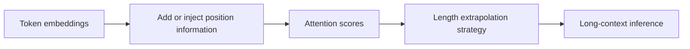
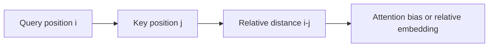
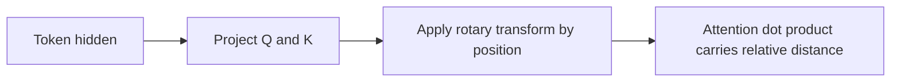
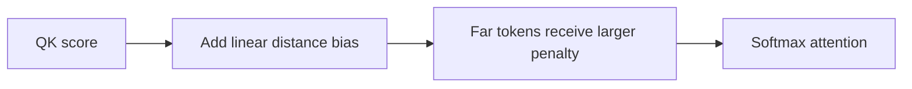
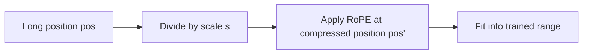
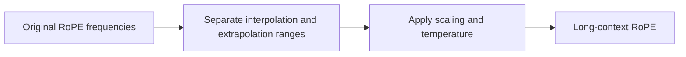

# 位置编码与长度外推

## 当前定位

Transformer 的 self-attention 本身对 token 顺序不敏感，所以必须通过位置编码或位置偏置注入顺序信息。大模型面试里，位置编码常见追问包括：**绝对位置编码、相对位置编码、RoPE、ALiBi 的区别**，以及 **长上下文外推** 中的 PI、NTK-aware scaling、YaRN 等方法。

> **术语说明**：你提到的 RTK 在长上下文语境里常见写法更可能是 **NTK-aware RoPE scaling**。本章会保留 “RTK / NTK-aware” 关键词，后续如果你确认 RTK 指另一篇方法，我们再单独补充。



## 总览画像

| 方法 | 注入位置 | 核心思想 | 外推能力 | 典型风险 |
|---|---|---|---|---|
| Sinusoidal absolute PE | embedding 输入端 | 用固定正弦/余弦向量表示位置 | 有一定外推直觉，但现代 LLM 少直接用 | 位置与内容简单相加，灵活性有限 |
| Learned absolute PE | embedding 输入端 | 每个位置学习一个 embedding | 训练内长度效果好 | 超过训练长度无法自然外推 |
| Relative position | attention score | attention 直接感知相对距离 | 比绝对位置更适合变长 | 实现和缓存复杂 |
| T5 relative bias | attention score | 按相对距离 bucket 加 bias | 稳定、简单 | bucket 设计影响长距离表达 |
| RoPE | Q/K 向量内部 | 按位置旋转 Q/K，使点积包含相对位置信息 | 当前 LLM 主流 | 长度外推会出现高频相位错位 |
| ALiBi | attention score | 给远距离 token 加线性负偏置 | 天然支持外推 | 表达力和主流兼容性不如 RoPE |
| PI | RoPE 位置缩放 | 把长位置线性压回训练范围 | 简单有效 | 可能损失短距离分辨率 |
| NTK-aware / RTK | RoPE 频率缩放 | 调整 RoPE base，让低频维度支持更长距离 | 比纯 PI 更平滑 | 参数选择依赖经验 |
| YaRN | RoPE scaling 改进 | 分段/温度/插值结合，兼顾短程和长程 | 长上下文效果更稳 | 实现细节多 |

## 为什么需要位置编码

self-attention 的基本形式是：

$$
\mathrm{Attention}(Q,K,V)
=
\mathrm{softmax}
\left(
\frac{QK^\top}{\sqrt{d}}
\right)V
$$

如果没有位置信息，交换 token 顺序后，attention 只看到内容向量，无法知道“谁在前、谁在后”。位置编码的作用就是让模型区分：

- token 的绝对位置：第几个 token。
- token 之间的相对距离：两个 token 隔多远。
- 方向性：谁在左，谁在右。
- 长上下文中的距离尺度。

## 绝对位置编码

### Sinusoidal absolute PE

原始 Transformer 使用固定正弦/余弦位置编码：

$$
PE_{(pos,2i)} = \sin\left(\frac{pos}{10000^{2i/d}}\right)
$$

$$
PE_{(pos,2i+1)} = \cos\left(\frac{pos}{10000^{2i/d}}\right)
$$

然后把位置向量加到 token embedding 上：

$$
h_{pos}=x_{pos}+PE_{pos}
$$

**优点**：不需要学习参数，理论上可以计算任意长度位置。  
**局限**：位置和内容简单相加，外推效果不一定稳定，现代 LLM 已较少直接采用。

### Learned absolute PE

learned absolute PE 为每个位置学习一个 embedding。BERT/GPT 早期模型常见。

**优点**：训练长度内表达力强。  
**局限**：超过训练最大长度时没有自然定义，外推困难。

## relative position

相对位置编码不只告诉模型“当前 token 是第几个”，而是让 attention score 感知 query 和 key 的相对距离。例如 Transformer-XL 和 T5 都属于这一思路。



典型做法包括：

- 给 attention score 加相对位置 bias。
- 把相对位置 embedding 参与 Q/K 交互。
- 用 bucket 把很远的距离合并到同一类，例如 T5 relative position bias。

**面试结论**：相对位置比绝对位置更适合变长序列，因为语言建模中很多规律与“相对距离”相关，而不是固定位置编号。

## RoPE

RoPE（Rotary Position Embedding）是当前 LLM 最主流的位置编码方法之一。它不是把位置向量加到 token embedding 上，而是对 query/key 的二维子空间做旋转。

对每一对维度，位置 $m$ 对应旋转角度 $m\theta_i$：

$$
R_{\Theta,m} =
\begin{bmatrix}
\cos(m\theta_i) & -\sin(m\theta_i) \\
\sin(m\theta_i) & \cos(m\theta_i)
\end{bmatrix}
$$

将其作用到 query/key：

$$
q_m' = R_{\Theta,m} q_m,\quad k_n' = R_{\Theta,n} k_n
$$

关键性质是点积天然包含相对位置：

$$
(q_m')^\top k_n'
=
q_m^\top R_{\Theta,n-m} k_n
$$



**优势**：

- 同时保留绝对位置信息和相对位置性质。
- 对 causal LM 友好，已被 LLaMA、Qwen、DeepSeek 等大量模型采用。
- 与 KV cache 兼容：生成时只需给新 token 应用对应位置旋转。

**局限**：

- 超过训练长度后，高频维度相位变化太快，可能出现外推退化。
- 位置缩放会影响短距离分辨率和长距离稳定性。
- 不同模型的 RoPE base、head dim、训练长度不同，外推参数不能盲目迁移。

## ALiBi

ALiBi（Attention with Linear Biases）不显式学习位置 embedding，而是在 attention score 上加入与距离相关的线性负偏置：

$$
\mathrm{score}_{ij}
=
\frac{q_i^\top k_j}{\sqrt{d}}
-
m_h |i-j|
$$

其中 $m_h$ 是不同 attention head 的斜率。



**优势**：

- 不需要位置 embedding，长度外推更自然。
- 实现简单，训练短长度、测试长长度的场景表现较好。
- 每个 head 可以学习/使用不同距离偏好。

**局限**：

- 线性距离偏置表达力有限。
- 当前主流 LLM 生态更多围绕 RoPE 优化，ALiBi 的兼容路线少一些。
- 对需要复杂相对位置模式的任务，纯线性 bias 可能不够。

## 长度外推为什么难

模型在训练时只见过长度 $L_{train}$ 内的位置分布。推理时如果直接使用更大的位置 $L_{test}$，位置编码可能进入训练未覆盖的区域。

对 RoPE 来说，问题尤其体现在相位：

$$
\phi_{pos,i}=pos \cdot \theta_i
$$

当 $pos$ 很大时，高频维度的相位变化很快，模型没有在训练中学过这些模式，attention 可能失真。

## PI：Position Interpolation

PI（Position Interpolation）的核心思想是：不要让模型看到超出训练范围太多的位置，而是把长上下文位置线性压缩回训练范围。

如果训练长度是 $L_{train}$，目标长度是 $L_{test}$，缩放因子是：

$$
s = \frac{L_{test}}{L_{train}}
$$

则推理位置 $pos$ 被映射为：

$$
pos' = \frac{pos}{s}
$$



**优势**：

- 简单，常用于 RoPE 模型的上下文扩展。
- 比直接 extrapolate 到很大位置更稳定。
- 可通过少量 long-context fine-tuning 获得更好效果。

**局限**：

- 所有距离都被压缩，短距离位置分辨率下降。
- scale 太大时，局部 token 的相对距离变得过近，可能影响局部语法和代码结构。
- 通常需要配合少量继续训练或更复杂 scaling。

## NTK-aware / RTK RoPE Scaling

NTK-aware scaling 的直觉是：RoPE 的不同维度对应不同频率。与其简单缩放所有 position，不如调整 RoPE 的 base 或频率分布，让低频维度承载更长上下文。

RoPE 中常见频率写法是：

$$
\theta_i = \mathrm{base}^{-2i/d}
$$

NTK-aware scaling 会调整 base，例如把 base 放大：

$$
\mathrm{base}' = \mathrm{base} \cdot \alpha
$$

base 变大后，频率整体变低，相同位置对应的相位变化更慢，有利于更长距离。

> **RTK 备注**：如果面试或资料里出现 RTK，建议先确认原文是否其实指 NTK-aware RoPE scaling。常见社区资料和实现里更常见的是 dynamic NTK scaling、NTK-aware interpolation、YaRN 等说法。

**优势**：

- 比单纯 PI 更关注 RoPE 频率结构。
- 可以更好保留一部分短程能力，同时扩展长程能力。
- 许多长上下文模型或推理框架会提供类似 RoPE scaling 配置。

**局限**：

- 具体 scale/base 参数依赖模型训练长度、head dim、RoPE base。
- 不同实现差异较大，面试里不要把社区 trick 当成统一理论。
- 过强 scaling 仍可能损害短上下文表现。

## YaRN

YaRN（Yet another RoPE extensioN method）是对 RoPE 长度扩展更系统的改进。它试图在短程和长程之间做更细的平衡，而不是对所有频率做单一缩放。



**面试结论**：YaRN 可以理解为更精细的 RoPE scaling：它希望在扩展上下文的同时，尽量保持训练长度内的局部位置分辨率和 attention 分布稳定。

## 方法对比：怎么回答

| 问题 | 推荐答案 |
|---|---|
| 绝对位置和相对位置区别？ | 绝对位置告诉模型 token 在第几个位置；相对位置让 attention 感知 token 之间的距离，通常更适合变长和长上下文。 |
| RoPE 和 absolute PE 区别？ | absolute PE 是加到 embedding 上；RoPE 是旋转 Q/K，使 attention 点积天然携带相对位置。 |
| RoPE 为什么适合 LLM？ | 它兼具相对位置性质、causal LM 友好、KV cache 兼容，且工程生态成熟。 |
| ALiBi 为什么能外推？ | 它用距离线性 bias，而不是有限位置 embedding；测试更长长度时仍可计算距离惩罚。 |
| PI 解决什么？ | 把超长位置压缩回训练长度范围，减少 RoPE 直接外推时的相位失真。 |
| NTK-aware / RTK scaling 解决什么？ | 调整 RoPE 频率或 base，让位置相位增长更慢，使模型更适应长上下文。 |
| YaRN 相比 PI 的变化？ | YaRN 更精细地区分频率和距离范围，试图兼顾短程分辨率和长程外推稳定性。 |

## 代码理解：RoPE 最小骨架

```python
import torch


def apply_rope(x: torch.Tensor, cos: torch.Tensor, sin: torch.Tensor) -> torch.Tensor:
    # x: [batch, heads, seq, dim], dim must be even
    x_even = x[..., 0::2]
    x_odd = x[..., 1::2]
    rotated_even = x_even * cos - x_odd * sin
    rotated_odd = x_even * sin + x_odd * cos
    return torch.stack((rotated_even, rotated_odd), dim=-1).flatten(-2)
```

## 代码理解：PI 位置缩放

```python
def position_interpolation_positions(seq_len: int, train_len: int, target_len: int) -> list[float]:
    scale = target_len / train_len
    return [pos / scale for pos in range(seq_len)]
```

真实实现通常不会返回 Python list，而是在构造 RoPE cos/sin cache 时直接用缩放后的位置。

## 代码理解：NTK-aware base 缩放

```python
def ntk_scaled_base(base: float, scale: float, dim: int) -> float:
    # A simplified intuition-only variant.
    # Real implementations may use model-specific formulas.
    return base * (scale ** (dim / max(dim - 2, 1)))
```

这段只用于建立直觉：扩大 base 会降低 RoPE 频率，让相同 position 下相位变化更慢。真实项目里要以模型配置和推理框架实现为准。

## 面试 QA

**Q：为什么 Transformer 必须有位置编码？**

A：self-attention 对输入 token 的排列本身是置换等变的。如果不注入位置，模型无法区分同样 token 集合的不同顺序。

**Q：RoPE 的核心优势是什么？**

A：RoPE 通过旋转 Q/K 把位置信息注入 attention 点积，使点积天然依赖相对距离，同时保持 causal LM 和 KV cache 友好。

**Q：RoPE 外推为什么会退化？**

A：推理长度超过训练长度后，RoPE 的相位进入模型未见过的范围，高频维度尤其容易变化过快，导致 attention 模式失真。

**Q：PI 和 NTK-aware scaling 有什么区别？**

A：PI 主要缩放 position，把长位置压回训练范围；NTK-aware 更偏调整 RoPE 频率/base，让相位变化整体变慢。前者简单，后者更关注频率结构。

**Q：ALiBi 和 RoPE 怎么选？**

A：ALiBi 外推自然、实现简单；RoPE 表达力强、LLM 生态成熟。现代开源 LLM 多用 RoPE，再通过 PI、NTK-aware、YaRN 等方法扩展上下文。

**Q：长上下文扩展只改位置编码就够吗？**

A：通常不够。还需要长上下文继续训练、数据构造、attention/KV cache 工程优化、评测集验证，以及避免短上下文能力下降。

## 后续补全计划

- 补 RoPE 的二维旋转 SVG 图。
- 补 ALiBi 不同 head slope 的可视化。
- 补 PI、NTK-aware、YaRN 的公式对比和实现差异。
- 补 LongRoPE、Dynamic NTK、Llama/Qwen/DeepSeek RoPE scaling 配置对比。
- 增加一个可运行的 RoPE attention toy demo。

## 参考资料

- Attention Is All You Need, arXiv:1706.03762。
- Transformer-XL: Attentive Language Models Beyond a Fixed-Length Context, arXiv:1901.02860。
- T5: Exploring the Limits of Transfer Learning with a Unified Text-to-Text Transformer, arXiv:1910.10683。
- RoFormer: Enhanced Transformer with Rotary Position Embedding, arXiv:2104.09864。
- Train Short, Test Long: Attention with Linear Biases Enables Input Length Extrapolation, arXiv:2108.12409。
- Extending Context Window of Large Language Models via Positional Interpolation, arXiv:2306.15595。
- YaRN: Efficient Context Window Extension of Large Language Models, arXiv:2309.00071。
