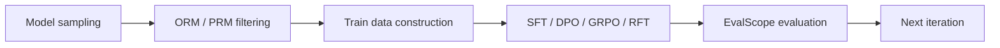
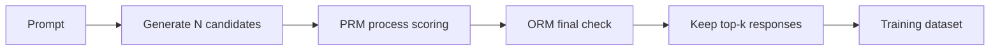
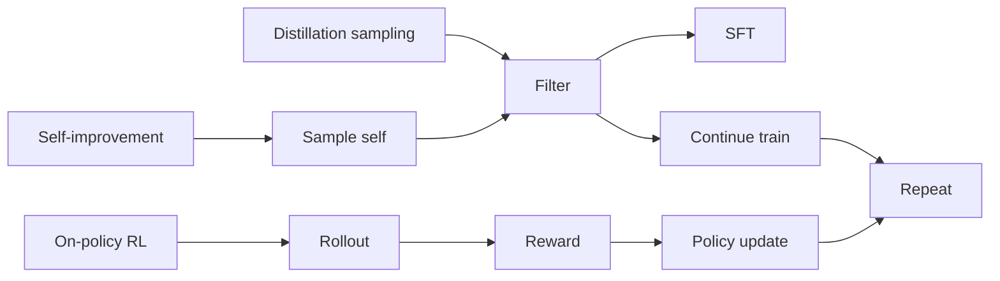
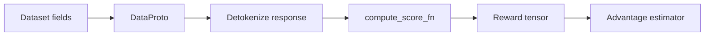

# 采样、评测与强化微调闭环

## 当前定位

SWIFT 文档里最值得单独沉淀的一条工程主线是：**先采样，再用 ORM/PRM/verifier 过滤，再把优质样本用于 SFT / DPO / GRPO / RFT，最后用 EvalScope 做训练中评测**。这条链路比单个算法命令更适合面试，因为它回答的是“如何把模型能力提升做成闭环”。

> **面试抓手**：SFT 是直接学固定数据；RFT / rejection sampling fine-tuning 是“生成候选 -> 过滤候选 -> 再训练”；GRPO/PPO 是更在线的“采样 -> reward -> policy update”。三者可以共享采样、过滤和评测基础设施。

## 一、采样与候选生成

### SWIFT Sample：test-time compute 的工程入口

SWIFT 的 `sample` 能力可以理解为 **test-time compute / data generation** 的落地入口。它支持对同一 query 生成多个候选，并保留完整 `messages` 格式结果。

| 组件 | 作用 | 面试关注 |
|---|---|---|
| `num_return_sequences` | 每个 prompt 生成多个候选 | best-of-n / rejection sampling 的基础 |
| `sampler_engine` | transformers、lmdeploy、vLLM 等生成后端 | 采样吞吐、显存、服务化 |
| `temperature` / `top_p` | 控制探索强度 | 多样性与正确率 trade-off |
| 输出 jsonl | 保存完整 messages | 方便后续过滤、蒸馏、SFT |

**面试结论**：采样不是简单“生成数据”，它是 RLVR、RFT、蒸馏、self-improvement 的共同前置步骤。

### ORM / PRM 过滤

SWIFT Sample 支持使用 ORM 和 PRM 过滤候选：

- **ORM（Outcome Reward Model / Rule）**：看最终答案是否对，例如数学答案、代码测试、格式校验。
- **PRM（Process Reward Model）**：看推理过程是否合理，例如每一步推导、工具调用轨迹、过程分数。

过滤时常见参数包括：

- `n_best_to_keep`：每个 query 保留几个候选。
- `prm_model`：过程奖励模型或自定义 PRM。
- `orm_model`：结果验证器或自定义 ORM。
- `rejected_response`：保留负样本，可用于 DPO / preference training。

**面试表达**：ORM 更像“答案对不对”，PRM 更像“过程靠不靠谱”。数学/代码题常先用 ORM 建立强信号；复杂推理和 Agent 任务可能需要 PRM 防止偶然猜中。

### 两段式采样：显存与成本控制

如果 generator、PRM、ORM 同时加载，容易 OOM。SWIFT 文档给出的工程思路是两段式：

1. 只加载生成模型，采样并缓存候选。
2. 不重新采样，只加载 PRM/ORM，对缓存结果打分过滤。

这对应一个很重要的系统观点：**采样和评估可以解耦**。在大规模 RFT/RLVR 中，生成、打分、训练往往分别由不同资源池承担。

## 二、强化微调与评测闭环

### 强化微调 RFT：三类路线

SWIFT 的 RFT 文档把强化微调拆成三类，很适合面试：

| 路线 | 数据来源 | 训练方式 | 是否循环 |
|---|---|---|---|
| 蒸馏 | 更大模型采样，如 DeepSeek-R1 / Qwen-Max | 用过滤后数据 SFT 小模型 | 通常不循环 |
| self-improvement | 当前模型自己采样 | 筛选后继续训练自己 | 可以循环 |
| on-policy RL | 当前 policy rollout | PPO / GRPO 等 policy update | 循环 |

**关键判断**：如果输出好坏能被相对准确评估，例如数学、代码、格式任务，RFT/RLVR 才更值得做；如果 reward 不可靠，训练可能原地震荡甚至变差。

### Evaluation：训练闭环的反馈面

SWIFT 的 eval 能力基于 EvalScope，支持：

- 标准文本评测：MMLU、CEval、GSM8K、HumanEval、BBH、GPQA 等。
- 多模态评测：MMBench、MMMU、OCRBench、MathVista、Video-MME 等。
- 自定义评测：MCQ 和 QA 两类格式。
- 训练中评测：在 SFT / 微调过程中按 steps 调用评测。

面试中要强调：**训练 loss 降低不等于任务能力提升**。尤其后训练场景要同时看：

- 通用能力：MMLU / CEval / CMMLU。
- 推理能力：GSM8K / MATH / GPQA / BBH。
- 代码能力：HumanEval / MBPP / 单元测试通过率。
- 指令遵循：IFEval / 自定义格式准确率。
- 多模态能力：MMBench / MMMU / OCRBench。
- 训练过程：reward、KL、response length、entropy、format accuracy、pass@k。

### 与 GRPO / 蒸馏 / Agent 的关系

| 模块 | 采样-评测闭环中的位置 |
|---|---|
| GRPO | 在线 rollout、组内 reward、policy update |
| DPO / SimPO / ORPO | 可以使用采样过滤得到 chosen/rejected 偏好对 |
| GKD / 蒸馏 | 可以用大模型 API 采样构造教师数据，或用 teacher logits 做 token-level supervision |
| Agent | tool_call / tool_response 轨迹可被 ORM/PRM 检查，用于工具调用训练 |
| 代码训练 | 单元测试天然是 ORM，适合 RLVR/RFT |

## 三、面试 QA

**Q：RFT 和普通 SFT 的区别是什么？**

A：普通 SFT 直接学习固定数据；RFT 先生成多个候选，再用 ORM/PRM/verifier 过滤出高质量样本，之后再 SFT 或继续训练。RFT 的关键在采样和过滤，不只是训练命令。

**Q：什么时候适合做强化微调？**

A：当任务输出好坏能被稳定评估，比如数学、代码、格式、可验证工具任务；如果 reward/validator 不可靠，RFT/RLVR 可能放大错误信号。

**Q：ORM 和 PRM 怎么区分？**

A：ORM 看最终结果，适合答案可验证任务；PRM 看中间过程，适合长链推理和 Agent 轨迹。ORM 更便宜直接，PRM 更细但更难训练和校准。

**Q：采样为什么常比训练还贵？**

A：需要对大量 prompt 生成多个候选，且可能调用更大模型、PRM、ORM 或外部 API；生成是逐 token 解码，成本高，尤其在 best-of-n 和多轮 self-improvement 中。

**Q：训练中评测为什么重要？**

A：后训练可能出现 reward 上升但通用能力下降、长度变长、格式崩坏、KL 失控等问题。训练中评测能及时发现过拟合、遗忘和 reward hacking。

## 四、SWIFT / VeRL：Reward Loop 字段链路

> **结论**：采样和评测不是训练后的附属动作，而是后训练质量闭环的一部分。SWIFT 强调采样、PRM/ORM 过滤、评测和训练中评测；VeRL 强调 reward function、RewardManager、分布式 Reward Loop，以及 reward 与 rollout 能否流式并行。

### 采样为什么重要

| 场景 | 采样的作用 | 常见风险 |
|---|---|---|
| SFT 数据构造 | 用强模型生成候选答案或解释链 | 数据同质化、错误答案混入、格式不一致 |
| 蒸馏 | 教师模型预采样，降低在线教师成本 | 回到 off-policy，覆盖不了学生错误状态 |
| GRPO/RLVR | 每个 prompt 多次 rollout 形成 group | 全对/全错 group 无训练信号，rollout 成本高 |
| RFT/代码训练 | 生成多候选再用 verifier/单测过滤 | verifier 过窄导致 reward hacking |
| Agent 训练 | 多轮工具调用轨迹采样 | 工具错误、环境不稳定、轨迹 token mask 复杂 |

### VeRL Reward Function 里的关键设计

VeRL 的 reward function 文档强调：数据预处理时的 `ground_truth`、`data_source` 会被放入 `DataProto` 的 non-tensor 字段，RewardManager 解码 response 后把 `solution_str`、`ground_truth`、`data_source`、`extra_info` 传给 `compute_score_fn`。

这给面试一个很好的回答模板：

### Reward 字段如何进入训练链路

把 SWIFT 的 sample/filter/eval 和 VeRL 的 RewardManager 连起来看，reward 不是一个孤立分数，而是要进入 DataProto 并最终变成 advantage。面试可以这样拆：

| 环节 | 字段/对象 | 解释 |
|---|---|---|
| 数据预处理 | `data_source`、`ground_truth`、`extra_info` | 告诉 reward function 当前样本来自哪里、标准答案是什么、是否有额外判题信息 |
| rollout | `responses`、`response_mask` | 生成候选答案；Agent 场景还要区分工具返回和 assistant token |
| reward function | `solution_str`、`ground_truth`、`extra_info` | 解码 response 后做规则判分、模型判分或混合判分 |
| reward tensor | `token_level_scores` / sequence reward | 进入 RL 算法前必须和 response 粒度对齐 |
| advantage | GRPO / GAE / RLOO / credit assignment | 把 reward 转成 policy update 可用的优势信号 |
| actor loss | `old_logprobs`、`ref_logprobs`、`advantages`、`response_mask` | 最终只更新模型生成 token，避免 prompt/pad/tool observation 污染 loss |

**面试结论**：reward function 的输入字段、输出形状和 mask 约定必须固定，否则会出现 reward 算对了但训练错了的情况。更细的字段流见 [VeRL：RL 后训练系统框架](#knowledge/verl-rl-framework)。
### Reward Loop 的系统价值

VeRL Reward Loop 支持分布式 reward manager，可以把 batch 拆成多个 chunk 分发到 RewardWorker；还支持 rule-based reward 或有独立资源池的 reward model 与 rollout 流式并行。它解决的是：reward 计算本身也可能成为 RL 后训练瓶颈。

| Reward 类型 | 例子 | 需要注意 |
|---|---|---|
| rule-based | GSM8K 答案匹配、格式奖励、代码单测 | 规则覆盖率和 reward hacking |
| model-based | RM、PRM、ORM、生成式 judge | 推理成本、校准、延迟和偏差 |
| hybrid reward | 规则 + 模型打分 + 长度惩罚 | 权重调节和指标归因 |
| streaming reward | rollout 完一个样本就算 reward | 需要资源池和异步调度支持 |

### 面试 QA

**Q：为什么训练中评测比训练后评测更重要？**

A：RL 后训练可能出现 reward 上升但真实能力下降，比如格式投机、长度膨胀、KL 崩坏。训练中评测可以持续观察 reward、accuracy、length、KL、clip fraction、throughput 等指标，及时发现偏移。

**Q：自定义 reward function 最容易错在哪里？**

A：最容易错在数据字段和 reward 函数不一致。例如 ground truth 提取方式和 response 格式约束不一致，会把正确答案判错；或者只奖励最终答案，忽略格式和安全边界，导致模型学会钻规则漏洞。

### 本节知识索引引用

| 知识点 | 来源 |
|---|---|
| SWIFT 采样、PRM/ORM、评测、训练中评测目录 | https://swift.readthedocs.io/zh-cn/latest/index.html |
| VeRL reward function / RewardManager / DataProto 输入字段 | https://verl.readthedocs.io/en/latest/preparation/reward_function.html |
| VeRL Reward Loop 分布式 reward manager 与 streaming reward | https://verl.readthedocs.io/en/latest/advance/reward_loop.html |

## 后续补全计划

- 补一个 rejection sampling fine-tuning 的最小 Python demo。
- 补 ORM / PRM / verifier 的接口设计代码。
- 把 HumanEval / LeetCode 单元测试与 RLVR 的 ORM 视角关联起来。
- 补 EvalScope 指标和自定义评测集格式的实操页。

## 知识索引引用

| 知识点 | 主要来源 | 本页使用方式 |
|---|---|---|
| best-of-n / num_return_sequences / sampler_engine | SWIFT Sample 文档 | 用于解释采样作为 RFT/RLVR 数据生成入口 |
| ORM / PRM 过滤 | SWIFT Sample 文档 | 用于区分 outcome reward 和 process reward |
| 两段式采样与过滤 | SWIFT Sample 文档 | 用于说明生成和评分可解耦以降低显存压力 |
| RFT 三类路线：蒸馏、自我提升、on-policy RL | SWIFT Reinforced Fine-tuning 文档 | 用于建立 RFT 与 SFT/GRPO 的边界 |
| EvalScope、标准评测、自定义评测、训练中评测 | SWIFT Evaluation 文档 | 用于说明后训练闭环的评测面 |
| reward hacking / length / KL / pass@k 监控 | SWIFT Evaluation、GRPO/RLVR 实践经验 | 用于补充面试中的训练稳定性关注点 |

## 参考资料

- SWIFT Sample documentation: `https://swift.readthedocs.io/zh-cn/latest/Instruction/Sample.html`
- SWIFT Evaluation documentation: `https://swift.readthedocs.io/zh-cn/latest/Instruction/Evaluation.html`
- SWIFT Reinforced Fine-tuning documentation: `https://swift.readthedocs.io/zh-cn/latest/Instruction/Reinforced-Fine-tuning.html`
