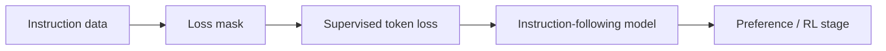

# SFT：Supervised Fine-Tuning

## 当前定位

SFT 是大模型后训练的第一层地基：它把预训练模型从“续写文本”调整为“遵循指令、按格式回答、在特定任务上模仿高质量示范”。在面试中，SFT 不是最前沿的点，但它是理解 DPO、RLHF、GRPO、蒸馏和 Agent 微调的共同前置概念。

> **面试抓手**：SFT 的核心不是“把答案喂给模型背下来”，而是通过高质量 `(instruction, response)` 或多轮对话数据，让模型学习任务格式、回答风格、工具轨迹和领域表达。SFT 解决“会不会做、会不会按格式做”的问题，偏好优化和 RL 进一步解决“哪种回答更好”的问题。

## 核心问题

- 为什么 SFT 通常只对 assistant response 计算 loss？
- SFT 数据质量应该从哪些维度评估？
- SFT 和预训练、DPO、RLHF、GRPO 的边界是什么？
- 为什么 SFT 可能导致过拟合、能力遗忘或回答模板化？
- Agent / Tool-use SFT 为什么要记录完整轨迹而不只是最终答案？

## 训练目标

常见的 decoder-only SFT 仍然是 next-token cross entropy，只是通过 loss mask 控制哪些 token 参与监督。

$$
\mathcal{L}_{SFT}
=-\sum_{t=1}^{T} m_t \log p_\theta(y_t \mid y_{<t}, x)
$$

其中 $m_t$ 是 loss mask。对于聊天数据，system/user prompt 通常作为上下文输入，但不计算 loss；assistant response 才作为监督目标。

**为什么只训 assistant？**

- user 输入不是模型应该生成的目标，否则模型会学会复述用户问题。
- system/user token 作为条件上下文，assistant token 才是策略行为。
- 多轮对话中只训 assistant 可以减少角色混淆。

## 数据质量维度

| 维度 | 检查问题 | 面试表达 |
|---|---|---|
| 正确性 | 答案事实、代码、数学是否正确 | 错数据比少数据更危险 |
| 指令覆盖 | 是否覆盖任务类型、格式、语言、难度 | 防止只学会单一模板 |
| 风格一致性 | 是否符合目标助手风格 | 影响最终产品体验 |
| 去重与污染 | 是否有重复样本、评测集泄漏 | 防止虚高评测和过拟合 |
| 安全与边界 | 是否包含拒答、安全策略、权限边界 | 为后续对齐打基础 |
| 轨迹完整性 | Agent/tool-use 是否包含 Thought/Action/Observation | 训练决策过程，而不是只训练最终答案 |

## 和其他后训练方法的边界

| 方法 | 训练信号 | 适合解决 | 不擅长解决 |
|---|---|---|---|
| SFT | 标准答案 token loss | 格式、任务模仿、领域表达、工具轨迹模仿 | 多答案偏好排序、探索高 reward 行为 |
| DPO | chosen/rejected 偏好对 | 离线偏好对齐 | 需要在线探索的可验证推理 |
| PPO/RLHF | reward + value advantage | 人类偏好优化 | 成本高、训练复杂 |
| GRPO/RLVR | group reward advantage | 数学、代码、可验证推理 | reward 模糊的开放式任务 |
| OPD/GKD | teacher distribution / on-policy distillation | 压缩、稳定迁移 teacher 行为 | teacher 错误和分布外 prefix |

## 常见风险

- **过拟合模板**：数据风格太单一时，模型会生成“看起来很标准但信息量低”的回答。
- **能力遗忘**：小领域数据强训可能破坏基础能力，尤其是全参 SFT。
- **评测泄漏**：训练数据混入 benchmark，会让能力判断失真。
- **拒答泛化错误**：安全数据比例或表述不当，可能导致正常问题被误拒。
- **工具轨迹不完整**：只训练最终答案，不训练工具选择和错误恢复，会导致 Agent SFT 后仍然不会稳定调用工具。

## 面试 QA

**Q：SFT 为什么是后训练地基？**

A：因为它让预训练模型先学会指令格式、回答风格和基础任务行为。没有 SFT，后续 DPO/RLHF/GRPO 的初始策略质量差，rollout 会更不稳定，偏好或 reward 信号也更难利用。

**Q：SFT 和 DPO 的区别是什么？**

A：SFT 学的是“给定输入时模仿一个标准答案”，DPO 学的是“同一个输入下 chosen 比 rejected 更好”。SFT 适合建立基础行为，DPO 适合利用偏好数据调整回答排序。

**Q：Agent SFT 数据应该长什么样？**

A：应该包含任务、可用工具、每一步 Thought/Action/Observation、工具返回、最终答案或完成状态。它训练的是决策轨迹，而不是只训练最终文本。

## 原理代码

关联代码骨架：`sft-loss-mask`。后续可补充：

- assistant-only loss mask 构造。
- packed sequence 下 label shift 和 ignore index。
- tool-use trajectory 的监督样本格式。

## SWIFT / VeRL 视角补强：SFT 与后训练数据准备

> **结论**：SFT 不是只把 `prompt -> answer` 喂给模型。框架里真正重要的是数据字段、chat template、loss mask/loss scale、LoRA/全参后端、以及训练产物如何进入后续 DPO/GRPO/GKD/RL 流程。

### SWIFT 里 SFT 的工程关键词

| 关键词 | 为什么重要 | 面试表达 |
|---|---|---|
| 数据集注册 / `dataset_info.json` | 让训练脚本知道数据来源、字段映射、格式类型 | 大规模训练不应靠临时脚本硬编码字段 |
| chat template | 决定 user/assistant/tool/system 如何被拼接成 token 序列 | template 不一致会导致训练和推理格式错位 |
| loss mask / loss scale | 决定哪些 token 参与 loss、不同片段权重多大 | Agent/tool 数据里工具返回不一定应作为模型生成 token 训练 |
| LoRA / 全参 / Megatron-SWIFT | 对应不同显存、吞吐、稳定性和模型规模 | 面试要能说明为什么 7B LoRA 与 70B/MoE 全参不是同一类工程问题 |
| merge / export / deploy | SFT 只是链路中间环节 | 能把训练产物接到推理、评测、DPO/GRPO/GKD 后续阶段 |

### VeRL 里的后训练数据格式启发

VeRL 的 post-training 数据准备要求把数据预处理成 parquet，并显式包含 `data_source`、`prompt`、`ability`、`reward_model`、`extra_info` 等字段。这对 SFT/RL 都有启发：

- `data_source`：用于路由到对应 reward function 或分析不同数据源表现。
- `prompt`：通常按 HuggingFace chat template 组织，避免训练和推理格式不一致。
- `ability`：标注数学、代码、指令、工具调用等能力维度，方便分桶评估。
- `reward_model.ground_truth`：RLVR/评测时用于规则 reward 或 verifier。
- `extra_info`：保存 index、split、原始来源等调试信息。

### 面试 QA

**Q：为什么 SFT 数据最好保留 `data_source` / `ability` / `extra_info`？**

A：因为后训练不是一次性训练。保留这些字段可以支持按来源评估、按能力分桶、reward function 路由、错误分析和数据回溯。尤其进入 GRPO/RLVR 后，reward 与数据源强相关，字段丢失会让训练和排障变得很困难。

**Q：chat template 错位会带来什么问题？**

A：模型训练时看到的角色标记、工具格式、assistant 起始符和推理时不一致，会导致格式遵循能力下降，甚至让工具调用、函数参数、停止符全部错位。SFT 的有效性很大一部分来自格式一致性。

### 知识索引引用

| 知识点 | 来源 |
|---|---|
| SWIFT 预训练/微调、数据集、自定义模板、Megatron-SWIFT 能力目录 | https://swift.readthedocs.io/zh-cn/latest/index.html |
| VeRL post-training parquet 数据字段 | https://verl.readthedocs.io/en/latest/preparation/prepare_data.html |

## 知识索引引用

| 知识点 | 主要来源 | 本页使用方式 |
|---|---|---|
| SFT loss mask 与 assistant-only loss | InstructGPT / RLHF 基础流程、开源 SFT 实践 | 用于解释为什么 prompt 作为条件而 response 作为监督 |
| SFT 与 DPO/RLHF/GRPO 边界 | DPO、PPO、GRPO、OPD 相关章节 | 用于构建后训练方法对比表 |
| Agent SFT 轨迹数据 | Hello-Agents Extra01 与 Agent 面试实战材料 | 用于说明工具调用和决策轨迹监督 |
