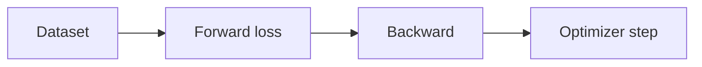
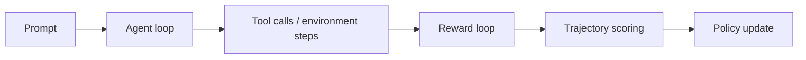
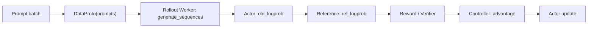
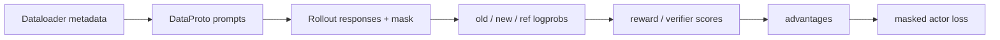

# VeRL：RL 后训练系统框架

## 当前定位

VeRL 是面向 LLM 后训练的 RL 框架，核心价值不是“又实现了 PPO/GRPO”，而是把 RLHF / RLVR 的复杂训练过程抽象成 **控制流 + 计算流 + WorkerGroup + ResourcePool + DataProto**。这让算法研究者能改 PPO/GRPO/DAPO/OPD 的控制逻辑，同时复用 FSDP、Megatron-LM、vLLM、SGLang 等训练和推理后端。

> **面试抓手**：VeRL 适合回答“一个大模型 RL 后训练系统应该如何拆组件”。SWIFT 更偏算法应用入口；VeRL 更偏 RL dataflow 编排；Slime 更偏 Megatron + SGLang 的 scaling 闭环。

```archify
VeRL HybridFlow Dataflow|assets/diagrams/html/verl-hybridflow-dataflow.html
```

## 一、核心架构与角色拆分

### 为什么 RL 后训练不是普通 trainer

普通 SFT trainer 大致是：



RLHF / RLVR trainer 则至少包含：


差异在于：

- **生成是训练的一部分**：每个 step 先用当前 policy rollout。
- **模型角色多**：actor、rollout engine、reference、critic、reward model / rule verifier 可能都是不同 worker。
- **数据形态复杂**：prompt、response、old logprob、ref logprob、values、token rewards、advantages、masks 都要对齐。
- **系统瓶颈混合**：rollout 是推理瓶颈，update 是训练瓶颈，中间还有权重同步和数据搬运。

### HybridFlow：控制流和计算流解耦

VeRL 文档强调 RL 是 dataflow 问题。它把 RL 程序分成两层：

| 层次 | 解决什么 | 例子 |
|---|---|---|
| 控制流 | 算法步骤如何串起来 | 先 rollout，再算 reward / advantage，再 update actor |
| 计算流 | 每个重计算如何分布式执行 | FSDP forward/backward、Megatron 并行、vLLM/SGLang 生成 |

VeRL 采用 **single-controller + distributed workers** 的 HybridFlow 设计：controller 在单进程里写算法主循环，worker 在 Ray 上分布式执行重计算。好处是：

- 改算法时主要改 controller，不必重写 FSDP/Megatron/vLLM 计算后端。
- 换后端时可以复用同一套 PPO/GRPO 控制流。
- 资源放置更灵活，不同角色可以放在不同 ResourcePool。

代价是 controller 和 workers 之间有数据通信开销，所以 VeRL 需要 DataProto、dispatch/collect 协议和 colocate worker 来降低系统成本。

### 核心对象：Controller / WorkerGroup / DataProto

| 对象 | 作用 | 面试表达 |
|---|---|---|
| Controller / RayPPOTrainer | 单进程算法主循环 | “算法脑子”：决定 rollout、reward、advantage、update 的顺序 |
| Worker | 具体远程计算角色 | actor forward、生成、reference logprob、critic value、reward score |
| WorkerGroup | 同一类 worker 的集合 | 封装数据切分、远程调用、结果聚合 |
| ResourcePool | GPU 资源分配 | 决定 actor、critic、reward、rollout 是否共卡或分池 |
| DataProto | 训练 step 的数据容器 | 统一携带 tensors、metadata、masks、metrics |

VeRL 的一个关键设计是 Worker method 通过注册 dispatch mode 来描述数据如何切分和收集。例如输入 batch 按 data parallel 维度切给多个 worker，完成后再拼回 controller。

## 二、训练数据流与字段对齐

### PPO / GRPO 数据流

一个典型 PPO 数据流可以写成：


对应角色：

| 步骤 | 角色 | 产物 |
|---|---|---|
| rollout | actor_rollout worker + vLLM/SGLang | responses、attention masks、position ids |
| actor logprob | actor | old_log_prob / current_log_prob |
| reference logprob | reference policy | ref_log_prob，用于 KL |
| value | critic | token values |
| reward | reward model / rule reward | token_level_scores |
| advantage | controller | GAE / GRPO group advantage / RLOO 等 |
| update | actor / critic | policy loss、value loss、entropy、grad norm |

GRPO 可以去掉 critic/value 相关步骤，用 group relative advantage 替代 value baseline；DAPO、GSPO、OPD、DPPO 等则是在 advantage、ratio、KL、rollout correction 或 distillation signal 上改控制逻辑。

### Worker 放置与 colocation

VeRL 允许把 actor、rollout、reference、critic、reward 放在不同资源池，也支持把某些角色 colocation。

| 放置方式 | 优势 | 风险 |
|---|---|---|
| actor + rollout 共置 | 权重同步快，rollout 直接用最新 actor | 显存压力大，训练/推理资源抢占 |
| actor + reference 共置 | LoRA PPO 中 reference 可以是 base model | 角色耦合更强 |
| critic / reward 独立资源池 | 资源隔离，扩展清晰 | 数据传输更多 |
| Megatron 多角色共进程 | 减少重复 CUDA / distributed context | 不同角色并行度可能难以分别调 |

面试中可以这样说：colocation 是在 **显存、通信、权重同步延迟和资源利用率** 之间做 trade-off。

## 三、工程后端与资源放置

### 后端：FSDP / Megatron / vLLM / SGLang

VeRL 的工程价值在于连接训练后端和推理后端：

| 后端 | 位置 | 解决问题 |
|---|---|---|
| PyTorch FSDP / FSDP2 | actor / critic / reward 训练 | 参数、梯度、optimizer state 分片 |
| Megatron-LM | 大模型训练后端 | tensor / pipeline / expert / context parallel |
| vLLM | rollout 推理 | 高吞吐生成、PagedAttention、continuous batching |
| SGLang | rollout 推理 / Agentic RL | 多轮、结构化、工具调用、共享前缀场景 |
| TensorRT-LLM | 推理后端 | 更偏高性能推理部署 |

VeRL 首页和性能文档还强调 3D-HybridEngine、actor resharding、rollout/training 阶段切换，这说明 RL 后训练系统的难点不是单次 forward，而是 **训练引擎和推理引擎之间的权重形态转换与数据搬运**。

## 四、算法扩展与高级能力

### Algorithm 面：不只是 PPO/GRPO

VeRL 文档里的算法模块可以按问题类型理解：

| 算法/Recipe | 问题类型 | 知识库连接 |
|---|---|---|
| PPO | RLHF 基础算法 | PPO clip、critic、GAE |
| GRPO | critic-free group baseline | GRPO 章节 |
| DAPO | RLVR 稳定 recipe | GRPO 高级谱系 |
| SPIN / SPPO | self-play / preference self-play | SFT-RL 数据自举 |
| Entropy Mechanism | 探索与熵控制 | 高熵 token / entropy collapse |
| OPO / GPG / OTB | baseline / advantage 估计 | 多步 RL / 方差降低 |
| Rollout Correction / DPPO | off-policy / divergence 修正 | training-inference mismatch |
| OPD | on-policy distillation | 知识蒸馏 / OPD |

面试时不要背算法清单，而是说清楚它们分别改 **reward、advantage、ratio、KL、rollout correction、distillation signal** 哪个环节。

### Agentic RL 与多轮 rollout

VeRL 的 Advanced Features 包含 multi-turn rollout、Agent Loop、Reward Loop、Sandbox Fusion、Prometheus/Grafana rollout monitoring 等。这说明它已经从单轮数学题 RLVR 扩展到 Agentic RL：



关键面试点：

- 单轮 RLVR 的 response 是一段文本；Agentic RL 的 response 是多轮轨迹。
- reward 不一定只来自最终答案，也可能来自工具结果、环境状态、代码沙箱、搜索过程。
- rollout engine 不只是 batch generation，还要处理 stop condition、tool schema、environment state 和超时。
- SGLang 等结构化推理后端更适合复杂多轮 rollout。

### 异步训练与 off-policy 风险

VeRL 有 one-step off-policy async trainer、fully async policy trainer、async on-policy knowledge distillation trainer 等文档。异步化的核心动机是提高资源利用率：rollout 和 training 不必完全串行等待。

但异步会带来 off-policy 风险：

- rollout 使用的是旧 actor 权重。
- update 时 actor 已经变了，policy ratio 可能偏离。
- reward / reference / tokenizer / chat template 版本必须保持一致。

所以异步 RL 需要 versioning、staleness control、importance correction 或 rollout correction。

## 五、稳定性、排障与横向比较

### 性能与稳定性面试点

| 问题 | VeRL 关注点 |
|---|---|
| 训练大 MoE | Megatron backend、expert parallel、context parallel、optimizer offload |
| rollout 慢 | vLLM/SGLang、KV cache、Mooncake-Store offload、continuous batching |
| 显存不够 | FSDP/Megatron sharding、offload、recomputation、sequence balance |
| step time 高 | actor/rollout/ref colocation、resharding、serialization overhead |
| 难 debug | Ray timeline、verl profiler、Nsight、PyTorch profiler、metrics |
| 结果不可复现 | full determinism、seed、数据顺序、采样配置、分布式 nondeterminism |

### 与 SWIFT / Slime 的区别

| 维度 | SWIFT | VeRL | Slime |
|---|---|---|---|
| 定位 | 算法应用与训练实验入口 | RL dataflow 编排框架 | Megatron + SGLang 的 RL scaling 闭环 |
| 最适合回答 | “我怎么配置 SFT/GRPO/GKD/DPO/RFT” | “我怎么设计一个 RL 后训练系统” | “我怎么把大规模训练和 rollout 串起来” |
| 抽象核心 | 模型/数据/算法/评测配置 | Controller、WorkerGroup、DataProto、ResourcePool | data buffer、weight sync、agentic rollout |
| 推理后端 | vLLM / LMDeploy 等 | vLLM / SGLang / TensorRT-LLM | SGLang |
| 训练后端 | HF/DeepSpeed/Megatron-SWIFT | FSDP/Megatron 等 | Megatron |

## 六、面试 QA

**Q：VeRL 的 HybridFlow 解决什么问题？**

A：它把 RL 算法控制流和分布式模型计算流解耦。controller 像单进程一样写 PPO/GRPO 主循环，worker 负责 FSDP/Megatron/vLLM/SGLang 等重计算。这样算法容易改，后端也容易换。

**Q：为什么 PPO/GRPO 后训练需要 actor、rollout、reference、critic、reward 多个角色？**

A：actor 负责被优化的策略；rollout 负责采样；reference 负责 KL 约束；critic 提供 value baseline；reward model 或 rule verifier 提供奖励。GRPO 可以省 critic，但 reference、rollout 和 reward/verifier 仍然重要。

**Q：DataProto 在 VeRL 里有什么价值？**

A：它统一承载 prompt、response、logprob、reward、advantage、mask、metadata 等数据，让 controller 和 worker 之间的数据传递、切分和聚合更稳定。

**Q：actor 和 rollout 为什么常常共置？**

A：因为 rollout 需要最新 actor 权重，共置可以减少权重同步和数据搬运；但会增加单组 GPU 的显存压力。

**Q：VeRL 如何支持 GRPO / DAPO / OPD 这类新算法？**

A：这些方法通常不需要重写底层 FSDP/Megatron/vLLM 后端，而是在 controller 的 advantage、ratio、clip、KL、reward 或 distillation signal 计算处改控制逻辑。

**Q：异步 RL 最大风险是什么？**

A：rollout policy 和 update policy 不一致，导致 off-policy 偏差。需要控制 staleness、记录权重版本、做 importance correction 或 rollout correction。

## 七、官方文档精读补强

> **结论**：VeRL 面试重点不是 API 名字，而是能解释为什么 LLM RL 需要把算法控制流和模型计算流解耦。只要讲清楚 HybridFlow、WorkerGroup、DataProto、rollout engine、reward/advantage、actor update 之间的关系，就能体现你理解后训练系统复杂度。

### 1. HybridFlow 的核心动机

VeRL 文档把 RL 系统看成 dataflow。传统神经网络训练的数据流节点通常是 matmul、softmax、loss 这类算子，边是 tensor movement；但 LLM RL 的节点是更高层的 rollout、model forward、reward、advantage、actor update，边是跨进程/跨服务的数据移动。

因此 VeRL 把系统拆成两层：

| 层次 | 负责什么 | 举例 |
|---|---|---|
| Control flow | 算法主循环和高层执行顺序 | rollout -> reward -> advantage -> update |
| Computation flow | 大模型前向、反向、优化器和并行后端 | FSDP、Megatron、vLLM、SGLang、TensorRT-LLM |

这种设计的意义是：算法研究者可以在 controller 里改控制流，系统工程侧可以替换底层训练/推理后端，两者不用强耦合。

### 2. PPO/GRPO 训练链路如何拆


| 阶段 | 数据 | 常见问题 |
|---|---|---|
| Rollout | prompt、response、attention mask、position ids | 推理吞吐低、长上下文显存高、引擎与训练权重同步慢 |
| Logprob | old logprob、actor logprob、ref logprob | off-policy 复用时 ratio 漂移，KL 估计不稳定 |
| Reward | rule reward、reward model、token reward、final reward | verifier 噪声、奖励稀疏、reward hacking |
| Advantage | GAE、GRPO、RLOO、OPO、OTB 等 | baseline 偏差、方差大、长度偏差 |
| Actor update | PPO/GRPO/DAPO/OPD loss | clip、KL、loss aggregation、micro batch OOM |
| Metrics | reward、length、KL、clip fraction、acceptance rate | 指标看不全会误判训练是否真的变好 |

### 3. 为什么 VeRL 同时关心 vLLM/SGLang

RLHF/RLVR 不是只有训练，rollout 本身就是大头成本。VeRL 文档把 vLLM、SGLang、TensorRT-LLM 等推理后端放到 trainer/worker 体系里，是因为每轮训练都要生成大量 response。面试可以说：**后训练框架必须把训练并行和推理 serving 同时纳入系统设计，否则 rollout 成本会成为瓶颈。**

### 4. 算法扩展怎么落到 VeRL

| 想扩展的内容 | 在 VeRL 里通常改哪里 | 例子 |
|---|---|---|
| 新 advantage | algorithm/adv_estimator 或 advantage 计算函数 | GRPO、RLOO、OPO、OTB |
| 新 policy loss | actor loss 计算 | DAPO clip higher、CISPO、GSPO 类 ratio 改造 |
| 新 reward | RewardManager / reward function | 规则 reward、代码单测、PRM/ORM、视觉工具 reward |
| 新 rollout 结构 | rollout worker / agent loop / multi-turn rollout | ReAct、多轮工具调用、agentic RL |
| 新推理加速 | rollout engine 配置 | vLLM、SGLang、MTP、KV cache offload |

### 5. VeRL 排障清单

- reward 上升但 eval 不升：检查 reward hacking、验证器覆盖率、训练集泄漏、采样温度。
- KL 突然升高：检查 learning rate、clip ratio、KL coef、reference model、old logprob 是否对齐。
- response 越来越长：检查 loss aggregation、overlong reward shaping、DrGRPO、length metrics。
- rollout 慢：检查 vLLM/SGLang 配置、batch、max response length、KV cache、权重同步。
- 显存 OOM：检查 micro batch、sequence length、FSDP/Megatron 配置、activation checkpoint、offload。
- 多机不稳定：检查 Ray 资源池、head node 压力、checkpoint、worker 重启和日志链路。

### 面试 QA

**Q：VeRL 的 HybridFlow 相比把所有逻辑写进一个分布式 trainer 有什么好处？**

A：它把算法控制流和模型计算流解耦。控制流保留在单进程 controller 中，便于快速实现新 RL 算法；计算流交给 FSDP/Megatron/vLLM/SGLang 等后端，便于扩展大模型训练和推理。代价是 controller 与 worker 之间有数据通信开销。

**Q：为什么 GRPO 在 VeRL 里仍然有很多 `ppo_` 前缀配置？**

A：因为 GRPO 的训练主循环和 PPO 很像，差异主要在 advantage 估计和 critic 是否存在。框架复用 PPO 的 actor update、mini-batch、epoch、clip、KL 等配置是合理的。

**Q：后训练系统里最重要的监控指标有哪些？**

A：至少要看 reward/eval accuracy、response length、KL、clip fraction、entropy、rollout throughput、OOM/重试、reward 分布、group reward std、训练和推理引擎的延迟。只看 reward 很容易被 reward hacking 或长度偏差误导。

### 知识索引引用

| 知识点 | 来源 |
|---|---|
| HybridFlow control flow / computation flow | https://verl.readthedocs.io/en/latest/hybrid_flow.html |
| VeRL 总目录：算法、Worker、性能、异步、MTP、高级功能 | https://verl.readthedocs.io/en/latest/ |
| VeRL GRPO 配置与 DrGRPO | https://verl.readthedocs.io/en/latest/algo/grpo.html |
| VeRL DAPO recipe | https://verl.readthedocs.io/en/latest/algo/dapo.html |
| VeRL OPD | https://verl.readthedocs.io/en/latest/algo/opd.html |
| VeRL MTP | https://verl.readthedocs.io/en/latest/advance/mtp.html |

### VeRL 高级算法入口：面试化解释

VeRL 官方目录把 PPO、GRPO、DAPO、OPO、GPG、Rollout Correction、OTB、DPPO、OPD、Async Training、Agent Loop、MTP 等放在同一个 RL dataflow 体系下。可以把这些方法理解成对后训练系统四个风险的修补：

| 风险 | 典型表现 | VeRL 相关机制 | 面试回答抓手 |
|---|---|---|---|
| 方差过大 | reward 稀疏、group 内差异小、token credit 不清楚 | GRPO、OPO、OTB、GPG | baseline/advantage 的核心是降低方差，不是改变 reward 本身 |
| 策略漂移 | rollout 来自旧策略，update 时 ratio/KL 失控 | PPO clip、DPPO、Rollout Correction、Async Trainer | 高吞吐和 on-policy 严格性天然冲突，需要 correction 或 staleness 控制 |
| 长度偏差 | 长回答梯度权重大、超长截断污染 reward | DAPO token-level loss、overlong filtering、soft overlong | 不能只看 reward，要同时监控 length、clip fraction、KL |
| 系统瓶颈 | rollout 慢、KV cache 大、权重同步频繁 | vLLM/SGLang、MTP、KV cache offload、3D-HybridEngine | RL 后训练是训练系统 + 推理系统的耦合，不是单纯 trainer |

### Rollout Correction 怎么讲

Rollout Correction 的背景是：RL 训练会先用当前或稍旧策略生成 response，再用新策略计算 loss。如果生成策略和更新策略差异变大，importance ratio 会变得不可靠，训练容易 off-policy。Correction 类方法尝试重加权、截断或修正这些旧 rollout 的贡献。

面试回答模板：**rollout correction 不是为了“复用旧数据越多越好”，而是在吞吐和 on-policy 准确性之间找平衡；复用越多，样本效率越高，但策略分布偏差也越大。**

### OPO / OTB / DPPO 怎么区分

| 方法 | 直觉 | 适合怎么追问 |
|---|---|---|
| OPO | 设计更优 reward baseline，减少 policy gradient 方差 | 和 GRPO/RLOO 的 baseline 差别是什么？ |
| OTB | 把 baseline 下沉到 token 粒度，改善长序列 credit assignment | 为什么 sequence-level reward 对长回答不够细？ |
| DPPO | 用 divergence 约束策略更新，关注策略分布偏移 | DPPO 与 PPO clip / KL penalty 有什么关系？ |

### Async Training 的核心取舍

异步训练让 rollout worker 和 training worker 并行，吞吐更高，但会引入 policy version lag。面试中要主动补一句：异步 RL 的关键不是“开更多 worker”，而是要监控 rollout staleness、old logprob、KL、ratio 分布和 eval 指标，必要时用 correction 或缩短队列长度。

### Agent Loop / Reward Loop 的工程意义

Agentic RL 的样本不是单轮 prompt-response，而是多轮 observation-action-observation 轨迹。VeRL 的 Agent Loop / Reward Loop 入口说明框架需要支持：

- 多轮 tool call 和环境状态；
- 对 assistant token 计算 response mask；
- 对 tool observation、system message、环境返回做 loss 屏蔽；
- final reward、step reward、tool success reward 混合；
- 失败轨迹回放和可验证任务 reward。

**结论**：Agent RL 比普通 GRPO 更难，是因为 reward 更延迟、轨迹更长、状态更复杂、工具错误会污染后续上下文。

## 八、源码级数据流与字段契约

VeRL 官方 HybridFlow guide 给出的 PPO 主循环很适合作为面试骨架：controller 代码看起来像普通 Python 顺序程序，但每一步实际可以调度到不同 WorkerGroup。核心链路是：`generate_sequences -> compute_log_prob -> compute_ref_log_prob -> compute_values / reward -> compute_advantages -> update_actor / update_critic`。



### DataProto 字段流怎么讲

| 阶段 | DataProto 新增字段 | 谁产生 | 面试解释 |
|---|---|---|---|
| prompt batch | `prompts`、`attention_mask`、`position_ids`、metadata | dataloader | 数据入口不只是 token，还要带任务来源、reward function、采样参数等元信息 |
| rollout | `responses`、`response_mask`、`input_ids` | rollout worker / vLLM / SGLang | response mask 决定哪些 token 参与 loss；Agent 场景还要屏蔽 tool observation |
| actor logprob | `old_log_probs` | actor worker | PPO/GRPO ratio 的分母，必须和 rollout policy 版本对齐 |
| reference logprob | `ref_log_probs` | reference worker | KL 约束来源；GRPO 文档建议直接在 loss 里加 KL，而不是混入 reward |
| value / critic | `values` | critic worker | PPO 需要，GRPO 通常不需要 critic |
| reward | `token_level_scores` 或 final reward | reward worker / rule verifier | 数学题、代码题、Agent 任务都可以接不同 reward manager |
| advantage | `advantages`、`returns` | controller | GAE、GRPO、RLOO、OPO、OTB 的差异主要在这里 |
| update | loss、KL、clip fraction、entropy、grad norm | actor / critic worker | 训练是否稳定要看指标组合，不能只看 reward |

### 为什么这比普通 Trainer 更难

普通 SFT batch 只需要 `input_ids -> loss -> backward`。VeRL 这类 RL 后训练系统必须把 **推理生成、训练前向、reward/verifier、advantage、分布式 update** 串成闭环。难点不只是写 loss，而是字段对齐、mask 对齐、版本对齐和资源对齐：

- **字段对齐**：response、old logprob、ref logprob、reward、advantage 必须在同一 token 粒度上对齐。
- **mask 对齐**：prompt token、padding token、tool observation、system message 不应误入 actor loss。
- **版本对齐**：异步或复用 rollout 时，要知道样本来自哪个 policy version。
- **资源对齐**：rollout 是推理系统，actor update 是训练系统，中间有权重同步和 tensor 搬运。

### 字段对齐面试图谱

VeRL / SWIFT 这类后训练框架最容易被面试追问的不是“PPO 公式怎么写”，而是 **字段从哪里来、在哪个 worker 算、最后如何在 token 维度对齐**。可以按下面这张表回答：

| 字段 | 来源 | 粒度 | 用在什么地方 | 常见 bug |
|---|---|---|---|---|
| `prompts` / `input_ids` | dataloader / tokenizer | prompt + response | rollout、logprob、attention mask | prompt 模板和训练模板不一致 |
| `responses` | rollout worker：vLLM / SGLang | response token | reward、logprob、actor update | 截断、EOS、padding 处理不一致 |
| `response_mask` / `loss_mask` | rollout / chat template / agent loop | token | 屏蔽 prompt、padding、tool observation | 工具返回被算进 loss |
| `old_logprobs` | rollout policy / actor worker | token | PPO/GRPO ratio 分母 | rollout 版本和 update 版本错位 |
| `new_logprobs` | 当前 actor forward | token | policy loss | micro-batch 拼接后顺序错 |
| `ref_logprobs` | reference worker | token | KL penalty / KL loss | reference 模型、模板或 tokenizer 不一致 |
| `values` | critic worker | token / step | PPO GAE | GRPO 通常没有 critic，不要硬讲 value model |
| `token_level_scores` / `rewards` | reward worker / verifier | token / sequence | advantage 计算 | reward shape 和 response shape 不匹配 |
| `advantages` | controller | token / sequence / group | actor loss | group、step、token 归一化粒度搞错 |

**面试结论**：后训练框架的核心质量门槛是四个对齐：token 对齐、mask 对齐、policy version 对齐、reward/advantage 粒度对齐。只会写 loss，但讲不清这些字段，就还没有真正理解 RLHF/RLVR 系统。



### WorkerGroup / ResourcePool 面试追问

VeRL 文档里 ActorRolloutRef、Critic、Reward 会被组织成 WorkerGroup，并放进不同 ResourcePool。这个设计不是为了概念漂亮，而是为了解决后训练里的资源冲突：rollout 是推理负载，actor update 是训练负载，reward/verifier 可能是规则、模型或外部服务。

| 放置选择 | 为什么这么放 | 代价 |
|---|---|---|
| actor + rollout 共置 | 权重同步最快，rollout 可以及时用新 policy | 显存压力大，训练/推理抢资源 |
| actor + reference 共置 | LoRA PPO 中 reference 可能复用 base model | 角色耦合，扩展性变弱 |
| critic 单独资源池 | PPO value model 可独立扩缩容 | 增加数据传输 |
| reward 单独资源池 | RM / PRM / verifier 不阻塞 rollout | reward 延迟和吞吐需要监控 |
| rollout 使用 vLLM/SGLang | 提升生成吞吐，支持多轮工具或长上下文 | 需要处理权重同步、KV cache 和模板一致性 |

回答模板：**VeRL 的 WorkerGroup 是“角色抽象”，ResourcePool 是“资源放置抽象”，DataProto 是“字段契约”。这三个合起来，才让 GRPO/DAPO/OPD/Agentic RL 能复用同一套后训练系统。**

### SWIFT 与 VeRL 怎么横向比较

| 维度 | SWIFT 更像 | VeRL 更像 | 面试表达 |
|---|---|---|---|
| 入口 | 算法应用和训练 recipe | RL dataflow 与分布式编排 | SWIFT 适合快速跑通算法，VeRL 适合解释系统链路 |
| 关注点 | GRPO/DAPO/蒸馏/采样/评测的一体化使用 | WorkerGroup、DataProto、ResourcePool、rollout/reward/update | 一个偏“怎么用”，一个偏“系统怎么拆” |
| 数据闭环 | sample、filter、eval、train | rollout、logprob、reward、advantage、update | 面试里可以用 SWIFT 讲流程，用 VeRL 讲底层字段 |
| 扩展算法 | 修改训练参数、reward、loss recipe | 修改 controller、worker、advantage、actor loss | 研究实现通常两者思路可以互补 |

### GRPO / DAPO / OPD 在链路里改哪里

| 方法 | 主要改动位置 | 对 DataProto 的影响 | 面试结论 |
|---|---|---|---|
| GRPO | advantage 计算 | 需要按同 prompt 的 group rewards 计算相对优势 | 去掉 critic，但没有去掉 rollout、reward、KL 和 mask 问题 |
| DAPO | sampling、clip、loss aggregation、overlong reward | 需要 group reward 方差、response length、token-level loss mask | 它是稳定训练 recipe，不是简单把 GRPO 换个名字 |
| OPD | reward / distillation signal | 需要 teacher logprob 或 full-vocab teacher distribution | OPD 可以作为 KL loss，也可以把 teacher log-ratio 变成 sampled-token reward |
| Agentic RL | rollout / reward / mask | 需要 multi-turn trace、tool result、response mask、step reward | Agent RL 的本质是更长、更噪、更难对齐的 RL dataflow |

关联原理代码：[VeRL DataProto / rollout / reward / advantage loop](#principle-code/verl-dataflow-loop)。这段代码不是复刻 VeRL，而是把面试时最该手写的抽象保留下来：`MiniDataProto.union()` 如何逐步补齐字段，controller 如何串起多个 worker 函数，以及 `validate_verl_token_alignment()` / `verl_masked_policy_loss()` 如何检查 token 级字段对齐并计算 masked actor loss。

### 60 秒面试回答模板

VeRL 的核心不是某个 PPO/GRPO loss，而是把 LLM RL 后训练建模成 dataflow。controller 写 rollout、logprob、reward、advantage、update 的顺序；WorkerGroup 把每个重计算分发到 FSDP、Megatron、vLLM、SGLang 等后端；DataProto 统一携带 prompt、response、logprob、reward、advantage 和 mask。这样算法研究者改 GRPO/DAPO/OPD 时，主要改 reward、advantage 或 actor loss，不必重写底层分布式训练和推理引擎。

## 关联资源

| 资源 | 链接 | 为什么重要 |
|---|---|---|
| VeRL 官方目录 | https://verl.readthedocs.io/en/latest/ | 查看算法、Worker、性能、异步、Agent Loop、Reward Loop、MTP 等完整入口 |
| HybridFlow Programming Guide | https://verl.readthedocs.io/en/latest/hybrid_flow.html | 官方给出 RL dataflow、WorkerGroup、DataProto 和 PPO main loop 的关键解释 |
| VeRL GRPO 文档 | https://verl.readthedocs.io/en/latest/algo/grpo.html | 说明 `adv_estimator=grpo`、`loss_agg_mode`、KL loss 和 DrGRPO 配置 |
| Reward Function 文档 | https://verl.readthedocs.io/en/latest/preparation/reward_function.html | 理解 reward manager / rule verifier 如何接入数据集 |
| VeRL Agent Loop | https://verl.readthedocs.io/en/latest/advance/agent_loop.html | 理解多轮 Agentic RL 的 trace、mask 和异步 rollout 问题 |
| VeRL Reward Function | https://verl.readthedocs.io/en/latest/preparation/reward_function.html | 理解 ground_truth、data_source、extra_info 如何进入 reward 计算 |

## 后续补全计划

- 补 actor/rollout/ref/critic/reward 的资源池放置 SVG。
- 补 vLLM/SGLang rollout 与 FSDP/Megatron training 的权重同步流程。
- 将 VeRL 的 OPO、GPG、OTB、DPPO、Rollout Correction 继续并入 GRPO 高级谱系。

## 知识索引引用

| 知识点 | 主要来源 | 本页使用方式 |
|---|---|---|
| VeRL 定位、HybridFlow、3D-HybridEngine | VeRL 首页 | 用于定义 VeRL 是 RL 后训练 dataflow 框架，而不是普通 trainer |
| 控制流 / 计算流解耦 | HybridFlow Programming Guide | 用于解释 single-controller + distributed workers 的核心设计 |
| Controller、WorkerGroup、DataProto | HybridFlow Programming Guide、PPO Ray Trainer | 用于整理 VeRL 的核心工程对象 |
| PPO 数据流 | PPO Ray Trainer、PPO Example Architecture | 用于抽象 generate -> logprob -> reward -> advantage -> update 流程 |
| token 字段对齐、DataProto 输入输出、WorkerGroup dispatch/collect | HybridFlow Programming Guide、Reward Function 文档 | 用于补强字段来源、形状、mask 和 reward/advantage 对齐问题 |
| actor / rollout / reference / critic / reward 角色 | HybridFlow Programming Guide、PPO Ray Trainer | 用于面试中讲 RLHF/RLVR 系统拆分 |
| FSDP / Megatron / vLLM / SGLang 后端 | VeRL 首页、SGLang Backend、Training DeepSeek 671B | 用于训练后端和 rollout 后端的横向比较 |
| Agentic RL、多轮 rollout、Agent Loop | VeRL 首页、Agent Loop、Multi-turn Rollout Support | 用于说明 VeRL 如何扩展到工具调用和多轮环境交互 |
| 异步 RL 与 off-policy 风险 | VeRL Async Training 文档入口 | 用于解释 rollout staleness、policy version 和 correction 的必要性 |
| 大规模 MoE / DeepSeek 671B / Qwen3-235B | Training DeepSeek 671B | 用于说明 VeRL + Megatron scaling 的工程关注点 |

## 参考资料

- VeRL documentation: `https://verl.readthedocs.io/en/latest/`
- HybridFlow Programming Guide: `https://verl.readthedocs.io/en/latest/hybrid_flow.html`
- PPO Ray Trainer: `https://verl.readthedocs.io/en/latest/workers/ray_trainer.html`
- GRPO algorithm docs: `https://verl.readthedocs.io/en/latest/algo/grpo.html`
- DAPO recipe docs: `https://verl.readthedocs.io/en/latest/algo/dapo.html`
- SGLang Backend docs: `https://verl.readthedocs.io/en/latest/workers/sglang_worker.html`
- Training DeepSeek 671B docs: `https://verl.readthedocs.io/en/latest/perf/dpsk.html`

