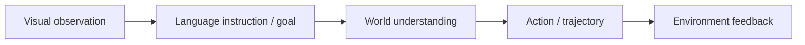
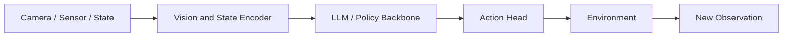
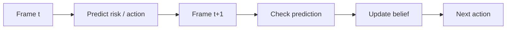
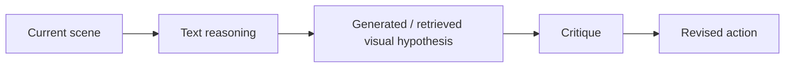

# VLA：视觉-语言-动作与自动驾驶/具身智能

## 当前定位

VLA（Vision-Language-Action）是在 VLM 之上进一步接入动作空间：输入不只是图像和语言，输出也不只是文本，而是可执行动作、轨迹、控制指令或工具动作。它常见于机器人、自动驾驶、GUI/Web Agent 和具身智能。

> **面试抓手**：VLM 解决“看懂并说出来”，VLA 解决“看懂、理解目标并行动”。因此 VLA 的核心难点从语义对齐扩展到动态世界建模、空间几何、动作表示、闭环评估和安全约束。

## VLA 和 VLM 的边界

| 维度 | VLM | VLA |
|---|---|---|
| 输入 | 图像/视频 + 文本 | 图像/视频/传感器 + 指令 + 历史状态 |
| 输出 | 文本回答、描述、判断 | 动作 token、连续控制、轨迹、工具调用 |
| 核心目标 | 视觉语言理解 | 视觉语言条件下的决策和控制 |
| 训练数据 | 图文对、VQA、视觉指令 | observation-instruction-action trajectory |
| 评估 | VQA/OCR/grounding/幻觉 | 任务成功率、碰撞率、轨迹误差、闭环回报 |
| 主要风险 | 视觉幻觉、OCR 错误、定位不准 | 分布漂移、动作不可执行、闭环误差累积、安全事故 |

## 通用架构

一个 VLA 系统通常可以拆成四层：

| 层次 | 作用 | 常见实现 |
|---|---|---|
| 感知编码 | 把图像、视频、传感器、状态编码为视觉/状态 token | ViT、DINOv2、SigLIP、BEV/3D token、occupancy、flow |
| 跨模态融合 | 把视觉状态与语言目标对齐 | projector、Q-Former、cross-attention、DeepStack、多层视觉注入 |
| 决策建模 | 根据历史、目标和当前状态决定下一步 | autoregressive policy、trajectory decoder、planner head、diffusion policy head |
| 执行与反馈 | 将动作落到环境并观察结果 | robot controller、trajectory tracker、simulator、closed-loop evaluator |

## 动作输出方式

轨迹或动作怎么表示不是唯一答案，关键要看控制频率、动作连续性、推理延迟和安全约束。

| 输出方式 | 代表思路 | 优点 | 局限 |
|---|---|---|---|
| 文本动作 | 把动作离散化为文本 token | 能复用 LLM 生成能力，解释性强 | 连续控制精度有限，解码慢 |
| special action token | 输出特殊 token 后映射到动作 | 训练接口相对统一 | 需要稳定的 token-action 映射 |
| 连续轨迹 head | 直接回归未来轨迹点 | 适合自动驾驶规划 | 解释性弱，对分布漂移敏感 |
| diffusion head | 用扩散模型生成动作/轨迹 | 多模态轨迹表达强，工业上常用于快速生成 | 训练和部署链路更复杂 |
| tool / planner call | 调用规划器、地图、几何测距工具 | 可控、可验证 | 依赖工具质量和调用策略 |

**结论**：青稞 VLA 文章里提到“轨迹输出方式不重要”可以理解为：在上层语义决策能力足够时，动作头更多是工程取舍；但在真实部署里，latency、稳定性、可解释和安全边界会决定最终形态。

## 自动驾驶 VLA 的核心难点

| 难点 | 为什么难 | 可讲的解决方向 |
|---|---|---|
| 视觉幻觉 | VLM 静态感知和语言先验容易“无中生有”或“视而不见” | 动态感知、多次校验、DPO/GRPO 偏好约束、允许回看/放大/测距 |
| 3D 空间不足 | 大量预训练任务是 2D 图文对，缺少深度、速度、遮挡、拓扑关系 | 3D occupancy、flow、BEV、空间定位任务、具身数据混训 |
| 速度慢 | VLM/VLA token 多、视觉编码重、解码长 | KV cache、视觉 token 压缩、按需思考、prompt-conditioned reasoning |
| 开闭环差异 | 离线训练最小化模仿误差，在线部署追求累计回报 | closed-loop 仿真、反事实评估、RL/偏好学习、行为分布修正 |
| 灾难性遗忘 | 只在动作数据上训练会削弱原始视觉语言能力 | replay 预训练图文数据，混合任务训练，多任务联合优化 |

## 为什么 VLA 需要动态感知

自动驾驶和机器人不是静态看图任务。模型看到的是连续环境，动作会反过来改变后续观测。因此单帧 VLM 可能能描述场景，却不一定能做安全决策。

动态感知可以体现在：

- **历史帧建模**：理解目标速度、转向趋势、遮挡恢复。
- **主动观察**：需要时放大、换视角、回看历史帧或调用测距工具。
- **自校验**：让模型在输出动作前检查关键对象、车道线、交通灯、行人和盲区证据。
- **环境反馈**：用下一帧、模拟器或真实执行反馈修正策略。

## 辅助监督信号

青稞文章强调丰富监督有助于表征学习。面试里可以把它解释成：VLA 不能只学“给定图像输出轨迹”，还要让 backbone 学到可迁移的世界结构。

| 辅助任务 | 提供的能力 | 对 VLA 的价值 |
|---|---|---|
| 下一帧预测 | 短期未来建模 | 帮助理解动作后果和动态风险 |
| 3D occupancy / flow | 空间占据和运动 | 补足 2D 视觉语言预训练的几何短板 |
| 目标检测 | 车辆、行人、自行车等实体 | 强化可验证的场景元素 |
| 交通灯/标志/道路语义 | 驾驶规则约束 | 降低语言先验导致的错误决策 |
| 轨迹/规划标签 | 动作监督 | 直接学习控制目标 |
| 语言形式决策信息 | 可解释推理 | 让动作决策能被人类检查和调试 |

## 从 SFT 到 DPO / GRPO / RL

早期 VLA 往往依赖 imitation learning 或 SFT：给定观测和指令，模仿专家动作。但只靠 SFT 有两个问题：

- 专家数据覆盖不到所有风险场景，模型遇到分布外状态容易崩。
- SFT 优化的是离线动作匹配，不一定等于在线闭环任务成功。

因此后续需要偏好学习或强化学习：

| 方法 | 在 VLA 中的作用 |
|---|---|
| DPO | 用偏好对减少幻觉、危险动作、错误轨迹，适合已有 chosen/rejected 轨迹或回答 |
| GRPO / RLVR | 对多条 rollout 进行相对评分，强化任务成功、规则遵守、碰撞避免 |
| 多任务联合 RL | 同时优化感知、问答、规划、动作，而不是阶段性单任务过拟合 |
| replay | 混入图文预训练数据，防止 VLM foundation 能力退化 |

**面试结论**：VLA 后训练的关键不是“把 RL 套上去”，而是 reward 是否真实反映闭环安全和任务成功，以及 response/action mask 是否准确区分模型动作、环境观测和工具返回。

## 多模态 CoT 与 visual thinking

纯文本 CoT 对 VLA 不一定充分，因为驾驶和机器人规划需要空间想象、未来状态和局部细节。更合理的方向是多模态 CoT：文本推理、视觉草图、未来帧、局部 crop、工具测距共同组成推理过程。

可讲的方向：

- **visual CoT**：让模型生成或引用中间视觉状态，而不是只写文字理由。
- **future imagination**：预测下一秒画面或关键对象运动，用来检查碰撞风险。
- **tool-augmented CoT**：推理中调用放大、测距、历史帧、地图、轨迹仿真工具。
- **self-critique**：对初始视觉假设进行批判，再更新动作。

## VL 交互不足与深度融合

VLA 对视觉语言融合的要求比普通 VQA 更高，因为动作决策依赖细粒度空间信息。单纯把视觉 token 投影到 LLM 输入层，可能会损失几何和局部信息。

| 融合方式 | 典型形态 | 适合解释的问题 |
|---|---|---|
| 输入层 projector | 视觉 token 映射到 LLM hidden space | 简单高效，但交互较浅 |
| cross-attention | 语言层反复访问视觉特征 | 适合多图、多步视觉推理 |
| 多层视觉注入 | 视觉 token 进入 LLM 不同层 | 增强细粒度 VL 交互 |
| 生成式辅助任务 | 预测未来帧或中间视觉假设 | 强化世界模型和空间想象 |

## 开环、伪闭环和闭环评估

| 评估方式 | 怎么做 | 优点 | 风险 |
|---|---|---|---|
| 开环 | 在离线数据上比较预测轨迹和专家轨迹 | 成本低、可复现 | 不反映动作对未来观测的影响 |
| 伪闭环 | 用部分模拟或重放机制评估后续状态 | 比开环更接近部署 | 模拟器和真实世界仍有差距 |
| 闭环 | 模型真实控制环境或高保真模拟器 | 最能反映任务成功和安全 | 成本高，评估方差大，安全要求高 |

闭环指标比开环差的根源通常有两类：

- **目标不一致**：训练时最小化离线模仿误差，部署时最大化累计回报和安全性。
- **观测不一致**：训练数据来自专家驾驶记录，测试观测来自模型自己的行为轨迹，分布会逐步偏移。

## 面试 QA

**Q：VLA 和 VLM 最大区别是什么？**

A：VLM 主要输出文本或视觉理解结果，VLA 输出可执行动作、轨迹或控制指令。VLA 需要处理动作空间、环境反馈、闭环误差累积和安全约束，因此难点不只是跨模态对齐，还包括动态世界建模、3D 空间理解和控制稳定性。

**Q：为什么自动驾驶 VLA 容易出现幻觉？**

A：一方面 VLM 的视觉表示可能丢失小目标、遮挡物和远处细节；另一方面语言模型有强先验，容易补全“合理但不存在”的对象。自动驾驶还要求时序一致性，单帧静态感知不足。缓解方式包括动态感知、多次证据校验、DPO/GRPO 偏好约束、工具测距、历史帧回看和高质量 grounding 数据。

**Q：为什么 3D 空间是自动驾驶 VLA 的短板？**

A：多数 VLM 预训练来自 2D 图文数据，学到的是语义匹配，不一定学到深度、速度、遮挡、车道拓扑和可行驶区域。自动驾驶需要 3D occupancy、flow、BEV、ego state 和交通规则等结构化信息，所以常常要额外加入 3D 感知模块或空间辅助任务。

**Q：VLA 的轨迹输出应该用文本 token 还是 diffusion head？**

A：没有绝对答案。文本 token 便于复用 LLM 和解释，但连续控制精度与速度受限；diffusion head 更适合表达多模态连续轨迹，工业里常用于快速生成轨迹；special token 或连续 head 则处在中间。面试中要强调：动作头是工程取舍，核心取决于延迟、控制频率、可解释性、安全约束和训练数据形态。

**Q：为什么开环好不代表闭环好？**

A：开环只比较离线专家轨迹和预测轨迹，模型动作不会影响后续观测；闭环里模型每一步动作都会改变环境，错误会累积。训练目标也不同：离线模仿学习优化动作匹配，在线部署关心累计回报、安全和任务成功。因此闭环需要仿真、RL、反事实评估和行为分布修正。

**Q：VLA 为什么要从 SFT 转向 DPO/GRPO/RL？**

A：SFT 能让模型模仿专家动作，但难以覆盖所有失败场景，也不能直接优化任务成功、碰撞避免和人类偏好。DPO 可以用优劣轨迹或回答对减少危险动作和幻觉；GRPO/RL 可以基于多条 rollout 的任务结果强化策略。但 reward、环境、mask、闭环评估必须设计好，否则会放大奖励漏洞。

## 与现有知识章节的连接

| 关联章节 | 应该怎么联动学习 |
|---|---|
| [多模态大模型与 VLM](#knowledge/multimodal-vlm) | 先理解 CLIP、LLaVA、BLIP-2、Qwen-VL 等视觉语言 backbone，再看 VLA 如何增加动作层 |
| [具身智能与机器人 VLA](#knowledge/embodied-ai-robotics-vla) | 补齐机器人 VLA 的动作表示、ACT/Diffusion/Flow 策略、数据闭环、Sim-to-Real 与机器人 RL |
| [Agent 系统](#knowledge/agent) | VLA 可以视为具身 Agent：有环境观测、行动、反馈、规划和安全约束 |
| [DPO / 偏好优化](#knowledge/dpo) | 用偏好学习约束幻觉、危险轨迹和错误决策 |
| [GRPO](#knowledge/grpo) | 用多条 rollout 或多候选轨迹做相对优势优化 |
| [采样、评测与强化微调闭环](#knowledge/sampling-evaluation-rft) | 对应 VLA 的 rollout、reward、open-loop/closed-loop 评估 |
| [CV 基础模型](#foundations/cv-foundation-models) | 补齐 ViT、CLIP、DINO、SAM、Diffusion 等视觉基础 |

## 知识索引引用

| 知识点 | 来源 | 本页使用方式 |
|---|---|---|
| VLA 在自动驾驶中的幻觉、3D 空间、速度、辅助监督、开闭环评估问题 | https://qingkeai.online/archives/2025121102 | 作为 VLA 章节的面试问题主线和工程结论来源 |
| RT-2：把机器人动作表示为文本 token，并与视觉语言任务共同微调 | https://arxiv.org/abs/2307.15818 | 解释 VLA 概念、动作 token 化和 web-scale VLM 到机器人控制的迁移 |
| OpenVLA：7B 开源 VLA，融合 DINOv2/SigLIP 和 Llama 2，在真实机器人示范上训练 | https://arxiv.org/abs/2406.09246 | 解释开源 VLA、机器人数据、视觉 backbone 融合和高效微调 |
| OpenDriveVLA：面向自动驾驶的 VLA，结合 2D/3D 表征、ego state 和语言命令 | https://arxiv.org/abs/2503.23463 | 解释自动驾驶 VLA 的 3D structured token、agent-environment-ego 建模和轨迹规划 |
| Thinking with Generated Images：用生成图像作为中间视觉思考步骤 | https://arxiv.org/abs/2505.22525 | 支撑 visual CoT、future imagination 和多模态推理扩展 |
| Multimodal Chain-of-Thought Reasoning in Language Models | https://arxiv.org/abs/2302.00923 | 支撑多模态 CoT 不应只依赖文本链路的讨论 |
